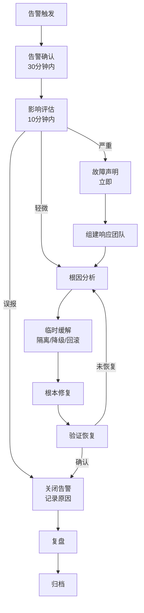

# 运维 On-Call 流程

On-Call（值班）是 SRE 实践的核心环节。当告警在凌晨 3 点响起，值班工程师需要在最短时间内响应、定位问题、恢复服务。但很多团队的 On-Call 体验是这样的：告警满天飞，值班人员疲于应付，最终对告警产生麻木——真正的问题被忽视。

好的 On-Call 流程，是让值班人员**在对的时机收到对的告警，带着足够的信息快速响应**。

## On-Call 的核心挑战

### 挑战一：告警疲劳

告警疲劳（Alert Fatigue）是 On-Call 的最大敌人。当告警量超过值班人员的处理能力时：

- 重要告警被忽略
- 值班人员对告警产生抵触心理
- 故障恢复时间变长

### 挑战二：上下文缺失

告警只知道「指标超标了」，不知道：

- 这是一个新问题还是已知问题？
- 其他相关指标是否也异常？
- 上次遇到类似问题是怎么处理的？

### 挑战三：时间压力

故障发生在凌晨 3 点，值班人员：

- 需要从睡眠状态切换到故障排查模式
- 需要快速理解系统状态
- 需要在压力下做出正确决策

## 告警接收与分级

### 告警分级标准

```yaml title="告警分级定义"
severity: page  # 必须立即响应
  - 用户正在受到影响
  - 需要人工干预
  - 有明确的行动项
  - 值班人员必须接听电话

severity: warning  # 尽快处理
  - 潜在问题，需要关注
  - 不需要立即响应，但应该在几小时内处理
  - Slack/邮件通知即可

severity: info  # 信息记录
  - 仅供参考，不需要人工处理
  - 只记录，不通知
```

### 告警路由

```yaml title="Alertmanager 路由配置"
route:
  receiver: default-receiver
  group_wait: 30s           # 等待 30s 聚合同组告警
  group_interval: 5m        # 发送间隔
  repeat_interval: 1h        # 重复告警间隔

  routes:
    # P0 告警：立即通知
    - match:
        severity: page
      receiver: pagerduty
      group_wait: 0s         # 立即发送
      repeat_interval: 30m

    # 业务告警：发 Slack
    - match:
        team: business
      receiver: slack-business
      slack_configs:
        - channel: '#business-alerts'

    # 基础设施告警：发 Slack + 创建工单
    - match:
        team: infra
      receiver: slack-infra
      slack_configs:
        - channel: '#infra-alerts'
```

## 值班轮次设计

### 轮次原则

```yaml
# 轮次设计原则
# 1. 值班周期：不超过 1 周
# 2. 值班时间：7x24 全覆盖
# 3. 交接时间：固定的交接窗口（如每天 10:00）
# 4. 升级规则：30 分钟无响应自动升级
```

### Escalation 规则

```yaml title="PagerDuty Escalation"
escalation_policies:
  - name: primary-oncall
    escalation_rules:
      - targets:
          - type: oncall
            id: primary-oncall
        delay: 30m  # 30 分钟后无人响应，升级

      - targets:
          - type: oncall
            id: secondary-oncall
        delay: 30m  # 再 30 分钟后，继续升级

      - targets:
          - type: schedule
            id: engineering-lead
        delay: 30m  # 最后升级到工程负责人
```

## 故障响应流程

### 标准响应流程（ISO 22301）



### 响应时间目标

| 告警级别 | 首次响应 | 影响评估 | 缓解完成 |
|---|---|---|---|
| **P0（全局故障）** | 5 分钟 | 10 分钟 | 30 分钟 |
| **P1（服务故障）** | 15 分钟 | 30 分钟 | 2 小时 |
| **P2（局部故障）** | 1 小时 | 2 小时 | 8 小时 |
| **P3（预警）** | 4 小时 | 8 小时 | 无 SLA |

## 值班工具链

### 工具清单

| 工具类型 | 推荐选择 | 用途 |
|---|---|---|
| **告警平台** | PagerDuty / Opsgenie | 告警路由、升级、值班表 |
| **沟通协作** | Slack / 飞书 | 告警通知、响应协作 |
| **仪表盘** | Grafana | 系统状态可视化 |
| **链路追踪** | Jaeger / Tempo | 故障链路分析 |
| **日志** | Loki / ELK | 日志关联查询 |
| **变更管理** | Jenkins / ArgoCD | 发布记录、变更追溯 |

### 值班手册（Runbook）

每个告警应该附带值班手册：

```yaml title="Runbook 示例"
# Runbook: order-service-high-latency
# 告警: order-service P99 > 2s (持续 5 分钟)

## 初步诊断
1. 检查 Grafana 仪表盘：
   - order-service-overview
   - 检查延迟是从什么时候开始升高的

2. 检查依赖服务：
   - payment-service 是否正常？
   - inventory-service 延迟是否也升高？

## 常见原因及处理

### 原因 1: 数据库慢查询
- 症状：数据库连接池使用率 > 80%
- 处理：
  1. 查看 slow query 日志
  2. 识别慢查询
  3. 联系 DBA 确认是否可以 kill 或添加索引

### 原因 2: GC 问题
- 症状：JVM GC 频率 > 10次/分钟
- 处理：
  1. 查看 GC 日志
  2. 如果是 CMS/Full GC，考虑回滚或扩容

### 原因 3: 依赖服务超时
- 症状：下游服务 P99 升高
- 处理：
  1. 检查下游服务告警
  2. 考虑降级该依赖

## 升级路径
- 30 分钟内无法缓解 → 升级到 Tech Lead
- 影响扩大 → 发起故障声明（Incident Declare）

## 相关链接
- 仪表盘: https://grafana.example.com/d/order-overview
- 告警规则: https://git.example.com/infra/prometheus-rules
```

## 值班文化

### 健康的值班文化

```
✅ 值班是有价值的工程工作
✅ 值班不应该让人精疲力竭
✅ 告警应该让人有信心处理
✅ 故障复盘是为了学习，不是追责
✅ 值班体验是团队需要持续改进的
```

### 需要避免的文化问题

```
❌ 「告警多说明系统有问题，必须全接」
❌ 「值班是初级工程师的事」
❌ 「出了故障就是值班人员的责任」
❌ 「为了少报警，不设告警」
```

## 质量判断标准

读完本节后，你应该能够回答：

1. 告警疲劳（Alert Fatigue）的根本原因是什么？好的告警治理如何解决这个问题？
2. On-Call 的核心挑战（上下文缺失、时间压力）分别对应哪些具体的系统设计问题？
3. 告警分级的四个级别（P0/P1/P2/P3）的判断标准是什么？请举例说明。
4. 值班手册（Runbook）应该包含哪些核心内容？为什么说 Runbook 是 On-Call 效率的关键？
5. 如何建立健康的值班文化？哪些常见的团队观念实际上会加剧告警疲劳？
