# 报警系统概述

一条告警在凌晨 3 点响起。值班工程师揉着眼睛登录系统，看到：「CPU 使用率超过 90%」。他开始排查，发现 CPU 高是因为 Full GC，而 GC 是因为内存分配速率过高，但真正的问题是——一个慢查询拖垮了整个系统。

如果只看告警内容，这个场景需要大量的推理：CPU 高 → 可能是 GC → GC 是因为内存分配高 → 可能是请求量大或内存泄漏。但告警本身没有给出这个推理链。

**好的告警应该直接回答：用户受到了什么影响，而不是系统发出了什么信号。** 这句话是 Google SRE 经验的精髓，也是报警系统设计的核心原则。

## 传统阈值告警的问题

传统的阈值告警是「预设问题」模式：你根据经验设定一个阈值（如 CPU > 90%），超过就告警。这种方式的问题是：

**误报率高**。CPU 偶尔超过 90% 但系统正常运行（比如启动阶段、批处理任务），告警仍然触发，工程师疲于应对。

**漏报**。系统在故障时 CPU 可能不高（比如一个死锁导致线程等待，CPU 反而低），但用户已经无法访问。

**无上下文**。告警只知道「CPU > 90%」，不知道「这个服务现在还正常吗」「用户能访问吗」。

**无法表达业务影响**。告警告诉你的是系统层面的问题，不是业务层面的影响。用户不在乎 CPU 高不高，只在乎「我的订单能下吗」。

## 黄金指标告警

基于黄金指标的告警比纯阈值告警更好，因为它关注的是用户可感知的指标。但仍不够。

```yaml title="黄金指标告警规则"
groups:
  - name: golden-signals
    rules:
      # 问题：阈值是静态的，无法适应流量波动
      - alert: HighLatency
        expr: |
          histogram_quantile(0.99,
            sum(rate(http_request_duration_seconds_bucket[5m])) by (le)
          ) > 1  # 固定阈值：1 秒
        for: 2m
```

固定阈值的核心问题：**高峰期的 P99 可能是 500ms，正常期是 20ms**。用 1 秒的固定阈值，高峰期不告警（因为不到 1 秒），但 500ms 的 P99 已经是异常了。

## SLO 告警：让告警表达业务影响

SLO（Service Level Objective）是告警设计的转折点。SLO 告警的核心思想是：**不告警「系统指标」，而是告警「用户感知到的服务质量」**。

SLO 定义了用户对服务质量的期望：

```yaml
# 某服务的 SLO 定义
service_level_objectives:
  - name: availability
    target: 99.9%              # 可用性目标：每月最多 43.8 分钟不可用
    window: 30d               # 计算窗口：30 天
    indicator:
      type: request-success-rate
      filter: status < 500
```

### 错误预算的概念

SLO 99.9% 意味着每月可用性目标为 99.9%。那么允许的「不可用时间」是 43.8 分钟，这 43.8 分钟就是**错误预算（Error Budget）**。

错误预算像一个「故障配额」：只要预算还有，系统可以自由发布新功能；预算快耗尽了，发布冻结，优先修复稳定性问题。

```mermaid
gantt
    title SLO 错误预算消耗
    dateFormat  X
    axisFormat  %d days

    section 当前状态
    已消耗预算: 0, 35
    剩余预算: 35, 43.8
    冻结发布线: 35, 43.8

    section 告警
    预算 > 50% 消耗: 0, 17.5
    预算 > 90% 消耗: 0, 39.4
    预算 100%: 0, 43.8
```



### 燃烧率报警（Burn Rate Alerting）

传统阈值告警是静态的，SLO 报警是动态的。燃烧率报警（Burn Rate Alerting）是最成熟的 SLO 告警方法论，它的核心思想是：**不告警「当前错误率」，而是告警「错误率的燃烧速度」**。

燃烧率的定义：

```
燃烧率 = 当前错误消耗率 / 允许的错误率
       = (当前错误数 / 当前时间窗口) / (允许错误数 / 总时间窗口)
```

比如：SLO 窗口是 30 天，允许错误预算是 43.8 分钟。如果在 1 小时内消耗了 1 小时的错误预算，燃烧率就是 30 倍。

```yaml title="燃烧率报警规则"
// 1 小时窗口，快速燃烧检测（检测突发故障）
# 当 1 小时内消耗了相当于 6 小时预算的错误时告警（燃烧率 > 6）
- alert: HighErrorBurnRate
  expr: |
    sum(rate(http_requests_total{status=~"5.."}[1h]))
    /
    sum(rate(http_requests_total[1h]))
    > (1 - 0.999) / 24 * 6
  labels:
    severity: critical
  annotations:
    summary: "服务错误燃烧率过高"
    description: "1 小时内错误消耗了超过 6 小时的错误预算"

# 6 小时窗口，慢速燃烧检测（检测慢性退化）
# 当 6 小时内消耗了相当于 3 天预算的错误时告警（燃烧率 > 12）
- alert: SlowErrorBurnRate
  expr: |
    sum(rate(http_requests_total{status=~"5.."}[6h]))
    /
    sum(rate(http_requests_total[6h]))
    > (1 - 0.999) / 168 * 12
  labels:
    severity: warning
```

多窗口燃烧率的目的是同时检测两种故障模式：

| 窗口 | 燃烧率阈值 | 检测目标 |
|---|---|---|
| 1 小时 | 14.4x（= 6h/1h） | 突发性故障（如熔断打开、依赖服务崩溃） |
| 6 小时 | 12x（= 3d/6h） | 慢性退化（如内存泄漏、配置错误导致的累积问题） |

## Alertmanager 报警路由

告警产生后，需要路由到正确的接收人。Alertmanager 提供了灵活的路由和通知机制：

```yaml title="alertmanager.yml"
global:
  resolve_timeout: 5m

route:
  group_by: ['alertname', 'service']
  group_wait: 30s           # 等待 30s 聚合同组告警
  group_interval: 5m        # 同组告警的发送间隔
  repeat_interval: 4h       # 重复告警的间隔
  receiver: 'default-receiver'

  routes:
    # 严重告警立即通知（不等待聚合）
    - match:
        severity: critical
      receiver: 'paging-team'
      group_wait: 0s
      repeat_interval: 1h

    # 业务指标告警发给业务负责人
    - match:
        team: business
      receiver: 'business-team'
      group_by: ['service', 'alertname']

    # 基础设施告警发给运维
    - match:
        team: infra
      receiver: 'infra-team'

# 接收器配置
receivers:
  - name: 'default-receiver'
    email_configs:
      - to: 'team@example.com'

  - name: 'paging-team'
    slack_configs:
      - channel: '#oncall-alerts'
        send_resolved: true
    pagerduty_configs:
      - service_key: 'YOUR_PAGERDUTY_KEY'

  - name: 'business-team'
    slack_configs:
      - channel: '#business-alerts'

  - name: 'infra-team'
    slack_configs:
      - channel: '#infra-alerts'
```

### 报警抑制与静默

Alertmanager 的三个高级特性让告警更精准：

**分组（Grouping）**：将相关的告警聚合为一个通知。比如一个服务有 10 个 Pod，如果每个 Pod 都发一条告警，工程师会被淹没。分组让同一类告警只发一条。

**抑制（Inhibition）**：当某个告警触发时，自动抑制相关的告警。比如「整个服务不可用」告警触发后，不再发送「Pod 重启」告警。

```yaml title="Alertmanager 抑制规则"
inhibit_rules:
  # 当 service:order-service 整体不可用时
  # 抑制该服务下所有 Pod 级别的告警
  - source_match:
      alertname: ServiceDown
      severity: critical
    target_match_re:
      alertname: PodDown
      service: order-service
    equal: ['service']
```

**静默（Silence）**：在维护窗口期间，静默特定告警，避免打扰。

```bash
# 创建静默规则
amtool silence add --alertname HighLatency --service order-service \
  --until 2026-04-08T12:00:00Z \
  --author admin@example.com \
  --comment "Planned maintenance window"
```

## 告警疲劳避免策略

告警疲劳（Alert Fatigue）是 SRE 团队最头疼的问题之一。工程师对告警麻木了，看到告警不处理，最终导致真正的故障被忽视。

### 策略一：告警分级

```yaml title="告警分级标准"
severity: page     # 必须立即处理的告警，发给 oncall 工程师
severity: ticket   # 需要处理但不紧急的告警，创建工单
severity: info     # 信息性告警，只记录不通知
```

Page 级别的告警必须满足以下条件：

1. **用户正在受到影响**——不是「可能受影响」，而是「正在受影响」
2. **需要人工干预**——自动化无法解决，或者自动化解决需要人工确认
3. **有明确的行动项**——工程师知道该做什么

### 策略二：去重与聚合

```yaml
# 告警去重：在 10 分钟内，同一个告警只通知一次
# 使用 alertname + service + alertname 作为去重 key
group_by: ['alertname', 'service']
repeat_interval: 10m
```

### 策略三：事后复盘与规则清理

每个告警都应该有复盘：告警是否有效？如果无效（误报或无效告警），应该修改或删除告警规则。

建立告警治理机制：每个季度检查一次告警规则，删除无效规则，优化模糊规则。

## 质量判断标准

读完本节后，你应该能够回答：

1. 为什么说「好的告警应该表达业务影响，而不是系统信号」？
2. 错误预算（Error Budget）的概念是什么？为什么它比固定阈值更合理？
3. 燃烧率报警中的「多窗口」设计是为了检测哪两种不同的故障模式？
4. Alertmanager 的分组（Grouping）、抑制（Inhibition）、静默（Silence）三个特性分别解决了什么问题？
5. Page 级别的告警必须满足哪三个条件？如何避免告警疲劳？
