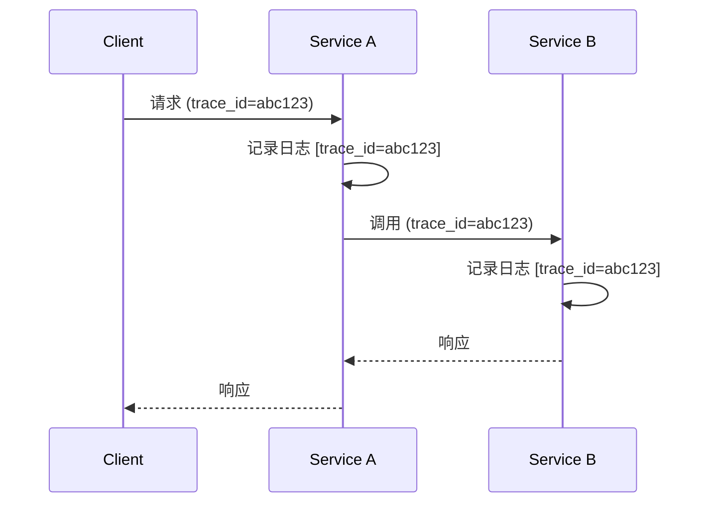

# 日志与 Trace 关联实现

日志和链路追踪是两种互补的观测数据：链路追踪提供请求的宏观路径视图，日志提供请求的微观细节视图。两者结合，才能完整还原一次请求的全貌——「哪个请求失败了？在哪一步失败的？失败时的上下文信息是什么？」

关联的核心是 **TraceID**：每条日志中嵌入对应的 TraceID，通过这个 ID 可以将日志条目与特定的 Trace/Span 关联起来。日志中的 TraceID 让你可以从「某条错误日志」直接跳转到「这次请求的完整链路」；链路中的 Span 可以展示「这个操作对应的日志条目」。

## 实现机制

日志与 Trace 的关联需要在三个环节进行埋点：**日志写入时**将当前上下文的 TraceID 注入日志；**Trace 传播时**确保 TraceID 在进程间正确传递；**存储层面**支持基于 TraceID 的联合查询。

日志写入时的 TraceID 注入有多种实现方式：手动在 Logback/Log4j2 配置中读取当前 TraceContext 并追加到日志格式；使用 MDC（Mapped Diagnostic Context）自动传递 TraceID；使用 OpenTelemetry SDK 的自动日志关联功能。OpenTelemetry Java SDK 可以自动将 trace_id 和 span_id 注入到日志中，无需手动配置。

## 关联查询实践

关联后的日志查询变得异常高效。当你在 Jaeger 中发现某次请求的 span 耗时异常时，点击 span 详情页面的「相关日志」标签，可以直接展示这次请求的所有日志条目。这些日志按时间排序，你能看到请求从进入系统到离开的完整执行轨迹。

在 Grafana 中，可以通过变量和面板联动实现「点击 TraceID 查询关联日志」：在链路面板中配置点击事件，将选中的 trace_id 作为变量传递给日志查询面板。
