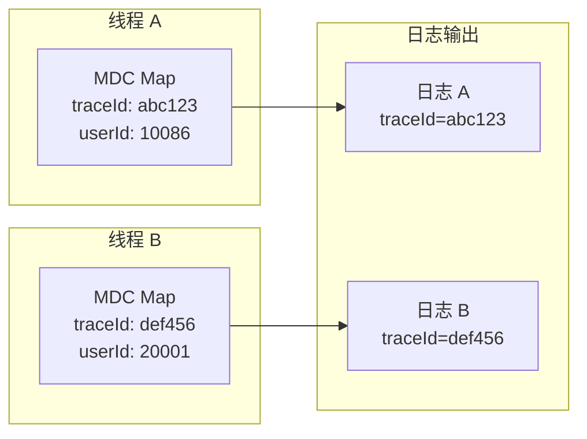

# MDC（Mapped Diagnostic Context）

MDC（Mapped Diagnostic Context）是 SLF4J/Logback 提供的**线程级日志上下文**机制。它允许你在同一个线程中，把关键信息（如 TraceID、UserID）放入上下文中，后续所有日志都会自动带上这些信息。

MDC 是可观测性关联的基础组件之一——没有 MDC，结构化日志就无法包含请求级别的上下文。

## MDC 的工作原理

### 核心概念

MDC 是一个**线程本地存储（ThreadLocal）的 Map**。每个线程有自己独立的 MDC，数据不会在多线程间泄露。



### 基本操作

```java
// 添加键值对
MDC.put("traceId", "abc123");
MDC.put("userId", "10086");

// 获取值
String traceId = MDC.get("traceId");  // "abc123"

// 移除键
MDC.remove("traceId");

// 清空
MDC.clear();

// Logback 配置后，以下代码会自动包含 traceId 和 userId
log.info("User order placed: orderId={}", orderId);
// 输出: 2026-04-08 10:23:45.123 INFO [order-service] abc123 10086 User order placed: orderId=884321
```

## MDC 与 LogstashEncoder 的集成

LogstashEncoder 会自动从 MDC 中提取所有键值对，附加到 JSON 日志中：

```xml title="logback-spring.xml"
<encoder class="net.logstash.logback.encoder.LogstashEncoder">
    <!-- 指定要包含的 MDC 键 -->
    <includeMdcKeyName>traceId</includeMdcKeyName>
    <includeMdcKeyName>spanId</includeMdcKeyName>
    <includeMdcKeyName>userId</includeMdcKeyName>
    <includeMdcKeyName>orderId</includeMdcKeyName>

    <!-- 自定义字段 -->
    <customFields>{"service":"${spring.application.name}"}</customFields>
</encoder>
```

输出的 JSON 日志：

```json
{
  "@timestamp": "2026-04-08T10:23:45.123Z",
  "level": "INFO",
  "message": "User order placed: orderId=884321",
  "logger": "com.example.OrderService",
  "traceId": "abc123",
  "userId": "10086",
  "orderId": "884321",
  "service": "order-service"
}
```

## 典型使用场景

### 场景一：Web 请求上下文

```java title="TraceIdFilter.java"
@WebFilter(urlPatterns = "/api/*")
public class TraceIdFilter implements Filter {

    @Override
    public void doFilter(ServletRequest req, ServletResponse resp, FilterChain chain)
            throws IOException, ServletException {

        HttpServletRequest request = (HttpServletRequest) req;
        HttpServletResponse response = (HttpServletResponse) resp;

        // 提取或生成 TraceID
        String traceId = extractOrGenerateTraceId(request);

        // 放入 MDC
        MDC.put("traceId", traceId);
        MDC.put("requestUri", request.getRequestURI());
        MDC.put("httpMethod", request.getMethod());
        MDC.put("clientIp", getClientIp(request));

        // 将 traceId 传回客户端（方便调试）
        response.setHeader("X-Trace-Id", traceId);

        try {
            chain.doFilter(request, response);
        } finally {
            MDC.clear();  // ⚠️ 必须清理，防止内存泄漏
        }
    }
}
```

### 场景二：用户上下文

```java title="UserContextFilter.java"
@WebFilter(urlPatterns = "/api/*")
public class UserContextFilter implements Filter {

    @Override
    public void doFilter(ServletRequest req, ServletResponse resp, FilterChain chain)
            throws IOException, ServletException {

        HttpServletRequest request = (HttpServletRequest) req;

        // 从 Token 或 Session 中提取用户信息
        String userId = extractUserId(request);
        String userRole = extractUserRole(request);

        if (userId != null) {
            MDC.put("userId", userId);
            MDC.put("userRole", userRole);
        }

        try {
            chain.doFilter(request, response);
        } finally {
            if (userId != null) {
                MDC.remove("userId");
                MDC.remove("userRole");
            }
        }
    }
}
```

### 场景三：多租户上下文

```java title="TenantContextFilter.java"
@WebFilter(urlPatterns = "/api/*")
public class TenantContextFilter implements Filter {

    @Override
    public void doFilter(ServletRequest req, ServletResponse resp, FilterChain chain)
            throws IOException, ServletException {

        HttpServletRequest request = (HttpServletRequest) req;

        // 从 Header 中提取租户 ID
        String tenantId = request.getHeader("X-Tenant-Id");

        if (tenantId != null) {
            MDC.put("tenantId", tenantId);
        }

        try {
            chain.doFilter(request, response);
        } finally {
            MDC.remove("tenantId");
        }
    }
}
```

### 场景四：业务操作上下文

```java title="OrderService.java"
@Service
@Slf4j
public class OrderService {

    public Order placeOrder(OrderRequest request) {
        // 在业务逻辑中也可以向 MDC 添加信息
        MDC.put("orderId", request.getId());
        MDC.put("orderAmount", String.valueOf(request.getAmount()));

        try {
            log.info("Processing order: items={}", request.getItems().size());

            // 业务逻辑
            validateOrder(request);
            PaymentResult result = paymentService.charge(request);

            if (result.isSuccess()) {
                log.info("Order placed successfully: transactionId={}",
                    result.getTransactionId());
                return order;
            } else {
                log.warn("Payment failed: reason={}", result.getErrorMessage());
                throw new OrderException(result.getErrorMessage());
            }
        } finally {
            MDC.remove("orderId");
            MDC.remove("orderAmount");
        }
    }
}
```

## MDC 传递问题

### 问题一：异步线程 MDC 丢失

这是 MDC 最常见的问题。线程池提交任务后，新线程没有父线程的 MDC：

```java
// ❌ 错误：异步任务看不到 MDC
MDC.put("traceId", traceId);
executor.submit(() -> {
    log.info("Async task");  // MDC 为空！
});
```

```java
// ✅ 正确：显式传递 MDC
String traceId = MDC.get("traceId");
executor.submit(() -> {
    MDC.put("traceId", traceId);
    try {
        log.info("Async task");
    } finally {
        MDC.remove("traceId");
    }
});
```

### 解决方案：MDC 工具类

```java title="MdcUtils.java"
public class MdcUtils {

    /**
     * 将当前线程的 MDC 捕获为一个 Map
     */
    public static Map<String, String> capture() {
        Map<String, String> context = MDC.getCopyOfContextMap();
        return context != null ? new HashMap<>(context) : new HashMap<>();
    }

    /**
     * 将捕获的 MDC 恢复到当前线程
     */
    public static void restore(Map<String, String> context) {
        MDC.clear();
        if (context != null) {
            context.forEach(MDC::put);
        }
    }

    /**
     * 在异步任务中自动传播 MDC
     */
    public static <T> Callable<T> wrap(Callable<T> task) {
        Map<String, String> context = capture();
        return () -> {
            restore(context);
            return task.call();
        };
    }

    /**
     * 在异步任务中自动传播 MDC（Runnable 版本）
     */
    public static Runnable wrap(Runnable task) {
        Map<String, String> context = capture();
        return () -> {
            restore(context);
            task.run();
        };
    }
}
```

使用方式：

```java
// 捕获当前 MDC
Map<String, String> context = MdcUtils.capture();

// 在异步任务中恢复
executor.submit(MdcUtils.wrap(() -> {
    log.info("Async task with MDC");  // 自动包含 traceId
    return null;
}));
```

## MDC 与 OTel 的关系

MDC 是 Logback 的本地机制，OTel 是跨语言的链路追踪标准。两者需要配合使用：

```java title="OTel 与 MDC 集成"
@Service
public class OtelMdcIntegration {

    @Autowired
    private OpenTelemetry openTelemetry;

    @Bean
    public OpenTelemetryMeterRegistrar meterRegistrar() {
        // OTel SDK 的 Context 就是 MDC 的上游
        // 从 OTel Context 同步到 MDC
        return new OpenTelemetryMeterRegistrar() {
            // ...
        };
    }
}
```

OTel Java Agent 会自动将 Span 的 traceId/spanId 同步到 MDC（如果配置了 `otel.javaagent.logging.mdc=true`）。

## 常见问题

### 问题一：MDC 内存泄漏

如果 `MDC.clear()` 没有在 finally 块中调用，MDC 数据会残留在 ThreadLocal 中，导致内存泄漏。

### 问题二：ThreadLocal 泄漏

Tomcat 的线程池会复用线程。如果请求结束时没有清理 MDC，下一个请求可能会看到上一个请求的数据。

### 问题三：父子线程 MDC 不共享

子线程看不到父线程的 MDC。这是 ThreadLocal 的设计特性，不是 bug，但需要通过 `MdcUtils.wrap()` 显式传递。

## 质量判断标准

读完本节后，你应该能够回答：

1. MDC 的工作原理是什么？它和 ThreadLocal 的关系是什么？
2. 为什么说 `MDC.clear()` 应该在 finally 块中调用？如果忘记清理会有什么后果？
3. MDC 在异步场景下为什么会丢失？如何在异步任务中正确传递 MDC？
4. LogstashEncoder 如何从 MDC 中提取数据并包含到 JSON 日志中？
5. MDC 和 OTel 的 Context 分别扮演什么角色？它们如何配合使用？
