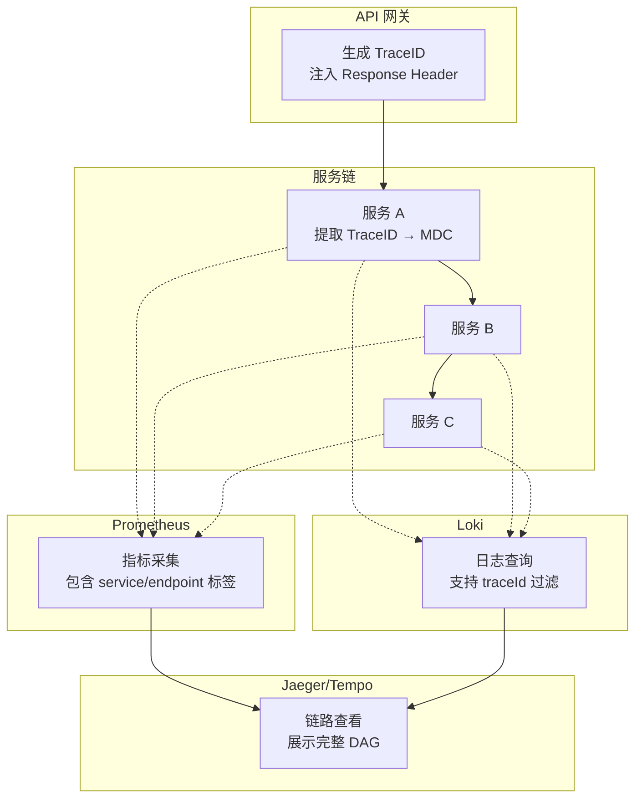
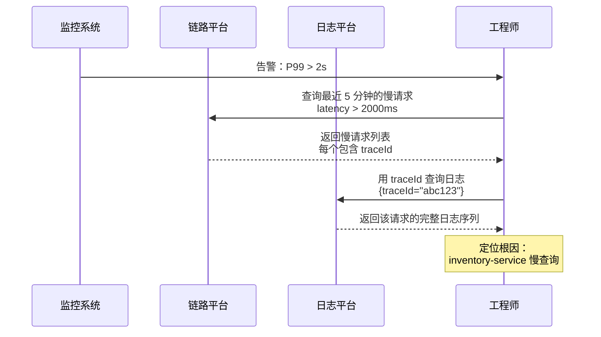

# 可观测性关联概述

一个完整的故障排查流程，通常从告警开始：「API 延迟 P99 从 50ms 飙升到 2 秒」。你点击告警中的 TraceID，跳转到 Jaeger，看到链路中 `inventory-service` 的 `checkStock` 方法耗时 1.8 秒。你点击 Span 的 `traceId` 字段，跳转到 Loki，输入同一个 TraceID，看到该请求在 `inventory-service` 中的完整日志——数据库查询耗时 1.5 秒，因为缺少索引。

这个场景展示了可观测性关联的力量：**用同一个标识符（TraceID），把指标、链路、日志串联成一个完整视图**。没有这种关联，故障排查就是一场「盲人摸象」的游戏。

## 关联分析的本质问题

三大支柱（Metrics / Logs / Traces）各自独立存在时，数据是孤立的：

- **指标**：告诉你「有问题」，但不告诉你「问题在哪」
- **链路**：告诉你「问题在哪」，但不告诉你「具体发生了什么」
- **日志**：告诉你「发生了什么」，但不告诉你「这次事件和其他事件有什么关系」

关联分析解决的是「数据孤岛」问题。它的核心是三个能力：

**一、横跨维度关联**。用同一个标识符（通常是 TraceID）串联指标、日志、链路。比如从告警跳转到 Trace，从 Trace 跳转到日志。

**二、跨时间关联**。将故障发生前后的数据进行关联。比如「这个故障前 5 分钟的流量特征是什么」。

**三、跨服务关联**。将同一个请求在不同服务中的数据关联起来。这需要 TraceID 能够正确传播到每个服务。

## 关联的三种核心模式

### 模式一：指标关联链路

当指标告警触发时，能够直接跳转到对应的链路数据。这是故障排查的入口：

```
告警：P99 延迟 > 2s（持续 2 分钟）
    ↓ 点击 TraceID
Jaeger：查看慢请求的完整链路
    ↓ 点击 Span
日志：该 Span 内的详细日志
```

```yaml
# Prometheus 告警规则中嵌入 TraceID（如果有的话）
# 但通常 Prometheus 指标中没有 TraceID，需要从链路平台查询
# 典型流程：告警 → 查询链路平台 → 找到 TraceID → 查询日志
```

### 模式二：链路关联日志

链路追踪平台（Jaeger / Tempo）通常提供「查看该请求日志」的功能。实现方式是将 TraceID 作为查询参数传递给日志平台：

```java title="Jaeger UI 中的日志跳转（原理）"
// Jaeger UI 点击「View Logs」按钮时，实际上执行了：
GET https://loki.example.com/loki/api/v1/query_range
  ?query={service="order-service"} | json | traceId="d3f8a2c1"
```

这要求日志系统中 TraceID 字段已经被正确提取和索引。

### 模式三：日志关联指标

当在日志中发现某个错误时，能够查询该错误发生前后的指标变化，判断是否有关联的系统状态变化：

```yaml
# 查询 traceId=d3f8a2c1 的日志
{service="order-service"} | json | traceId="d3f8a2c1"

# 找到错误发生时间：2026-04-08 10:23:45
# 然后在 Prometheus 中查询该时间前后的指标
# CPU / 内存 / 连接池使用率是否有异常
```

## 数据关联的工程基础

### 统一的标签体系

三大支柱要能关联，首先需要有**统一的标签体系**。比如：

```yaml
# 服务名称标签：三个平台保持一致
service: order-service        # Prometheus
service.name: order-service  # OTel Resource
service: order-service        # Loki 日志

# 环境标签
environment: production       # 三个平台统一

# 实例标签（用于定位具体 Pod）
instance: order-service-7d8f6c-xk2p9
pod: order-service-7d8f6c-xk2p9
```

如果 Prometheus 用 `service="order-service"`，Loki 用 `app="order"`，Jaeger 用 `service.name="order-svc"`，关联就无从做起。

### TraceID 的全链路贯通

TraceID 是关联的核心纽带。它的传递链路必须是完整的：



任何一个环节断了，关联就中断：

- 网关不生成 TraceID → 链路无法贯通
- 服务不把 TraceID 放入 MDC → 日志无法关联
- OTel 配置中没有包含 traceId 到日志 → 日志平台没有 traceId 字段

## 关联的典型场景

### 场景一：告警 → 链路 → 日志

这是最常见的故障排查路径：



### 场景二：日志 → 链路 → 指标

当你通过日志发现异常时：

1. 在日志平台搜索关键词，找到异常日志，记下 traceId
2. 用 traceId 在链路平台查看该请求的完整链路
3. 发现是某个下游服务的超时导致的
4. 查询该服务的历史指标，发现该服务的 CPU 在那个时间段接近 100%

### 场景三：跨服务的因果关联

当一个服务故障导致级联影响时，关联分析的价值最大：

```
payment-service 故障（错误率从 0.1% → 30%）
    ↓ 导致
inventory-service 库存检查超时（延迟 P99 从 50ms → 5000ms）
    ↓ 导致
order-service 下单失败（错误率从 0.01% → 5%）
```

通过 TraceID，你可以把这条因果链完整还原出来。链路平台展示调用顺序和时间，指标平台展示每个服务的错误率变化，日志展示具体的错误原因。

## 关联分析的平台工具

| 工具 | 能力 | 局限 |
|---|---|---|
| **Grafana Explore** | 统一界面横跨 Tempo + Loki + Prometheus | 需要三个数据源都配置好 |
| **Datadog APM** | 链路 + 日志 + 指标原生集成，智能关联 | 商业软件，成本高 |
| **Jaeger + Loki** | 开源方案，需要手动配置跳转 | 跳转体验不如原生集成 |
| **Honeycomb** | 事件级分析，灵活度高 | 学习曲线陡峭 |

Grafana 9+ 的 Explore 页面支持在一个界面中同时查询 Tempo（链路）、Loki（日志）、Prometheus（指标），并支持变量引用传递——比如从链路查询结果中提取 traceId，再传给日志查询。

## 质量判断标准

读完本节后，你应该能够回答：

1. 为什么说三大支柱「各自独立时数据是孤立的」？关联分析解决的核心问题是什么？
2. TraceID 为什么是关联分析的核心纽带？它在三个平台中分别以什么形式存在？
3. 统一标签体系为什么是关联分析的前提条件？如果三个平台的标签命名不一致会有什么后果？
4. Grafana Explore 页面如何实现「告警 → 链路 → 日志」的关联查询？
5. 在故障排查中，关联分析的典型路径是什么？每一步分别解决什么问题？
