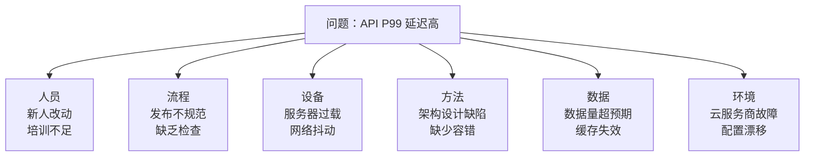

# 根因分析（RCA）方法论

2019 年，某大型电商平台的购物车服务出现故障。工程师们排查了 4 个小时，最终发现根因是一个 6 个月前的配置变更——当时的变更「看起来没有问题」，但在一个特定流量组合下暴露了竞态条件。

这个案例揭示了根因分析的一个核心挑战：**表象症状和真实根因之间，可能隔着多层因果链**。根因分析（RCA）是一套系统化的方法论，帮助工程师在复杂系统中找到真正的根因，而不是停留在表象。

## 什么是根因分析

根因分析（Root Cause Analysis）是一种系统化的问题分析方法，目的是**找到问题的根本原因（Root Cause），而不是仅仅修复表象症状**。

**表象（Symptom）**：用户看到的故障现象
**近因（Proximate Cause）**：直接导致表象的原因
**根因（Root Cause）**：最深层的、可干预的原因

```
表象：用户无法下单
  ↓
近因：库存服务返回 500 错误
  ↓
根因：数据库连接池配置过小，高并发下耗尽
```

根因分析的价值在于：**修复根因可以防止同类问题再次发生，修复表象只能解决当前问题**。

## 常见的 RCA 方法论

### 1. 5 Whys（五问法）

最简单也最有效的 RCA 方法。持续追问「为什么」，直到找到根因。

```
问题：用户无法下单

Why 1: 为什么无法下单？
→ 支付接口返回超时错误

Why 2: 为什么支付接口超时？
→ 支付服务连接池耗尽

Why 3: 为什么连接池耗尽？
→ 订单服务大量并发请求，占满了连接池

Why 4: 为什么订单服务并发量突然上升？
→ 营销活动导致流量是平时的 10 倍

Why 5: 为什么流量升高时连接池不够用？
→ 连接池大小是按平时流量配置的，没有考虑突发流量

根因：容量规划不足，没有做流量突发场景的设计
```

### 2. Ishikawa Diagram（鱼骨图）

从多个维度分析问题的可能原因：



### 3. Fault Tree Analysis（故障树分析）

从上往下逐层分解故障的逻辑关系：

```
                API 不可用
              /      |      \
        DB 故障   网络故障   服务崩溃
          |           |        |
     连接池耗尽   DNS 劫持    OOM
          |           |        |
      配置不当   证书过期     内存泄漏
```

## 根因分析的常见误区

### 误区一：找到第一个原因就停止

```
错误：找到「数据库慢」就停止了
正确：继续追问「为什么数据库慢」→ 缺少索引 → 为什么没有加索引 → 上线前没有做容量评估
```

### 误区二：把近因当根因

```
错误：「内存泄漏导致 OOM」
正确：「为什么会有内存泄漏」→ 第三方 SDK 有 bug → 为什么引入这个 SDK → 没有做代码审查

修复根因：修复 SDK bug 或替换 SDK
修复近因：重启服务（临时方案）
```

### 误区三：根因永远是人

```
错误：「根因是运维工程师操作失误」
正确：「为什么工程师会操作失误」→ 缺乏自动化工具 → 手工操作容易出错 → 为什么没有自动化 → 上线频率高但工具不完善

修复根因：完善自动化发布工具
```

## 根因分析流程

### 阶段一：收集事实

在分析之前，先收集足够的信息：

```markdown
## 故障信息收集清单

### 时间线
- [ ] 首次发现时间：
- [ ] 告警触发时间：
- [ ] 开始排查时间：
- [ ] 恢复时间：
- [ ] 总影响时长：

### 影响范围
- [ ] 受影响服务：
- [ ] 受影响用户数：
- [ ] 业务损失（如有）：

### 触发因素
- [ ] 最近是否有发布？
- [ ] 最近是否有配置变更？
- [ ] 最近是否有流量变化？
- [ ] 最近是否有基础设施变更？

### 环境信息
- [ ] 发生环境：生产/预发/测试
- [ ] 发生时间：业务高峰期/低峰期
```

### 阶段二：时间线重建

按照时间顺序重建故障链：

```mermaid
gantt
    title 故障时间线
    dateFormat  HH:mm
    axisFormat  %H:%M

    section 事件
    用户开始遇到问题: 14:23, 5m
    监控系统告警: 14:25, 1m
    值班工程师开始排查: 14:26, 10m
    定位到根因: 14:36, 5m
    实施修复: 14:41, 8m
    服务恢复: 14:49, 1m

    section 根因链
    流量突增: 14:20, 1m
    连接池耗尽: 14:23, 1m
    队列积压: 14:24, 1m
    超时激增: 14:25, 1m
```



### 阶段三：因果链分析

使用 5 Whys 或鱼骨图找到根因。

### 阶段四：验证假设

在修复后验证根因：

1. 同样的触发条件是否还会导致故障？
2. 修复是否引入了新的风险？
3. 是否需要在测试环境复现？

## 根因分类

### 技术根因

| 类型 | 示例 |
|---|---|
| 容量问题 | 连接池耗尽、磁盘空间不足、内存不足 |
| 配置错误 | 参数设置不当、开关配置错误 |
| 代码缺陷 | 内存泄漏、死锁、空指针 |
| 依赖故障 | 下游服务不可用、第三方 API 超时 |
| 网络问题 | DNS 故障、网络分区、证书过期 |

### 流程根因

| 类型 | 示例 |
|---|---|
| 发布问题 | 缺少灰度验证、配置变更未回滚 |
| 监控缺失 | 没有覆盖关键路径、告警阈值不合理 |
| 变更管理 | 缺乏变更评审、配置同步问题 |

### 组织根因

| 类型 | 示例 |
|---|---|
| 知识缺失 | 缺乏培训、文档不足 |
| 资源不足 | 人员不足、工具不足 |
| 优先级问题 | 安全/稳定性需求被推迟 |

## 根因分析报告模板

```markdown title="故障复盘报告模板"
# 故障复盘报告

## 基本信息
- **故障 ID**：INC-2026-0408-001
- **发生时间**：2026-04-08 14:23
- **发现时间**：2026-04-08 14:25
- **恢复时间**：2026-04-08 14:49
- **总影响时长**：26 分钟
- **影响范围**：购物车下单功能，约 1% 用户受影响
- **严重程度**：P1

## 故障摘要
用户在下单时遇到支付超时错误，导致下单失败。

## 时间线
| 时间 | 事件 |
|---|---|
| 14:20 | 营销活动开始，流量突增 10 倍 |
| 14:23 | 支付服务连接池耗尽 |
| 14:25 | 监控系统触发 P1 告警 |
| 14:26 | 值班工程师开始排查 |
| 14:36 | 定位到连接池耗尽 |
| 14:41 | 临时扩容连接池 |
| 14:49 | 服务恢复正常 |

## 根因分析（5 Whys）
- **Why 1**：为什么支付超时？
  → 支付服务连接池耗尽

- **Why 2**：为什么连接池耗尽？
  → 订单服务并发请求量超过连接池大小

- **Why 3**：为什么并发量突然上升？
  → 营销活动导致流量突增

- **Why 4**：为什么流量升高时连接池不够？
  → 连接池大小按平时流量配置，没有考虑突发

- **Why 5**：为什么没有考虑突发流量？
  → 容量评估流程中没有包含流量突发场景

## 根因
**容量规划不足**：连接池大小配置为 50，按平时流量够用，但未考虑营销活动的突发流量。

## 修复措施
### 立即修复（本次已执行）
1. 扩容连接池到 200
2. 临时限流，超限返回友好错误

### 长期修复
1. [ ] 完善容量评估流程，包含 10 倍突发场景
2. [ ] 引入自动扩容机制（HPA）
3. [ ] 优化连接池配置，支持动态调整
4. [ ] 增加支付服务的容量监控告警

## 改进项
| 类别 | 改进项 | 负责人 | 完成日期 |
|---|---|---|---|
| 流程 | 完善容量评估流程 | @张三 | 2026-04-15 |
| 技术 | 接入 HPA | @李四 | 2026-04-20 |
| 监控 | 增加容量告警 | @王五 | 2026-04-10 |

## 经验教训
1. 容量规划必须包含流量突发场景
2. 重要服务的依赖需要做容量隔离
3. 告警阈值需要根据业务特征动态调整

## 公开问题
- 无
```

## 质量判断标准

读完本节后，你应该能够回答：

1. 根因分析和近因的本质区别是什么？请用具体例子说明。
2. 5 Whys 方法的核心技巧是什么？为什么不能「找到第一个原因就停止」？
3. 根因分类（技术/流程/组织）中，技术根因和流程根因的修复方式有什么不同？
4. 根因分析报告中，「立即修复」和「长期修复」的区别是什么？两者分别解决什么问题？
5. 为什么说「把根因归咎于人的失误」是 RCA 中最常见的误区之一？应该如何正确归因？
