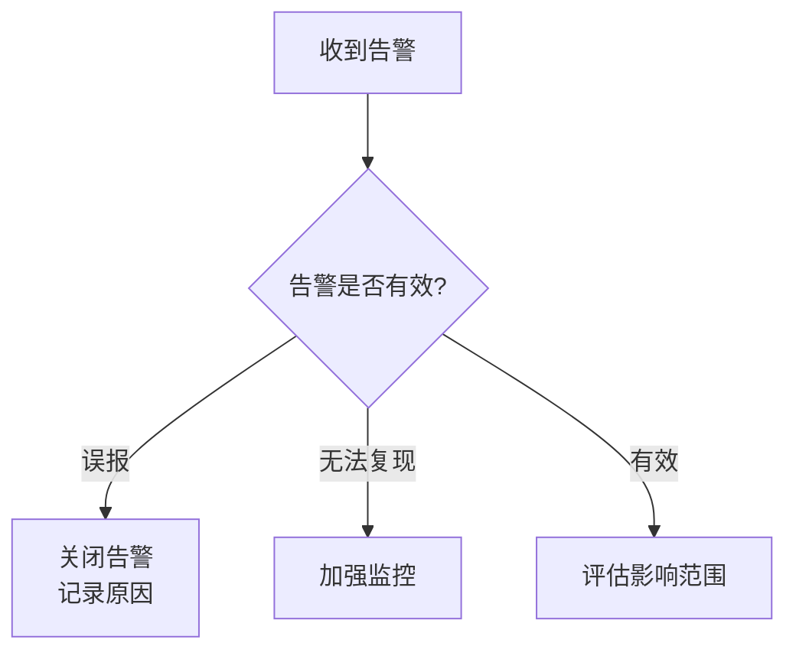

# 故障根因定位流程

故障发生时，工程师面对的是一个复杂的系统：告警可能是误导的，症状可能是连锁反应，根因可能隐藏在几层调用之下。根因定位流程是一套系统化的方法，让工程师能够高效地从告警出发，沿着因果链追踪到真正的根因。

## 根因定位的经典困境

```
告警：订单服务 P99 延迟 > 5 秒

表面现象：订单服务很慢
第一层：库存服务调用延迟 > 4 秒
第二层：数据库查询慢
第三层：主从切换导致查询阻塞
第四层：网络抖动触发主从切换

根因：网络基础设施不稳定
```

这个案例说明：**告警点往往不是根因点**。从告警到根因，可能隔着多层因果链。

## 根因定位流程（八步法）

### 第一步：确认告警

在开始排查前，先确认告警是否有效：



确认清单：

```
□ 告警是否反映了真实的用户影响？
□ 是否有其他相关告警？
□ 问题是否仍在持续？
□ 是否影响所有用户还是部分用户？
```

### 第二步：评估影响范围

快速回答三个问题：

```
影响范围：
□ 受影响的服务/接口？
□ 受影响的用户比例？
□ 业务损失（订单失败/转化率下降）？

持续时间：
□ 首次发现时间？
□ 是否持续？
□ 趋势是恶化还是稳定？

传播范围：
□ 是否有其他服务受到影响？
□ 影响是否在扩大？
```

### 第三步：建立时间线

```mermaid
gantt
    title 故障时间线
    dateFormat  HH:mm
    axisFormat  %H:%M

    section 监控
    告警触发: crit, 14:25, 1m
    工程师介入: 14:26, 1m

    section 排查
    链路分析: 14:27, 5m
    日志关联: 14:32, 3m
    根因确认: 14:35, 2m

    section 修复
    临时缓解: 14:37, 5m
    验证恢复: 14:42, 2m
    永久修复: 14:44, 30m
```



时间线的作用：

1. 帮助团队对齐「从什么时候开始出了问题」
2. 便于后续复盘分析
3. 识别出「在什么时间点应该做什么」

### 第四步：快速缓解

在定位根因的同时，如果用户正在受到影响，**优先缓解**：

```java
// 缓解优先级
// 1. 降级：关闭非核心功能，减少依赖
// 2. 限流：限制请求量，保护系统
// 3. 隔离：关闭故障区域，防止扩散
// 4. 回滚：撤销最近的变更
// 5. 扩容：增加资源
```

缓解不是根因修复，但可以减少用户影响。在缓解后，根因分析仍然需要继续。

### 第五步：链路分析

使用链路追踪定位慢请求：

```
1. 从告警中获取 traceId（如果有）
2. 在 Jaeger/Tempo 中查询该 traceId
3. 查看 Waterfall 图，找到耗时最长的 Span
4. 确认是哪个服务的哪个调用导致的延迟
```

```yaml
# Loki 查询示例
{service="order-service"} | json | traceId="abc123"

# Tempo 查询示例
{__name__="traces"} |= "abc123"
```

### 第六步：日志关联

用 TraceID 串联所有日志：

```
查询条件：
1. traceId = abc123
2. 时间范围：告警时间前后 5 分钟
3. 服务：order-service, inventory-service, payment-service
```

在 Loki 中：

```yaml
{service=~"order|inventory|payment"} |= "abc123"
```

### 第七步：指标关联

查看关联指标的变化：

```
1. CPU/内存：是否异常升高？
2. 连接池：使用率是否接近上限？
3. 下游服务：响应时间是否也升高？
4. 数据库：查询延迟是否增加？
```

```yaml
# 查看关联服务的延迟
histogram_quantile(0.99,
    sum(rate(http_request_duration_seconds_bucket{service=~"inventory|payment"}[5m])) by (le, service)
)

# 查看数据库连接池使用率
hikaricp_connections_active / hikaricp_connections_max
```

### 第八步：因果验证

找到疑似根因后，验证它确实是根因：

```
验证方法：
□ 如果这是根因，回滚/修复后问题是否消失？
□ 这个时间点的变化是否与故障时间吻合？
□ 是否有其他证据支持这个假设？
□ 其他服务是否也受到了影响（符合连锁反应）？
```

## 典型故障场景的排查路径

### 场景一：服务 P99 延迟升高

```
排查路径：
1. 链路追踪 → 找到耗时最长的 Span
2. Span 属性 → 是 DB 调用 / HTTP 调用 / 内部逻辑？
3. DB 调用慢 → 查看慢查询日志
4. HTTP 调用慢 → 查看下游服务的指标
5. 内部逻辑慢 → 查看 GC / 线程状态
```

### 场景二：服务错误率升高

```
排查路径：
1. 指标 → 查看是 5xx 还是 4xx
2. 日志 → 查看错误堆栈和消息
3. 链路 → 查看错误 Span 的上下文
4. 依赖 → 查看下游服务是否有异常
```

### 场景三：服务无响应

```
排查路径：
1. 健康检查 → 服务是否存活？
2. 进程状态 → JVM 是否 OOM / 僵死？
3. GC 状态 → 是否 Full GC 导致停顿？
4. 线程状态 → 是否有死锁 / 阻塞？
5. 连接池 → 是否连接池耗尽？
```

## 工具使用清单

| 阶段 | 工具 | 查询内容 |
|---|---|---|
| 链路分析 | Jaeger / Tempo | Trace Waterfall、慢请求 |
| 日志关联 | Loki / ELK | TraceID 日志、错误日志 |
| 指标分析 | Prometheus + Grafana | 黄金指标、资源使用率 |
| 服务拓扑 | Jaeger / SkyWalking | 服务依赖关系 |
| 容器/K8s | kubectl | Pod 状态、事件日志 |

## 常见误区

### 误区一：从告警点开始排查

告警点往往是「故障的表现」，不是「故障的原因」。

```
错误思路：告警说订单服务慢 → 直接看订单服务代码
正确思路：告警说订单服务慢 → 通过链路追踪找到最慢的 Span → 逐层追溯
```

### 误区二：过早下结论

找到第一个异常点就认为找到了根因。

```
错误：看到数据库查询慢 → 认为根因是 SQL 不好
正确：看到数据库查询慢 → 继续追问「为什么现在慢」→ 发现是主从延迟 → 继续追问「为什么主从延迟」→ 发现是网络抖动
```

### 误区三：只关注当前告警

一个故障可能同时触发多个告警，只看一个可能看不到全貌。

```
正确做法：
□ 查看所有相关告警
□ 建立告警之间的因果关系
□ 从最上游的告警开始追溯
```

## 质量判断标准

读完本节后，你应该能够回答：

1. 为什么说「告警点往往不是根因点」？请用一个具体例子说明告警点和根因之间的距离。
2. 根因定位流程的「八步法」中，哪几步是最容易被跳过的？为什么说「快速缓解」不能替代「根因分析」？
3. 链路追踪（Jaeger/Tempo）和日志（Loki）在根因定位中分别扮演什么角色？它们如何配合使用？
4. 「因果验证」为什么是根因定位流程的最后一步？跳过这一步会有什么后果？
5. 在排查「服务 P99 延迟升高」和「服务错误率升高」两种场景时，排查路径有什么不同？
