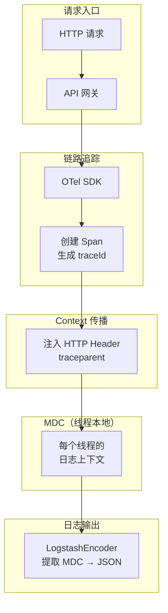

# TraceID 注入日志

想象一个没有 TraceID 的故障排查场景：用户在支付时遇到问题，你需要找出原因。你登录到 7 台服务器，分别 grep 相关时间段的日志，然后手动比对时间戳、拼凑因果关系。40 分钟后终于找到了答案。

现在想象一个有 TraceID 的场景：用户告诉你他的 traceId 是 `d3f8a2c1`。你在日志平台输入这个 ID，7 台服务器上属于这个请求的所有日志瞬间全部呈现，按时间顺序排列。

这就是 TraceID 的价值——**它让请求级别的日志关联从「人工拼图」变成「一键直达」**。

## TraceID 注入的原理

TraceID 注入的本质是：将链路追踪生成的 TraceID，通过 Context 传播机制，注入到每条日志的 MDC（Mapped Diagnostic Context）中。当 Logback 输出 JSON 格式的日志时，LogstashEncoder 会自动从 MDC 中提取 traceId 并包含到 JSON 输出中。



## 网关层：生成或提取 TraceID

网关是 TraceID 的起点。它有两个职责：如果请求中没有 TraceID，就生成一个新的；如果请求中有 TraceID，就提取并传递下去。

```java title="TraceIdGatewayFilter.java"
@Component
@Order(Ordered.HIGHEST_PRECEDENCE)
@Slf4j
public class TraceIdGatewayFilter extends OncePerRequestFilter {

    @Override
    protected void doFilterInternal(HttpServletRequest request,
                                    HttpServletResponse response,
                                    FilterChain filterChain)
            throws ServletException, IOException {

        String traceId;

        // 优先从 W3C traceparent Header 中提取
        String traceparent = request.getHeader("traceparent");
        if (traceparent != null && traceparent.length() >= 55) {
            // 格式：00-{TraceID}-{SpanID}-{flags}
            // TraceID 是第 4-35 个字符（共 32 个十六进制字符）
            traceId = traceparent.substring(3, 35);
        } else {
            // 没有 traceparent，生成新的 TraceID
            traceId = generateTraceId();
            log.info("Generated new traceId: {}", traceId);
        }

        // 放入响应 Header，供前端或下游服务使用
        response.setHeader("traceparent",
            "00-" + traceId + "-" + generateSpanId() + "-01");
        response.setHeader("X-Trace-Id", traceId);

        // 放入 MDC，供当前请求的日志使用
        MDC.put("traceId", traceId);

        try {
            filterChain.doFilter(request, response);
        } finally {
            MDC.clear();
        }
    }

    private String generateTraceId() {
        return UUID.randomUUID().toString().replace("-", "");
    }

    private String generateSpanId() {
        return String.format("%016x", new Random().nextLong());
    }
}
```

## 服务层：传递 TraceID

每个服务在收到请求时，都需要从 HTTP Header 中提取 TraceID 并放入 MDC。OTel SDK 的自动拦截机制可以处理这个过程，但你也可以手动处理以确保万无一失：

```java title="TraceContextInterceptor.java"
@Component
@Slf4j
public class TraceContextInterceptor implements HandlerInterceptor {

    @Override
    public boolean preHandle(HttpServletRequest request,
                            HttpServletResponse response,
                            Object handler) {

        // 提取 traceparent Header
        String traceparent = request.getHeader("traceparent");

        if (traceparent != null) {
            // 解析并放入 MDC
            String traceId = parseTraceId(traceparent);
            String spanId = parseSpanId(traceparent);

            MDC.put("traceId", traceId);
            MDC.put("spanId", spanId);

            log.debug("Extracted trace context: traceId={}, spanId={}",
                traceId, spanId);
        } else {
            // 没有 traceparent，说明这是入口请求（或者网关没有传递）
            String traceId = request.getHeader("X-Trace-Id");
            if (traceId != null) {
                MDC.put("traceId", traceId);
            } else {
                // 生成新的 TraceID（兜底）
                MDC.put("traceId", UUID.randomUUID().toString().replace("-", ""));
            }
        }

        return true;
    }

    @Override
    public void afterCompletion(HttpServletRequest request,
                               HttpServletResponse response,
                               Object handler,
                               Exception ex) {
        MDC.clear();
    }

    private String parseTraceId(String traceparent) {
        // 格式：00-{TraceID}-{SpanID}-{flags}
        if (traceparent.length() >= 35) {
            return traceparent.substring(3, 35);
        }
        return null;
    }

    private String parseSpanId(String traceparent) {
        // 格式：00-{TraceID}-{SpanID}-{flags}
        if (traceparent.length() >= 55) {
            return traceparent.substring(36, 52);
        }
        return null;
    }
}
```

注册拦截器：

```java title="WebMvcConfig.java"
@Configuration
public class WebMvcConfig implements WebMvcConfigurer {

    @Autowired
    private TraceContextInterceptor traceContextInterceptor;

    @Override
    public void addInterceptors(InterceptorRegistry registry) {
        registry.addInterceptor(traceContextInterceptor)
            .addPathPatterns("/**")
            .excludePathPatterns("/actuator/**", "/health");
    }
}
```

## 下游调用：传递 TraceID

服务调用下游服务时，不仅要传递 TraceID，还需要创建新的 SpanID：

```java title="TracePropagationHelper.java"
@Service
@Slf4j
public class TracePropagationHelper {

    private final OpenTelemetry openTelemetry;

    public TracePropagationHelper(OpenTelemetry openTelemetry) {
        this.openTelemetry = openTelemetry;
    }

    /**
     * 在发送 HTTP 请求时，注入当前 Trace Context 到 Header
     */
    public <T> ResponseEntity<T> get(String url, Class<T> responseType) {
        HttpHeaders headers = new HttpHeaders();
        headers.setContentType(MediaType.APPLICATION_JSON);

        // OTel 自动将当前 Context 注入到 headers
        // 下游服务从 headers 中提取 Context，恢复链路
        HttpEntity<Void> entity = new HttpEntity<>(headers);

        // 使用 OTel 自动传播的 RestTemplate
        return restTemplate.exchange(url, HttpMethod.GET, entity, responseType);
    }

    /**
     * 在发送 Kafka 消息时，注入 Trace Context
     */
    public void sendKafkaMessage(String topic, String key, Object message) {
        Map<String, Object> headers = new HashMap<>();

        // OTel 自动将 Context 注入到 headers
        kafkaTemplate.send(topic, key, message)
            .addCallback(
                result -> log.info("Message sent: topic={}, partition={}",
                    topic, result.getRecordMetadata().partition()),
                ex -> log.error("Message send failed: topic={}", topic, ex)
            );
    }
}
```

## 日志平台配置：确保 traceId 被索引

TraceID 要能被查询，日志平台必须正确配置。最常见的两个平台配置：

### Loki 配置

Loki 的 `yaml` 查询语法中，`traceId` 字段需要能被提取：

```yaml
# Loki LogQL 查询
# 基础过滤（通过标签）
{service="order-service"}

# JSON 字段提取（traceId 在日志的 JSON body 中）
{service="order-service"} | json | traceId="d3f8a2c1"

# 正则提取（如果 JSON 格式不标准）
{service="order-service"} | regexp `traceId=(?P<traceId>\w+)`
```

Loki 的 label 只能是静态标签，不支持将 traceId 这种动态高基数字段作为 label。因此 traceId 只能在日志行内容中，通过 `json` 或 `regexp` 解析器提取。

### Elasticsearch 配置

Elasticsearch 的日志索引中，traceId 字段需要被正确映射：

```json title="Elasticsearch 索引映射"
{
  "mappings": {
    "properties": {
      "timestamp": { "type": "date" },
      "level": { "type": "keyword" },
      "service": { "type": "keyword" },
      "traceId": { "type": "keyword" },
      "spanId": { "type": "keyword" },
      "message": { "type": "text" }
    }
  }
}
```

`traceId` 和 `spanId` 使用 `keyword` 类型（不分词），因为它们是精确匹配字段，不需要全文搜索。

## 常见问题排查

### 问题一：日志中没有 traceId

排查步骤：

1. 检查网关是否正确生成和返回 traceId
2. 检查服务的 MDC 配置是否正确（LogstashEncoder 是否包含 `includeMdcKeyName: traceId`）
3. 检查日志的 JSON 输出中是否有 traceId 字段
4. 检查日志平台的索引映射是否包含 traceId

### 问题二：traceId 在不同服务中断了

排查步骤：

1. 检查 HTTP Header 是否正确传递（网关 → 服务 A → 服务 B）
2. 检查服务间调用的 RestTemplate 是否配置了 OTel 拦截器
3. 检查消息队列的 Header 是否包含 traceparent

### 问题三：高基数导致的性能问题

traceId 的基数等于请求量，非常高。如果 Loki 或 Elasticsearch 的索引策略不当，会导致性能问题：

- **Loki**：traceId 不作为 label，只在日志行内容中解析，不会有问题
- **Elasticsearch**：traceId 作为 keyword 字段，可以正常处理，但不要在 Kibana 中对 traceId 做聚合

## 端到端测试

在生产环境部署前，应该验证 traceId 的端到端传递：

```java title="TraceIdEndToEndTest.java"
@SpringBootTest
class TraceIdEndToEndTest {

    @Autowired
    private TestRestTemplate restTemplate;

    @Test
    void traceId_should_propagate_through_all_services() {
        // 调用入口接口
        ResponseEntity<OrderResponse> response = restTemplate.getForEntity(
            "/api/orders/123", OrderResponse.class);

        // 验证响应中包含 traceId
        String traceId = response.getHeaders().getFirst("X-Trace-Id");
        assertThat(traceId).isNotNull();

        // 查询日志平台，验证所有服务都包含该 traceId
        // （使用 Testcontainers 启动 Loki 或嵌入式 ES）
        await()
            .atMost(Duration.ofSeconds(10))
            .untilAsserted(() -> {
                List<String> logs = queryLogs(traceId);
                assertThat(logs)
                    .hasSizeGreaterThanOrEqualTo(3)
                    .extracting(log -> log.getService())
                    .containsExactlyInAnyOrder(
                        "api-gateway", "order-service", "payment-service"
                    );
            });
    }
}
```

## 质量判断标准

读完本节后，你应该能够回答：

1. TraceID 注入日志的完整数据流是什么？从 HTTP 请求入口到日志输出的每一步是什么？
2. 为什么 MDC（Mapped Diagnostic Context）是 traceId 注入日志的关键机制？
3. LogstashEncoder 如何从 MDC 中提取 traceId 并包含到 JSON 日志中？配置项是什么？
4. 为什么 Loki 中 traceId 不能作为 label，而只能通过 `json` 或 `regexp` 解析器提取？
5. 如果日志中突然出现 traceId 丢失的情况，应该从哪几个层面排查？
