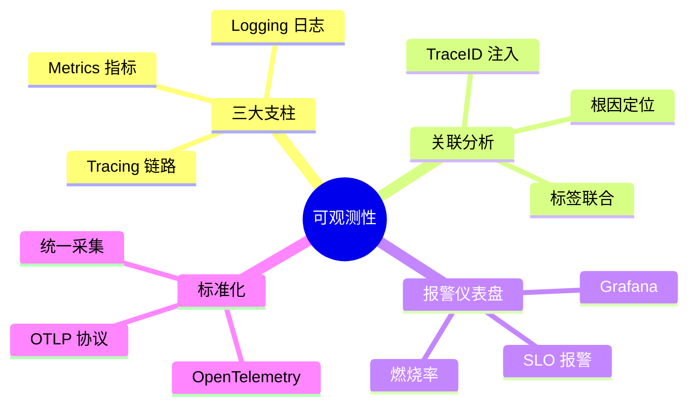

# 可观测性（Observability）

可观测性不是「装一个监控工具」那么简单。当系统出现故障时，你能否在 5 分钟内定位到根因？当性能出现劣化时，你能否知道瓶颈在哪？当业务指标异常时，你能否快速追溯到技术层的具体链路？

这些问题回答不了，根本原因在于：大多数系统的观测能力是事后补救，而非设计驱动。系统上线时没有埋点，故障时才发现看不见；出现问题时日志不全，只能靠「猜」来排查。

可观测性（Observability）正是来解决这个问题的。它不是某个具体工具，而是一套系统设计理念：**让系统的内部状态可以被外部输出推断出来**。可观测性强的系统，不需要在故障发生后再去加日志、加指标，而是系统本身就在持续输出足够的信息，让你在任何时刻都能回答「发生了什么、为什么发生、影响范围多大」这三个核心问题。

## 本章内容结构

可观测性分为六个子模块，层层递进：

| 模块 | 核心价值 | 关键问题 |
|---|---|---|
| **三大支柱** | 可观测性理论基础 | Metrics / Logging / Tracing 各自解决什么问题？ |
| **指标系统** | 量化系统行为 | Prometheus 如何支撑百万指标采集？ |
| **日志系统** | 记录离散事件 | ELK / Loki 各自的适用场景是什么？ |
| **链路追踪** | 还原请求路径 | 分布式上下文如何跨越服务边界传播？ |
| **关联与根因** | 连接数据孤岛 | 如何用 TraceID 串联所有数据？ |
| **报警与仪表盘** | 主动发现问题 | SLO 报警与阈值报警有何本质区别？ |

## 为什么可观测性比传统监控更重要

传统监控是「预先定义的指标告警」——你知道什么会出问题，提前埋好点，出问题时告警。这种方式在微服务时代遇到了瓶颈：服务数量爆炸、调用链路复杂、故障根因难以追溯，监控项的数量增长远超过人工管理能力。

可观测性则采用相反思路：**不预设问题，只收集足够的数据，让任何问题都能被事后分析出来**。它的核心假设是：故障模式无法完全预知，但只要数据够全，任何问题都能被还原。

这两者的本质区别在于：

| 维度 | 传统监控 | 可观测性 |
|---|---|---|
| **数据收集** | 按已知问题预设指标 | 收集所有原始事件，按需分析 |
| **故障发现** | 依赖预配置告警规则 | 通过数据关联发现未知问题 |
| **根因分析** | 告警点即问题点 | 通过链路和数据关联追溯根因 |
| **扩展性** | 服务增加 → 指标爆炸 → 管理困难 | 服务增加 → 自动采集 → 统一关联 |
| **代表工具** | Zabbix、Nagios | Prometheus、Grafana、Jaeger、ELK |

## 质量判断标准

读完本章后，你应该能够回答以下问题：

1. Metrics / Logging / Tracing 各自解决什么场景下的什么问题？
2. OpenTelemetry 为什么成为可观测性的行业标准？
3. 为什么说「三大支柱」是互补关系而非替代关系？
4. TraceID 注入日志为什么是关联分析的基础？
5. 燃烧率报警相比阈值报警解决了什么问题？

如果你能用自己的语言回答这些问题，说明已经建立起了对可观测性的系统性认知。
