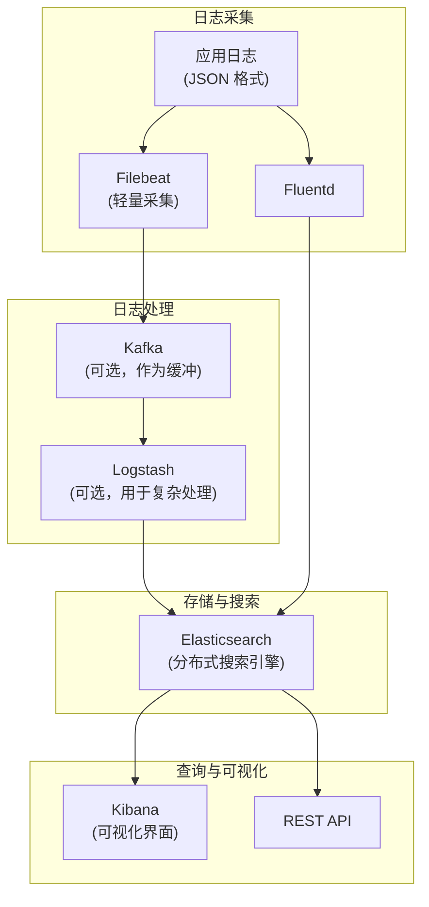

# ELK Stack 架构深度解析

ELK 是 Elasticsearch + Logstash + Kibana 的组合，是日志系统领域最经典的开源方案。Elasticsearch 负责存储和搜索，Logstash 负责数据处理和转换，Kibana 负责可视化。

但 ELK 并不是唯一的选择——对于中小规模的日志系统，Loki 可能是更轻量的替代。对于大规模系统，直接使用 Elasticsearch + Beats（替代 Logstash）可能更高效。理解 ELK 的架构，才能判断什么时候该用它。

## ELK 架构全景



## Elasticsearch：分布式搜索引擎

### 核心概念

| 概念 | 对应关系型数据库 | 说明 |
|---|---|---|
| **Index** | Database | 索引，逻辑上的数据库 |
| **Document** | Row | 文档，一条日志 |
| **Field** | Column | 字段，日志的属性 |
| **Mapping** | Schema | 映射，字段的类型定义 |
| **Shard** | - | 分片，数据分片 |
| **Replica** | - | 副本，数据副本 |

### 日志存储设计

```json title="日志索引映射"
{
  "mappings": {
    "properties": {
      "@timestamp": { "type": "date" },
      "level": { "type": "keyword" },
      "service": { "type": "keyword" },
      "traceId": { "type": "keyword" },
      "spanId": { "type": "keyword" },
      "message": { "type": "text" },
      "logger": { "type": "keyword" },
      "thread": { "type": "keyword" },
      "host": { "type": "keyword" },
      "error": {
        "type": "object",
        "properties": {
          "message": { "type": "text" },
          "stack_trace": { "type": "text" }
        }
      },
      "context": {
        "type": "object",
        "dynamic": true
      }
    }
  },
  "settings": {
    "number_of_shards": 3,
    "number_of_replicas": 1,
    "index.lifecycle.name": "log-retention-policy"
  }
}
```

### 关键字段类型选择

```json
{
  "mappings": {
    "properties": {
      // keyword：精确匹配，不需要分词，用于过滤和聚合
      "service": { "type": "keyword" },
      "level": { "type": "keyword" },
      "traceId": { "type": "keyword" },

      // text：全文搜索，用于 message 字段的内容搜索
      "message": { "type": "text" },

      // date：时间类型，用于时间范围查询
      "@timestamp": { "type": "date" },

      // long/double：数值类型，用于范围查询和统计
      "duration_ms": { "type": "long" },

      // object：嵌套对象
      "context": { "type": "object", "dynamic": true }
    }
  }
}
```

## Filebeat：轻量采集

Filebeat 是 Beats 家族的日志采集器，比 Logstash 更轻量，适合将日志直接发送到 Elasticsearch 或 Logstash。

```yaml title="filebeat.yml"
filebeat.inputs:
  - type: log
    enabled: true
    paths:
      - /var/log/containers/*.log
    json:
      keys_under_root: true
      add_error_key: true
      message_key: message

    # 字段添加
    fields:
      environment: production
      cluster: main
    fields_under_root: true

  # 过滤容器日志（只采集应用日志）
  - type: docker
    containers.ids:
      - '*'
    processors:
      - add_kubernetes_metadata:
          host: ${NODE_NAME}
          matchers:
            - logs_path:
                logs_path: "/var/log/containers/"
    json:
      keys_under_root: true
      add_error_key: true

processors:
  - add_host_metadata:
      when.not.contains.tags: forwarded
  - add_cloud_metadata: ~
  - add_docker_metadata: ~

output.elasticsearch:
  hosts: ["elasticsearch:9200"]
  index: "logs-%{+yyyy.MM.dd}"

# 启用索引生命周期管理
setup.ilm.enabled: true
setup.ilm.rollover_alias: "logs"
setup.ilm.pattern: "{now/d}-000001"
setup.ilm.policy_name: "log-retention-policy"
```

## Logstash：数据处理管道

Logstash 适合需要对日志做复杂转换的场景。

```ruby title="logstash-pipeline.conf"
input {
  beats {
    port => 5044
  }

  kafka {
    bootstrap_servers => "kafka:9092"
    topics => ["app-logs"]
    group_id => "logstash"
    codec => json
  }
}

filter {
  # 时间解析
  date {
    match => ["timestamp", "ISO8601"]
    target => "@timestamp"
  }

  # JSON 解析
  if [message] =~ /^\{/ {
    json {
      source => "message"
      target => "parsed"
    }

    # 将解析后的字段提升到顶层
    mutate {
      rename => {
        "[parsed][traceId]" => "traceId"
        "[parsed][service]" => "service"
        "[parsed][level]" => "level"
        "[parsed][message]" => "message"
      }
    }
  }

  # Grok 解析非结构化日志
  if [level] != "INFO" or [message] =~ /ERROR|WARN/ {
    grok {
      match => {
        "message" => "%{TIMESTAMP_ISO8601:timestamp} %{LOGLEVEL:level} \[%{DATA:logger}\] %{GREEDYDATA:message}"
      }
      overwrite => ["message"]
    }
  }

  # 过滤敏感信息
  mutate {
    gsub => [
      "message", "password=[^&\s]+", "password=***",
      "token=[^&\s]+", "token=***"
    ]
  }

  # 添加地理信息
  geoip {
    source => "client_ip"
    target => "geoip"
  }

  # 用户代理解析
  user_agent {
    source => "user_agent"
    target => "ua"
  }
}

output {
  elasticsearch {
    hosts => ["elasticsearch:9200"]
    index => "logs-%{+YYYY.MM.dd}"
    document_type => "_doc"

    # ILM 集成
    ilm_enabled => true
    ilm_rollover_alias => "logs"
    ilm_pattern => "{now/d}-000001"
    ilm_policy => "log-retention-policy"
  }
}
```

## Kibana：可视化

### 日志查询

```kql
# 基础查询
level: ERROR AND service: order-service

# 时间范围 + 错误
@timestamp: ["2026-04-08T00:00:00Z" TO "2026-04-08T23:59:59Z"]
AND level: ERROR

# TraceID 关联
traceId: "d3f8a2c1-e4b7-4f92"

# JSON 字段查询
context.orderId: 884321

# 聚合分析
# 统计每小时的错误数量
GET /logs/_search
{
  "size": 0,
  "query": {
    "bool": {
      "filter": [
        { "range": { "@timestamp": { "gte": "now-24h" } } },
        { "term": { "level": "ERROR" } }
      ]
    }
  },
  "aggs": {
    "errors_over_time": {
      "date_histogram": {
        "field": "@timestamp",
        "fixed_interval": "1h"
      }
    }
  }
}
```

## 索引生命周期管理（ILM）

```json title="ILM 策略"
PUT /_ilm/policy/log-retention-policy
{
  "policy": {
    "phases": {
      "hot": {
        "actions": {
          "rollover": {
            "max_age": "1d",
            "max_primary_shard_size": "50gb"
          },
          "set_priority": 100
        }
      },
      "warm": {
        "min_age": "7d",
        "actions": {
          "shrink": {
            "number_of_shards": 1
          },
          "forcemerge": {
            "max_num_segments": 1
          },
          "set_priority": 50
        }
      },
      "cold": {
        "min_age": "30d",
        "actions": {
          "set_priority": 0,
          "allocate": {
            "require": {
              "data": "cold"
            }
          }
        }
      },
      "delete": {
        "min_age": "90d",
        "actions": {
          "delete": {}
        }
      }
    }
  }
}
```

## 性能调优

### 常见性能问题

```json
# 问题：GC 导致写入阻塞
# 解决：增加 ES 堆内存或减少批量写入大小

# 问题：查询慢
# 原因：缺少 Filter Cache、Mapping 不合理
# 解决：使用 keyword 而非 text 做精确过滤

# 问题：存储成本高
# 解决：启用 ILM + 冷热分层
```

## 质量判断标准

读完本节后，你应该能够回答：

1. ELK Stack 中，Elasticsearch、Logstash、Filebeat 各自承担什么职责？什么场景下可以省略 Logstash？
2. Elasticsearch 的 `keyword` 和 `text` 字段类型有什么区别？为什么 TraceID 应该用 `keyword` 而非 `text`？
3. 索引生命周期管理（ILM）的热/温/冷/删四阶段分别是什么？为什么这样设计？
4. Filebeat 和 Logstash 的取舍标准是什么？在什么规模下需要引入 Logstash？
5. ELK 的查询性能瓶颈通常来自哪里？应该如何从索引设计和查询层面进行优化？
