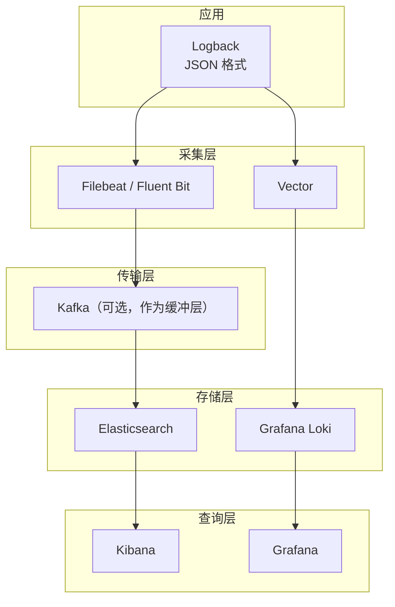

# 日志系统概述

一个用户在支付时遇到了问题：页面显示「支付失败」，但没有人知道具体原因。工程师开始排查，首先去订单服务查日志，发现订单创建成功；再去支付服务查日志，发现请求根本没收到；最后检查网关日志，发现请求被拦截了——原来是支付服务的 Token 过期了。

整个排查过程花了 40 分钟。如果日志从一开始就能按 TraceID 串联，工程师只需要搜索一次 TraceID，就能看到整个请求链路的完整日志，排查时间可以从 40 分钟降到 5 分钟。

这就是日志系统的核心问题：**日志量很大，但查找效率很低**。日志系统要解决的就是这个问题——让工程师在海量日志中快速找到需要的信息。

## 日志的本质

日志是系统产生的**离散事件记录**。每条日志描述了「在某个时间点，某个服务的某个位置，发生了什么」。

```
2026-04-08 10:23:45.123 ERROR [order-service] [d3f8a2c1] Payment failed: orderId=884321, reason=Token expired
```

这条日志包含几个关键字段：

- **时间戳**：`2026-04-08 10:23:45.123`
- **级别**：`ERROR`
- **服务**：`order-service`
- **上下文**：`[d3f8a2c1]`（TraceID）
- **消息**：`Payment failed: orderId=884321, reason=Token expired`

日志与指标的本质区别在于：**指标回答「系统怎么样」，日志回答「发生了什么」**。指标是聚合数据，日志是原始事件；指标告诉你「有多少请求失败了」，日志告诉你「这个请求为什么失败了」。

## 非结构化日志的问题

传统的日志格式是纯文本，靠换行分隔每条日志，靠固定格式约定（正则表达式）解析：

```
2026-04-08 10:23:45 ERROR PaymentService - Payment failed for order 884321
```

这种非结构化日志有以下问题：

**查询困难**。你想找所有「order 884321 相关的日志」，只能用 `grep "884321"`。但如果订单 ID 在不同日志中格式不一致（如 `orderId=884321`、`order: 884321`、`order_id: 884321`），grep 就要写多个正则。

**关联困难**。你想找同一个请求的所有日志，但没有统一标识，只能用时间窗口碰——「大概在这个时间点左右，找所有相关服务的日志」。准确性和效率都很低。

**分析困难**。你想统计「每种错误原因的分布」，但日志文本不统一，无法程序化分析。

## 结构化日志的价值

结构化日志将日志从纯文本转为键值对或 JSON，大幅提升查询和分析效率：

```json title="结构化日志示例"
{
  "timestamp": "2026-04-08T10:23:45.123Z",
  "level": "ERROR",
  "service": "payment-service",
  "traceId": "d3f8a2c1-e4b7-4f92-a1c6-8d2e9f0b3c5a",
  "spanId": "b7ad6b7169203331",
  "message": "Payment failed",
  "orderId": "884321",
  "amount": 299.00,
  "paymentMethod": "credit_card",
  "error": "Token expired",
  "duration_ms": 5000,
  "host": "payment-service-7d8f6c-xk2p9",
  "version": "v2.1.0"
}
```

结构化日志的优势：

**精确查询**：`traceId = "d3f8a2c1"` 可以直接找到该请求的所有日志，无论在哪个服务。

**多维度过滤**：`level = "ERROR" AND paymentMethod = "credit_card" AND amount > 100` 可以在毫秒级返回结果。

**聚合分析**：`count() BY (error)` 可以统计错误分布，`avg(duration_ms) BY (paymentMethod)` 可以分析不同支付方式的平均耗时。

## SLF4J + Logback 结构化输出

Java 生态最常用的日志框架是 SLF4J + Logback。通过配置 Logback 的 JSON 编码器，可以实现结构化输出：

```xml title="logback-spring.xml"
<?xml version="1.0" encoding="UTF-8"?>
<configuration>
    <include resource="org/springframework/boot/logging/logback/defaults.xml"/>

    <!-- 定义 JSON 编码器 -->
    <encoder class="ch.qos.logback.core.encoder.LayoutWrappingEncoder">
        <layout class="ch.p小品tion.to.sequential.logstash.logback.ArgumentsJsonProvider">
            <!-- 已有 MDC 的字段会自动包含 -->
            <includeMdcKeyName>traceId</includeMdcKeyName>
            <includeMdcKeyName>spanId</includeMdcKeyName>
            <includeMdcKeyName>userId</includeMdcKeyName>

            <!-- 自定义字段 -->
            <customFields>{"service":"${SPRING_APPLICATION_NAME:-unknown}"}</customFields>
        </layout>
    </encoder>

    <!-- 控制台输出 JSON -->
    <appender name="CONSOLE_JSON" class="ch.qos.logback.core.ConsoleAppender">
        <encoder class="net.logstash.logback.encoder.LogstashEncoder">
            <includeMdcKeyName>traceId</includeMdcKeyName>
            <includeMdcKeyName>spanId</includeMdcKeyName>
            <includeMdcKeyName>userId</includeMdcKeyName>
            <customFields>{"service":"${SPRING_APPLICATION_NAME}"}</customFields>
            <timestampPattern>yyyy-MM-dd'T'HH:mm:ss.SSSZ</timestampPattern>
        </encoder>
    </appender>

    <!-- 生产环境：异步输出避免阻塞 -->
    <appender name="ASYNC_JSON" class="ch.qos.logback.classic.AsyncAppender">
        <appender-ref ref="CONSOLE_JSON"/>
        <queueSize>1024</queueSize>
        <discardingThreshold>0</discardingThreshold>
        <includeCallerData>false</includeCallerData>
    </appender>

    <springProfile name="prod">
        <root level="INFO">
            <appender-ref ref="ASYNC_JSON"/>
        </root>
    </springProfile>

    <springProfile name="dev">
        <root level="DEBUG">
            <appender-ref ref="CONSOLE_JSON"/>
        </root>
    </springProfile>
</configuration>
```

### Java 代码示例

```java title="StructuredLoggingService.java"
@Service
@Slf4j
public class OrderService {

    public void placeOrder(Order order) {
        // 将关键信息放入 MDC，LogstashEncoder 会自动包含到 JSON 中
        MDC.put("traceId", span.context().getTraceId());
        MDC.put("spanId", span.context().getSpanId());
        MDC.put("orderId", order.getId());

        try {
            log.info("Placing order: amount={}, paymentMethod={}",
                order.getAmount(), order.getPaymentMethod());

            // 业务逻辑
            PaymentResult result = paymentService.charge(order);

            if (result.isSuccess()) {
                log.info("Order placed successfully: transactionId={}",
                    result.getTransactionId());
            } else {
                log.error("Payment failed: reason={}, errorCode={}",
                    result.getErrorMessage(),
                    result.getErrorCode());
            }

        } catch (Exception e) {
            // 记录异常时，LogstashEncoder 自动包含异常堆栈
            log.error("Order placement failed: orderId={}", order.getId(), e);
        } finally {
            MDC.clear(); // 防止 MDC 信息泄露到其他请求
        }
    }
}
```

### 异步日志的性能影响

日志写入是 IO 操作，如果不异步化，会严重拖慢业务线程。Logback 的 `AsyncAppender` 提供了异步日志写入能力：

```xml title="AsyncAppender 配置"
<appender name="ASYNC" class="ch.qos.logback.classic.AsyncAppender">
    <appender-ref ref="CONSOLE_JSON"/>

    <!-- 队列大小，超过后丢弃日志 -->
    <queueSize>2048</queueSize>

    <!-- 丢弃策略：
         0 = 永不丢弃（默认）
         >0 = 队列满时丢弃该百分比的低级别日志
    -->
    <discardingThreshold>0</discardingThreshold>

    <!-- 是否记录调用位置（行号、方法名），影响性能 -->
    <includeCallerData>false</includeCallerData>

    <!-- 队列剩余容量警告阈值 -->
    <neverBlock>true</neverBlock>
</appender>
```

关键配置项的作用：

- `queueSize`：队列太大占用内存，太小容易丢日志。2048 是常见的合理值。
- `discardingThreshold`：默认 0（永不丢弃）。设置 >0 可以在队列满时丢弃低级别日志（DEBUG、INFO），但需要评估是否能接受丢日志。
- `includeCallerData`：开启后每条日志会捕获调用堆栈，性能损耗约 10-20%，生产环境建议关闭。

## 日志的采集与存储

日志从产生到最终可查询，需要经历三个阶段：采集、传输、存储。



### ELK Stack vs Loki

这是最常见的两种日志存储方案选择：

| 维度 | ELK Stack（Elasticsearch） | Grafana Loki |
|---|---|---|
| **存储引擎** | Elasticsearch（全文索引） | 对象存储 + 索引 |
| **查询语言** | KQL | LogQL |
| **存储成本** | 高（需要足够的磁盘） | 极低（用对象存储） |
| **查询性能** | 毫秒级全文搜索 | 秒级标签过滤 |
| **适合场景** | 日志内容需要全文搜索 | 日志内容相对固定，标签检索足够 |
| **日志量** | < 50GB/天 | 任意规模 |
| **生态集成** | Kibana 强大 | Grafana 统一视图 |

Loki 的核心思路是「**索引日志元数据，存储原始日志**」。它不索引日志内容，只索引标签（`service`、`level`、`traceId` 等），大幅降低存储成本。查询时先用标签缩小范围，再拉取原始日志。这种折中在大多数排查场景下足够用。

## 日志级别策略

日志级别太多会淹没关键信息，太少会漏掉重要细节。推荐策略：

```java title="日志级别指南"
public class LoggingStrategy {

    // DEBUG：开发调试用，生产环境关闭
    // 包括：详细的入参/出参、中间变量、分支路径
    log.debug("Entering method: placeOrder, params: {}", order);

    // INFO：正常的业务里程碑
    // 包括：请求入口/出口、关键业务操作、系统状态变化
    log.info("Order placed: orderId={}, amount={}", order.getId(), order.getAmount());
    log.info("Application started, port={}", port);

    // WARN：潜在问题，不需要立即处理但需要关注
    // 包括：业务降级、资源接近上限、配置异常
    log.warn("Connection pool utilization high: {}/{}", used, max);
    log.warn("Retrying after failure: attempt={}/{}", attempt, maxAttempts);

    // ERROR：需要立即处理的错误，但服务仍可运行
    // 包括：外部依赖调用失败、业务逻辑异常、数据处理错误
    log.error("Payment failed: orderId={}, reason={}", orderId, reason, e);

    // NEVER：不要用 FATAL。FATAL 不是一个标准级别。
    // 如果服务无法继续，直接抛异常让容器重启，不要用日志"FATAL"
}
```

## 质量判断标准

读完本节后，你应该能够回答：

1. 为什么说「grep 日志」是低效的排查方式？结构化日志如何改变这个现状？
2. 结构化日志相比非结构化日志，在查询和关联两个维度有哪些具体优势？
3. Logback AsyncAppender 的 `discardingThreshold` 配置为什么建议设为 0？什么情况下可以调整？
4. ELK 和 Loki 的核心区别是什么？各自的适用场景是什么？
5. 为什么说日志中记录 TraceID 是可观测性关联分析的基础？TraceID 在日志关联中扮演什么角色？
