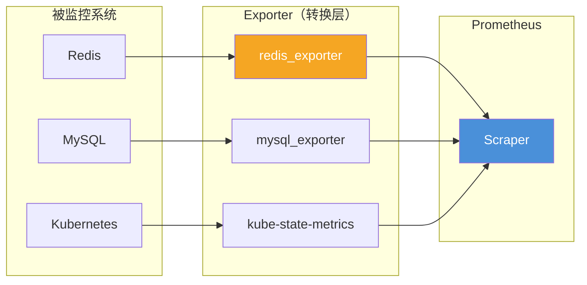

# Exporter 生态与开发

Prometheus 的数据采集能力不限于标准协议——它通过 **Exporter** 的模式，将任何系统（数据库、消息队列、硬件设备）都变成可被 Prometheus 抓取的目标。Exporter 本质上是一个**转换器**：将目标系统的指标格式转换为 Prometheus 的 `/metrics` 端点格式。

社区维护着数百个官方和非官方的 Exporter，覆盖了几乎所有主流中间件和系统。理解 Exporter 的工作原理，能让你在需要时快速开发自定义 Exporter，也能让你在遇到问题时快速定位 Exporter 配置问题。

## Exporter 工作原理



Exporter 的职责：

1. **连接被监控目标**：连接到 Redis、MySQL、K8s API 等
2. **收集指标**：执行查询命令、读取 API 数据
3. **格式转换**：将收集的数据转换为 Prometheus 文本格式
4. **暴露端点**：通过 HTTP 端口暴露 `/metrics` 端点

## 官方 Exporter 生态

### 最常用的 Exporter

| Exporter | 监控目标 | 下载地址 |
|---|---|---|
| **node_exporter** | 主机：CPU、内存、磁盘、网络 | prometheus/node_exporter |
| **mysqld_exporter** | MySQL：查询数、连接数、InnoDB | prometheus/mysqld_exporter |
| **postgres_exporter** | PostgreSQL | prometheus/postgres_exporter |
| **redis_exporter** | Redis：内存、键数量、命中率 | oliver006/redis_exporter |
| **kafka_exporter** | Kafka：消息量、消费延迟 | danielqsj/kafka_exporter |
| **blackbox_exporter** | 探测：HTTP/TCP/ICMP 可用性 | prometheus/blackbox_exporter |
| **jmx_exporter** | JVM：内存、GC、线程 | prometheus/jmx_exporter |
| **wmi_exporter** | Windows 主机监控 | michenriksen/wmi_exporter |

### node_exporter 部署

```yaml title="node-exporter-daemonset.yaml"
apiVersion: apps/v1
kind: DaemonSet
metadata:
  name: node-exporter
spec:
  selector:
    matchLabels:
      app: node-exporter
  template:
    metadata:
      labels:
        app: node-exporter
    spec:
      containers:
        - name: node-exporter
          image: prom/node-exporter:v1.7.0
          args:
            - '--path.procfs=/host/proc'
            - '--path.sysfs=/host/sys'
            - '--path.rootfs=/rootfs'
          ports:
            - containerPort: 9100
              name: metrics
          volumeMounts:
            - name: proc
              mountPath: /host/proc
            - name: sys
              mountPath: /host/sys
            - name: rootfs
              mountPath: /rootfs
      volumes:
        - name: proc
          hostPath:
            path: /proc
        - name: sys
          hostPath:
            path: /sys
        - name: rootfs
          hostPath:
            path: /
```

```yaml title="prometheus.yml"
scrape_configs:
  - job_name: 'node-exporter'
    kubernetes_sd_configs:
      - role: pod
    relabel_configs:
      - source_labels: [__meta_kubernetes_pod_label_app]
        action: keep
        regex: node-exporter
      - source_labels: [__meta_kubernetes_pod_container_port_number]
        action: keep
        regex: "9100"
      - action: labelmap
        regex: __meta_kubernetes_pod_label_(.+)
```

## 自定义 Exporter 开发

### 场景：监控自定义业务系统

假设你需要监控一个内部消息队列系统的指标。

### 1. 使用 Prometheus client library

```python title="custom_exporter.py"
from prometheus_client import Counter, Gauge, Histogram, generate_letrics
from flask import Flask

app = Flask(__name__)

# 定义指标
MESSAGES_PUBLISHED = Counter(
    'custommq_messages_published_total',
    '发布的消息总数',
    ['queue', 'priority']
)

QUEUE_SIZE = Gauge(
    'custommq_queue_size',
    '队列当前长度',
    ['queue']
)

PROCESS_TIME = Histogram(
    'custommq_message_process_seconds',
    '消息处理耗时',
    ['queue'],
    buckets=(0.005, 0.01, 0.025, 0.05, 0.1, 0.25, 0.5, 1.0)
)

@app.route('/metrics')
def metrics():
    # 暴露 Prometheus 格式的指标
    return generate_letrics()

@app.route('/api/publish', methods=['POST'])
def publish():
    queue = request.json['queue']
    priority = request.json['priority']

    PROCESS_TIME.labels(queue=queue).observe(0.05)
    MESSAGES_PUBLISHED.labels(queue=queue, priority=priority).inc()
    QUEUE_SIZE.labels(queue=queue).inc()

    return {'status': 'ok'}
```

### 2. Java Exporter 开发

```java title="CustomExporter.java"
public class CustomExporter {

    private static final Counter MESSAGES_PUBLISHED =
        Counter.build()
            .name("custommq_messages_published_total")
            .help("发布的消息总数")
            .labelNames("queue", "priority")
            .register();

    private static final Gauge QUEUE_SIZE =
        Gauge.build()
            .name("custommq_queue_size")
            .help("队列当前长度")
            .labelNames("queue")
            .register();

    public static void main(String[] args) {
        // 暴露 /metrics 端点
        HTTPServer server = new HTTPServer(9400);

        // 定时采集指标
        ScheduledExecutorService scheduler =
            Executors.newSingleThreadScheduledExecutor();
        scheduler.scheduleAtFixedRate(() -> {
            // 从消息队列获取指标
            List<QueueStats> stats = mqClient.getQueueStats();

            for (QueueStats stat : stats) {
                QUEUE_SIZE.labels(stat.getQueueName())
                    .set(stat.getQueueSize());
            }
        }, 0, 15, TimeUnit.SECONDS);
    }
}
```

### 3. 中间件方式（Java Agent）

```java title="CustomMetricsFilter.java"
@WebFilter(urlPatterns = "/api/*")
public class CustomMetricsFilter implements Filter {

    @Override
    public void doFilter(ServletRequest req, ServletResponse resp,
                         FilterChain chain) throws IOException, ServletException {
        HttpServletRequest request = (HttpServletRequest) req;
        long start = System.currentTimeMillis();

        try {
            chain.doFilter(req, resp);
        } finally {
            long duration = System.currentTimeMillis() - start;

            // 记录指标
            String endpoint = request.getRequestURI();
            int status = ((HttpServletResponse) resp).getStatus();

            REQUEST_LATENCY.labels(endpoint, String.valueOf(status))
                .observe(duration / 1000.0);
            REQUEST_TOTAL.labels(endpoint, String.valueOf(status))
                .inc();
        }
    }
}
```

## Exporter 配置最佳实践

### 1. 标签命名规范

```yaml
# ✅ 推荐：snake_case，标准化前缀
custommq_messages_published_total
custommq_queue_size
custommq_process_duration_seconds

# ❌ 不推荐：驼峰命名、含糊前缀
MessageCount
queue_size_mq
```

### 2. 避免高基数标签

```java
// ❌ 错误：高基数字段作为标签
Counter.build()
    .name("http_requests_total")
    .labelNames("user_id", "session_id")  // 灾难性基数
    .register();

// ✅ 正确：只使用低基数字段
Counter.build()
    .name("http_requests_total")
    .labelNames("method", "status", "endpoint")
    .register();
```

### 3. 合理的采集间隔

```yaml
scrape_configs:
  - job_name: 'custom-mq'
    scrape_interval: 15s    # 标准间隔
    scrape_timeout: 10s

  - job_name: 'slow-metrics'
    scrape_interval: 60s    # 慢指标可以更长
    scrape_timeout: 30s

  - job_name: 'fast-metrics'
    scrape_interval: 5s     # 需要高精度的指标
    scrape_timeout: 3s
```

## 常见问题

### 问题一：Exporter 连接失败

```bash
# 检查 Exporter 是否正常运行
curl http://exporter:9400/metrics

# 常见原因：
# 1. 端口被占用
# 2. 被监控系统认证失败
# 3. 网络策略阻止连接
```

### 问题二：指标格式错误

```bash
# 检查指标格式是否符合 Prometheus 规范
# 每一行应该是：metric_name{label="value"} value

# 常见错误：
# 1. 非数字值（Prometheus 只接受数值）
# 2. 缺失指标名称
# 3. 标签格式错误（引号不匹配）
```

### 问题三：指标丢失

```yaml
# 在 prometheus.yml 中启用调试
scrape_configs:
  - job_name: 'debug'
    metrics_path: /metrics
    static_configs:
      - targets: ['exporter:9400']
```

## 质量判断标准

读完本节后，你应该能够回答：

1. Exporter 的工作原理是什么？它如何将各种系统的指标转换为 Prometheus 格式？
2. 自定义 Exporter 开发有哪几种方式？分别在什么场景下适用？
3. 在开发自定义 Exporter 时，如何避免高基数标签问题？低基数标签和高基数标签应该如何区分使用？
4. node_exporter 在 Kubernetes 中的部署需要哪些特殊的 volume mount？为什么？
5. 如果 Exporter 的 `/metrics` 端点返回 404 或空白页面，应该从哪几个方面排查？
