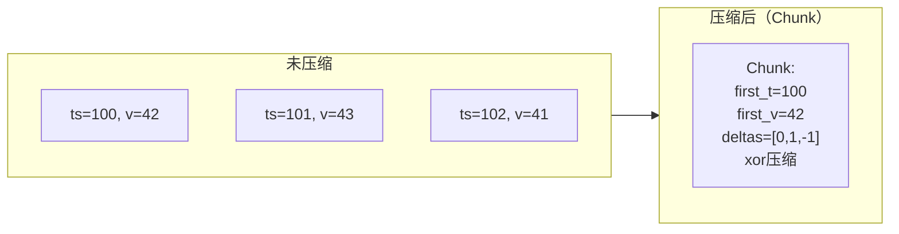

# 指标系统概述

凌晨 2 点，你被一条告警叫醒：「CPU 使用率超过 90%」。你登录服务器，发现 CPU 确实高，但到底是哪个进程、哪个线程、哪个操作消耗的？光看 CPU 使用率指标，你无法判断。重启 JVM 后 CPU 恢复了，但第二天同样的问题又来了。

这个场景揭示了一个关键事实：**指标告诉你「发生了什么」，但不告诉你「为什么发生」**。指标的真正价值，在于将系统行为量化，用数据驱动决策，而不是靠猜测。

指标系统（Metrics）是对系统状态的量化测量，是可观测性三大支柱中**最早成熟、投入产出比最高**的部分。相比链路追踪的复杂部署和日志系统的海量存储，指标的采集、存储、查询链路最为成熟，是所有可观测性实践的起点。

## 什么是指标

指标是**带时间戳的数值数据**，表示某个度量在特定时刻的值。指标的核心特征是**可聚合性**——你可以在任意时间窗口内对指标进行统计运算。

```
http_requests_total{method="GET", status="200", service="order-api"} 1523407 1712505600
                                           ↑                            ↑        ↑
                                         标签                            值      时间戳
```

这个例子展示了 Prometheus 格式的指标：`http_requests_total` 是指标名称，`method="GET"` 和 `status="200"` 是标签（Label），`1523407` 是当前值，`1712505600` 是 Unix 时间戳。

## 指标的四类类型

### Counter（计数器）

只增不减的累计值。用于统计「发生了多少次」，比如请求总数、错误总数、下单总数。Counter 的特点是：当前值不重要，变化率才重要。

```java title="Counter 使用示例"
Meter meter = openTelemetry.getMeter("order-service");

// 创建一个 Counter，统计下单总数
LongCounter orderCounter = meter.counterBuilder("orders_total")
    .setDescription("订单总数")
    .setUnit("1")
    .build();

// 每次下单时 +1
public void placeOrder(Order order) {
    orderCounter.add(1,
        Attributes.of(
            AttributeKey.stringKey("payment.method"), order.getPaymentMethod(),
            AttributeKey.stringKey("channel"), order.getChannel()
        )
    );
}
```

### Gauge（仪表）

可增可减的瞬时值。用于表示「当前是多少」，比如当前活跃连接数、当前队列长度、当前 CPU 使用率。

```java title="Gauge 使用示例"
Meter meter = openTelemetry.getMeter("order-service");

// 创建一个 Gauge，监控当前活跃请求数
AtomicInteger activeRequests = new AtomicInteger(0);

LongUpDownCounter activeRequestGauge = meter.upDownCounterBuilder("http_active_requests")
    .setDescription("当前活跃的 HTTP 请求数")
    .setUnit("1")
    .ofLongs()
    .build();

// 请求进来时 +1
public void onRequestStart() {
    activeRequestGauge.add(1);
}

// 请求结束时 -1
public void onRequestEnd() {
    activeRequestGauge.add(-1);
}
```

### Histogram（直方图）

统计分布的桶。用于分析「耗时/大小等连续值的分布」，比如 HTTP 请求延迟、数据库查询耗时、响应体大小。

```java title="Histogram 使用示例"
Meter meter = openTelemetry.getMeter("order-service");

// 创建 Histogram，统计请求延迟分布
DoubleHistogram requestLatency = meter.histogramBuilder("http_request_duration_seconds")
    .setDescription("HTTP 请求延迟分布")
    .setUnit("s")
    .ofLongs() // 使用长整型（毫秒）
    // 自定义 Bucket 边界
    .setExplicitBucketBoundariesAdvice(
        List.of(0.005, 0.01, 0.025, 0.05, 0.1, 0.25, 0.5, 1.0, 2.5, 5.0, 10.0))
    .build();

// 记录每次请求的延迟（毫秒）
public void recordLatency(long durationMs) {
    requestLatency.record(durationMs,
        Attributes.of(
            AttributeKey.stringKey("http.method"), "GET",
            AttributeKey.stringKey("http.status_code"), "200"
        )
    );
}
```

Histogram 的 Bucket 设计非常关键。在上面的例子中，`le="0.1"` 这个 Bucket 记录了延迟 `<= 100ms` 的请求数。你可以用这个数据计算出 P99.9：`100% - (le=0.1 桶的累积计数 / 总计数)`。

### Summary（摘要）

服务端直接计算并输出的分位数。输出 `quantile="0.99"` 时，指标直接显示 P99 值，不需要在查询端计算。

```java title="Summary vs Histogram 对比"
# Histogram（查询端计算分位数）
# 查询 Prometheus 获取延迟 P99
histogram_quantile(0.99,
    sum(rate(http_request_duration_seconds_bucket[5m])) by (le)
)

# Summary（服务端直接输出）
http_request_duration_seconds{quantile="0.99"} 0.085
# 直接就是 P99 值，无需计算
```

Summary 的局限：**服务端计算后输出，无法二次聚合**。如果你的服务部署了多个实例，Summary 的分位数无法在服务端合并（因为 P99 不可加），只能展示每个实例的分位数。而 Histogram 可以先聚合多个实例的 Bucket，再统一计算分位数。

**生产环境推荐 Histogram**。

## Prometheus 架构深度解析

Prometheus 是指标领域的事实标准。相比 Zabbix、Nagios 等传统监控系统，Prometheus 的核心优势是：**Pull 模型 + 标签模型 + PromQL**，这三者的组合让指标的采集、存储、查询变得异常灵活。

### Pull vs Push 模型

| 模型 | 说明 | 代表工具 | 优势 | 劣势 |
|---|---|---|---|---|
| **Pull（拉取）** | Prometheus 主动从目标拉取指标 | Prometheus | 易于发现目标、无需在应用端配置推送地址 | 高延迟（最大拉取间隔内看不到数据） |
| **Push（推送）** | 应用主动推送指标到收集器 | StatsD、InfluxDB | 立即可见、低延迟 | 需要在应用端配置推送地址 |

Prometheus 默认使用 Pull 模型，通过 `prometheus.yml` 中的 `scrape_configs` 定义拉取目标。Push 模型通过 `Prometheus Pushgateway` 支持（适用于短生命周期任务）。

```yaml title="prometheus.yml"
scrape_configs:
  - job_name: 'order-service'
    scrape_interval: 15s      # 拉取间隔
    scrape_timeout: 10s       # 拉取超时
    metrics_path: /actuator/prometheus
    static_configs:
      - targets: ['order-service:8080']

  - job_name: 'kubernetes-pods'
    kubernetes_sd_configs:
      - role: pod             # 自动发现 K8s Pod
    relabel_configs:
      - source_labels: [__meta_kubernetes_pod_annotation_prometheus_io_scrape]
        action: keep
        regex: true
```

### 标签模型与标签维度

Prometheus 的标签（Label）是指标的灵魂。同一个指标名称，通过不同标签区分不同维度：

```
# 粗粒度：一个指标覆盖所有场景
http_requests_total 1000000

# 细粒度：用标签区分维度
http_requests_total{method="GET",  status="200", service="order-api"}  850000
http_requests_total{method="POST", status="200", service="order-api"}  120000
http_requests_total{method="GET",  status="500", service="order-api"}  30000
```

标签让指标变得可查询、可过滤、可聚合。使用 PromQL 时，可以随意过滤、聚合、分组：

```yaml
# 过滤：只看 GET 请求
sum(rate(http_requests_total{method="GET"}[5m]))

# 分组聚合：按服务名统计 QPS
sum(rate(http_requests_total[5m])) by (service)

# 多标签过滤：GET + 500 错误
sum(rate(http_requests_total{method="GET", status=~"5.."}[5m]))
```

但标签也带来了**基数问题**（Cardinality Problem）：如果标签的组合数爆炸，Prometheus 的存储和查询性能会急剧下降。这是 Prometheus 使用中最常见也最危险的问题。

## 时序数据库原理

Prometheus 的存储引擎是自定义的 TSM（Time Series Merge）引擎，借鉴了 Gorilla 的内存压缩算法。理解 TSDB 的工作原理，有助于理解 Prometheus 的性能特征和局限。

### 内存压缩（Chunk）

Prometheus 不将每条数据点单独存储，而是将一段时间内的数据点压缩为一个 Chunk（数据块）：



Gorilla 算法使用 XOR 压缩和差分编码，在大多数场景下可以将数据压缩 10 倍以上。这意味着 Prometheus 可以在内存中缓存更多时间序列，查询更快。

### 写路径与读路径

**写路径**：

1. 指标数据到达 `Head Block`（内存中的最新数据区）
2. 超过阈值后，`Head Block` 压缩为 `Block` 写入磁盘
3. 后台任务定期将 `Block` 压缩合并（Compaction）

**读路径**：

1. 根据时间范围，确定需要读取哪些 Block
2. 从 Block 索引中定位目标时间序列
3. 解压 Chunk 数据，返回查询结果

Prometheus 的读性能高度依赖查询时间范围和并发度。查询跨度越大，需要读取的 Block 越多，越慢。

## 常见问题与反模式

### 反模式一：标签值包含高基数字段

```yaml
# 错误：user_id 作为标签值，高基数导致内存爆炸
http_requests_total{user_id="10086"} 1
http_requests_total{user_id="10087"} 1
http_requests_total{user_id="10088"} 1
# 每天几百万用户 = 几百万时间序列
```

```yaml
# 正确：user_id 只记录在日志中，指标不包含高基数字段
http_requests_total{service="order-api", method="GET"} 1
# 如果确实需要用户维度，用 TraceID 或 Rollup 聚合
```

### 反模式二：指标数量没有上限

有些团队喜欢「宁多勿少」——每个函数、每个分支都加一个指标。结果是 Prometheus 内存被几十万个时间序列撑满。

正确做法：**指标要按需创建**。优先保证核心指标（黄金指标）的准确性，非核心指标按需添加。

### 反模式三：忘记设置合理的拉取间隔

拉取间隔太短（如 5s），会增加 Prometheus 的负载和存储压力；太长（如 1min），会导致告警延迟过高。15s 是大多数场景的合理默认值。

## 质量判断标准

读完本节后，你应该能够回答：

1. Counter、Histogram、Summary 三种指标类型的本质区别是什么？分别适合什么场景？
2. 为什么生产环境推荐使用 Histogram 而非 Summary 来描述延迟分布？
3. Prometheus 的 Pull 模型相比 Push 模型有什么优势？在什么场景下需要 Pushgateway？
4. Prometheus 的标签基数问题（Cardinality Problem）是什么？为什么高基数字段（如 user_id）不适合作为标签值？
5. 如果 Prometheus 查询突然变慢，最可能的原因是什么？应该如何排查？
