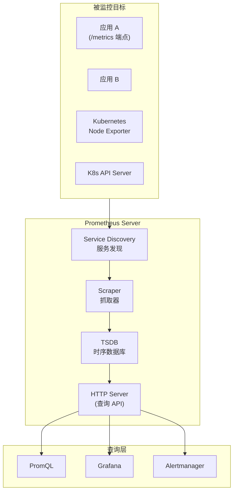
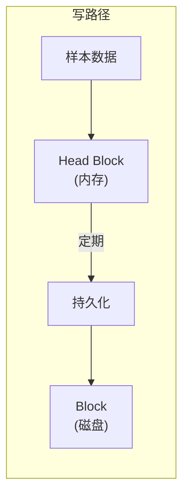
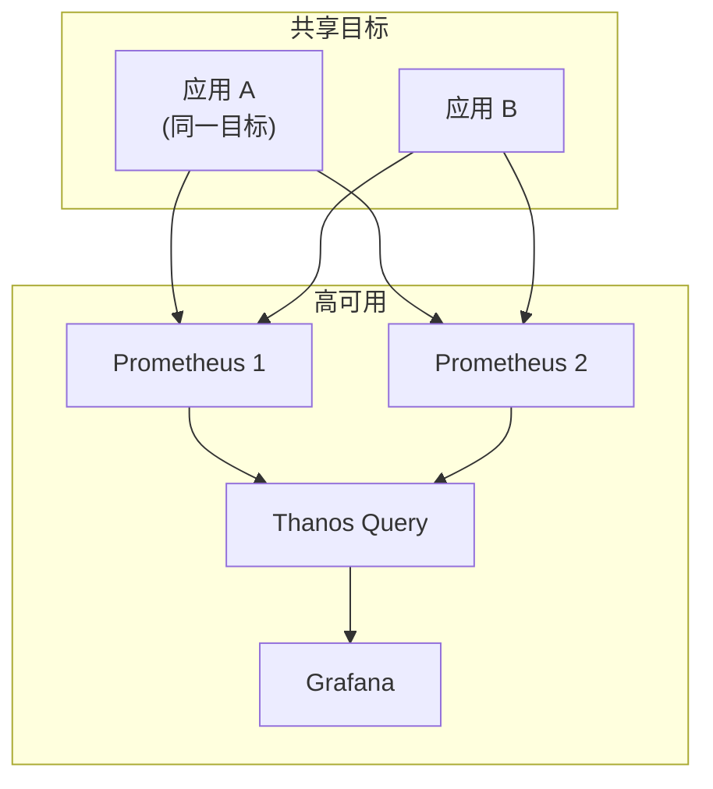

# Prometheus 架构深度解析

Prometheus 不是又一个监控工具，而是一个**重新定义监控数据模型**的系统。它用 Pull 模型取代 Push 模型，用标签模型取代树形指标，用 PromQL 取代 SQL-like 查询语言。这三个改变让监控变得灵活得多，但也引入了一些独特的概念和限制。

理解 Prometheus 的架构，有助于你做出正确的使用决策：什么时候用 Prometheus，什么时候需要 Thanos 或 VictoriaMetrics。

## 整体架构



## Pull 模型

### 原理

Prometheus 不等待数据推送过来，而是**主动去拉取（Pull）**。每个被监控的服务需要暴露一个 `/metrics` HTTP 端点，Prometheus 按照配置的间隔去访问这个端点。

```
# Prometheus 每 15 秒执行一次抓取
scrape_configs:
  - job_name: 'order-service'
    scrape_interval: 15s
    metrics_path: /actuator/prometheus
    static_configs:
      - targets: ['order-service:8080']
```

### 为什么 Pull 比 Push 更适合监控

| 维度 | Pull 模型 | Push 模型 |
|---|---|---|
| **目标发现** | Prometheus 主动发现，配置简单 | 应用需要知道推送地址，配置复杂 |
| **健康检查** | 抓取失败 = 目标不可达，直观 | 需要额外的健康检查机制 |
| **网络拓扑** | Prometheus 只需访问内网 | 应用需要能访问推送网关 |
| **指标完整性** | 拉取间隔内没有数据丢失 | 推送间隔决定数据粒度 |
| **告警触发** | 目标消失立即触发告警 | 需要额外心跳机制 |

### Pull 模型的局限

**高延迟监控**：`prometheus.pushgateway` 用于解决短生命周期任务（批处理、Lambda 函数）无法被 Pull 的问题。

**高频指标**：Prometheus 每次拉取只能获取最新值，不适合需要毫秒级精度的场景。

## 数据模型

### 时间序列

Prometheus 的基本数据单位是**时间序列（Time Series）**，每条时间序列由以下元素组成：

```
指标名称 + 标签集 = 时间序列标识
      ↓
  时间序列数据点：[ (timestamp, value), (timestamp, value), ... ]
```

示例：

```
# 指标名称：http_requests_total
# 标签：service="order-api", method="GET", status="200"
# 时间序列：{http_requests_total, service="order-api", method="GET", status="200"}

# 数据点
{total="..."}[http_requests_total{service="order-api", method="GET", status="200"}] = [
  (1701234567, 850000),
  (1701234582, 850120),
  (1701234597, 850350)
]
```

### 标签的命名规范

```yaml
# 推荐命名规范（snake_case）
http_requests_total           # 指标名
http_request_duration_seconds # 指标名
service_name                  # 标签名
instance_ip                   # 标签名

# 不推荐（camelCase / PascalCase）
httpRequestsTotal             # 难以阅读
ServiceName
```

## 服务发现

Prometheus 支持多种服务发现机制，让它能自动找到需要监控的目标：

### Kubernetes 服务发现

```yaml title="prometheus.yml"
scrape_configs:
  - job_name: 'kubernetes-pods'
    kubernetes_sd_configs:
      - role: pod
        namespaces:
          names:
            - production
    relabel_configs:
      # 只监控带有 prometheus.io/scrape=true 注解的 Pod
      - source_labels: [__meta_kubernetes_pod_annotation_prometheus_io_scrape]
        action: keep
        regex: true

      # 从 Pod 注解中提取服务名
      - source_labels: [__meta_kubernetes_pod_annotation_prometheus_io_name]
        target_label: service

      # 从 Pod 名称中提取实例名
      - source_labels: [__meta_kubernetes_pod_name]
        regex: '(.*)-[a-f0-9]{10}-[a-z0-9]{5}'
        replacement: '${1}'
        target_label: instance
```

### 常见服务发现角色

| 角色 | 说明 | 场景 |
|---|---|---|
| `pod` | 发现 K8s Pod | 应用监控 |
| `service` | 发现 K8s Service | 服务端点 |
| `node` | 发现 K8s Node | 基础监控 |
| `endpoints` | 发现 Service 的 Endpoints | 精确到 Pod |
| `ingress` | 发现 K8s Ingress | 入口监控 |

## TSDB 存储引擎

### 存储结构

Prometheus 的存储分为两部分：

1. **Head（内存区）**：最新写入的数据，存储在内存中，支持高写入速率
2. **Block（磁盘区）**：定期压缩后的历史数据块



### Gorilla 压缩算法

Prometheus 使用改进版的 Gorilla 压缩算法，可以将时序数据压缩 10 倍以上：

```go
// 压缩原理（简化）
// 对于连续单调递增的时间戳：
// 不存储每个时间戳，而是存储：
// 1. 第一个时间戳和值（完整存储）
// 2. 后续时间戳只存储与前一个的差值（Delta）
// 3. 如果差值可以 XOR 表示，进一步压缩

// 对于连续相似的值：
// 不存储完整值，而是存储 XOR 后的差值
```

### 查询执行流程

```yaml
# 查询 P99 延迟
histogram_quantile(0.99,
    sum(rate(http_request_duration_seconds_bucket[5m])) by (le)
)
```

```
查询执行流程：

1. 解析 PromQL → 抽象语法树
2. 查询计划：
   ├── 从索引定位目标时间序列
   ├── 读取 Block 数据（按时间范围）
   ├── 在内存中处理 Head 数据
   ├── 合并 Block + Head 结果
   ├── 按标签分组聚合
   └── 计算 histogram_quantile
3. 返回结果
```

### 写入速率与查询性能的权衡

| 配置 | 写入速率 | 查询性能 | 内存使用 |
|---|---|---|---|
| `scrape_interval: 5s` | 高 | 好 | 高 |
| `scrape_interval: 15s` | 中 | 中 | 中 |
| `scrape_interval: 60s` | 低 | 差 | 低 |

`scrape_interval` 越短，数据越精细，但存储和查询压力越大。15 秒是大多数场景的合理默认值。

## 高可用架构

### 基本 HA



两台 Prometheus 同时抓取同一目标，数据去重由 Thanos Query 层处理。任一台 Prometheus 宕机，不影响监控连续性。

### Thanos 实现全局视图

```yaml title="thanos-query.yml"
query:
  query_range:
    # 查询范围
    max_resolution: 5m
    step: 30s
```

Thanos Sidecar 让 Prometheus 可以从对象存储读取历史数据，实现**无限历史存储**，同时保持 Prometheus 的独立运行能力。

## 常见问题

### 问题一：Prometheus OOM

```yaml title="prometheus.yml"
# 限制每个抓取目标的内存使用
scrape_configs:
  - job_name: 'high-cardinality'
    metric_limit: 10000  # 每个目标最多 10000 个时间序列
```

### 问题二：查询超时

```yaml title="prometheus.yml"
global:
  evaluation_interval: 15s  # 告警规则评估间隔

# 单次查询超时
scrape_configs:
  - job_name: 'default'
    scrape_timeout: 10s  # 抓取超时
```

## 质量判断标准

读完本节后，你应该能够回答：

1. Prometheus 的 Pull 模型相比 Push 模型，在「服务发现」和「健康检查」两个维度上有什么优势？
2. Prometheus TSDB 的 Head Block 和 Block 分别承担什么职责？Gorilla 压缩算法是如何工作的？
3. 在 Kubernetes 环境中，Prometheus 是如何自动发现需要监控的 Pod 的？`relabel_configs` 的作用是什么？
4. Prometheus 的 HA 架构中，两台 Prometheus 同时抓取同一目标，数据如何去重？Thanos Query 在其中扮演什么角色？
5. 如果 Prometheus 出现 OOM 问题，最可能的原因是什么？如何从配置层面避免？
