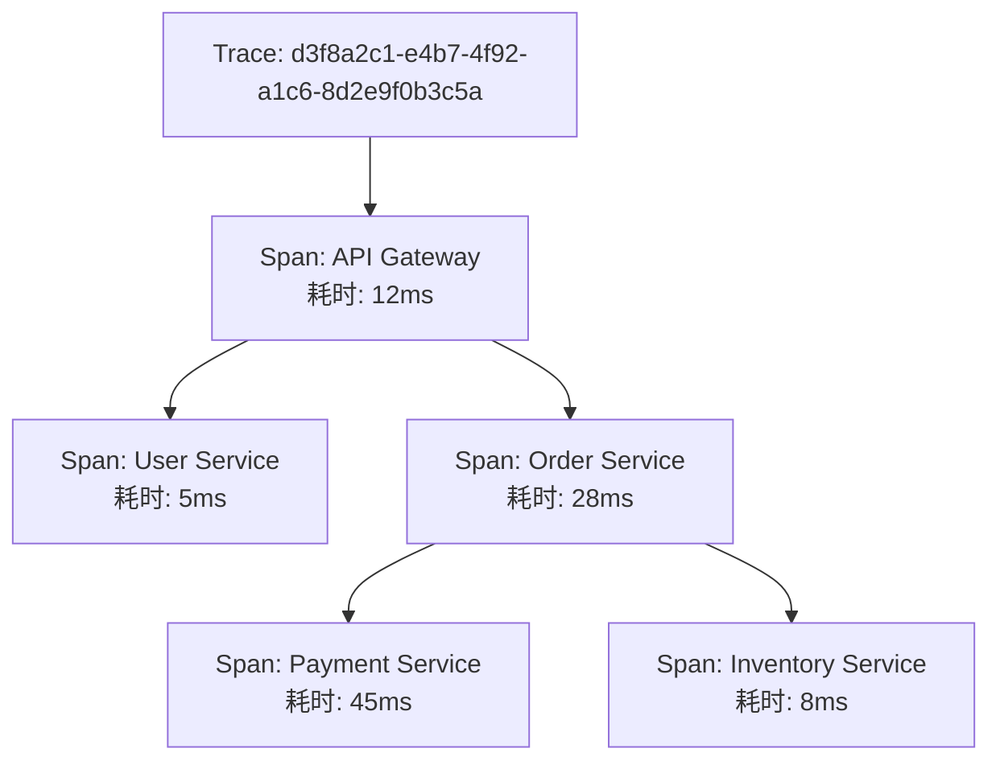
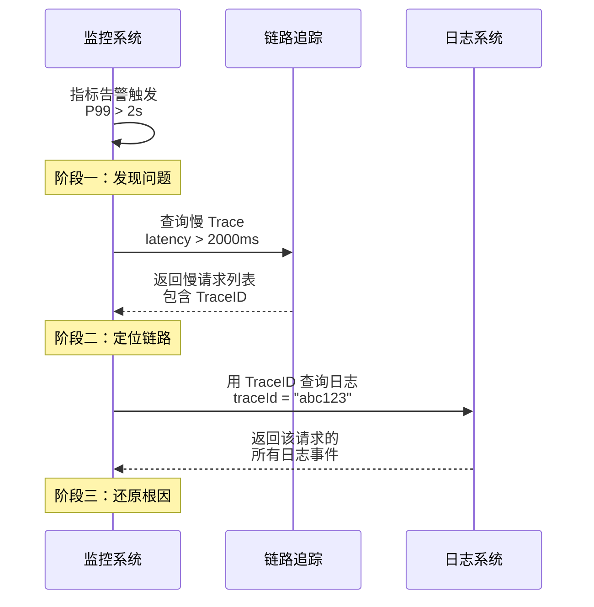

# 三大支柱：Metrics / Logging / Tracing

如果把可观测性比作一场车祸事故的调查，**Metrics** 是查看各个路口的车流量统计表，告诉你「这条路平时 100 辆/分钟，现在 300 辆/分钟」；**Logging** 是事故现场的监控录像，告诉你「车牌 ABC123 在 14:32:15 撞上了护栏」；**Tracing** 则是导航软件记录的行驶轨迹，告诉你「这辆车从 A 点出发，经过 B、C 两个路口，最后在 D 点出事」。

三种数据回答的问题不同，互相补充。

## 一、Metrics（指标）

### 什么是指标

指标是对系统状态的**量化测量**。它是经过聚合的数值数据，通常带有时间戳，表示某个度量在特定时刻的值。

比如：`http_requests_total{method="GET", status="200"} 1523407` 表示 HTTP GET 请求中状态码为 200 的请求总数为 1523407 次。

指标的核心特征是**可聚合性**：你可以在任意时间窗口内对指标进行求和、平均、分位数计算。指标适合回答「系统整体健康吗？」这类宏观问题。

### 指标的四种类型

| 类型 | 说明 | 适用场景 | 示例 |
|---|---|---|---|
| **Counter（计数器）** | 只增不减的累计值 | 请求总数、错误总数 | `http_requests_total` |
| **Gauge（仪表）** | 可增可减的瞬时值 | 当前连接数、CPU 使用率 | `cpu_usage_percent` |
| **Histogram（直方图）** | 统计分布的桶 | 请求延迟分布、响应大小分布 | `http_request_duration_seconds` |
| **Summary（摘要）** | 服务端计算的分位数 | 延迟 P50/P90/P99 | `http_request_latency_seconds{quantile="0.99"}` |

Histogram 和 Summary 都用于描述延迟分布，但有一个关键区别：**Histogram 在客户端采集服务端聚合**（Buckets 分布），数据可二次计算；**Summary 在服务端计算后直接输出**分位数，无法二次聚合但精度更高。生产环境推荐使用 Histogram。

### 指标的典型场景

- **容量规划**：`container_memory_usage_bytes` 的历史趋势用于判断何时扩容
- **SLO 监控**：`http_requests_total{job="api" and status!="200"}` 用于计算错误率
- **性能分析**：`http_request_duration_seconds_bucket{le="0.1"}` 用于分析延迟分布

### 指标的局限性

指标擅长回答「发生了什么」和「发生多少」，但不擅长回答「为什么」。当 CPU 使用率飙升时，指标可以告诉你「CPU 确实升高了」，但无法告诉你「是哪个请求、哪个线程、哪行代码导致的」。

## 二、Logging（日志）

### 什么是日志

日志是系统产生的**离散事件记录**，每条日志包含时间戳、消息内容以及可选的上下文属性。

典型的日志格式：

```
2026-04-08 10:23:45.123 INFO [order-service] [d3f8a2c1] Order placed: orderId=884321, amount=299.00, userId=10086
```

日志的核心特征是**事件驱动**：日志只在事件发生时产生，包含丰富的上下文信息（谁、什么、什么时候、在哪）。

### 结构化日志 vs 非结构化日志

**非结构化日志**（传统方式）：

```
2026-04-08 10:23:45 ERROR PaymentService: Payment failed for order 884321, error: connection timeout
```

**结构化日志**（JSON 格式）：

```json
{
  "timestamp": "2026-04-08T10:23:45.123Z",
  "level": "ERROR",
  "service": "payment-service",
  "traceId": "d3f8a2c1",
  "message": "Payment failed",
  "orderId": "884321",
  "error": "connection timeout",
  "duration_ms": 5000
}
```

结构化日志的最大优势是**可查询性**：在 ELK 或 Loki 中，你可以用 `traceId=d3f8a2c1` 精确过滤出属于同一次请求的所有日志，而非结构化日志只能靠正则匹配，查询效率低且容易出错。

### 日志的典型场景

- **错误追踪**：`level=ERROR` 过滤出所有错误，查看错误堆栈和上下文
- **调试分析**：`traceId=d3f8a2c1` 查看某次请求的完整执行路径
- **审计合规**：记录所有涉及资金或敏感数据的操作日志

### 日志的局限性

日志量大得惊人。一个日均 10 万 QPS 的服务，每秒可能产生数千条日志。如果不加控制，日志存储成本会迅速失控。此外，日志本身是离散的——你知道某件事发生了，但很难从日志直接看出「这件事导致系统变慢的量化关系」。

## 三、Tracing（链路追踪）

### 什么是链路追踪

链路追踪记录一次请求从接收到响应完成的**完整执行路径**，包括该请求经过的所有服务、每个服务的耗时、是否出错等信息。

一条完整的 Trace 看起来像一棵树：



### Trace 的核心概念

**Trace（追踪）**：一次完整请求的全局视图，用唯一的 TraceID 标识。比如用户下单操作，从 API 网关 → 用户服务 → 订单服务 → 支付服务 → 库存服务，所有这些 Span 组成一个 Trace。

**Span（跨度）**：Trace 中的一个工作单元，代表一次操作。比如「调用支付接口」是一个 Span，「查询商品库存」是另一个 Span。每个 Span 有自己的 SpanID，Span 之间通过 ParentSpanID 形成父子关系。

**Context（上下文）**：TraceID 和 SpanID 的载体，通过 HTTP Header 或消息协议在服务间传播，确保上下文不丢失。

### 链路追踪的典型场景

- **瓶颈定位**：「这个接口为什么慢？」——通过 Waterfall 图找到耗时最长的 Span
- **错误传播追踪**：「用户的订单为什么失败了？」——通过 TraceID 串联所有服务日志
- **依赖关系分析**：自动构建服务间的调用拓扑图

### 链路追踪的局限性

链路追踪的数据量很大。每个请求都会生成一条 Trace，在高 QPS 系统下数据量惊人。采样策略是链路追踪的核心工程问题——全量采集成本太高，但采样率太低又可能漏掉重要请求。

## 三大支柱的对比矩阵

| 维度 | Metrics | Logs | Traces |
|---|---|---|---|
| **数据形态** | 聚合数值 | 离散事件记录 | 因果链/树状结构 |
| **产生方式** | 持续采集（Pull/Push） | 事件驱动（主动写入） | 请求驱动（每次请求生成 |
| **存储大小** | 小（高压缩率） | 大（原始文本/JSON） | 中（采样后可接受） |
| **查询延迟** | 低（预聚合，毫秒级） | 中（倒排索引，秒级） | 低（时序索引，毫秒级） |
| **回答的问题** | 系统健康吗？ | 发生了什么？ | 怎么变成这样的？ |
| **适用阶段** | 监控告警 | 故障排查 | 根因定位 |
| **典型工具** | Prometheus | Loki、ELK | Jaeger、Zipkin |
| **成本** | 低 | 高 | 中 |

## 三大支柱如何协同

没有哪个支柱能单独解决问题。三大支柱需要协同工作才能发挥可观测性的全部价值。

一个典型的故障排查流程：

1. **指标告警**：`http_request_duration_seconds_p99 > 2s` 触发告警——告诉你「有问题」
2. **链路分析**：查看慢请求的 Trace，找到耗时最长的 Span——告诉你「问题在哪」
3. **日志关联**：用 TraceID 过滤出该请求的所有日志——告诉你「具体发生了什么」



这个流程中，**TraceID 是串联三大支柱的纽带**——它是指标中可以关联的标签、日志中可以过滤的字段、链路中天然携带的标识。

## 什么时候选哪种数据

不是所有场景都需要三大支柱同时上场。根据问题类型选择合适的数据：

**优先看指标**：容量规划、SLO 达标率监控、日常巡检、性能基线对比。这类问题关心的是宏观趋势和量化数据。

**优先看日志**：错误调试、审计追踪、安全事件分析。这类问题关心的是「具体发生了什么」。

**优先看链路**：跨服务调用分析、延迟瓶颈定位、错误根因追溯。这类问题关心的是「请求是怎么走的」。

**三者联合**：重大故障排查、慢请求分析、性能优化。这类问题需要三种数据配合使用。

## 质量判断标准

读完本节后，你应该能够回答：

1. Counter 和 Gauge 的本质区别是什么？分别适合什么场景？
2. 为什么说结构化日志比非结构化日志更适合微服务环境？
3. TraceID 在三大支柱中扮演什么角色？为什么它如此重要？
4. Histogram 和 Summary 都可以描述延迟分布，它们的核心区别是什么？
5. 在故障排查中，三大支柱通常以什么顺序使用？各自的角色是什么？
