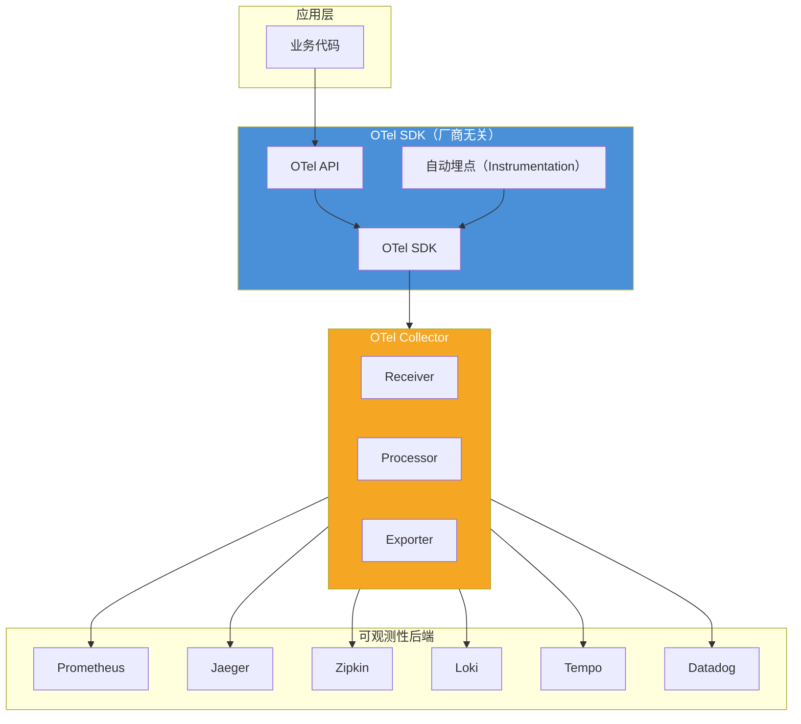
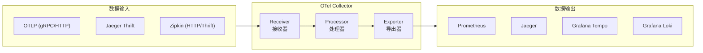
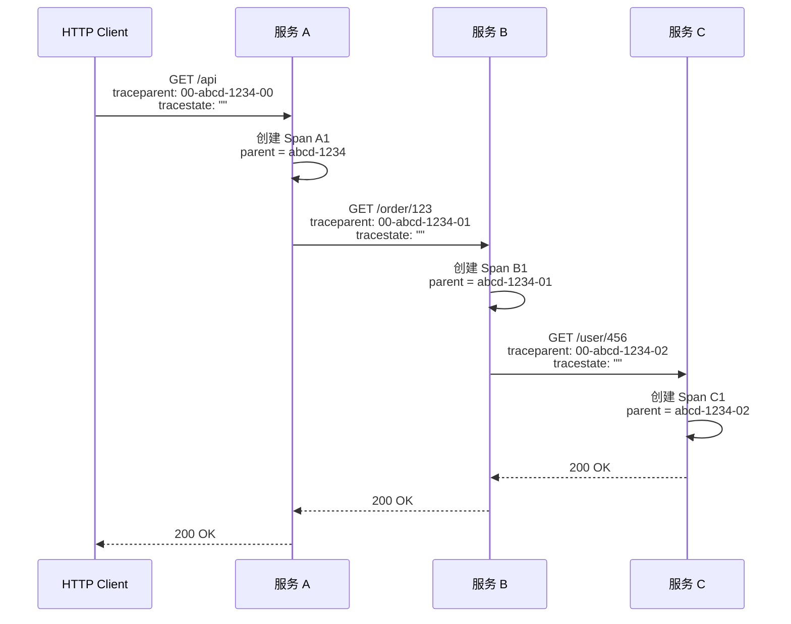

# OpenTelemetry 统一标准

2021 年 5 月，OpenTelemetry（简称 OTel）发布了 1.0 版本。这不是一个新项目，而是 OpenTracing 和 OpenCensus 两个标准合并后的产物。这场合并花了两年时间，背后的推动力很简单：**市场上存在两套不兼容的标准，工具和库被迫支持两份 API，开发者被逼着做选择**。

OpenTelemetry 的目标是一次埋点、全渠道导出。你只需要用 OTel SDK 写一次埋点代码，数据就可以发送到 Prometheus、Grafana、Jaeger、Zipkin、DataDog 等任何支持 OTLP 协议的后端。这种「大一统」的能力，让 OTel 成为可观测性领域的事实标准。

## 为什么需要 OpenTelemetry

在 OTel 出现之前，埋点代码和后端存储是强绑定的：

- 想用 Jaeger？得用 Jaeger 的 SDK 埋点
- 想切到 Zipkin？得重写埋点代码
- 想同时支持两个后端？得写两套埋点逻辑

这种强绑定带来的问题是：**埋点代码 = 业务逻辑 + 供应商锁定**。一旦选定了可观测性供应商，再想更换代价巨大。

OpenTelemetry 通过三层解耦解决了这个问题：



OTel SDK 负责数据采集，Collector 负责数据处理和转发，任何后端只要实现了 OTLP 协议就能接收数据。应用层完全不感知后端选型。

## OpenTelemetry 的核心组件

OpenTelemetry 由四个核心组件构成：

### 1. Specification（规范）

OTel 的「宪法」，定义了所有组件的行为规范。包括：

- **Trace API**：Span、Tracer、Context 的接口定义
- **Metrics API**：Meter、Counter、Gauge、Histogram 的接口定义
- **Log API**：LogRecord、Logger 的接口定义
- **Resource**：标识产生数据的进程（服务名、版本、环境等）
- **Semantic Conventions**：标准化的属性命名（如 `http.method`、`db.system`）

Specification 是 OTel 的根基，确保所有语言的 SDK 实现行为一致。

### 2. SDK（软件开发包）

Specification 的语言特定实现。目前支持 10+ 种语言，包括 Java、Go、Python、JavaScript、.NET、Rust 等。

OTel SDK 分为两个层面：

| 层面 | 说明 | 内容 |
|---|---|---|
| **手动埋点** | 显式创建 Span / Counter / LogRecord | 业务逻辑的精确覆盖 |
| **自动埋点** | 无需修改代码，自动拦截常见框架 | HTTP 库、数据库、消息队列 |

自动埋点解决了 80% 的常见场景，手动埋点处理剩余的 20% 定制化需求。

### 3. Collector（采集器）

OTel Collector 是一个独立运行的进程，负责接收、处理和导出遥测数据。它既可以部署在应用旁边（Agent 模式），也可以作为独立网关（Gateway 模式）。



Collector 的核心优势是**管道化处理**：可以在导出前对数据进行批处理、过滤、采样、重采样、属性添加/修改。这对于生产环境非常重要——比如在 Collector 层统一添加环境标签，而不是在每个应用里单独配置。

### 4. 语义约定（Semantic Conventions）

OTel 定义了一套标准化的属性命名规范，确保不同服务、不同语言的数据可以统一查询：

| 属性 | 说明 | 示例 |
|---|---|---|
| `service.name` | 服务名称 | `order-service` |
| `service.version` | 服务版本 | `v2.1.0` |
| `deployment.environment` | 部署环境 | `production` |
| `http.method` | HTTP 方法 | `GET` |
| `http.url` | 请求 URL | `/api/orders/123` |
| `http.status_code` | 响应状态码 | `200` |
| `db.system` | 数据库类型 | `postgresql` |
| `db.statement` | 数据库语句 | `SELECT * FROM orders` |

这套语义约定不是强制的，但强烈建议遵循。不遵循约定意味着跨服务查询时需要维护两套标签体系。

## Java SDK 快速上手

### 添加依赖

```xml title="pom.xml"
<dependency>
    <groupId>io.opentelemetry</groupId>
    <artifactId>opentelemetry-api</artifactId>
    <version>1.38.0</version>
</dependency>
<dependency>
    <groupId>io.opentelemetry</groupId>
    <artifactId>opentelemetry-sdk</artifactId>
    <version>1.38.0</version>
</dependency>
<dependency>
    <groupId>io.opentelemetry</groupId>
    <artifactId>opentelemetry-exporter-otlp</artifactId>
    <version>1.38.0</version>
</dependency>
```

### 初始化配置

```java title="OtelConfig.java"
public class OtelConfig {

    public static OpenTelemetry initOpenTelemetry() {
        // 配置 OTLP 导出器
        OtlpGrpcSpanExporter spanExporter = OtlpGrpcSpanExporter.builder()
            .setEndpoint("http://otel-collector:4317")
            .build();

        // 配置日志导出器
        OtlpGrpcLogRecordExporter logExporter = OtlpGrpcLogRecordExporter.builder()
            .setEndpoint("http://otel-collector:4317")
            .build();

        // 配置指标导出器
        OtlpGrpcMetricExporter metricExporter = OtlpGrpcMetricExporter.builder()
            .setEndpoint("http://otel-collector:4317")
            .build();

        // 构建 SDK 实例
        return OpenTelemetrySdk.builder()
            .setTracerProvider(
                SdkTracerProvider.builder()
                    .addSpanProcessor(
                        BatchSpanProcessor.builder(spanExporter).build())
                    .build())
            .setMeterProvider(
                SdkMeterProvider.builder()
                    .registerMetricReader(
                        PeriodicMetricReader.builder(metricExporter)
                            .setInterval(Duration.ofSeconds(30))
                            .build())
                    .build())
            .setLoggerProvider(
                SdkLoggerProvider.builder()
                    .addLogRecordProcessor(
                        BatchLogRecordProcessor.builder(logExporter).build())
                    .build())
            .setResource(Resource.getDefault()
                .merge(Resource.create(Attributes.of(
                    ResourceAttributes.SERVICE_NAME, "order-service",
                    ResourceAttributes.SERVICE_VERSION, "v1.0.0",
                    ResourceAttributes.DEPLOYMENT_ENVIRONMENT, AttributeValue.stringAccessor(env)
                ))))
            .build();
    }
}
```

### 手动埋点

```java title="OrderServiceTracing.java"
@Service
public class OrderServiceTracing {

    private final Tracer tracer;

    public OrderServiceTracing(OpenTelemetry openTelemetry) {
        this.tracer = openTelemetry.getTracer("order-service");
    }

    public Order placeOrder(OrderRequest request) {
        // 创建 Span，标记操作开始
        Span span = tracer.spanBuilder("placeOrder")
            .setAttribute("order.amount", request.getAmount())
            .setAttribute("order.itemCount", request.getItems().size())
            .startSpan();

        try (Scope scope = span.makeCurrent()) {
            // 执行业务逻辑
            validateOrder(request);

            PaymentResult payment = callPaymentService(request);

            if (payment.isSuccess()) {
                Order order = saveOrder(request);
                span.setAttribute("order.id", order.getId());
                span.setStatus(StatusCode.OK);
                return order;
            } else {
                // 标记 Span 为错误
                span.setStatus(StatusCode.ERROR, payment.getError());
                span.recordException(payment.getException());
                throw new OrderException(payment.getError());
            }
        } finally {
            // 确保 Span 结束
            span.end();
        }
    }

    private PaymentResult callPaymentService(OrderRequest request) {
        // 创建子 Span，记录支付调用的耗时
        Span paymentSpan = tracer.spanBuilder("PaymentService.call")
            .setAttribute("payment.method", request.getPaymentMethod())
            .startSpan();

        try (Scope scope = paymentSpan.makeCurrent()) {
            PaymentResult result = paymentClient.charge(request);
            paymentSpan.setAttribute("payment.transactionId", result.getTransactionId());
            return result;
        } finally {
            paymentSpan.end();
        }
    }
}
```

### 手动记录指标

```java title="MetricsService.java"
@Service
public class MetricsService {

    private final Meter meter;

    // 计数器：请求总数
    private final LongCounter requestCounter;

    // 直方图：请求延迟
    private final DoubleHistogram requestLatency;

    // 仪表：当前活跃请求数
    private final LongUpDownCounter activeRequests;

    public MetricsService(Meter meter) {
        this.meter = meter;

        this.requestCounter = meter.counterBuilder("http_requests_total")
            .setDescription("HTTP 请求总数")
            .setUnit("1")
            .build();

        this.requestLatency = meter.histogramBuilder("http_request_duration_seconds")
            .setDescription("HTTP 请求延迟分布")
            .setUnit("s")
            .ofLongs()
            .build();

        this.activeRequests = meter.upDownCounterBuilder("http_active_requests")
            .setDescription("当前活跃的 HTTP 请求数")
            .setUnit("1")
            .build();
    }

    public void recordRequest(String method, int status, long durationMs) {
        // 标签：方法、状态码
        Attributes attrs = Attributes.of(
            AttributeKey.stringKey("http.method"), method,
            AttributeKey.longKey("http.status_code"), (long) status
        );

        requestCounter.add(1, attrs);
        requestLatency.record(durationMs, attrs);
    }

    public void incrementActiveRequests() {
        activeRequests.add(1);
    }

    public void decrementActiveRequests() {
        activeRequests.add(-1);
    }
}
```

## Java Agent 自动埋点

手动埋点需要修改业务代码，对于已有的存量项目改造代价太大。OTel Java Agent 提供了零代码侵入的自动埋点能力——只需要加一个 JVM 参数：

```bash
java -javaagent:opentelemetry-javaagent.jar \
     -Dotel.service.name=order-service \
     -Dotel.exporter.otlp.endpoint=http://otel-collector:4317 \
     -jar order-service.jar
```

Java Agent 会自动拦截以下组件的调用：

| 组件类型 | 覆盖范围 |
|---|---|
| **HTTP 框架** | Servlet、Spring MVC、Spring WebFlux、Netty |
| **数据库** | JDBC、JPA、Hibernate、MongoDB、Redis |
| **消息队列** | Kafka、RocketMQ、RabbitMQ |
| **HTTP 客户端** | OkHttp、Apache HttpClient、Feign |
| **ORM 框架** | MyBatis |

自动埋点默认覆盖了常见的外部调用。对于业务逻辑的精确埋点，仍然需要手动添加。

## 上下文传播机制

上下文传播是链路追踪最核心的工程问题。在微服务架构中，一个请求会跨越多个进程，每个进程都会产生 Span。这些 Span 如何串联成一条完整的 Trace？

答案是：**通过 HTTP Header 传播 TraceContext**。



服务 A 收到请求时，从 Header 中提取 `traceparent`，以其中的 TraceID 和 SpanID 作为当前 Span 的 parent。调用服务 B 时，把当前的 SpanID 作为新的 parent 放入 Header。依此类推。

W3C Trace Context 标准定义了这种传播格式，所有兼容 OTel 的系统都遵循这个标准，确保跨厂商、跨语言的 Trace 可以正确串联。

## 落地路径建议

**小团队（< 10 服务）**：
先用 OTel Java Agent 自动埋点起量，配合 Grafana 生态（Prometheus + Tempo + Loki）做全链路观测。初期不需要 Collector，每个服务直连后端即可。

**中等团队（10-50 服务）**：
引入 OTel Collector 作为 Gateway，所有数据先汇聚到 Collector，再统一处理和转发。在这个阶段开始关注数据治理：标签规范化、采样策略、基线配置。

**大团队（50+ 服务）**：
OTel Collector 部署为 Agent + Gateway 两级架构。Agent 负责本地处理（属性增强、过滤），Gateway 负责跨集群数据聚合和导出。在这一阶段需要建立可观测性平台，统一管理采样规则、告警配置和仪表盘模板。

## 质量判断标准

读完本节后，你应该能够回答：

1. OpenTelemetry 为什么能实现「一次埋点、全渠道导出」？它的三层解耦是怎么做到的？
2. OTel SDK 和 OTel Collector 分别承担什么职责？两者是什么关系？
3. 自动埋点和手动埋点分别适用什么场景？为什么两者都需要？
4. W3C Trace Context 的 `traceparent` Header 包含哪些信息？Span 是如何串联成 Trace 的？
5. 对于一个 5 人团队维护 8 个微服务的场景，OTel 落地的最小可行方案是什么？
