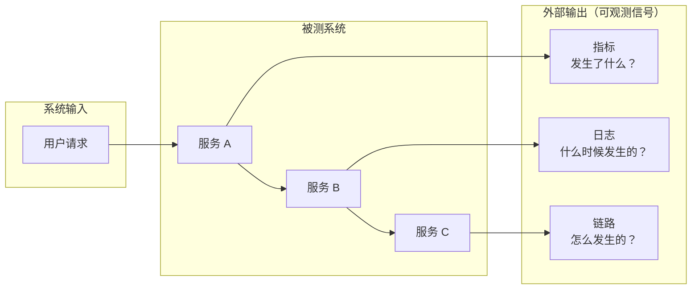
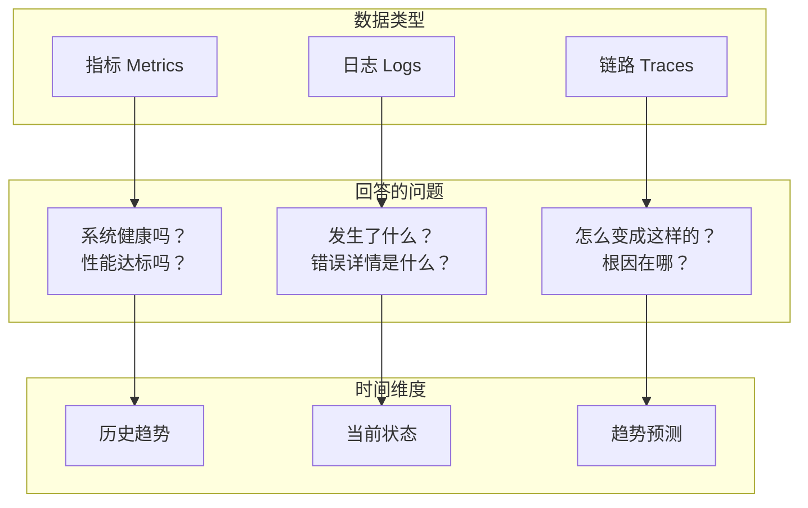

# 可观测性概述与演进

2017 年，Twitter 的一次故障排查让工程师团队花了整整 6 个小时——不是因为问题复杂，而是因为他们要在十几个监控系统之间来回切换：CloudWatch 看指标、Kibana 看日志、Zipkin 看链路。每套系统各自为政，数据无法关联，故障排查变成了「拼图游戏」。

这次经历不是孤例。在微服务架构下，一个用户请求可能涉及几十个服务的交互。当系统出现性能劣化或故障时，工程师面临的核心困境是：**数据很多，但串联不起来**。这个问题催生了可观测性（Observability）这个概念。

## 从控制理论到软件工程

可观测性（Observability）最早是控制理论中的概念，由数学家 Rudolf Kálmán 在 1960 年代提出。它的定义是：**通过外部输出的观察，推断系统内部状态的能力**。

软件工程引入这个概念，是为了让分布式系统具备同样的能力：一个系统无论多么复杂，只要它输出的数据足够丰富，就应该能从外部推断出内部发生了什么。

## 为什么传统监控不够用了

传统监控的思路是「先定义问题，再收集数据」。工程师根据经验预设：CPU 使用率超过 80% 会出问题、响应时间超过 2 秒会引发投诉、磁盘使用率超过 90% 需要扩容。然后围绕这些阈值配置告警。

这种模式在单体架构时代运行良好，但在微服务时代遇到了根本性瓶颈：

**服务数量爆炸**。一个有 100 个微服务的系统，每个服务可能有 10-20 个监控指标，阈值告警规则可能有几百条。人工维护这些规则本身就是巨大的工作量，而且总会有遗漏——你不可能预见到所有可能的故障模式。

**故障定位困难**。当告警触发时，告警点往往不是根因点。比如：用户投诉商品页打不开，告警显示订单服务 CPU 飙升，但真正的问题根源是物流服务的一个慢查询拖累了整个调用链。阈值告警只能告诉你「某个指标超标了」，但无法告诉你「为什么超标」。

**故障传播不可见**。微服务之间的依赖关系形成复杂的调用链，一个服务的故障会沿着调用链传播。传统监控只能看到单个服务的状态，看不到故障是如何从一个服务扩散到另一个服务的。

**故障模式无法预设**。最难解决的问题是：你只能为已知的问题配置告警。系统真正的大故障，往往来自你从未想过的组合——比如「某个中间件的特定版本 + 特定时间 + 特定流量特征」触发的罕见竞态条件。这类问题无法通过预设阈值来发现。

## 可观测性解决的是什么

可观测性的核心转变是：**从「预设问题」到「收集一切，按需分析」**。它的前提假设是：故障模式无法完全预知，但只要数据够全，任何问题都能被事后还原。

可观测性不等于「三大支柱」（Metrics / Logging / Tracing），三大支柱是可观测性的**数据基础**，而不是可观测性本身。可观测性真正的核心能力是**关联分析**：将指标、日志、链路串联起来，从任意一个维度出发，能够追溯到其他维度的相关数据。

举一个例子：告警显示某接口 P99 延迟从 50ms 飙升到 2 秒。如果只有指标，你只能知道「延迟上升了」；如果同时有链路追踪，可以知道「哪个 Span 的耗时增加了」；如果链路数据还能关联到日志，可以进一步知道「这个 Span 内发生了什么事」。这种层层递进的关联能力，才是可观测性的本质。

## 行业演进路径

可观测性从概念到行业标准，经历了三个阶段：

**第一阶段：工具碎片化（2010-2016）**。每个厂商和开源项目各自为战。Prometheus 管指标、ELK 管日志、Zipkin/Jaeger 管链路。数据格式不统一，存储不统一，查询语言不统一。工程师维护多套系统，学习多套 API，数据关联靠手动复制 TraceID。

**第二阶段：统一协议（2016-2020）**。OpenTracing 和 OpenCensus 分别定义了追踪和指标的标准化接口。但两个标准不兼容，CNCF 最终在 2019 年推动两者合并，形成了 OpenTelemetry。OpenTelemetry 的目标是「一次埋点，全渠道导出」——用同一套 SDK 采集数据，通过 OTLP 协议发送到任意后端。

**第三阶段：可观测性平台（2020 至今）**。以 Grafana、Grafana Loki、Grafana Tempo 为代表的开源生态，和以 Datadog、New Relic 为代表的商业平台，将指标、日志、链路整合到统一平台中。Grafana 提出的「可观测性统一视图」成为事实标准。

## 可观测性的三大数据支柱

可观测性依赖三种互补的数据类型：

| 支柱 | 回答的问题 | 数据特征 | 典型工具 |
|---|---|---|---|
| **Metrics（指标）** | 「系统健康吗？」 | 聚合后的数值，定量分析 | Prometheus、Grafana |
| **Logs（日志）** | 「发生了什么？」 | 离散的事件记录，事件驱动 | Loki、ELK |
| **Traces（链路）** | 「怎么变成这样的？」 | 跨请求的因果链，请求驱动 | Jaeger、Zipkin |

三大支柱各有优势和局限，互相补充而非替代。比如：指标能告诉你「API 延迟 P99 升高了」，但无法告诉你「为什么升高了」——链路可以；链路能告诉你「用户请求经过了哪些服务」，但无法告诉你「具体发生了什么错误」——日志可以。

## 可观测性与 SRE 的关系

可观测性是 SRE（Site Reliability Engineering）实践的基础设施。没有可观测性，SRE 的核心工作——SLO 定义、错误预算管理、故障复盘——都无法有效开展。

Google SRE 书籍中提出的「错误预算策略」本质上依赖可观测性：你需要能够精确测量当前的错误率，才能判断错误预算是否耗尽。没有准确的指标和链路数据，错误预算就只是纸上谈兵。

反过来，SRE 实践也在推动可观测性工具的进化。传统监控满足不了 SRE 对「快速定位」和「数据关联」的需求，所以推动了 OpenTelemetry、Grafana 等新一代工具的诞生。

## 常见误区

**误区一：上了监控系统就是可观测**。很多团队以为部署了 Prometheus 和 Grafana 就是实现了可观测性。但如果指标、日志、链路之间没有关联，数据还是孤立的，可观测性只完成了一半。

**误区二：可观测性只需要工具**。可观测性是组织能力，不是采购行为。工具只能收集数据，真正发挥价值的是团队的告警治理文化、故障复盘机制和根因分析方法论。

**误区三：三大支柱必须同时建立**。对于初创团队或小型系统，可以从指标起步，逐步引入链路和日志。Metrics 投入产出比最高，是最容易出价值的部分——Prometheus 的安装和使用成本都很低。

## 质量判断标准

读完本节后，你应该能够回答：

1. 为什么说传统监控的「预设阈值」模式在微服务时代遇到了瓶颈？
2. 可观测性相比传统监控，最核心的转变是什么？
3. 三大支柱（Metrics / Logging / Tracing）分别解决什么场景下的问题？
4. 为什么说可观测性的本质是「关联分析」，而不是数据收集？
5. OpenTelemetry 为什么是行业里程碑？它解决了什么问题？

如果你能用自己的语言解释这些问题，说明已经理解了可观测性的本质。
