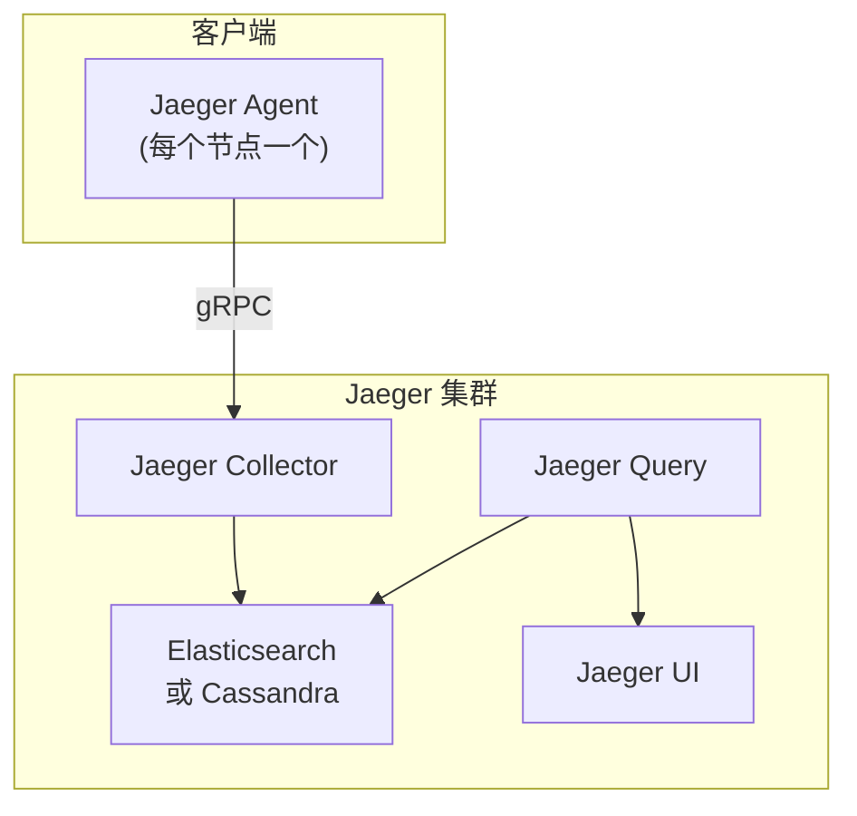
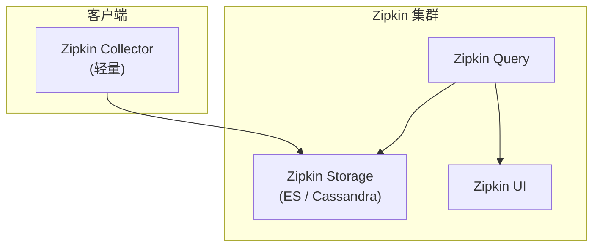
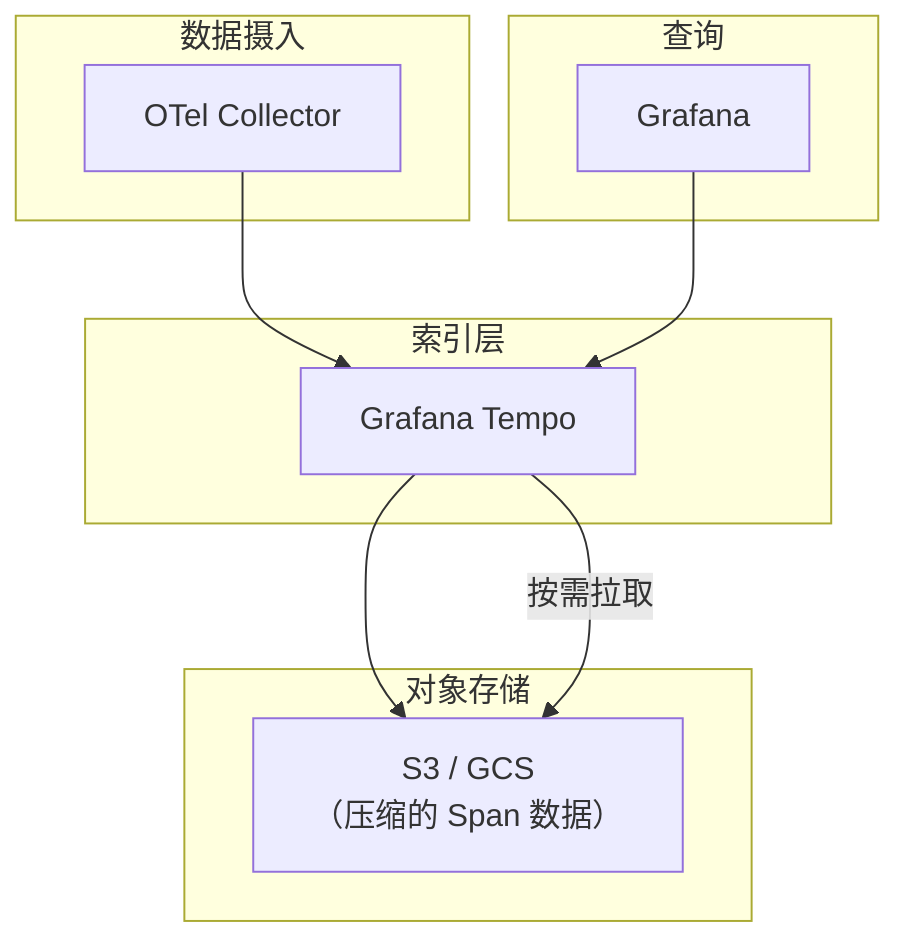

# 链路追踪对比（Jaeger / Zipkin / Tempo）

选择链路追踪工具时，很多人会纠结：Jaeger 是 CNCF 毕业项目，Zipkin 是老牌选手，Tempo 是 Grafana 生态的新贵。它们之间有什么本质区别？选错了会有什么后果？

其实，理解了这三者的**设计哲学**，选择就不难了。

## 核心对比

| 维度 | Jaeger | Zipkin | Grafana Tempo |
|---|---|---|---|
| **开发方** | Uber → CNCF | Twitter → OpenZipkin | Grafana Labs |
| **毕业状态** | CNCF 毕业项目 | CNCF 归档（功能冻结） | CNCF 毕业项目 |
| **存储后端** | Cassandra / Elasticsearch | Cassandra / Elasticsearch / In-Memory | 对象存储（S3/GCS/Azure） |
| **查询性能** | 好 | 一般 | 好 |
| **存储成本** | 中 | 中 | **极低** |
| **生态集成** | 一般 | 一般 | **强（Grafana 全家桶）** |
| **运维复杂度** | 中 | 低 | **低** |
| **适合场景** | 通用场景 | 轻量级需求 | Grafana 用户，存储成本敏感 |

## Jaeger 架构

### 架构图



### 存储后端选型

| 后端 | 适用规模 | 特点 |
|---|---|---|
| **Cassandra** | 超大规模（百亿级 Span） | 水平扩展好，但运维复杂 |
| **Elasticsearch** | 中大规模（十亿级 Span） | 运维相对简单，查询快 |
| **In-Memory** | 测试/开发 | 数据易丢失，只用于测试 |

### 部署配置

```yaml title="jaeger-production.yml"
apiVersion: jaegertracing.io/v1
kind: Jaeger
metadata:
  name: jaeger-production
spec:
  strategy: production
  collector:
    maxReplicas: 5
    resources:
      requests:
        cpu: 500m
        memory: 1Gi
  storage:
    type: elasticsearch
    elasticsearch:
      nodeCount: 3
      redundancyPolicy: SingleRedundancy
      esIndexCleaner:
        enabled: true
        numberOfDays: 14
  query:
    replicas: 2
```

## Zipkin 架构

### 架构图



### Zipkin 的局限

Zipkin 是链路追踪领域的老前辈，但已经**功能冻结**（2023 年移至 CNCF 归档）：

- 不支持 OpenTelemetry 原生采集（需要 Zipkin 原生 SDK）
- 存储后端配置复杂
- UI 功能相对基础

**不推荐新项目使用 Zipkin**。如果团队已经在用，可以继续维护。

## Grafana Tempo 架构

### 核心设计：极低存储成本

Tempo 的设计哲学是**「只索引，不存储完整数据」**：

1. Span 数据压缩后存入对象存储（S3/GCS/Azure Blob）
2. 只在索引中存储 TraceID → 数据块的映射
3. 查询时先查索引定位数据块，再从对象存储拉取



### 存储成本对比

| 工具 | 存储方式 | 1000 万 Span/天/月成本 |
|---|---|---|
| Jaeger + Elasticsearch | SSD 存储 | 约 500-1000 美元 |
| Jaeger + Cassandra | 本地磁盘 | 约 300-800 美元 |
| **Tempo + S3** | **对象存储** | **约 30-100 美元** |

**Tempo 的存储成本约为 Jaeger 的 10%**。

### 部署配置

```yaml title="tempo.yml"
server:
  http_listen_port: 3100

distributor:
  receivers:
    otlp:
      protocols:
        grpc:
        http:

ingester:
  max_block_duration: 5m

compactor:
  compaction:
    block_retention: 30d

storage:
  trace:
    backend: s3
    s3:
      endpoint: s3.amazonaws.com
      bucket: tempo-data
      region: us-east-1
    wal:
      path: /var/tempo/wal
    block:
      index_downsample: 10
```

## 选型决策树

```
开始选择链路追踪工具

需要极低存储成本？
    └── 是 → Grafana Tempo（配合 Grafana 使用）

已经在用 Grafana 生态？
    └── 是 → Grafana Tempo

数据规模 > 10 亿 Span/月？
    └── 是 → Jaeger + Cassandra

需要最强的查询灵活性？
    └── 是 → Jaeger + Elasticsearch

轻量级需求（< 5 个服务）？
    └── 是 → Zipkin（继续用旧版本）

其他情况 → Jaeger 或 Tempo 均可
```

## 混合架构：Tempo + Jaeger

如果你既想用 Grafana 生态，又需要 Jaeger 的某些高级功能，可以采用混合架构：

```yaml title="混合架构配置"
# OTel Collector 同时发送数据到两个后端
traces:
  exporters:
    otlp/jaeger:
      endpoint: jaeger:4317
    otlp/tempo:
      endpoint: tempo:4317

  service:
    pipelines:
      traces:
        receivers: [otlp]
        processors: [batch]
        exporters: [otlp/jaeger, otlp/tempo]
```

## 数据互通性

### OpenTelemetry 兼容

三个工具都支持 OpenTelemetry 的 OTLP 协议：

```yaml title="OTel Collector 配置（统一采集）"
exporters:
  otlp/jaeger:
    endpoint: jaeger:4317
  otlp/tempo:
    endpoint: tempo:4317
  zipkin:
    endpoint: http://zipkin:9411/api/v2/spans
```

### 数据格式对比

| 格式 | Jaeger | Zipkin | Tempo |
|---|---|---|---|
| **OTLP** | ✅ 原生支持 | ❌ 不支持 | ✅ 原生支持 |
| **Jaeger Thrift** | ✅ 原生 | ❌ 不支持 | ❌ 不支持 |
| **Zipkin JSON** | ❌ 需要转换 | ✅ 原生 | ❌ 不支持 |
| **W3C Trace Context** | ✅ 支持 | ⚠️ 部分支持 | ✅ 支持 |

## 迁移路径

### 从 Zipkin 迁移到 Jaeger/Tempo

```yaml title="OTel Collector 接收 Zipkin 并转发"
receivers:
  zipkin:
    endpoint: 0.0.0.0:9411

exporters:
  otlp/tempo:
    endpoint: tempo:4317

service:
  pipelines:
    traces:
      receivers: [zipkin]
      exporters: [otlp/tempo]
```

## 质量判断标准

读完本节后，你应该能够回答：

1. Jaeger、Zipkin、Tempo 三者的核心设计哲学分别是什么？为什么它们的存储成本差异如此巨大？
2. Grafana Tempo 为什么选择「只索引，不存储完整数据」的设计？这个设计带来了哪些优势和局限？
3. 为什么 Zipkin 已经被 CNCF 归档（功能冻结）？对于正在使用 Zipkin 的团队，建议怎么做？
4. 在什么场景下 Jaeger + Elasticsearch 是更优选择？什么场景下 Tempo + S3 是更优选择？
5. 如果团队已经在使用 Grafana + Prometheus + Loki，引入链路追踪工具时应该如何选择？为什么？
