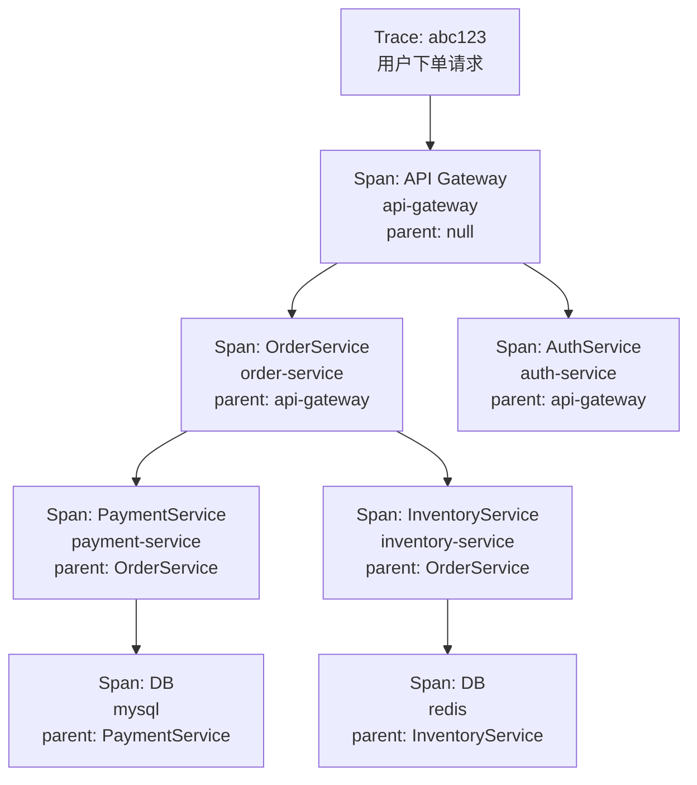
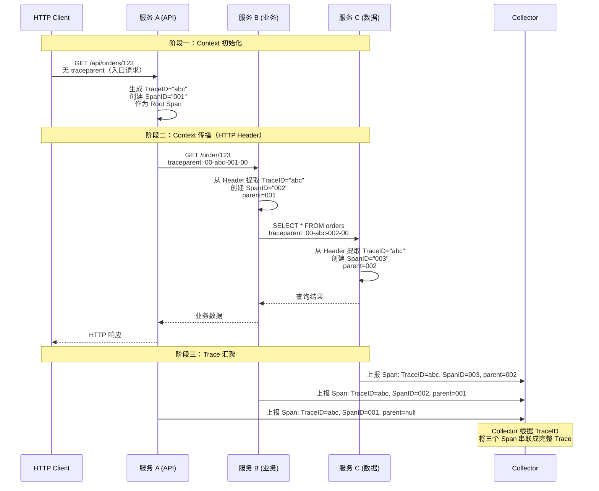

# Trace / Span / Context 核心概念

如果把一次用户请求比作一次跨国旅行，那么：

- **Trace** 是你的护照，记录了从出发到返回的完整行程
- **Span** 是护照上的每一页入境章，代表你在每个国家的停留
- **Context** 是你在机场转机时递给海关的那本护照——它确保你在换乘时不丢行李、不迷路

这三个概念构成了链路追踪的基石。理解它们之间的关系，是掌握链路追踪的必经之路。

## Trace（追踪）

### 什么是 Trace

Trace 是**一次请求从入口到出口的完整执行路径**。这条路径可能在单个进程中，也可能跨越数十个服务，但它们共享同一个 TraceID。

比如用户点击「立即购买」按钮后，请求可能经过：CDN → API 网关 → 认证服务 → 订单服务 → 库存服务 → 支付服务 → 物流服务。所有这些服务中产生的 Span，都属于同一个 Trace。

### Trace 的结构

Trace 在逻辑上是一棵**有向无环图（DAG）**。根节点是入口 Span（通常是 API 网关接收请求的那个 Span），子节点是入口 Span 调用的下游服务，依此类推。

在顺序调用的场景下，Trace 是一棵树：



在并行调用的场景下（比如同时调用用户服务和商品服务），Trace 的结构会更复杂，呈现为真正的有向无环图。

### Trace 的元数据

每个 Trace 包含以下元数据：

| 字段 | 说明 |
|---|---|
| `traceId` | 全局唯一标识符，通常为 32 位十六进制字符串 |
| `startTime` | Trace 开始时间 |
| `endTime` | Trace 结束时间 |
| `duration` | 总耗时 |
| `serviceName` | 入口服务名称 |
| `tags` | Trace 级别的标签（如 `environment=production`） |
| `spans` | 所有 Span 的集合 |
| `status` | Trace 状态（OK / ERROR） |

## Span（跨度）

### 什么是 Span

Span 是 Trace 中的**最小工作单元**，代表一次有边界的工作。一个 Span 记录了一件事的开始和结束，以及在这件事进行过程中产生的各种信息。

比如：一次 HTTP 调用是一个 Span，一次数据库查询是一个 Span，一次 Redis 读取是一个 Span。Span 记录了「这件事是什么」「花了多长时间」「有没有出错」。

### Span 的生命周期

Span 的生命周期用开始时间、结束时间、状态来描述：

```mermaid
gantt
    title Span 生命周期
    dateFormat X
    axisFormat %sms

    section Span
    创建 Span       :0, 5
    执行业务逻辑    :5, 45
    记录属性/事件   :10, 40
    设置状态        :45, 48
    结束 Span       :48, 50
```



关键操作：

```java title="Span 生命周期示例"
Span span = tracer.spanBuilder("HTTP GET /api/orders")
    // 1. 创建 Span
    .setAttribute("http.method", "GET")
    .setAttribute("http.url", "/api/orders/123")
    .startSpan(); // Span 开始

try (Scope scope = span.makeCurrent()) {
    // 2. 执行业务逻辑
    Order order = orderService.getOrder(123);

    // 3. 记录属性（业务相关）
    span.setAttribute("order.id", order.getId());
    span.setAttribute("order.amount", order.getAmount());

    // 4. 记录事件（时间点事件）
    span.addEvent("Order retrieved from database");

    // 5. 设置状态
    span.setStatus(StatusCode.OK);

} catch (Exception e) {
    // 异常路径：标记为错误
    span.setStatus(StatusCode.ERROR, e.getMessage());
    span.recordException(e);
} finally {
    // 6. 结束 Span
    span.end();
}
```

### Span 的属性

Span 包含四类信息：

| 类型 | 说明 | 示例 |
|---|---|---|
| **Attributes（属性）** | 结构化的键值对，Span 生命周期内不变 | `http.method=GET`、`db.system=mysql` |
| **Events（事件）** | Span 执行过程中的时间点事件，可有多个 | `addEvent("Cache miss")`、`addEvent("Retry attempt 2")` |
| **Links（链接）** | 当前 Span 与其他 Trace 的关联 | 用于异步消息、批量处理场景 |
| **Status（状态）** | Span 的最终状态 | `OK`、`ERROR` |

### Span 之间的关系

Span 通过 Parent SpanID 建立层级关系：

```java title="Span 父子关系"
// 父 Span
Span parentSpan = tracer.spanBuilder("processOrder").startSpan();
try (Scope scope = parentSpan.makeCurrent()) {

    // 子 Span：支付调用
    Span paymentSpan = tracer.spanBuilder("callPayment")
        .setParent(Context.current().with(parentSpan))
        .startSpan();
    try {
        paymentService.charge(order);
    } finally {
        paymentSpan.end();
    }

    // 子 Span：库存扣减
    Span inventorySpan = tracer.spanBuilder("deductInventory")
        .setParent(Context.current().with(parentSpan))
        .startSpan();
    try {
        inventoryService.deduct(order.getItems());
    } finally {
        inventorySpan.end();
    }
} finally {
    parentSpan.end();
}
```

父子关系的核心规则：**父 Span 的耗时 >= 最长子 Span 的耗时 + 自己直接执行的时间**。如果父 Span 比某个子 Span 还短，说明时间计算有问题。

## Context（上下文）

### 什么是 Context

Context 是 TraceID 和 SpanID 的**携带者和传播载体**。它是确保 Trace 能够在服务间传递而不丢失的核心机制。

在一个 HTTP 请求中，Context 通过 HTTP Header 传播：

```http title="HTTP 请求头"
GET /api/orders/123 HTTP/1.1
Host: order-service:8080
traceparent: 00-0af7651916cd43dd8448eb211c80319c-b7ad6b7169203331-01
tracestate: congo=t61rcWkgMzE
```

`traceparent` Header 的格式为 `00-{TraceID}-{SpanID}-{flags}`。当服务 B 收到这个请求时，它可以从 Header 中提取 TraceID 和 SpanID，用这些信息创建子 Span。

### W3C Trace Context 标准

目前链路追踪领域存在多种 Context 传播格式：Jaeger、B3（Zipkin）、W3C Trace Context、Datadog 等。每种格式的 Header 名和编码方式不同。

W3C Trace Context 是 W3C 推荐的标准化格式：

| Header | 内容 | 说明 |
|---|---|---|
| `traceparent` | `00-{TraceID}-{SpanID}-{flags}` | 必选，追踪上下文 |
| `tracestate` | `key=value,key=value` | 可选，厂商特定信息 |

选择建议：统一使用 W3C Trace Context 作为内部标准，确保跨厂商、跨语言的兼容性。如果某个中间件只支持特定格式（如 B3），在 OTel Collector 层做格式转换。

### 上下文传播的工程实践

#### HTTP 传播

```java title="HTTP 服务间调用的上下文传播（使用 OpenTelemetry"
@Service
public class OrderService {

    private finalTracer tracer;
    private final RestTemplate restTemplate;

    public Order getOrder(Long orderId) {
        Span span = tracer.spanBuilder("callInventoryService")
            .startSpan();

        try (Scope scope = span.makeCurrent()) {
            // OpenTelemetry 的 RestTemplate 拦截器自动处理上下文传播
            // 只需要确保 RestTemplate bean 开启了 W3C 传播
            InventoryResponse response = restTemplate.getForObject(
                "http://inventory-service/api/inventory/{id}",
                InventoryResponse.class,
                orderId
            );
            span.setAttribute("inventory.available", response.isAvailable());
        } finally {
            span.end();
        }
    }

    @Bean
    public RestTemplate restTemplate(OpenTelemetry openTelemetry) {
        // 注入自动传播上下文拦截器
        return RestTemplates.create(
            ClientHttpRequestInterceptor.of(openTelemetry)
        );
    }
}
```

#### 消息队列传播

```java title="Kafka 消息的上下文传播"
@Service
public class OrderEventProducer {

    private finalTracer tracer;
    private final KafkaTemplate kafkaTemplate;

    public void sendOrderCreatedEvent(Order order) {
        Span span = tracer.spanBuilder("sendOrderCreatedEvent")
            .setAttribute("messaging.system", "kafka")
            .setAttribute("messaging.destination", "order-created")
            .startSpan();

        try (Scope scope = span.makeCurrent()) {
            // 将 TraceContext 注入消息 Header
            kafkaTemplate.send("order-created", order.getId(), order)
                .addCallback(result -> {
                    span.setStatus(StatusCode.OK);
                    span.end();
                }, ex -> {
                    span.setStatus(StatusCode.ERROR, ex.getMessage());
                    span.recordException(ex);
                    span.end();
                });
        }
    }
}

@Service
public class InventoryEventConsumer {

    private finalTracer tracer;

    @KafkaListener(topics = "order-created")
    public void handleOrderCreated(ConsumerRecord<String, Order> record) {
        // 从消息 Header 中提取 TraceContext 并激活为当前 Span 的父 Span
        Context extractedContext = W3CTraceContextPropagator.getInstance()
            .extract(Context.current(), record.headers(), Getter);

        try (Scope scope = tracer.spanBuilder("processOrderCreated")
            .setParent(extractedContext)
            .startSpan()
            .makeCurrent()) {

            inventoryService.processOrder(record.value());
        }
    }
}
```

消息队列的上下文传播比 HTTP 更复杂，因为消息可能异步处理、可能被多个消费者并发处理。需要在生产者端注入 Context，在消费者端提取 Context。

## Trace、Span、Context 的协作流程



## 常见问题

**问题一：Span 数量爆炸**。一个高 QPS 服务如果对每个请求都创建几十个 Span，数据量会非常大。解决方法是采样——比如只记录 1% 的请求，或者只记录慢请求。

**问题二：Context 丢失**。有时候 Context 在传播过程中丢失了（比如某个中间件不支持 Header 透传），导致 Trace 断裂。需要在 OTel Collector 层做兜底：至少保证 TraceID 能在每跳传递。

**问题三：异步任务的链路追踪**。线程池、定时任务、消息队列等异步场景，Context 不会自动传递。必须显式将 Context 传递给异步任务的执行上下文。

## 质量判断标准

读完本节后，你应该能够回答：

1. Trace 和 Span 的本质区别是什么？它们之间的数量关系是什么？
2. Span 的四类信息（Attributes、Events、Links、Status）分别在什么场景下使用？
3. 为什么 Context 传播是链路追踪中最核心的工程问题？
4. 在消息队列场景下，Context 传播和 HTTP 场景有什么关键区别？
5. 为什么父子 Span 的时间关系有约束条件（父 Span >= 最长子 Span）？
