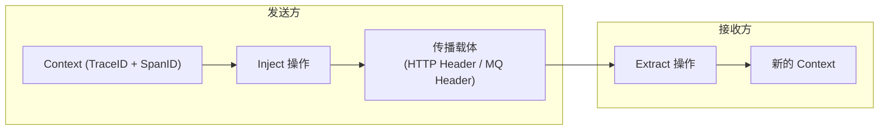

# 上下文传播（Context Propagation）

想象一个跨国快递的流转过程：你从深圳寄一个包裹到纽约。包裹从深圳仓库发出，经过广州中转站、香港机场、纽约海关，最终送到收件人手里。每个环节都要知道这个包裹的快递单号（TraceID），否则包裹就会在某个中转站「失踪」。

上下文传播（Context Propagation）解决的就是这个问题：**在微服务的调用链中，如何确保 TraceID 和 SpanID 能够从入口服务一直传递到出口服务，中间不丢失**。

这是链路追踪中最核心也最容易被忽视的工程问题。埋点代码写得再好，如果 Context 传丢了，Trace 就是断裂的，分析价值大打折扣。

## 为什么上下文传播是难题

在单体架构中，所有调用都在同一个进程内完成，Context 天然是共享的（可以用 ThreadLocal 简单存储）。但微服务架构引入了三个破坏这种共享的机制：

**进程边界**。HTTP 调用的发送方和接收方是不同的进程，ThreadLocal 根本无法跨进程传递。

**异步处理**。线程池、定时任务、消息队列消费都会使处理逻辑在不同的线程中执行，ThreadLocal 的值不会自动跟随线程切换。

**多路复用**。一个服务可能同时处理多个请求，每个请求的 Context 都不一样。如果不做隔离，就会产生 Context 混乱——请求 A 的数据跑到请求 B 的 Trace 里去了。

## 传播机制的核心原理

Context 传播的核心是**注入（Inject）和提取（Extract）**两个操作：

- **注入（Inject）**：发送方将 Context 信息写入传播载体（HTTP Header、消息队列 Message Header 等）
- **提取（Extract）**：接收方从传播载体中读取 Context 信息，恢复当前请求的 Trace 上下文



## HTTP 上下文传播

### 标准 Header 格式

HTTP 是最常见的同步调用协议。Context 通过 HTTP Header 传播，业界有多种格式：

| 传播格式 | Header 名称 | TraceID 长度 | 典型使用方 |
|---|---|---|---|
| **W3C Trace Context** | `traceparent` | 32 位十六进制 | OpenTelemetry 推荐标准 |
| **B3 Single Header** | `b3` | 单个 Header 包含所有信息 | Zipkin 传统格式 |
| **B3 Multi Header** | `X-B3-TraceId`、`X-B3-SpanId` 等 | 多个 Header | Zipkin 兼容格式 |
| **Jaeger** | `uber-trace-id` | Jaeger 专用格式 | Jaeger |
| **Datadog** | `x-datadog-*` | Datadog 专用格式 | Datadog APM |

**强烈推荐使用 W3C Trace Context**。它是 W3C 推荐的行业标准，所有主流追踪系统都支持互操作。在需要兼容老系统时，通过 OTel Collector 做格式转换。

W3C `traceparent` Header 的格式：

```http
traceparent: 00-0af7651916cd43dd8448eb211c80319c-b7ad6b7169203331-01
            ↑  ↑                                          ↑  ↑
          版本  TraceID (32位)                        SpanID (16位) flags
```

### OpenTelemetry 中的传播实现

```java title="HTTP 服务入口（自动传播）"
@SpringBootApplication
public class OrderServiceApplication {

    public static void main(String[] args) {
        SpringApplication.run(OrderServiceApplication.class, args);
    }
}

// 使用 Spring Boot 的 OpenTelemetry 自动配置时
// 所有 Spring MVC 的 HTTP 请求会自动处理 Context 传播
// 只需要在 application.yml 中配置即可：
```

```yaml title="application.yml"
otel:
  exporter:
    otlp:
      endpoint: http://otel-collector:4317
  propagators: tracecontext,baggage   # W3C Trace Context + Baggage
  service:
    name: order-service
```

### 手动处理 HTTP 传播

在某些场景下，你可能需要手动处理 Context 传播，比如自定义 HTTP 客户端：

```java title="手动传播 HTTP Context"
@Service
public class CustomHttpClient {

    private final OpenTelemetry openTelemetry;
    private final TextMapSetter<HttpURLConnection> setter;

    public CustomHttpClient(OpenTelemetry openTelemetry) {
        this.openTelemetry = openTelemetry;
        // 定义如何将 Context 注入到 HTTP Header
        this.setter = (carrier, key, value) -> {
            if (carrier instanceof HttpURLConnection conn) {
                conn.setRequestProperty(key, value);
            }
        };
    }

    public String get(String url) throws Exception {
        HttpURLConnection conn = (HttpURLConnection) new URL(url).openConnection();
        conn.setRequestMethod("GET");

        // 从当前活跃的 Span 中提取 Context，并注入到 HTTP Header
        Span span = tracer.spanBuilder("HTTP GET " + url)
            .setAttribute("http.url", url)
            .setAttribute("http.method", "GET")
            .startSpan();

        try (Scope scope = span.makeCurrent()) {
            // W3C Trace Context 传播
            openTelemetry.getPropagators()
                .getTextMapPropagator()
                .inject(Context.current(), conn, setter);

            // 读取响应
            int responseCode = conn.getResponseCode();
            span.setAttribute("http.status_code", responseCode);

            if (responseCode >= 400) {
                span.setStatus(StatusCode.ERROR);
            } else {
                span.setStatus(StatusCode.OK);
            }
        } finally {
            span.end();
        }

        return readResponse(conn);
    }
}
```

### HTTP 传播的常见陷阱

**陷阱一：代理服务器丢失 Header**。Nginx、API 网关等反向代理可能不会自动透传 `traceparent` Header。需要在代理层配置透传，或者确保 OTel SDK 能在代理层正确注入/提取。

**陷阱二：重试导致的 Context 重复使用**。HTTP 客户端重试时，可能会重复使用同一个 Context，导致 Trace 中出现重复的 Span。在重试逻辑中应该为每次重试创建新的 Span，并 Link 到原始 Span。

## 消息队列上下文传播

### 为什么消息队列的传播更复杂

HTTP 是同步的，请求和响应在时间上是紧耦合的。消息队列是异步的，发送和接收是解耦的。这意味着：

1. 生产者和消费者可能运行在完全不同的时区（消息可能在队列中停留很久）
2. 一个消息可能被多个消费者并发处理
3. 消费者可能在处理消息时又产生新消息

### Kafka 上下文传播

Kafka 通过 Message Header 传递 Context。Header 是 Kafka 0.10+ 版本引入的特性：

```java title="Kafka 生产者端注入 Context"
@Service
public class OrderEventPublisher {

    private final KafkaTemplate<String, OrderEvent> kafkaTemplate;
    private final OpenTelemetry openTelemetry;
    private final TextMapSetter<Headers> setter;

    public OrderEventPublisher(OpenTelemetry openTelemetry) {
        this.openTelemetry = openTelemetry;
        // 定义如何将 Context 注入 Kafka Header
        this.setter = (headers, key, value) ->
            headers.add(key, value.getBytes(StandardCharsets.UTF_8));
    }

    public void publishOrderCreated(Order order) {
        Span span = tracer.spanBuilder("kafka.publish")
            .setAttribute("messaging.system", "kafka")
            .setAttribute("messaging.destination", "order-events")
            .setAttribute("messaging.operation", "publish")
            .startSpan();

        try (Scope scope = span.makeCurrent()) {
            OrderEvent event = new OrderEvent(order);

            // 使用 Future 异步发送 Span 的结束时机
            kafkaTemplate.send("order-events", order.getId(), event)
                .addCallback(
                    result -> {
                        span.setAttribute("messaging.kafka.partition",
                            result.getRecordMetadata().partition());
                        span.setAttribute("messaging.kafka.offset",
                            result.getRecordMetadata().offset());
                        span.end();
                    },
                    ex -> {
                        span.setStatus(StatusCode.ERROR, ex.getMessage());
                        span.recordException(ex);
                        span.end();
                    }
                );
        } finally {
            span.end();
        }
    }
}
```

```java title="Kafka 消费者端提取 Context"
@Service
public class OrderEventConsumer {

    private final Tracer tracer;
    private final TextMapGetter<ConsumerRecord<?, ?>> getter;

    public OrderEventConsumer(OpenTelemetry openTelemetry) {
        this.tracer = openTelemetry.getTracer("order-consumer");

        // 定义如何从 Kafka Header 提取 Context
        this.getter = (carrier, key) -> {
            if (carrier instanceof ConsumerRecord<?, ?> record) {
                Headers headers = record.headers();
                if (headers != null) {
                    Header header = headers.lastHeader(key);
                    if (header != null) {
                        return new String(header.value(), StandardCharsets.UTF_8);
                    }
                }
            }
            return null;
        };
    }

    @KafkaListener(topics = "order-events", groupId = "inventory-group")
    public void handleOrderCreated(ConsumerRecord<String, OrderEvent> record) {
        // 从 Kafka Header 中提取 Trace Context
        Context extractedContext = openTelemetry.getPropagators()
            .getTextMapPropagator()
            .extract(Context.current(), record, getter);

        // 创建子 Span，以提取的 Context 为父 Span
        Span span = tracer.spanBuilder("kafka.receive")
            .setAttribute("messaging.system", "kafka")
            .setAttribute("messaging.operation", "receive")
            .setAttribute("messaging.destination", record.topic())
            .setAttribute("messaging.kafka.partition", record.partition())
            .setAttribute("messaging.kafka.offset", record.offset())
            .setParent(extractedContext)
            .startSpan();

        try (Scope scope = span.makeCurrent()) {
            // 处理消息，同时创建子 Span
            processInventory(record.value());

            span.setStatus(StatusCode.OK);
        } catch (Exception e) {
            span.setStatus(StatusCode.ERROR, e.getMessage());
            span.recordException(e);
            throw e;
        } finally {
            span.end();
        }
    }
}
```

### 消息幂等性对 Context 的影响

消费端经常需要处理消息幂等性——同一条消息可能被投递多次（at-least-once 语义）。在记录 Span 时，需要注意：

- 每次处理都创建新 Span（因为 `processMessage` 可能被调用多次）
- 但这些 Span 应该 Link 到原始的生产者 Span，而不是作为其 child
- 使用 `span.addLink()` 建立这种关联关系

## 异步任务的上下文传播

### ThreadLocal 的局限性

ThreadLocal 是 Java 中最常用的线程本地存储机制，但它有以下问题：

```java title="ThreadLocal 的问题"
public class AsyncService {

    private static final ThreadLocal<String> TRACE_ID =
        new ThreadLocal<>();

    public void processAsync() {
        String traceId = TRACE_ID.get(); // ThreadLocal

        // 问题：submit 到线程池后，traceId 为 null
        CompletableFuture.runAsync(() -> {
            String id = TRACE_ID.get(); // null！当前线程不是主线程
        });
    }
}
```

### 正确的异步传播方式

使用 OpenTelemetry 的 `Context` API 和线程池包装：

```java title="线程池的上下文传播"
@Service
public class TracingThreadPoolExecutor extends ThreadPoolExecutor {

    private final Context context;

    public TracingThreadPoolExecutor(
            int corePoolSize,
            int maximumPoolSize,
            long keepAliveTime,
            TimeUnit unit,
            BlockingQueue<Runnable> workQueue) {
        super(corePoolSize, maximumPoolSize, keepAliveTime, unit, workQueue);
        // 在创建线程时捕获当前 Context
        this.context = Context.current();
    }

    @Override
    public void execute(Runnable command) {
        // 将 Context 包装到 Runnable 中
        Runnable wrapped = () -> {
            try (Scope scope = context.makeCurrent()) {
                command.run();
            }
        };
        super.execute(wrapped);
    }
}
```

或者更简洁地，使用 OpenTelemetry 提供的自动上下文传播工具：

```java title="使用 Context.task() 包装异步任务"
public void processAsync() {
    // 捕获当前 Context
    Context context = Context.current();

    CompletableFuture.supplyAsync(() -> {
        // 在异步任务中恢复 Context
        try (Scope scope = context.makeCurrent()) {
            // 这里可以正常创建 Span，会自动关联到主流程
            return processOrder(orderId);
        }
    }, executor);
}
```

## 多传播器配置

在微服务架构中，可能同时存在多种传输协议（HTTP、gRPC、Kafka）。OTel 支持配置多个 Propagator：

```yaml title="application.yml"
otel:
  propagators: tracecontext,baggage,jaeger

  # tracecontext: W3C 标准 Trace Context
  # baggage: 业务数据传递（类似 correlation context）
  # jaeger: 向后兼容 Jaeger 格式
```

当多个 Propagator 同时配置时，OTel 会尝试从 Header 中按顺序提取，直到成功。对于注入操作，默认使用第一个 Propagator。

## 质量判断标准

读完本节后，你应该能够回答：

1. 为什么说 Context 传播是链路追踪中最核心的工程问题？
2. Inject 和 Extract 操作的本质是什么？在代码中分别对应什么场景？
3. 在 Kafka 消息队列场景下，Context 传播和 HTTP 场景有三个关键区别，分别是什么？
4. ThreadLocal 在异步场景下为什么会失效？正确的异步传播方式是什么？
5. 当同时使用 HTTP 和 Kafka 两种传输协议时，Context 传播器应该如何配置？
