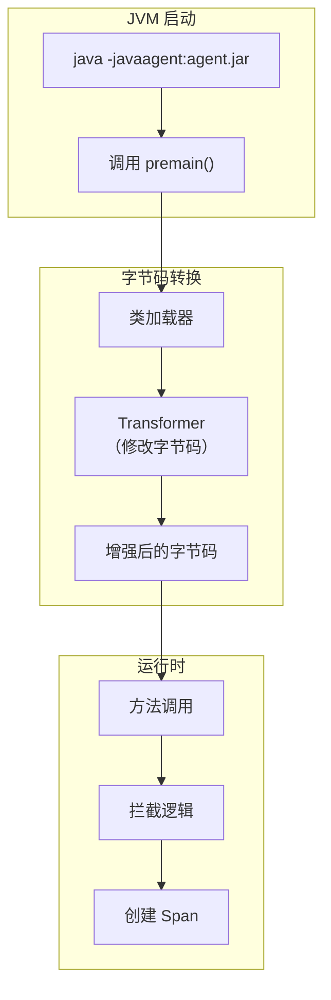

# Java Agent 无侵入埋点

想象一个场景：你接手了一个有 5 年历史的 Java 系统，有 30 万行代码，分布在 200 个服务中。领导要求接入链路追踪，你会怎么办？改代码？每个服务逐一加依赖、逐一改逻辑？工作量想想就让人绝望。

Java Agent 的价值就在这里：**不需要改一行代码，只需要加一个 JVM 参数，就能自动拦截所有 HTTP、数据库、缓存、消息队列的调用**。这就是 OTel Java Agent 带给我们的能力——无侵入埋点。

## Java Agent 是什么

Java Agent 是 JVM 提供的一种机制，允许在 **类加载之前** 或 **运行时** 修改字节码。它的工作原理：

1. JVM 启动时加载 Agent JAR
2. Agent 的 `premain()` 或 `agentmain()` 方法被执行
3. 在类加载前或重转换时，Agent 拦截目标类的字节码
4. 在字节码中插入埋点逻辑
5. 后续代码执行时，埋点逻辑自动触发



## OTel Java Agent 快速上手

### 1. 下载 Agent

```bash
# 下载最新版本
curl -L -O https://github.com/open-telemetry/opentelemetry-java-instrumentation/releases/latest/download/opentelemetry-javaagent.jar
```

### 2. 启动时加载

```bash
# 最简配置
java -javaagent:opentelemetry-javaagent.jar \
     -jar your-app.jar

# 推荐配置
java -javaagent:opentelemetry-javaagent.jar \
     -Dotel.service.name=order-service \
     -Dotel.exporter.otlp.endpoint=http://otel-collector:4317 \
     -Dotel.resource.attributes=deployment.environment=production \
     -jar your-app.jar
```

### 3. Docker 集成

```dockerfile title="Dockerfile"
FROM openjdk:17-slim

# 复制 Agent
COPY opentelemetry-javaagent.jar /opt/agent/opentelemetry-javaagent.jar

# 在 java -jar 之前设置 Agent
ENV JAVA_TOOL_OPTIONS="-javaagent:/opt/agent/opentelemetry-javaagent.jar"
ENV OTEL_SERVICE_NAME="order-service"
ENV OTEL_EXPORTER_OTLP_ENDPOINT="http://otel-collector:4317"
ENV OTEL_RESOURCE_ATTRIBUTES="deployment.environment=production"

COPY target/order-service.jar /app/order-service.jar

CMD ["java", "-jar", "/app/order-service.jar"]
```

### 4. Kubernetes 部署

```yaml title="deployment-with-agent.yaml"
apiVersion: apps/v1
kind: Deployment
metadata:
  name: order-service
spec:
  template:
    spec:
      containers:
        - name: order-service
          image: order-service:v1.0.0
          env:
            - name: OTEL_SERVICE_NAME
              value: "order-service"
            - name: OTEL_EXPORTER_OTLP_ENDPOINT
              value: "http://otel-collector:4317"
            - name: OTEL_RESOURCE_ATTRIBUTES
              value: "deployment.environment=production"
            - name: JAVA_TOOL_OPTIONS
              value: "-javaagent:/opt/opentelemetry-javaagent.jar"
          volumeMounts:
            - name: otel-agent
              mountPath: /opt/opentelemetry-javaagent.jar
              subPath: opentelemetry-javaagent.jar
      volumes:
        - name: otel-agent
          hostPath:
            path: /opt/otel-agents/opentelemetry-javaagent.jar
```

## 自动拦截的组件

OTel Java Agent 自动拦截以下组件的调用：

### HTTP 框架

| 框架 | 拦截内容 |
|---|---|
| Servlet API | 请求入口/出口 |
| Spring MVC / WebFlux | `@RequestMapping` 方法 |
| Netty | ChannelHandler |
| Apache HttpClient | HTTP 请求 |
| OkHttp | HTTP 请求 |
| Jetty | HTTP 服务器和客户端 |

### 数据库

| 驱动 | 拦截内容 |
|---|---|
| JDBC | Connection、Statement、ResultSet |
| MyBatis | SQL 执行 |
| Hibernate | Session 操作 |
| MongoDB | Document 操作 |
| Redis (Jedis/Lettuce) | 命令执行 |

### 消息队列

| 组件 | 拦截内容 |
|---|---|
| Kafka | 生产/消费 |
| RabbitMQ | 发送/接收 |
| RocketMQ | 生产/消费 |
| JMS | 消息发送/接收 |

## 配置项详解

### 基础配置

```bash
# 服务名称（必须配置）
-Dotel.service.name=order-service

# OTLP 导出地址
-Dotel.exporter.otlp.endpoint=http://collector:4317

# 传输协议（gRPC 或 HTTP）
-Dotel.exporter.otlp.protocol=grpc

# 资源属性（会附加到所有 Span 上）
-Dotel.resource.attributes=deployment.environment=production,region=cn-east-1
```

### 采样配置

```bash
# 固定采样率（1%）
-Dotel.traces.sampler=traceidratio
-Dotel.traces.sampler.arg=0.01

# 始终采样（开发环境）
-Dotel.traces.sampler=always_on

# 关闭采样（压测环境，减少干扰）
-Dotel.traces.sampler=always_off
```

### 排除配置

```bash
# 排除特定 URL 的链路追踪
-Dotel.instrumentation.http.server.enabletracing=true
-Dotel.instrumentation.http.server.captureRequestHeaders=host,content-type
-Dotel.instrumentation.http.server.captureResponseHeaders=content-type

# 排除健康检查端点
-Dotel.instrumentation.http.client.exclude.url.patterns="/actuator/.*,/health"

# 排除特定类的方法
-Dotel.instrumentation.methods.exclude=com.example.MyClass[expensiveMethod]
```

### 自定义属性

```bash
# 为所有 Span 添加自定义属性
-Dotel.resource.attributes=service.version=${APP_VERSION},service.owner=${TEAM}
```

## 手动增强：添加自定义 Span

Agent 接管了常见框架的拦截，但业务逻辑的 Span 仍然需要手动添加：

```java title="OrderServiceTracing.java"
@Service
@Slf4j
public class OrderService {

    // Agent 会自动创建 Span，这里创建子 Span 描述业务逻辑
    @Autowired
    private Tracer tracer;

    public Order placeOrder(OrderRequest request) {
        // 业务逻辑的 Span
        Span span = tracer.spanBuilder("placeOrder-business")
            .setAttribute("order.amount", request.getAmount())
            .setAttribute("order.items", request.getItems().size())
            .startSpan();

        try (Scope scope = span.makeCurrent()) {
            // 业务逻辑
            validateOrder(request);
            PaymentResult payment = paymentService.charge(request);

            if (payment.isSuccess()) {
                span.setAttribute("order.id", order.getId());
                span.setStatus(StatusCode.OK);
            }

            return order;
        } catch (Exception e) {
            span.setStatus(StatusCode.ERROR, e.getMessage());
            span.recordException(e);
            throw e;
        } finally {
            span.end();
        }
    }
}
```

## Agent 的局限性

### 无法覆盖的场景

**一、业务逻辑**。Agent 只拦截框架调用（HTTP、DB、MQ），业务代码中的逻辑不在覆盖范围内。

**二、自定义协议**。私有 RPC 框架、TCP 自定义协议，Agent 无法自动识别。

**三、异步处理**。线程池、定时任务、消息队列消费，需要手动处理 Context 传播。

### 性能开销

OTel Java Agent 的性能开销包括：

| 开销来源 | 影响 | 典型值 |
|---|---|---|
| 类加载时字节码修改 | 启动时间 | 增加 1-3 秒 |
| Span 创建/结束 | CPU | < 1% CPU |
| Context 传播 | 内存 | 微量 |
| 网络传输 | 带宽 | 与采样率成正比 |

在生产环境中，开启 Agent 的 CPU 开销通常 < 2%，可以接受。

## 常见问题

### 问题一：启动失败

```bash
# 常见原因：Agent JAR 版本与 JDK 版本不兼容
# 解决方案：下载与 JDK 版本对应的 Agent

# JDK 11+ 用最新版本
java -javaagent:opentelemetry-javaagent.jar

# 旧版 JDK
java -javaagent:opentelemetry-javaagent-all.jar
```

### 问题二：Span 数据为空

```bash
# 原因：OTLP 端点配置错误，或网络不通
# 排查：开启调试日志
-Dotel.javaagent.debug=true
```

### 问题三：内存占用高

```bash
# 原因：Agent 的缓冲区配置过大
# 解决：调整批处理参数
-Dotel.traces.exporter=otlp
-Dotel.exporter.otlp.batch-size=512
```

## 质量判断标准

读完本节后，你应该能够回答：

1. Java Agent 的无侵入埋点是如何工作的？它的核心技术原理是什么？
2. OTel Java Agent 自动拦截了哪些组件？对于业务代码中的逻辑，Agent 是否能自动覆盖？
3. 在 Kubernetes 环境中，如何通过 DaemonSet 或 InitContainer 的方式统一管理 OTel Agent？
4. OTel Java Agent 的性能开销主要来自哪些方面？生产环境中 CPU 开销通常是多少？
5. 如果你需要为业务逻辑添加自定义 Span，代码应该如何编写？Agent 拦截的 Span 和手动创建的 Span 是什么关系？
