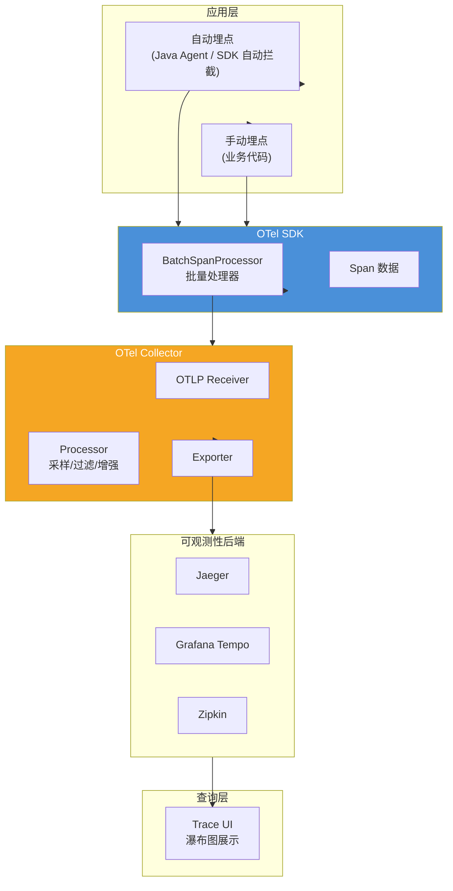
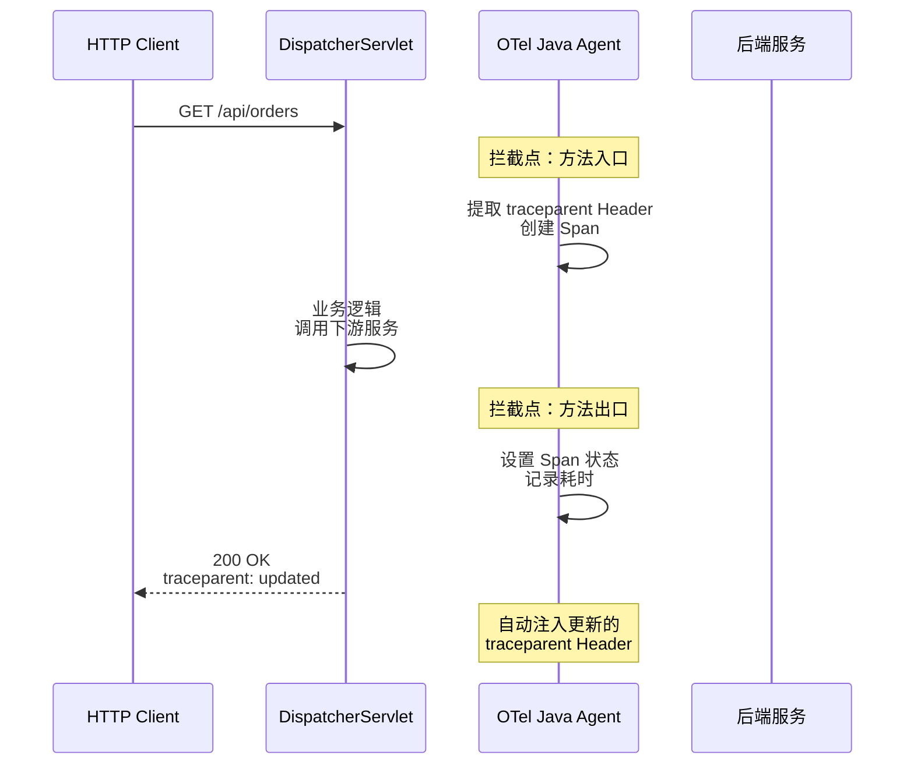
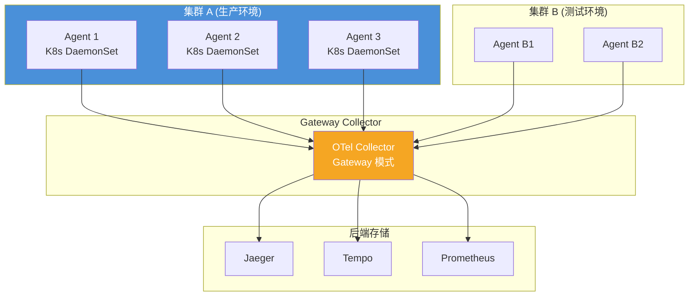
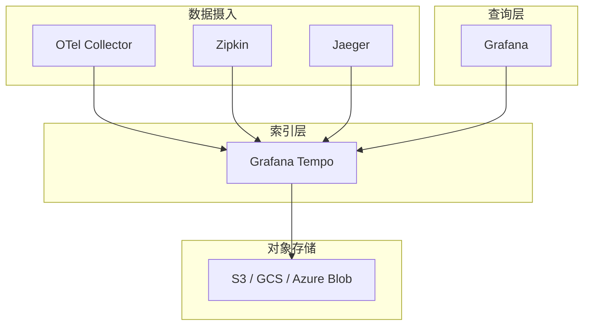

# OpenTelemetry 链路追踪架构

表面上，你只是在代码中加了一个 `@Traced` 注解或一行 `tracer.spanBuilder()`。但在这背后，OTel 的链路追踪系统经历了一系列复杂的数据流转：从 SDK 的自动拦截，到 Context 的跨进程传播，再到 Collector 的聚合处理，最后到后端存储的可视化。

理解这套架构，能让你在遇到「为什么 Trace 断了」「为什么数据没上报」等问题时，快速定位根因。

## 整体数据流

一条 Trace 从产生到最终展示，经历以下阶段：



## 埋点层：自动 vs 手动

### 自动埋点的工作原理

OTel Java Agent 通过 Java Instrumentation 机制，在类加载时拦截目标类的字节码，插入埋点逻辑。这个过程对业务代码完全透明。

以一个 Spring MVC 的 HTTP 请求为例，自动埋点的工作流程：

1. Agent 拦截 `DispatcherServlet.doDispatch()` 方法
2. 在方法入口创建新 Span，设置 HTTP 相关属性
3. 在方法出口结束 Span，设置状态和耗时
4. 通过 `W3CTraceContextPropagator` 将 TraceContext 注入 HTTP 响应 Header



自动埋点覆盖的常见场景：

| 组件 | 拦截的方法/框架 |
|---|---|
| **HTTP 服务器** | Servlet API、Spring MVC、Spring WebFlux、Netty |
| **HTTP 客户端** | OkHttp、Apache HttpClient、Feign |
| **数据库** | JDBC、MyBatis、Hibernate、MongoDB Client |
| **缓存** | Jedis、Lettuce、Redis Client |
| **消息队列** | Kafka Client、RocketMQ、RabbitMQ Client |

### 手动埋点的补充

自动埋点解决 80% 的场景，但以下情况必须手动埋点：

**业务关键路径**：自动埋点只知道「调用了哪个方法」，不知道「这个方法在做什么业务」。比如 `orderService.placeOrder()` 内部调用了支付服务，你需要给这个支付调用单独创建一个 Span，并带上 `payment.amount`、`payment.method` 等业务属性。

**异步处理**：线程池、定时任务、消息队列消费等场景，Context 不会自动传递，必须手动创建 Span 并正确设置 parent。

**外部系统调用**：非标准协议的调用（如自定义 TCP 协议、私有 RPC 框架），Agent 无法自动拦截。

## SDK 层：SpanProcessor

Span 从业务代码产生后，不会立刻发送到后端，而是先经过 `SpanProcessor` 的处理。OTel 定义了两种标准处理方式：

### SimpleSpanProcessor（立即发送）

每创建一个 Span 就立即发送到 Exporter。实现简单，但性能差——高 QPS 下会产生大量网络请求。不推荐生产环境使用。

### BatchSpanProcessor（批量发送）

将多个 Span 积累到缓冲区，达到以下条件之一时批量发送：

| 条件 | 说明 | 推荐值 |
|---|---|---|
| `maxQueueSize` | 缓冲区队列的最大容量 | 2048 |
| `scheduledDelayMillis` | 定时触发发送的间隔 | 5000ms |
| `exportTimeoutMillis` | 单次批量发送的超时时间 | 30000ms |
| `maxExportBatchSize` | 单次批量发送的最大 Span 数 | 512 |

```yaml title="application.yml"
otel:
  traces:
    exporter: otlp
  exporter:
    otlp:
      traces:
        endpoint: http://collector:4317
  span-processor:
    type: batch
    max-queue-size: 2048
    schedule-delay: 5000ms
    max-export-batch-size: 512
```

BatchSpanProcessor 是生产环境的必选配置。如果配置不当，可能导致 Span 数据丢失（队列满了会丢弃）或发送延迟（定时太长发得慢）。

## Collector 层：数据处理中枢

### 为什么需要 Collector

在简单的测试环境中，应用可以直接向 Jaeger/Tempo 等后端发送数据。但生产环境有以下需求：

**多后端复用**。同一个应用的数据可能需要同时发送到多个后端（Jaeger + Tempo + 商业平台），Collector 可以配置多个 Exporter，实现一次采集、多渠道导出。

**数据预处理**。在数据发送到存储前做过滤、采样、属性增强。比如为所有 Span 统一添加 `deployment.environment=production` 标签。

**协议转换**。将非 OTLP 格式的数据（Jaeger Thrift、Zipkin JSON）转换为 OTLP 格式，统一处理流程。

**负载缓解**。Collector 作为独立网关，可以做流量控制、限流、缓冲，保护后端存储不被冲击。

### Collector 部署架构



**Agent 模式**：Collector 以 DaemonSet 部署在每个 K8s 节点上，负责收集该节点上所有 Pod 的数据。本地处理（过滤、增强），然后通过 gRPC 转发到 Gateway Collector。

**Gateway 模式**：独立部署的 Collector，负责接收来自多个 Agent 的数据，做全局处理后转发到存储后端。可以部署多个实例做水平扩展。

### Collector 配置文件

```yaml title="otel-collector-config.yaml"
receivers:
  otlp:
    protocols:
      grpc:
        endpoint: 0.0.0.0:4317
      http:
        endpoint: 0.0.0.0:4318

  jaeger:
    protocols:
      thrift_http:
        endpoint: 0.0.0.0:14278

  zipkin:
    endpoint: 0.0.0.0:9411

processors:
  batch:
    timeout: 5s
    send_batch_size: 1024

  memory_limiter:
    check_interval: 1s
    limit_mib: 1000
    spike_limit_mib: 200

  # 过滤掉健康检查的请求
  filter:
    traces:
      exclude:
        match_type: strict
        services:
          - kubernetes probe

  # 统一添加环境标签
  resource:
    attributes:
      - key: deployment.environment
        value: production
        action: upsert
      - key: cloud.region
        value: cn-hangzhou
        action: upsert

exporters:
  otlp/jaeger:
    endpoint: jaeger:4317
    tls:
      insecure: true

  otlp/tempo:
    endpoint: tempo:4317

  prometheus:
    endpoint: 0.0.0.0:8889

service:
  pipelines:
    traces:
      receivers: [otlp, jaeger, zipkin]
      processors: [memory_limiter, filter, resource, batch]
      exporters: [otlp/jaeger, otlp/tempo]
    metrics:
      receivers: [otlp]
      processors: [memory_limiter, batch]
      exporters: [prometheus]
```

## 后端存储：Jaeger vs Tempo

### Jaeger 架构

Jaeger 是 CNCF 毕业项目，提供完整的链路追踪后端能力：

```mermaid
flowchart TB
    subgraph Ingest["摄入层"]
        Agent["Jaeger Agent<br/>(与 Collector 协议兼容)"]
    end

    subgraph Storage["存储层"]
        Cassandra["Cassandra"]
        Elasticsearch["Elasticsearch"]
    end

    subgraph Query["查询层"]
        Query["Jaeger Query"]
        UI["Jaeger UI"]
    end

    Agent --> Collector["Jaeger Collector"]
    Collector --> Cassandra
    Collector --> Elasticsearch
    Query --> Cassandra
    Query --> Elasticsearch
    Query --> UI
```

Jaeger 支持两种存储后端：Cassandra 和 Elasticsearch。Cassandra 适合超大规模场景（单集群百亿级 Span），Elasticsearch 对中小规模更友好，查询性能更好。

### Grafana Tempo 架构

Tempo 是 Grafana 生态中的追踪存储，以「极低存储成本」为核心卖点。Tempo 本身不存储完整的 Trace 数据，而是存储 Trace 的索引信息（TraceID → 对象存储路径），实际数据存在对象存储（S3/GCS/Azure Blob）中。



Tempo 的优势是**存储成本极低**——因为 Span 数据是压缩后存对象存储的。以 100 万 Span/天的规模为例，Jaeger + Elasticsearch 每月存储成本约 500-1000 美元，Tempo + S3 约 50-100 美元。

Tempo 的局限是**查询能力有限**——Trace 数据需要拉回 Tempo 后再做聚合分析，不适合超大规模 Trace 数据的即席查询。

### 选型建议

| 场景 | 推荐 |
|---|---|
| Grafana 生态用户，存储成本敏感 | Grafana Tempo + 对象存储 |
| 独立部署，需要丰富的查询能力 | Jaeger + Elasticsearch |
| 需要同时支持链路追踪和 APM 高级分析 | SkyWalking / Datadog |
| AWS 托管环境 | AWS X-Ray |

## 查询与可视化

Trace 数据的最终价值体现在查询和可视化上。一个好的 Trace UI 应该提供：

**瀑布图（Waterfall View）**：以时间为横轴，展示每个 Span 的开始时间、持续时间、父子关系。这是定位延迟瓶颈的核心视图。

**Span 明细**：点击任意 Span，显示其所有属性（Attributes）、事件（Events）、错误信息。

**Trace 统计**：Top N 慢请求、错误率分布、Span 数量分布等聚合视图。

**日志关联**：点击 Span 或 TraceID，直接跳转到该请求的所有日志。

```java title="Grafana Tempo 中的查询"
# 通过 TraceID 直接查询
{__name__="traces"} |= "abc123def456"

# 查询慢 Trace（超过 2 秒）
{__name__="traces"} | json | duration > 2000

# 查询包含错误的所有 Trace
{__name__="traces"} | json | status_code = "error"
```

## 质量判断标准

读完本节后，你应该能够回答：

1. OTel 链路追踪的数据流从业务代码到最终展示，经历哪几个关键阶段？
2. 为什么生产环境必须使用 BatchSpanProcessor 而不是 SimpleSpanProcessor？
3. OTel Collector 在链路追踪架构中承担哪些核心职责？Agent 模式和 Gateway 模式分别适合什么场景？
4. Grafana Tempo 的低存储成本是如何实现的？它的核心局限是什么？
5. 如果 Trace 出现「断裂」问题（链路不连续），应该在哪些层面排查？
