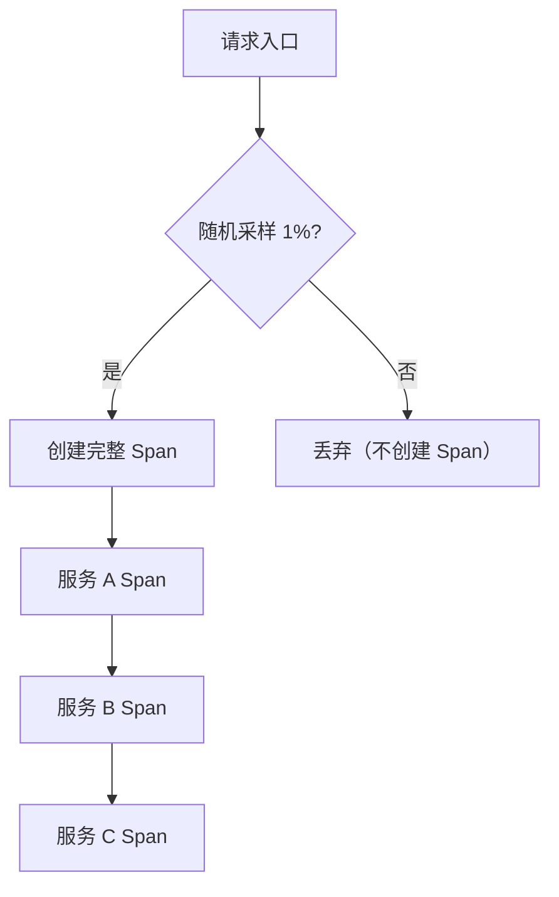
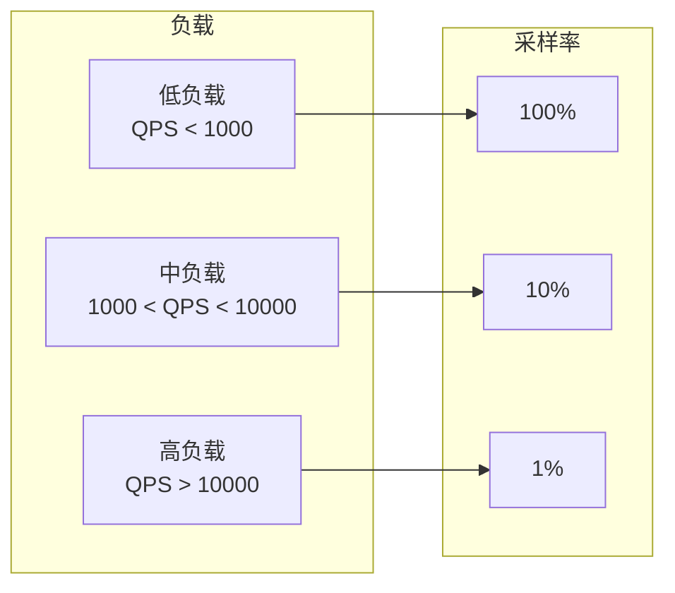

# 采样策略（头部采样 / 尾部采样）

一个日均 1000 万 QPS 的电商系统，如果每个请求都生成完整的 Trace，每个 Trace 平均 15 个 Span，每个 Span 平均 2KB，每天产生约 300GB 的链路数据。一年下来就是 100TB。

采样（ sampling）是控制链路追踪成本的核心手段。但采样也是双刃剑——采得太多，成本爆炸；采得太少，有价值的 Trace 可能被丢弃。

## 采样的本质问题

采样解决的是「数据量 vs 可观测性」的矛盾：

```
保留 100% 的 Trace → 数据量巨大 → 成本高
保留 1% 的 Trace → 数据量可控 → 可能丢失关键 Trace
```

好的采样策略是**智能的**：对绝大多数普通请求采集少量数据，对有问题的请求（慢、错、异常）采集完整数据。

## 采样类型对比

| 类型 | 决策时机 | 决策依据 | 优势 | 劣势 |
|---|---|---|---|---|
| **头部采样** | 请求入口 | 静态比例 | 简单，无内存压力 | 无法区分好坏请求 |
| **尾部采样** | 请求结束 | 请求结果 | 保留所有有价值的 Trace | 需要等待，增加复杂度 |
| **自适应采样** | 动态调整 | 实时负载 | 自动平衡 | 配置复杂 |
| **规则采样** | 多阶段 | 业务规则 | 精准控制 | 需要维护规则 |

## 头部采样（Head-based Sampling）

### 原理

头部采样在请求入口处立即决定是否采样。决策后，请求后续的整个链路都遵循该决策。



### OTel SDK 配置

```yaml title="application.yml"
otel:
  traces:
    exporter: otlp
    sampler:
      # 固定比例采样
      type: trace_id_ratio
      ratio: 0.01  # 1%

      # 或者：基于父 Span 的采样决策
      parent_based:
        - trace_state: { key: "sampling", notIn: ["exclude"] }
          sampler: trace_id_ratio
          ratio: 0.1
```

### 常见模式

```yaml
# 1. 始终采样（开发/测试环境）
otel.traces.sampler: always_on

# 2. 从不采样（压测环境）
otel.traces.sampler: always_off

# 3. 固定比例（生产环境）
otel.traces.sampler: traceidratio
otel.traces.sampler.arg: 0.01

# 4. 基于服务名的采样
# 通过环境变量配置
OTEL_TRACES_SAMPLER: parentbased_traceidratio
OTEL_TRACES_SAMPLER_ARG: "0.1"
```

### 头部采样的局限

**无法区分「好请求」和「坏请求」**：

```
场景：0.1% 的请求产生了 50% 的用户投诉

问题：这 0.1% 的请求恰好没有被采样
结果：用户投诉了，但你看不到任何 Trace

原因：头部采样只看随机比例，不知道哪些请求是慢/错请求
```

## 尾部采样（Tail-based Sampling）

### 原理

尾部采样在请求结束后（Span 全部完成）才决定是否采样。决策依据是请求的最终结果：是否慢、是否有错、是否符合特定规则。

```mermaid
flowchart TB
    Start["请求入口"] --> A["服务 A：创建 Span"]
    A --> B["服务 B：创建 Span"]
    B --> C["服务 C：创建 Span"]
    C --> Buffer["缓冲区等待"]
    Buffer --> Decision{"评估结果"}

    Decision -->|慢请求 (>1s)| Keep["保留"]
    Decision -->|错误| Keep
    Decision -->|特定接口| Keep
    Decision -->|普通请求| Discard["丢弃"]

    Keep --> Collect["发送到后端"]
    Discard --> Done["丢弃"]
```

### OTel Collector 尾部采样配置

```yaml title="otel-collector-config.yaml"
receivers:
  otlp:
    protocols:
      grpc:
        endpoint: 0.0.0.0:4317

processors:
  tail_sampling:
    decision_wait: 10s       # 等待 Span 完成的最多时间
    num_traces: 100000      # 内存缓存的最大 Trace 数量
    expected_new_traces_per_sec: 10000

    policies:
      # 保留所有错误 Trace
      - name: errors-policy
        type: status_code
        status_code:
          status_codes: [ERROR]

      # 保留超过 1 秒的慢请求
      - name: slow-requests-policy
        type: latency
        latency:
          threshold_ms: 1000

      # 保留关键接口
      - name: critical-routes-policy
        type: string_attribute
        string_attribute:
          key: http.route
          values:
            - /api/payment
            - /api/checkout
            - /api/order/create

      # 按采样率保留其他请求（兜底）
      - name: probabilistic-policy
        type: probabilistic
        probabilistic:
          sampling_percentage: 10
```

### 尾部采样的挑战

**内存压力**：需要等待请求结束后才能决定是否保留，所有 Span 都先暂存在内存中。10000 QPS 下，假设每个 Trace 需要 10KB 内存，10 秒等待窗口：

```
10,000 × 10KB × 10s = 1GB 内存
```

解决方案：限制 `num_traces` 参数，超出限制时按策略优先级丢弃。

**延迟**：请求结束后需要等待一段时间（`decision_wait`）才能决定是否发送，增加链路数据的延迟。配置建议：等待时间应大于最慢请求的预期时间。

## 自适应采样

### 原理

自适应采样根据当前负载动态调整采样率。QPS 高时降低采样率，QPS 低时提高采样率。



### 实现方式

#### 方式一：OTel SDK 动态采样器

```java title="AdaptiveSampler.java"
public class AdaptiveSampler implements Sampler {

    private final Sampler fallback;
    private final AtomicDouble currentRatio = new AtomicDouble(1.0);
    private final Meter meter;

    public AdaptiveSampler(Sampler fallback, Meter meter) {
        this.fallback = fallback;
        this.meter = meter;

        // 暴露当前采样率
        meter.gaugeBuilder("otel.sampling.ratio")
            .setDescription("Current sampling ratio")
            .buildWithCallback(m ->
                m.record(currentRatio.get()));
    }

    @Override
    public SamplingResult shouldSample(
            Context parentContext,
            String traceId,
            String name,
            SpanKind kind,
            Attributes initialAttributes,
            List<Link> parentLinks) {

        double qps = getCurrentQPS();
        double ratio = calculateRatio(qps);
        currentRatio.set(ratio);

        if (Math.random() < ratio) {
            return SamplingResult.recordAndSample();
        } else {
            return SamplingResult.drop();
        }
    }

    private double calculateRatio(double qps) {
        if (qps > 100000) return 0.001;   // 10 万 QPS+，采样 0.1%
        if (qps > 50000) return 0.005;    // 5-10 万 QPS，采样 0.5%
        if (qps > 10000) return 0.01;     // 1-10 万 QPS，采样 1%
        if (qps > 1000) return 0.05;      // 1 千-1 万 QPS，采样 5%
        return 1.0;                         // 1 千 QPS 以下，100%
    }
}
```

#### 方式二：头部 + 尾部组合

```
1. 头部采样：1% 随机采样（保证覆盖率）
2. 尾部采样：所有慢/错请求保留
```

这种组合策略是生产环境最常用的：**头部保证基本的 Trace 覆盖率，尾部保证有问题的请求不被丢失**。

```yaml title="组合采样配置"
processors:
  # 头部采样：1%
  tail_sampling:
    decision_wait: 10s
    num_traces: 50000

    policies:
      # 尾部采样：所有错误
      - name: errors
        type: status_code
        status_code:
          status_codes: [ERROR]

      # 尾部采样：所有慢请求
      - name: slow
        type: latency
        latency:
          threshold_ms: 2000

      # 头部采样兜底：按比例保留
      - name: probabilistic
        type: probabilistic
        probabilistic:
          sampling_percentage: 1
```

## 规则采样

规则采样根据业务规则决定是否采样：

```yaml title="规则采样配置"
policies:
  # 保留所有支付相关接口
  - name: payment-routes
    type: string_attribute
    string_attribute:
      key: http.route
      values:
        - /api/payment/*
        - /api/checkout
    policies:
      - type: always_sample

  # 保留 VIP 用户的请求
  - name: vip-users
    type: string_attribute
    string_attribute:
      key: user.tier
      values: [premium, enterprise]
    policies:
      - type: always_sample

  # 丢弃测试用户
  - name: test-users
    type: string_attribute
    string_attribute:
      key: user.type
      values: [test]
    policies:
      - type: always_drop
```

## 采样对指标的影响

采样只影响 Trace 数据，不影响 Metrics 数据。Metrics 是聚合数据，即使链路追踪采样 99%，Prometheus 的 QPS 统计仍然是准确的。

```
结论：告警用的指标数据不受采样影响
结论：故障排查用的 Trace 数据受采样影响
```

## 质量判断标准

读完本节后，你应该能够回答：

1. 为什么说采样是链路追踪的「双刃剑」？好的采样策略需要平衡哪两个目标？
2. 头部采样和尾部采样的核心区别是什么？为什么尾部采样能保留更多有价值的请求？
3. 尾部采样在工程实现上最大的挑战是什么？`decision_wait` 和 `num_traces` 这两个参数分别控制什么？
4. 自适应采样的工作原理是什么？QPS 与采样率的关系是怎样的？
5. 为什么说「头部 + 尾部组合采样」是生产环境最常用的策略？两者各承担什么职责？
