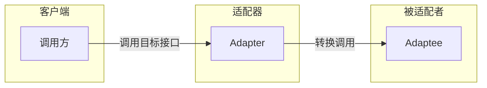
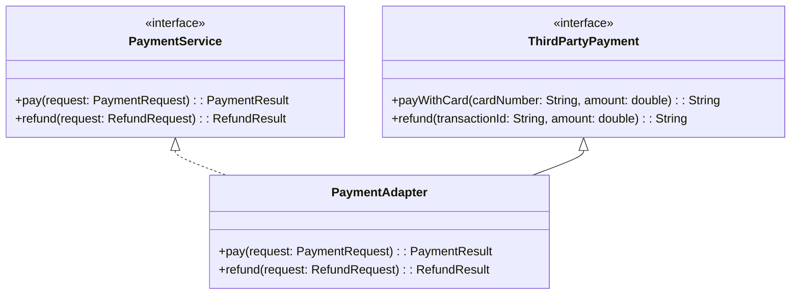
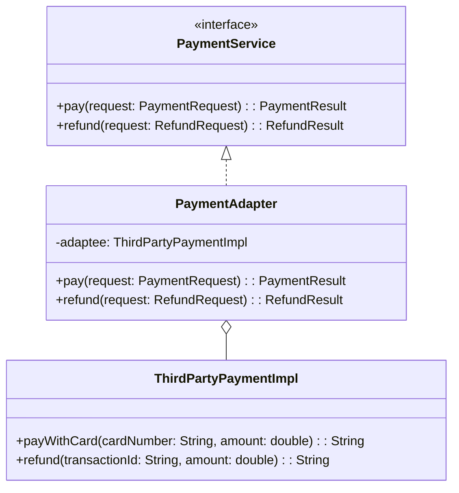

# 适配器模式

项目需要对接一个第三方支付 SDK，但这个 SDK 的接口设计和你的系统完全不兼容：

```java
// 第三方 SDK 的接口
public interface ThirdPartyPayment {
    String payWithCard(String cardNumber, double amount);
    String refund(String transactionId, double amount);
}

// 你系统定义的接口
public interface PaymentService {
    PaymentResult pay(PaymentRequest request);
    RefundResult refund(RefundRequest request);
}
```

你有两个选择：**一是** 改造所有调用方来适配第三方接口；**二是** 写一个适配器层，让适配器去适配第三方接口。第一种方式改动大、风险高，第二种就是适配器模式。

## 适配器模式的核心思想

适配器模式（Adapter Pattern）将一个类的接口转换成客户端期望的另一个接口，使原本接口不兼容的类可以一起工作。



适配器有三种类型：**类适配器**（通过继承）、**对象适配器**（通过组合）、**接口适配器**（通过抽象类）。

## 类适配器

通过继承实现适配器：

```java
// 被适配者：第三方 SDK
public class ThirdPartyPaymentAdapter extends ThirdPartyPayment {
    @Override
    public String payWithCard(String cardNumber, double amount) {
        // 模拟第三方 SDK 的调用
        return "第三方支付成功，卡号：" + cardNumber + "，金额：" + amount;
    }

    @Override
    public String refund(String transactionId, double amount) {
        return "第三方退款成功，交易号：" + transactionId + "，金额：" + amount;
    }
}

// 目标接口
public interface PaymentService {
    PaymentResult pay(PaymentRequest request);
    RefundResult refund(RefundRequest request);
}

// 适配器：继承方式
public class PaymentAdapter extends ThirdPartyPaymentAdapter implements PaymentService {

    @Override
    public PaymentResult pay(PaymentRequest request) {
        String result = payWithCard(request.getCardNumber(), request.getAmount());
        return new PaymentResult(result);
    }

    @Override
    public RefundResult refund(RefundRequest request) {
        String result = refund(request.getTransactionId(), request.getAmount());
        return new RefundResult(result);
    }
}
```



## 对象适配器

通过组合实现适配器：

```java
// 被适配者
public class ThirdPartyPaymentImpl {
    public String payWithCard(String cardNumber, double amount) {
        return "第三方支付成功，卡号：" + cardNumber + "，金额：" + amount;
    }

    public String refund(String transactionId, double amount) {
        return "第三方退款成功，交易号：" + transactionId + "，金额：" + amount;
    }
}

// 目标接口
public interface PaymentService {
    PaymentResult pay(PaymentRequest request);
    RefundResult refund(RefundRequest request);
}

// 适配器：组合方式
public class PaymentAdapter implements PaymentService {
    private final ThirdPartyPaymentImpl adaptee;

    public PaymentAdapter() {
        this.adaptee = new ThirdPartyPaymentImpl();
    }

    @Override
    public PaymentResult pay(PaymentRequest request) {
        String result = adaptee.payWithCard(request.getCardNumber(), request.getAmount());
        return new PaymentResult(result);
    }

    @Override
    public RefundResult refund(RefundRequest request) {
        String result = adaptee.refund(request.getTransactionId(), request.getAmount());
        return new RefundResult(result);
    }
}
```



## 对象适配器 vs 类适配器对比

| 维度 | 类适配器 | 对象适配器 |
|------|---------|-----------|
| 实现方式 | 继承 | 组合 |
| 灵活性 | 较低（受继承限制） | 较高（可适配被适配者的子类） |
| 覆盖行为 | 可以重写被适配者的方法 | 需要委托 |
| 对象数量 | 一个 | 两个（适配器 + 被适配者） |
| Java 多继承 | 不支持（单继承） | 支持 |
| 推荐使用 | 被适配者接口较稳定 | 被适配者可能被扩展 |

## Spring 中的适配器模式

Spring MVC 的 `HandlerAdapter` 是适配器模式的经典应用：

```java
public interface HandlerAdapter {
    boolean supports(Object handler);
    ModelAndView handle(HttpServletRequest request, HttpServletResponse response, Object handler) throws Exception;
}
```

Spring 提供了多种 `HandlerAdapter` 实现：

```java
// 1. RequestMappingHandlerAdapter - 处理 @RequestMapping 注解的方法
// 2. HttpRequestHandlerAdapter - 处理 HttpRequestHandler
// 3. SimpleControllerHandlerAdapter - 处理 Controller 接口
// 4. SimpleServletHandlerAdapter - 处理 Servlet
```

```java
public class DispatcherServlet {
    private List<HandlerAdapter> handlerAdapters;

    protected void doDispatch(HttpServletRequest request, HttpServletResponse response) {
        // 获取处理器（如 @Controller 的方法）
        HandlerExecutionChain handler = getHandler(mappedHandler);

        // 获取适配器
        HandlerAdapter adapter = getHandlerAdapter(handler.getHandler());

        // 通过适配器执行处理器
        adapter.handle(request, response, handler.getHandler());
    }

    private HandlerAdapter getHandlerAdapter(Object handler) {
        for (HandlerAdapter adapter : this.handlerAdapters) {
            if (adapter.supports(handler)) {
                return adapter;
            }
        }
        throw new ServletException("No adapter for handler [" + handler + "]");
    }
}
```

这样设计的好处：无论控制器以什么方式实现（注解、接口、Servlet），都可以通过适配器统一处理。

## 适配器模式 vs 装饰器模式 vs 代理模式

这三个模式经常被混淆，因为它们结构相似（都包装了一个对象），但目的不同：

| 维度 | 适配器 | 装饰器 | 代理 |
|------|-------|-------|------|
| **目的** | 接口转换 | 功能增强 | 访问控制 |
| **原接口** | 通常不同 | 必须相同 | 必须相同 |
| **使用时机** | 事后补救 | 设计时规划 | 设计时规划 |
| **接口变化** | 可能改变 | 不改变 | 不改变 |
| **调用链** | 调用适配者 | 调用被装饰者 | 调用真实对象 |

```java
// 适配器：接口转换
ThirdPartySDK sdk = new ThirdPartySDK();
sdk.pay(cardNumber, amount);  // 第三方接口

// 装饰器：功能增强
FileInputStream fis = new FileInputStream("data.txt");
BufferedInputStream bis = new BufferedInputStream(fis);  // 增加缓冲功能

// 代理：访问控制
Image realImage = new RealImage("large.jpg");
Image proxy = new ImageProxy(realImage);  // 控制访问，可能延迟加载
```

## 适配器模式的优缺点

**优点**：

1. **开闭原则**：不修改原有代码，扩展新功能
2. **单一职责**：将接口转换逻辑抽离出来
3. **解耦**：调用方和被调用方解耦
4. **复用**：旧代码可以在新系统中复用

**缺点**：

1. **过度使用**：滥用适配器会增加系统复杂度
2. **性能开销**：每次调用都多了一层转换
3. **隐蔽性**：调用方不知道底层调用了谁，调试困难

## 思考题

**问题 1**：什么情况下应该用适配器模式？

<details>
<summary>参考答案</summary>

**1. 对接第三方库或遗留系统**

```java
// 第三方库的接口不兼容你的系统
public class ThirdPartyAPI {
    public Map<String, Object> fetchUser(String id) { ... }
}

// 适配成你的接口
public class UserAdapter implements UserService {
    @Override
    public User getUser(String id) {
        Map<String, Object> data = thirdPartyAPI.fetchUser(id);
        return convertToUser(data);
    }
}
```

**2. 统一不同模块的接口**

系统中多个模块实现了类似功能，但接口不一致，需要统一。

**3. 扩展系统功能**

在不修改原有代码的情况下，让新代码和旧代码一起工作。

**不适用场景**：如果原有接口设计合理，应该优先考虑重构，而不是加适配器层。

</details>

**问题 2**：为什么 Spring 选择用适配器模式处理 Controller？

<details>
<summary>参考答案</summary>

Spring 需要支持多种控制器实现方式：

1. `@Controller` + `@RequestMapping`（注解方式）
2. 实现 `Controller` 接口（最原始的方式）
3. 实现 `HttpRequestHandler` 接口
4. 实现 `Servlet` 接口

每种方式有自己独特的接口定义：

```java
// 注解方式
public @interface RequestMapping {
    String value();
}

// Controller 接口
public interface Controller {
    ModelAndView handleRequest(HttpServletRequest request, HttpServletResponse response);
}

// HttpRequestHandler
public interface HttpRequestHandler {
    void handleRequest(HttpServletRequest request, HttpServletResponse response);
}
```

如果不用适配器，`DispatcherServlet` 需要写一堆 `if-else` 判断：

```java
if (handler instanceof Controller) {
    ((Controller) handler).handleRequest(req, resp);
} else if (handler instanceof HttpRequestHandler) {
    ((HttpRequestHandler) handler).handleRequest(req, resp);
}
// ... 更多判断
```

有了适配器，`DispatcherServlet` 只需要调用 `adapter.handle()`，具体处理逻辑由适配器负责。

</details>

**问题 3**：适配器模式和门面模式（外观模式）有什么区别？

<details>
<summary>参考答案</summary>

| 维度 | 适配器模式 | 门面模式 |
|------|-----------|---------|
| **目的** | 接口转换（变不同为相同） | 简化接口（变复杂为简单） |
| **关注点** | 被适配者暴露的接口 | 子系统的整体功能 |
| **调用方向** | 调用方 → 适配器 → 被适配者 | 调用方 → 门面 → 多个子系统 |
| **封装内容** | 转换逻辑 | 一组相关接口 |
| **典型场景** | 对接第三方 SDK | 封装复杂系统 |

**适配器**：把「方的东西」变成「圆的东西」，你最终还是在用「方的东西」。

**门面模式**：你根本不需要知道内部是方的还是圆的，门面给你提供了一个更简单的使用方式。

```java
// 适配器：转换接口
PaymentAdapter adapter = new PaymentAdapter();
adapter.pay(request);  // 你的系统接口，底层调用第三方

// 门面：简化调用
OrderFacade facade = new OrderFacade();
facade.createOrder(request);  // 一个方法，内部可能调用 10 个子系统
```

</details>
