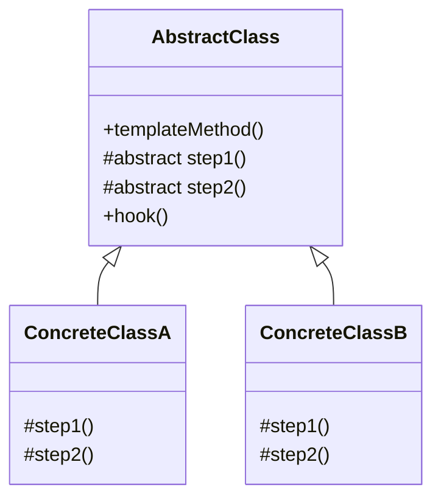
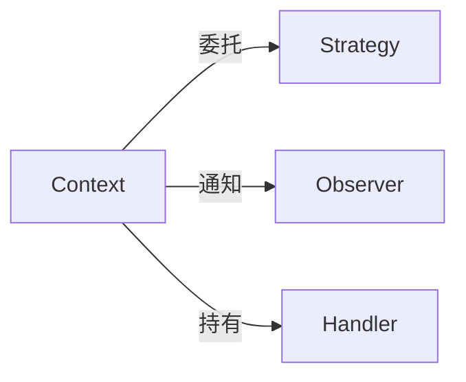
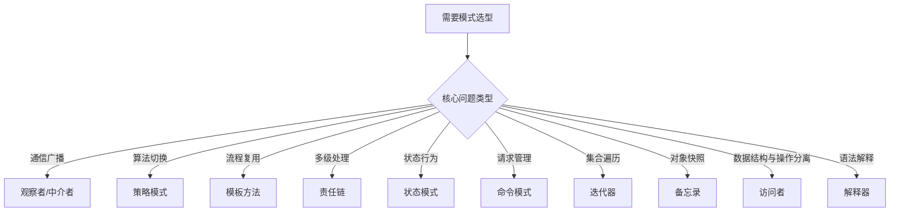

# 行为型模式总览

凌晨 2 点，线上出现诡异现象：用户下单后系统通知了 3 次库存团队、2 次物流团队、1 次财务团队，但用户自己却没收到任何通知。问题不在代码逻辑，而在于通知系统把「谁应该知道」和「怎么通知」混在了一起——每个业务模块都在直接调用其他模块的方法，耦合严重到改一处动全身。

这只是行为型模式要解决的核心问题的冰山一角。

## 行为型模式要解决什么问题

行为型模式（Behavioral Pattern）关注对象间的职责分配和算法封装。核心目标是：**解耦——让发送者和接收者不再紧耦合，而是通过某种机制松散地连接在一起**。

具体来说，行为型模式解决以下几类问题：

- **对象间通信**：A 变化了，如何让 B、C、D 知道？—— 观察者模式
- **算法封装**：同一件事有多种实现，如何切换？—— 策略模式
- **流程复用**：多个步骤固定，但部分步骤可变？—— 模板方法模式
- **请求传递**：一个请求需要多个处理器处理？—— 责任链模式
- **状态切换**：对象行为随状态自动变化？—— 状态模式
- **请求封装**：请求、命令、撤销统一管理？—— 命令模式

## 11 种行为型模式概览

行为型模式共有 11 种，是三大类模式中数量最多的。按其作用可分为以下几个维度：

| 维度 | 模式 |
| --- | --- |
| **对象通信** | 观察者、中介者 |
| **算法封装** | 策略、模板方法 |
| **请求处理** | 责任链、命令 |
| **状态管理** | 状态、备忘录 |
| **数据操作** | 迭代器、访问者、解释器 |

## 分类：类行为模式 vs 对象行为模式

按照复用机制的不同，行为型模式可分为两类：

### 类行为模式

通过**继承**来复用代码，将行为分布到各个类中。模板方法模式是唯一一种类行为模式，它使用继承将算法的可变部分延迟到子类。

### 对象行为模式

通过**组合**和**委托**来复用代码，对象间通过协作完成任务。大多数行为型模式都是对象行为模式。

| 类型 | 模式 | 复用机制 |
| --- | --- | --- |
| **类行为模式** | 模板方法 | 继承 |
| **对象行为模式** | 其余 10 种 | 组合 + 委托 |

## 行为型模式对比表

### 按意图分类

| 模式 | 核心意图 | 解决问题 |
| --- | --- | --- |
| **策略模式** | 算法家族 | 将一族算法封装起来，使它们可以互换 |
| **观察者模式** | 一对多依赖 | 当对象状态改变时，自动通知所有依赖者 |
| **模板方法** | 算法骨架 | 定义算法骨架，将部分步骤延迟到子类 |
| **责任链模式** | 请求传递 | 将请求沿着处理者链传递，直到被处理 |
| **状态模式** | 状态切换 | 对象内部状态决定其行为 |
| **命令模式** | 请求封装 | 将请求封装为对象，支持撤销/重做 |
| **迭代器模式** | 集合遍历 | 提供顺序访问集合元素的方式 |
| **中介者模式** | 交互封装 | 用中介对象封装对象间交互 |
| **备忘录模式** | 状态快照 | 捕获并恢复对象状态 |
| **访问者模式** | 操作分离 | 将数据结构与操作分离 |
| **解释器模式** | 语法解析 | 定义语法解释器 |

### 按核心思想分类

| 思想 | 对应模式 |
| --- | --- |
| **委托与组合** | 策略、命令、迭代器 |
| **通知与广播** | 观察者、中介者 |
| **链式处理** | 责任链 |
| **状态机** | 状态、备忘录 |
| **分层与模板** | 模板方法 |
| **分离关注点** | 访问者、解释器 |

### 按典型应用分类

| 领域 | 典型模式 |
| --- | --- |
| **框架层** | 模板方法（Spring JdbcTemplate）、责任链（Servlet Filter） |
| **业务层** | 策略（促销计算）、状态（订单流转）、命令（事务管理） |
| **集合/API** | 迭代器（Java Iterator）、访问者（FileVisitor） |
| **消息/事件** | 观察者（Spring Listener）、中介者（EventBus） |
| **语法/规则** | 解释器（SpEL、正则） |

## 模式选用指南

### 场景决策树

### 核心模式对比

#### 观察者 vs 中介者

| 维度 | 观察者模式 | 中介者模式 |
| --- | --- | --- |
| 通信方式 | 直接通信，观察者注册到被观察者 | 间接通信，对象间不直接通信 |
| 耦合程度 | 观察者与被观察者耦合 | 对象与中介者耦合，对象间解耦 |
| 适用场景 | 状态变化通知（GUI 事件、消息推送） | 对象交互复杂（表单验证、UI 组件） |
| 典型框架 | Java Observable、Spring Listener | Guava EventBus |

#### 策略 vs 状态 vs 责任链

| 维度 | 策略模式 | 状态模式 | 责任链模式 |
| --- | --- | --- | --- |
| 策略选择 | 客户端或 Context 决定 | 对象内部状态决定 | 请求自己流动 |
| 切换方式 | 手动切换 | 自动切换 | 自动传递 |
| 独立性 | 策略之间无关联 | 状态之间可能有转换关系 | Handler 之间无关联 |
| 典型场景 | 支付方式、促销算法 | 订单状态、审批流程 | 日志过滤、安全校验 |

#### 命令 vs 策略 vs 模板方法

| 维度 | 命令模式 | 策略模式 | 模板方法 |
| --- | --- | --- | --- |
| 目的 | 封装请求 | 封装算法 | 复用流程 |
| 可撤销 | 是 | 否 | 否 |
| 队列化 | 支持 | 不支持 | 不支持 |
| 继承 vs 组合 | 组合 | 组合 | 继承 |

## 常见模式组合

### 命令 + 备忘录 + 责任链

实现撤销/重做系统时，三种模式配合使用：

- **命令模式**：封装每个操作
- **备忘录模式**：保存操作前后状态
- **责任链模式**：多级审批流程

### 观察者 + 中介者

复杂 GUI 系统中：

- **观察者模式**：组件与数据模型的绑定
- **中介者模式**：组件间通信的协调中心

### 迭代器 + 访问者

编译器或文档处理中：

- **迭代器模式**：遍历抽象语法树节点
- **访问者模式**：对不同节点类型执行不同操作

## 反模式警示

:::danger 观察者模式过度嵌套

观察者链过长或嵌套过深会导致性能问题和调试困难。每个观察者执行时间过长会阻塞整个通知链。

:::

:::danger 策略模式类爆炸

每个策略一个类，当策略数量激增时会导致类爆炸。考虑使用策略工厂或策略注册表。

:::

:::danger 责任链链路过长

链路节点过多会增加延迟，每次请求都经过完整链路是浪费。

:::

:::danger 状态机过度设计

如果状态转换规则简单到可以用 if-else 描述，不要强行引入状态模式。状态模式适合复杂的状态流转逻辑。

:::

## 本章文章导读

行为型模式内容丰富，建议按以下优先级阅读：

**核心必读**：

1. 策略模式—— 算法切换的首选方案
2. 观察者模式—— 解耦对象间通信
3. 模板方法—— 流程复用的经典实现

**进阶推荐**：

1. 责任链模式—— 请求处理的链式结构
2. 状态模式—— 有限状态机的实现
3. 命令模式—— 请求封装与撤销重做

**选读深入**：

1. 迭代器模式—— 集合遍历的演进
2. 中介者模式—— 对象交互的协调中心
3. 备忘录模式—— 状态快照与恢复
4. 访问者模式—— 双分派的艺术
5. 解释器模式—— 语法解析的利器

准备好了吗？让我们从策略模式开始，深入理解行为型模式的本质与适用场景。
