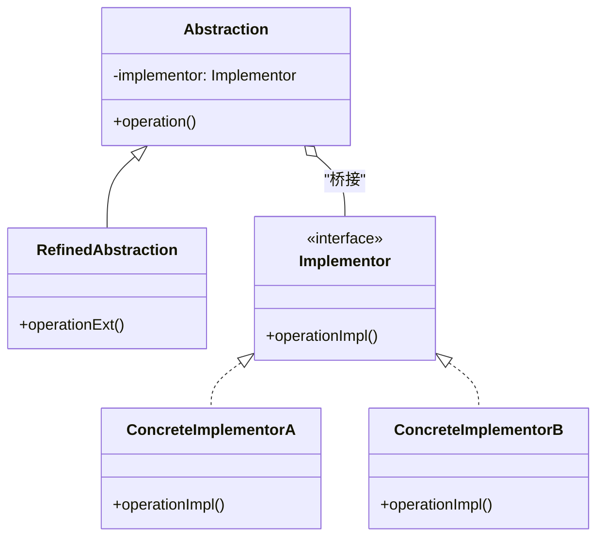
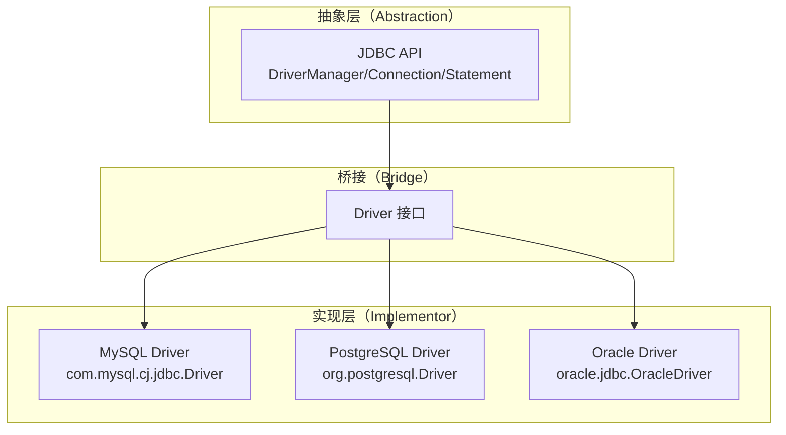
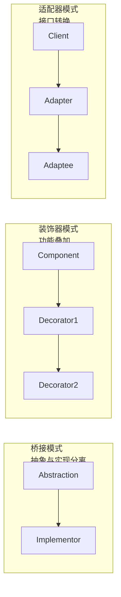

# 桥接模式

你正在开发一个数据库访问框架，需要支持 MySQL、PostgreSQL、Oracle 三种数据库，同时还需要支持增删改查、事务、分页三种操作方式。

按照传统思路，你可能会这样设计类结构：

```java
// 继承层次爆炸
class MySQLQuery {}
class MySQLInsert {}
class MySQLUpdate {}
class MySQLDelete {}
class MySQLTransaction {}
class MySQLPagination {}

class PostgreSQLQuery {}
class PostgreSQLInsert {}
// ... 每种数据库 × 每种操作 = 大量类
```

如果有 3 种数据库和 3 种操作，就需要 9 个类。如果再加 2 种数据库、加 2 种操作，类数量会爆炸式增长。这不是继承该解决的问题。

问题的根源在于：**数据库类型和操作类型是两个独立变化的维度**，不应该绑在一起。MySQL 的查询和 PostgreSQL 的查询，核心逻辑是相似的；查询 MySQL 和查询 PostgreSQL，核心逻辑也是相似的。

桥接模式正是解决这类问题的利器。

## 桥接模式的核心思想

桥接模式（Bridge Pattern）将抽象部分与实现部分分离，使它们可以独立变化。它通过组合而非继承来连接抽象和实现，让两者可以独立扩展而互不影响。



抽象部分定义高层业务逻辑，实现部分提供底层平台能力。两者通过「桥」——即组合关系——连接起来，而不是通过继承绑死在一起。

## JDBC：桥接模式的经典应用

JDBC（Java Database Connectivity）是桥接模式最经典的应用案例。Java 应用程序只需要面对 JDBC 接口编程，而具体的数据库驱动由数据库厂商实现。



JDBC 的接口设计：

```java
// 实现部分接口（Driver）
public interface Driver {
    Connection connect(String url, Properties info) throws SQLException;
    boolean acceptsURL(String url) throws SQLException;
    DriverPropertyInfo[] getPropertyInfo(String url, Properties info) throws SQLException;
}

// MySQL 驱动实现
public class com.mysql.cj.jdbc.Driver implements Driver {
    @Override
    public Connection connect(String url, Properties info) {
        // MySQL 特有连接逻辑
        return new MysqlConnection(url, info);
    }
}

// 抽象层（DriverManager）
public class DriverManager {
    // 获取连接，实际调用的是 Driver 接口
    public static Connection getConnection(String url) {
        Driver driver = loadDriver(url);  // 找到对应的 Driver
        return driver.connect(url, null);  // 调用 Driver 实现
    }
}

// 应用代码（不感知具体数据库）
public class UserDao {
    public User findById(Long id) {
        Connection conn = DriverManager.getConnection("jdbc:mysql://localhost:3306/test");
        // 增删改查都是 JDBC 标准 API，与具体数据库无关
        PreparedStatement ps = conn.prepareStatement("SELECT * FROM user WHERE id = ?");
        ps.setLong(1, id);
        ResultSet rs = ps.executeQuery();
        // ...
    }
}
```

JDBC 的设计精髓在于：**Java 应用只需要学会一套 API**，无论底层是 MySQL、PostgreSQL 还是 Oracle，代码逻辑几乎不变。切换数据库只需要换驱动包和 URL。

## 桥接模式的实现

让我们实现一个跨平台的图形渲染系统：

```java
// 实现部分接口：渲染引擎
public interface RenderingEngine {
    void renderCircle(double x, double y, double radius);
    void renderRectangle(double x, double y, double width, double height);
    void renderText(String text, double x, double y);
}

// OpenGL 实现
public class OpenGLEngine implements RenderingEngine {
    @Override
    public void renderCircle(double x, double y, double radius) {
        System.out.println("[OpenGL] 渲染圆形 at (" + x + ", " + y + "), radius=" + radius);
        // OpenGL 特有的圆形渲染逻辑
    }

    @Override
    public void renderRectangle(double x, double y, double width, double height) {
        System.out.println("[OpenGL] 渲染矩形 at (" + x + ", " + y + "), "
                          + width + "x" + height);
    }

    @Override
    public void renderText(String text, double x, double y) {
        System.out.println("[OpenGL] 渲染文本: " + text + " at (" + x + ", " + y + ")");
    }
}

// Vulkan 实现
public class VulkanEngine implements RenderingEngine {
    @Override
    public void renderCircle(double x, double y, double radius) {
        System.out.println("[Vulkan] 渲染圆形 at (" + x + ", " + y + "), radius=" + radius);
    }

    @Override
    public void renderRectangle(double x, double y, double width, double height) {
        System.out.println("[Vulkan] 渲染矩形 at (" + x + ", " + y + "), "
                          + width + "x" + height);
    }

    @Override
    public void renderText(String text, double x, double y) {
        System.out.println("[Vulkan] 渲染文本: " + text + " at (" + x + ", " + y + ")");
    }
}

// 抽象部分：图形
public abstract class Shape {
    protected RenderingEngine engine;  // 桥接

    public Shape(RenderingEngine engine) {
        this.engine = engine;
    }

    public abstract void draw();
    public abstract void resize(double factor);
}

// 精化抽象：圆形
public class Circle extends Shape {
    private double x, y, radius;

    public Circle(RenderingEngine engine, double x, double y, double radius) {
        super(engine);
        this.x = x;
        this.y = y;
        this.radius = radius;
    }

    @Override
    public void draw() {
        engine.renderCircle(x, y, radius);
    }

    @Override
    public void resize(double factor) {
        radius *= factor;
    }
}

// 精化抽象：矩形
public class Rectangle extends Shape {
    private double x, y, width, height;

    public Rectangle(RenderingEngine engine, double x, double y, double width, double height) {
        super(engine);
        this.x = x;
        this.y = y;
        this.width = width;
        this.height = height;
    }

    @Override
    public void draw() {
        engine.renderRectangle(x, y, width, height);
    }

    @Override
    public void resize(double factor) {
        width *= factor;
        height *= factor;
    }
}
```

使用示例：

```java
public class BridgeDemo {
    public static void main(String[] args) {
        // 组合 1：OpenGL + 圆形
        RenderingEngine opengl = new OpenGLEngine();
        Shape circle1 = new Circle(opengl, 100, 100, 50);
        circle1.draw();

        // 组合 2：Vulkan + 圆形
        RenderingEngine vulkan = new VulkanEngine();
        Shape circle2 = new Circle(vulkan, 200, 200, 30);
        circle2.draw();

        // 组合 3：OpenGL + 矩形
        Shape rect = new Rectangle(opengl, 50, 50, 100, 200);
        rect.draw();

        // 组合 4：Vulkan + 矩形
        Shape rect2 = new Rectangle(vulkan, 150, 150, 80, 120);
        rect2.draw();
    }
}
```

输出：

```
[OpenGL] 渲染圆形 at (100.0, 100.0), radius=50.0
[Vulkan] 渲染圆形 at (200.0, 200.0), radius=30.0
[OpenGL] 渲染矩形 at (50.0, 50.0), 100.0x200.0
[Vulkan] 渲染矩形 at (150.0, 150.0), 80.0x120.0
```

**类的数量**：如果有 M 种图形和 N 种引擎，使用继承需要 M × N 个类，而使用桥接模式只需要 M + N 个类。

## 桥接模式 vs 装饰器模式 vs 适配器模式

三者都涉及到「包装」，但意图和应用场景不同：

| 维度 | 桥接模式 | 装饰器模式 | 适配器模式 |
| --- | --- | --- | --- |
| **核心意图** | 分离抽象与实现，让两者独立扩展 | 动态添加功能，叠加组合 | 转换接口，解决不兼容 |
| **变化维度** | 两个维度独立变化 | 功能叠加 | 接口适配 |
| **组合关系** | 抽象持有实现的引用 | 装饰器包装组件 | 适配器包装被适配者 |
| **使用时机** | 设计期，考虑扩展性 | 运行期，按需组合 | 接入期，解决兼容 |



**桥接模式解决的是「类爆炸」问题**——当一个事物有两个独立变化的维度时，不应该用继承把两者绑在一起。

## 桥接模式的应用场景

### JDBC 驱动

JDBC 是桥接模式最经典的应用。`DriverManager` 是抽象层，`Driver` 是实现接口，各厂商驱动是具体实现。

### 跨平台 UI 组件

```java
// 实现层：不同操作系统的窗口实现
public interface WindowImpl {
    void drawRect(int x, int y, int w, int h);
    void drawText(String text, int x, int y);
    void drawButton(String label, int x, int y);
}

// 抽象层：窗口
public abstract class Window {
    protected WindowImpl impl;

    public void drawButton(String label, int x, int y) {
        impl.drawButton(label, x, y);
    }
}

// 精化抽象：带边框的窗口
public class BorderWindow extends Window {
    @Override
    public void drawButton(String label, int x, int y) {
        // 先画边框
        impl.drawRect(x - 5, y - 5, 70, 30);
        // 再画按钮
        impl.drawButton(label, x, y);
    }
}
```

### 日志框架

SLF4J 是日志门面（外观），具体的日志实现（Logback、Log4j2）通过桥接模式插拔：

```java
// Logger 接口是实现部分
public interface Logger {
    void info(String msg);
    void warn(String msg);
    void error(String msg);
}

// 应用代码只依赖抽象
public class OrderService {
    private final Logger logger;

    public OrderService(Logger logger) {
        this.logger = logger;
    }

    public void createOrder(Order order) {
        logger.info("创建订单: " + order.getId());
        // ...
    }
}
```

## 桥接模式的适用场景

### 适用场景

- 一个类有两个独立变化的维度，且都需要扩展
- 不希望在两个维度之间使用继承（避免类爆炸）
- 希望在运行时切换实现
- 子系统需要分层，每个层次通过桥接连接

### 不适用场景

- 两个维度不会独立变化
- 抽象和实现已经绑死，改动成本太高
- 简单的两维度扩展，继承就够用

:::warning 桥接模式的代价

桥接模式增加了代码复杂度（多了一层抽象），并且需要维护两个独立的部分。只有当确实存在两个独立变化的维度时，才值得使用。如果只有一种变化维度，继承或组合都更简单。

:::

## 思考题

**问题 1**：JDBC 的 `DriverManager.getConnection()` 为什么能自动找到合适的驱动？

<details>
<summary>参考答案</summary>

这是通过 Java 的**服务加载机制（Service Provider）**实现的：

1. 各数据库驱动 JAR 包中的 `META-INF/services/java.sql.Driver` 文件声明了驱动类
2. `DriverManager` 在初始化时会调用 `ServiceLoader.load(Driver.class)` 扫描所有已注册的驱动
3. 当调用 `getConnection(url)` 时，`DriverManager` 遍历所有驱动，询问 `acceptsURL(url)` 哪个返回 `true`
4. 找到匹配的驱动后，调用其 `connect(url, info)` 建立连接

这种设计让 JDBC 驱动可以**热插拔**：添加一个驱动 JAR 包，不需要修改任何代码，应用程序就能使用新数据库。

</details>

**问题 2**：桥接模式和策略模式都涉及到「组合」，有什么区别？

<details>
<summary>参考答案</summary>

两者的关键区别在于**意图和使用时机**：

| 维度 | 桥接模式 | 策略模式 |
| --- | --- | --- |
| **目的** | 分离抽象与实现，让两者独立变化 | 封装可互换的算法 |
| **变化时机** | 设计期，两个维度都可能扩展 | 运行期，根据条件选择策略 |
| **关系稳定性** | 抽象和实现的关系是固定的 | 策略可以在运行时切换 |
| **典型场景** | JDBC、多平台 UI | 排序算法、支付方式、折扣计算 |

**简单判断**：如果两个维度「天然独立」，如数据库类型和 SQL 操作，就用桥接模式；如果需要在运行时「选择算法」，就用策略模式。

</details>

**问题 3**：在 JDBC 中，如果需要同时使用 MySQL 和 PostgreSQL，应该怎么设计？

<details>
<summary>参考答案</summary>

有三种方案：

**方案 1：同一时刻单一连接**
应用根据业务逻辑选择不同的数据源，代码层面不混合使用：

```java
public UserDao {
    public User findMySQL(Long id) {
        Connection conn = DriverManager.getConnection("jdbc:mysql://...");
        // ...
    }

    public User findPostgreSQL(Long id) {
        Connection conn = DriverManager.getConnection("jdbc:postgresql://...");
        // ...
    }
}
```

**方案 2：抽象数据源层**
在业务层和数据访问层之间引入数据源抽象：

```java
public interface DataSource {
    User findById(Long id);
}

public class MySQLDataSource implements DataSource { /* ... */ }
public class PostgreSQLDataSource implements DataSource { /* ... */ }
```

**方案 3：动态路由**
根据配置或请求参数动态选择数据源：

```java
public class RoutingDataSource implements DataSource {
    private Map<String, DataSource> sources;

    @Override
    public User findById(Long id) {
        String target = decideTarget(id);
        return sources.get(target).findById(id);
    }
}
```

方案 2 更符合桥接模式的思想，且易于测试和扩展。

</details>
