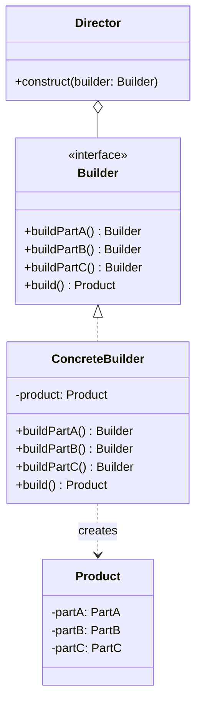

# 建造者模式

你用过 `HttpClient` 吗？看看它的 Builder 配置有多少项：

```java
HttpClient client = HttpClient.newBuilder()
    .version(HttpClient.Version.HTTP_2)
    .connectTimeout(Duration.ofSeconds(10))
    .followRedirects(HttpClient.Redirect.NORMAL)
    .proxy(ProxySelector.of(new InetSocketAddress("proxy.example.com", 8080)))
    .authenticator(Authenticator.getDefault())
    .cookieManager(new CookieManager())
    .executor(Executors.newFixedThreadPool(4))
    .build();
```

如果这些都用构造函数参数，代码会变成什么样？`HttpClient(String version, long timeout, int redirectMode, ...)` —— 这样的 API 没人愿意用。

这就是建造者模式的价值：**用链式调用解决多参数构造的问题**。

## 为什么需要建造者模式？

### 重叠构造函数的灾难

假设有一个 `User` 类，有 5 个可选参数：

```java
// 方式一：重叠构造函数（ telescoping constructor）
public User(String name, String email) {}
public User(String name, String email, String phone) {}
public User(String name, String email, String phone, String address) {}
// ... 指数级增长的构造函数

// 调用
User user = new User("zhangsan", "zhangsan@example.com", "13800000000", null, null);
```

调用方必须为每个 null 参数提供占位符，阅读代码时根本不知道哪些参数是真正重要的。

### JavaBean 模式的问题

```java
// 方式二：JavaBean 模式
public class User {
    private String name;
    private String email;

    public void setName(String name) { this.name = name; }
    public void setEmail(String email) { this.email = email; }
}

User user = new User();
user.setName("zhangsan");
user.setEmail("zhangsan@example.com");
// ...
```

问题在于：

1. **对象状态不一致**：构造函数创建了一个不完整的对象，在 `setXxx()` 调用完成前，对象都是无效的
2. **无法表示不可变性**：setter 意味着对象可以随时修改
3. **线程安全问题**：在多线程环境下，一个线程可能在另一个线程还未完成配置时使用该对象

## 建造者模式结构



传统结构包含 Director、Builder 接口、具体 Builder 和 Product。但在实际 Java 开发中，我们更常用「流式 API」的实现方式。

## 链式调用的实现

```java
public class User {
    private final String name;        // required
    private final String email;       // required
    private final String phone;       // optional
    private final String address;     // optional
    private final int age;            // optional

    // 私有构造函数，只能通过 Builder 调用
    private User(Builder builder) {
        this.name = builder.name;
        this.email = builder.email;
        this.phone = builder.phone;
        this.address = builder.address;
        this.age = builder.age;
    }

    public String getName() { return name; }
    public String getEmail() { return email; }
    // ... 其他 getter

    // 静态内部类 Builder
    public static class Builder {
        private final String name;
        private final String email;
        private String phone = null;
        private String address = null;
        private int age = 0;

        public Builder(String name, String email) {
            this.name = Objects.requireNonNull(name);
            this.email = Objects.requireNonNull(email);
        }

        public Builder phone(String phone) {
            this.phone = phone;
            return this;
        }

        public Builder address(String address) {
            this.address = address;
            return this;
        }

        public Builder age(int age) {
            this.age = age;
            return this;
        }

        public User build() {
            return new User(this);
        }
    }
}
```

```java
// 使用方式
User user = new User.Builder("zhangsan", "zhangsan@example.com")
    .phone("13800000000")
    .address("北京市朝阳区")
    .age(25)
    .build();
```

## 不可变对象构建

建造者模式天然适合构建不可变对象。关键点：

1. **成员变量用 `final` 修饰**
2. **不提供 setter 方法**
3. **构造函数私有化**
4. **Builder 负责初始化所有字段**

```java
public final class ImmutableUser {
    private final String name;
    private final String email;
    private final List<String> roles;

    private ImmutableUser(Builder builder) {
        this.name = builder.name;
        this.email = builder.email;
        // 防御性拷贝，防止调用方修改传入的列表
        this.roles = Collections.unmodifiableList(new ArrayList<>(builder.roles));
    }

    public String getName() { return name; }
    public List<String> getRoles() { return roles; }

    public static Builder builder() {
        return new Builder();
    }

    public static class Builder {
        private String name;
        private String email;
        private List<String> roles = new ArrayList<>();

        public Builder name(String name) {
            this.name = name;
            return this;
        }

        public Builder email(String email) {
            this.email = email;
            return this;
        }

        public Builder role(String role) {
            this.roles.add(role);
            return this;
        }

        public ImmutableUser build() {
            return new ImmutableUser(this);
        }
    }
}
```

## Lombok @Builder 原理

Lombok 的 `@Builder` 注解会自动生成 Builder 类：

```java
@Builder
public class User {
    private String name;
    private String email;
    private String phone;
    private String address;
    private int age;
}
```

编译后会生成：

```java
public class User {
    private String name;
    private String email;
    private String phone;
    private String address;
    private int age;

    private User(UserBuilder builder) {
        this.name = builder.name;
        this.email = builder.email;
        this.phone = builder.phone;
        this.address = builder.address;
        this.age = builder.age;
    }

    public static UserBuilder builder() {
        return new UserBuilder();
    }

    public static class UserBuilder {
        private String name;
        private String email;
        private String phone;
        private String address;
        private int age;

        public UserBuilder name(String name) {
            this.name = name;
            return this;
        }
        // ... 其他 setter 方法

        public User build() {
            return new User(this);
        }
    }
}
```

### Lombok @Builder 的坑

**1. 默认值处理**

```java
@Builder
public class Config {
    private int timeout = 30;  // 有默认值
    private String host = "localhost";
}

// 调用
Config config = Config.builder()
    .timeout(60)  // 覆盖了默认值
    .build();
// 结果：timeout=60, host="localhost"

// 但如果这样写
Config config = Config.builder()
    .build();
// 结果：timeout=0, host=null ❌ 默认值丢失！
```

**解决方案**：用 `@Builder.Default`

```java
@Builder
public class Config {
    @Builder.Default
    private int timeout = 30;

    @Builder.Default
    private String host = "localhost";
}
```

**2. 继承问题**

`@Builder` 不支持继承体系中的父类字段。

```java
public class Animal {
    private String name;
}

@Builder
public class Dog extends Animal {
    private String breed;
}

// DogBuilder 不会有 name 字段
```

**解决方案**：使用 `@SuperBuilder`（Lombok 1.18.10+）

```java
@SuperBuilder
public class Animal {
    private String name;
}

@SuperBuilder
public class Dog extends Animal {
    private String breed;
}
```

## 建造者模式 vs 工厂模式

| 维度 | 建造者模式 | 工厂模式 |
|------|-----------|---------|
| 关注点 | 如何构建 | 创建什么类型 |
| 产品复杂度 | 复杂对象，多参数 | 简单或中等复杂度 |
| 构建过程 | 有步骤差异 | 通常一步创建 |
| 返回方式 | `build()` 方法 | 直接返回 |
| 典型场景 | HTTP Client、Request、DTO | 产品族切换 |

## 思考题

**问题 1**：为什么说建造者模式适合构建不可变对象？

<details>
<summary>参考答案</summary>

不可变对象的三个核心特征：

1. **所有字段都是 final 的**
2. **不提供 setter**
3. **字段如果是引用类型，返回时做防御性拷贝**

建造者模式天然符合这些要求：

```java
private User(Builder builder) {  // 私有构造函数
    this.name = builder.name;    // final 字段
    this.roles = Collections.unmodifiableList(new ArrayList<>(builder.roles)); // 防御性拷贝
}
```

同时，建造过程是**原子性**的——只有调用 `build()` 后才生成完整对象，使用者无法看到「半成品」状态。

相比之下，JavaBean 模式在 `setXxx()` 调用过程中对象都是无效的，不符合不可变性的要求。

</details>

**问题 2**：Lombok 的 `@Builder` 生成的对象是线程安全的吗？

<details>
<summary>参考答案</summary>

**Builder 类本身不是线程安全的**。

```java
@Builder
public class User {
    private String name;
    private String email;
}

// 多线程共享一个 Builder
User.UserBuilder builder = User.builder();

// 线程 A
builder.name("Alice");

// 线程 B 同时
builder.email("alice@example.com");

// 最终结果不确定
User user = builder.build();
```

**生成的对象是否线程安全取决于类本身**。如果类的字段都是 `final` 且没有 setter，对象创建后自然是线程安全的（只读）。

如果需要线程安全的构建过程，应该：

```java
// 方式一：每个线程用自己的 Builder
public User createUser(String name, String email) {
    return User.builder()
        .name(name)
        .email(email)
        .build();
}

// 方式二：使用同步
synchronized (builder) {
    builder.name("Alice");
}
```

</details>

**问题 3**：什么情况下不应该用建造者模式？

<details>
<summary>参考答案</summary>

**1. 参数少且简单**

```java
// 错误：3 个参数完全不需要 Builder
Point p = Point.builder()
    .x(10)
    .y(20)
    .build();

// 正确：直接构造函数
Point p = new Point(10, 20);
```

**2. 对象不可变需求不强烈**

如果对象需要经常修改，使用 Builder 会增加代码复杂度。

**3. 产品结构简单**

没有复杂的组装过程，一行 `new` 就能解决。

**4. 需要高性能的场景**

Builder 模式会创建额外的 Builder 对象，虽然开销很小，但在极端性能敏感的场景下可能需要注意。

</details>
