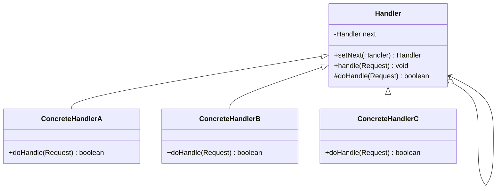
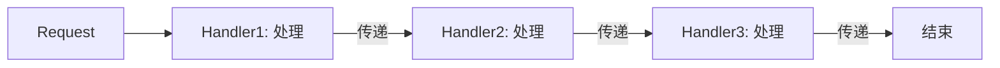
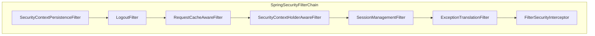
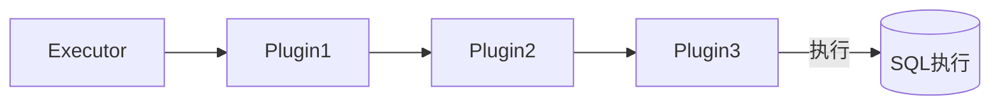
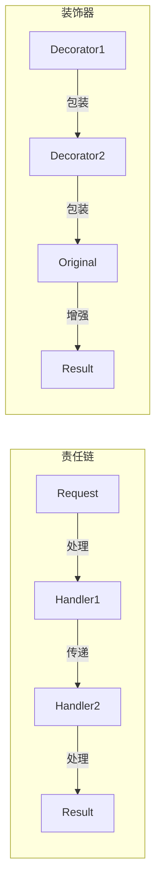

# 责任链模式

登录接口被疯狂调用，IP 来自全国各地，但你的系统根本没有区分国内外用户的逻辑。原来黑客使用了「糖醋地址」——通过代理池伪装成不同 IP 请求，每次都绕过单一 IP 的限流规则。

你开始构建多层防护：先限流，再验证签名，接着校验 Token，最后才到业务处理。每层只做自己的事，处理不了就交给下一层。

这就是责任链模式的核心：**让请求沿着处理者链传递，直到被某个处理器处理**。

## 问题背景：多层处理的困境

常见的请求处理场景：

- **Servlet Filter**：编码转换 → 认证 → 授权 → 日志 → 业务
- **Spring Security**：CSRF → Session → -basic Auth → 表单登录 → ...
- **网关层**：限流 → 鉴权 → 路由 → 协议转换 → 日志

如果用顺序调用实现：

```java
public class LoginService {
    public void login(LoginRequest request) {
        // 限流检查
        if (rateLimiter.isLimited(request.getIp())) {
            throw new TooManyRequestsException();
        }

        // 签名验证
        if (!signatureValidator.verify(request)) {
            throw new InvalidSignatureException();
        }

        // 参数校验
        if (!validator.validate(request)) {
            throw new InvalidParameterException();
        }

        // 业务逻辑
        doLogin(request);
    }
}
```

问题：每增加一种检查就要修改 `LoginService`，违反开闭原则；检查逻辑与业务逻辑耦合。

## 责任链模式结构

责任链模式（Chain of Responsibility Pattern）将请求沿着处理者链传递，链上的每个处理器负责处理请求的一部分，或者将请求传递给下一个处理器。



### 抽象处理器

```java
public abstract class Handler {
    private Handler next;

    public Handler setNext(Handler next) {
        this.next = next;
        return next;
    }

    /**
     * 模板方法：处理请求
     */
    public final void handle(Request request) {
        if (doHandle(request)) {
            return;  // 处理完成，不再传递
        }
        if (next != null) {
            next.handle(request);
        }
    }

    /**
     * 具体处理逻辑
     * @return true 表示处理完成，false 表示传递给下一个处理器
     */
    protected abstract boolean doHandle(Request request);
}
```

### 具体处理器

```java
public class RateLimitHandler extends Handler {
    private final RateLimiter rateLimiter;

    public RateLimitHandler(RateLimiter rateLimiter) {
        this.rateLimiter = rateLimiter;
    }

    @Override
    protected boolean doHandle(Request request) {
        if (rateLimiter.isLimited(request.getIp())) {
            throw new TooManyRequestsException("请求过于频繁");
        }
        return false;  // 继续传递给下一个处理器
    }
}

public class SignatureHandler extends Handler {
    private final SignatureValidator validator;

    public SignatureHandler(SignatureValidator validator) {
        this.validator = validator;
    }

    @Override
    protected boolean doHandle(Request request) {
        if (!validator.verify(request)) {
            throw new InvalidSignatureException("签名验证失败");
        }
        return false;
    }
}

public class ValidationHandler extends Handler {
    @Override
    protected boolean doHandle(Request request) {
        if (!request.isValid()) {
            throw new InvalidParameterException("参数校验失败");
        }
        return false;
    }
}

public class BusinessHandler extends Handler {
    @Override
    protected boolean doHandle(Request request) {
        // 执行具体业务逻辑
        return true;  // 处理完成
    }
}
```

### 链的组装

```java
public class HandlerChain {
    private final Handler head;
    private Handler tail;

    public HandlerChain() {
        head = new TailHandler();
        tail = head;
    }

    public HandlerChain addLast(Handler handler) {
        tail.setNext(handler);
        tail = handler;
        return this;
    }

    public void handle(Request request) {
        head.handle(request);
    }

    private static class TailHandler extends Handler {
        @Override
        protected boolean doHandle(Request request) {
            throw new IllegalStateException("No handler processed: " + request);
        }
    }
}

// 组装责任链
HandlerChain chain = new HandlerChain()
    .addLast(new RateLimitHandler(rateLimiter))
    .addLast(new SignatureHandler(signatureValidator))
    .addLast(new ValidationHandler())
    .addLast(new BusinessHandler());
```

## 纯责任链 vs 不纯责任链

### 纯责任链

纯责任链要求：**一个处理器要么处理请求，要么传递给下一个，不能同时做两件事**。



实现方式：处理器不调用 `next.handle()`，而是返回结果由调用方决定下一步。

### 不纯责任链

不纯责任链更常见：**处理器处理完请求后，可以继续传递给下一个**。

```java
@Override
protected boolean doHandle(Request request) {
    // 执行自己的处理逻辑
    doSomething(request);

    // 然后继续传递给下一个（可选）
    return false;  // 或者 return true 阻止传递
}
```

实际开发中，99% 的场景都是不纯责任链。

## Spring Security 过滤器链源码解析

Spring Security 的过滤器链是责任链模式的经典应用：



### 核心接口

```java
public interface Filter {
    void doFilter(ServletRequest request, ServletResponse response, FilterChain chain)
        throws IOException, ServletException;
}
```

### Spring Security 的 FilterChain 实现

```java
public class FilterChainProxy extends GenericFilterBean {
    private List<SecurityFilterChain> filterChains;

    @Override
    public void doFilter(ServletRequest request, ServletResponse response,
                         FilterChain chain) throws IOException, ServletException {
        doFilterInternal(request, response, chain);
    }

    private void doFilterInternal(ServletRequest request, ServletResponse response,
                                  FilterChain chain) throws IOException, ServletException {
        boolean wasApplied = false;
        boolean requestToServletContainer = false;

        for (SecurityFilterChain filterChain : filterChains) {
            if (filterChain.matches(request)) {
                wasApplied = true;
                doFilter(
                    filterChain.getFilters(),
                    request, response, chain
                );
                requestToServletContainer = true;
                break;
            }
        }
    }

    private void doFilter(List<Filter> filters, ServletRequest request,
                          ServletResponse response, FilterChain chain) {
        // 遍历每个过滤器执行
        VirtualFilterChain virtualFilterChain =
            new VirtualFilterChain(chain, filters);
        virtualFilterChain.doFilter(
            request, response
        );
    }

    private static class VirtualFilterChain implements FilterChain {
        private final FilterChain originalChain;
        private final List<Filter> additionalFilters;
        private int currentPosition = 0;

        @Override
        public void doFilter(ServletRequest request, ServletResponse response)
                throws IOException, ServletException {
            if (currentPosition == additionalFilters.size()) {
                originalChain.doFilter(request, response);
            } else {
                Filter filter = additionalFilters.get(currentPosition++);
                filter.doFilter(request, response, this);
            }
        }
    }
}
```

### 自定义过滤器

```java
@Component
public class JwtAuthenticationFilter extends OncePerRequestFilter {

    @Autowired
    private JwtTokenProvider tokenProvider;

    @Override
    protected void doFilterInternal(HttpServletRequest request,
                                    HttpServletResponse response,
                                    FilterChain filterChain)
            throws ServletException, IOException {

        String token = extractToken(request);

        if (StringUtils.hasText(token) && tokenProvider.validateToken(token)) {
            Authentication auth = tokenProvider.getAuthentication(token);
            SecurityContextHolder.getContext().setAuthentication(auth);
        }

        // 必须调用 filterChain.doFilter() 将请求传递给下一个过滤器
        filterChain.doFilter(request, response);
    }

    @Override
    protected boolean shouldNotFilter(HttpServletRequest request) {
        // 某些路径跳过此过滤器
        return request.getRequestURI().startsWith("/public/");
    }
}
```

:::warning 过滤器链的关键点

1. **必须调用 `filterChain.doFilter()`**：否则请求不会传递给下一个过滤器
2. **顺序很重要**：过滤器的执行顺序由添加顺序决定
3. **异常处理**：过滤器中的异常会被 `ExceptionTranslationFilter` 捕获

:::

## MyBatis 插件机制：Interceptor 链

MyBatis 的插件机制也是一种责任链实现，用于拦截 Executor、StatementHandler、ParameterHandler、ResultSetHandler 的方法：



### Interceptor 接口

```java
public interface Interceptor {
    /**
     * 拦截方法
     * @param invocation 方法调用上下文
     * @return 方法返回值（可以修改）
     * @throws Throwable 异常
     */
    Object intercept(Invocation invocation) throws Throwable;

    /**
     * 插件包装：返回代理对象
     */
    default Object plugin(Object target) {
        return Plugin.wrap(target, this);
    }

    /**
     * 设置属性
     */
    default void setProperties(Properties properties) {
    }
}
```

### Invocation 上下文

```java
public class Invocation {
    private final Object target;
    private final Method method;
    private final Object[] args;

    public Invocation(Object target, Method method, Object[] args) {
        this.target = target;
        this.method = method;
        this.args = args;
    }

    public Object proceed() throws InvocationTargetException, IllegalAccessException {
        return method.invoke(target, args);
    }

    public Object getTarget() { return target; }
    public Method getMethod() { return method; }
    public Object[] getArgs() { return args; }
}
```

### 自定义分页插件

```java
@Intercepts({
    @Signature(type = StatementHandler.class,
               method = "prepare",
               args = {Connection.class, Integer.class})
})
public class PageHelperInterceptor implements Interceptor {

    private Dialect dialect;
    private int defaultPage = 1;
    private int defaultPageSize = 10;

    @Override
    public Object intercept(Invocation invocation) throws Throwable {
        StatementHandler handler = (StatementHandler) invocation.getTarget();
        BoundSql boundSql = handler.getBoundSql();

        // 解析 SQL，添加分页
        String sql = boundSql.getSql();
        Page page = ThreadLocalUtil.getPage();

        if (page != null) {
            sql = dialect.addPageSQL(sql, page.getPageNum(), page.getPageSize());
            BoundSql newBoundSql = new BoundSql(handler.getConfiguration(), sql,
                                                boundSql.getParameterMappings(),
                                                boundSql.getParameterObject());
            // 替换目标对象
            Field field = BaseStatementHandler.class.getDeclaredField("boundSql");
            field.setAccessible(true);
            field.set(handler, newBoundSql);
        }

        return invocation.proceed();
    }

    @Override
    public Object plugin(Object target) {
        // 使用 JDK 动态代理包装目标对象
        return Plugin.wrap(target, this);
    }
}
```

## 责任链模式 vs 装饰器模式

两者结构相似，但意图不同：

| 维度 | 责任链模式 | 装饰器模式 |
| --- | --- | --- |
| **目的** | 请求传递，请求可能被任一处理器处理 | 功能增强，每个装饰器都处理 |
| **传递方式** | 可以传递或不传递 | 包装后继续传递 |
| **处理者关系** | 处理器之间无关联 | 装饰器和被装饰者实现同一接口 |
| **典型应用** | 过滤器链、拦截器链 | IO 流、日志增强 |



## 责任链模式的优缺点

### 优点

1. **解耦发送者和接收者**：发送者不需要知道哪个处理器会处理请求
2. **符合开闭原则**：新增或调整处理器不需要修改现有代码
3. **单一职责**：每个处理器只负责自己的处理逻辑
4. **灵活组合**：可以动态调整链的顺序和内容

### 缺点

1. **请求可能不被处理**：如果没有处理器处理请求，且没有默认处理器
2. **性能问题**：链过长时，每个请求都要遍历整个链
3. **调试困难**：请求在链中的流转路径不直观

:::warning 链过长的问题

如果责任链超过 10 个节点，考虑以下优化：

1. **分组处理**：将相关处理器分为多组，形成多级链
2. **动态短路**：根据条件提前终止链的遍历
3. **并行处理**：将可并行的处理器改为并行执行

:::

## 思考题

**问题 1**：如何实现责任链的动态配置和热更新？

<details>
<summary>参考答案</summary>

几种实现方式：

1. **配置中心**：将处理器配置存储在配置中心（Apollo、Nacos），运行时动态加载
2. **策略注册表**：使用 `Map<String, Handler>` 存储处理器，支持动态注册
3. **Spring Bean 扫描**：实现 `BeanFactoryPostProcessor` 自动收集所有 `Handler` 实现
4. **责任链工厂**：根据条件（环境、用户类型）动态组装不同的链

```java
@Component
public class DynamicHandlerChainFactory {
    @Autowired
    private List<Handler> handlers;

    @Bean
    public HandlerChain createChain() {
        HandlerChain chain = new HandlerChain();
        handlers.stream()
            .sorted(Comparator.comparingInt(h -> h.getOrder()))
            .forEach(chain::addLast);
        return chain;
    }
}
```

</details>

**问题 2**：责任链模式与策略模式都能处理多种情况，它们有什么区别？

<details>
<summary>参考答案</summary>

| 维度 | 责任链 | 策略模式 |
| --- | --- | --- |
| 处理方式 | 链式传递，每个处理器处理一部分 | 单次选择，一个策略处理全部 |
| 选择机制 | 顺序遍历，处理器自己决定是否处理 | 外部决定，通过 Context 注入 |
| 处理完成 | 可以继续传递 | 处理完成后不传递 |
| 适用场景 | 请求需要多层处理 | 算法可以互换 |

简单说：**策略模式是「选一个执行」，责任链模式是「依次执行直到有人处理」**。

</details>

**问题 3**：Spring Cloud Gateway 的过滤器链是如何实现的？

<details>
<summary>参考答案</summary>

Spring Cloud Gateway 基于 WebFlux 的响应式编程，过滤器链分为两种：

1. **GlobalFilter**：全局过滤器，所有路由都执行
2. **GatewayFilter**：针对特定路由的过滤器

实现原理：

```java
public interface GatewayFilterChain {
    Mono<Void> filter(ServerWebExchange exchange);
}

public class DefaultGatewayFilterChain implements GatewayFilterChain {
    private final int index;
    private final List<GatewayFilter> filters;

    @Override
    public Mono<Void> filter(ServerWebExchange exchange) {
        if (this.index >= filters.size()) {
            return Mono.empty();
        }
        GatewayFilter filter = filters.get(this.index++);
        return filter.filter(exchange, this);  // 递归传递
    }
}

// 使用方式
return filter.filter(exchange, exchange1 ->
    filter2.filter(exchange1, exchange2 ->
        filter3.filter(exchange2, ServerWebExchange::complete)
    )
);
```

这种「currying」写法实现了链式调用的延迟执行。

</details>
