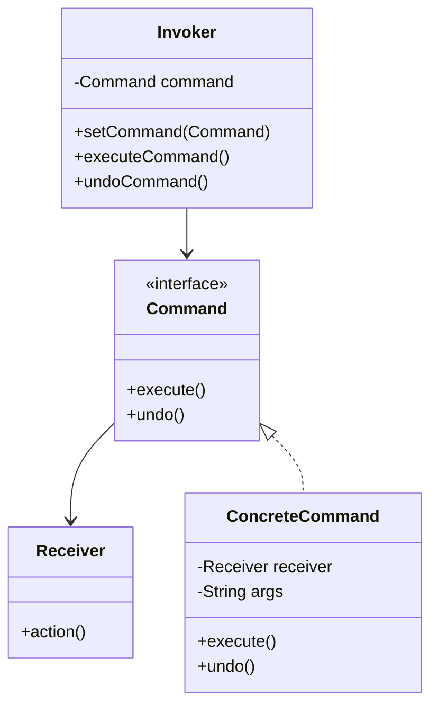
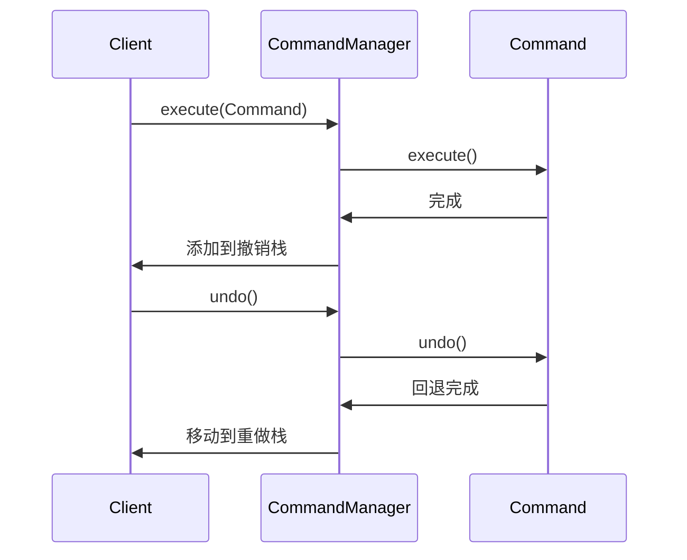

# 命令模式

想象你正在使用一个图片编辑软件。你可以点击「撤销」按钮，回到十步之前的状态；也可以点击「重做」，重新执行刚才的操作。更强大的是，你还可以把这些操作保存为一个「宏命令」，一键执行一系列操作。

这些功能的背后，就是命令模式。

## 问题背景：请求的封装

在软件开发中，很多场景需要对请求进行参数化、排队、日志记录、撤销/重做操作：

- **GUI 按钮**：点击按钮执行某个操作
- **数据库事务**：一组操作要么全部成功，要么全部回滚
- **任务队列**：将任务封装后提交给线程池执行
- **撤销/重做**：保存操作历史，支持回退和前进

如果用传统方式：

```java
public class Editor {
    public void cut() {
        // 剪切逻辑
    }

    public void copy() {
        // 复制逻辑
    }

    public void paste() {
        // 粘贴逻辑
    }

    public void delete() {
        // 删除逻辑
    }
}

public class Toolbar {
    private final Editor editor;

    public void onCutButtonClick() {
        editor.cut();  // 直接调用
    }

    public void onPasteButtonClick() {
        editor.paste();  // 直接调用
    }
}
```

问题：操作没有被记录，无法撤销/重做。

## 命令模式结构

命令模式（Command Pattern）将请求封装为对象，从而使你可以用不同的请求参数化客户、对请求进行排队、记录请求日志，以及支持撤销操作。



### 命令接口

```java
public interface Command {
    /**
     * 执行命令
     */
    void execute();

    /**
     * 撤销命令
     */
    void undo();

    /**
     * 命令名称（用于日志）
     */
    default String getName() {
        return this.getClass().getSimpleName();
    }
}
```

### 接收者

```java
public class TextEditor {
    private StringBuilder content = new StringBuilder();
    private String clipboard = "";

    public void write(String text) {
        content.append(text);
    }

    public void delete(int start, int end) {
        if (start >= 0 && end <= content.length() && start < end) {
            content.delete(start, end);
        }
    }

    public String getContent() {
        return content.toString();
    }

    public void setContent(String content) {
        this.content = new StringBuilder(content);
    }

    public void copy(int start, int end) {
        clipboard = content.substring(start, end);
    }

    public void paste() {
        content.append(clipboard);
    }
}
```

### 具体命令实现

```java
public class WriteCommand implements Command {
    private final TextEditor editor;
    private final String text;

    public WriteCommand(TextEditor editor, String text) {
        this.editor = editor;
        this.text = text;
    }

    @Override
    public void execute() {
        editor.write(text);
    }

    @Override
    public void undo() {
        int length = text.length();
        if (content().endsWith(text)) {
            editor.delete(content().length() - length, content().length());
        }
    }

    private String content() {
        return editor.getContent();
    }
}

public class DeleteCommand implements Command {
    private final TextEditor editor;
    private final int start;
    private final int end;
    private String deletedText;  // 用于撤销

    public DeleteCommand(TextEditor editor, int start, int end) {
        this.editor = editor;
        this.start = start;
        this.end = end;
    }

    @Override
    public void execute() {
        deletedText = editor.getContent().substring(start, end);
        editor.delete(start, end);
    }

    @Override
    public void undo() {
        // 将删除的内容插回去
        StringBuilder sb = new StringBuilder(editor.getContent());
        sb.insert(start, deletedText);
        editor.setContent(sb.toString());
    }
}

public class PasteCommand implements Command {
    private final TextEditor editor;
    private int pastePosition;

    public PasteCommand(TextEditor editor) {
        this.editor = editor;
    }

    @Override
    public void execute() {
        pastePosition = editor.getContent().length();
        editor.paste();
    }

    @Override
    public void undo() {
        editor.delete(pastePosition, editor.getContent().length());
    }
}
```

### 调用者

```java
public class CommandManager {
    private final Deque<Command> undoStack = new ArrayDeque<>();
    private final Deque<Command> redoStack = new ArrayDeque<>();

    public void execute(Command command) {
        command.execute();
        undoStack.push(command);
        redoStack.clear();  // 新命令清空重做栈
    }

    public void undo() {
        if (undoStack.isEmpty()) {
            return;
        }
        Command command = undoStack.pop();
        command.undo();
        redoStack.push(command);
    }

    public void redo() {
        if (redoStack.isEmpty()) {
            return;
        }
        Command command = redoStack.pop();
        command.execute();
        undoStack.push(command);
    }

    public boolean canUndo() {
        return !undoStack.isEmpty();
    }

    public boolean canRedo() {
        return !redoStack.isEmpty();
    }
}
```

### 客户端使用

```java
TextEditor editor = new TextEditor();
CommandManager manager = new CommandManager();

manager.execute(new WriteCommand(editor, "Hello "));
manager.execute(new WriteCommand(editor, "World"));
manager.execute(new DeleteCommand(editor, 5, 6));

System.out.println(editor.getContent());  // Helloorld

manager.undo();  // 撤销删除
System.out.println(editor.getContent());  // Hello World

manager.redo();  // 重做删除
System.out.println(editor.getContent());  // Helloorld
```

## 命令模式与撤销/重做

撤销/重做是命令模式最常见的应用场景。核心原理：



### 撤销栈和重做栈的设计

```java
public class CommandHistory {
    private final int maxSize;
    private final Deque<Command> undoStack;
    private final Deque<Command> redoStack;

    public CommandHistory(int maxSize) {
        this.maxSize = maxSize;
        this.undoStack = new ArrayDeque<>(maxSize);
        this.redoStack = new ArrayDeque<>(maxSize);
    }

    public void execute(Command command) {
        command.execute();
        undoStack.push(command);

        if (undoStack.size() > maxSize) {
            undoStack.removeLast();
        }

        redoStack.clear();
    }

    public void undo() {
        if (undoStack.isEmpty()) {
            throw new IllegalStateException("没有可撤销的命令");
        }
        Command command = undoStack.pop();
        command.undo();
        redoStack.push(command);
    }

    public void redo() {
        if (redoStack.isEmpty()) {
            throw new IllegalStateException("没有可重做的命令");
        }
        Command command = redoStack.pop();
        command.execute();
        undoStack.push(command);
    }
}
```

:::warning 撤销的边界情况

1. **状态不可逆**：某些命令（如发送邮件）无法真正撤销，需要业务补偿
2. **复合对象**：如果对象在撤销期间被修改，可能导致状态不一致
3. **撤销层级**：需要明确定义「撤销到哪个状态」

实际项目中，通常会限制撤销栈的大小（如最多 100 步），并定期持久化到磁盘。

:::

## 命令队列与宏命令

### 命令队列

将命令放入队列，异步执行：

```java
public class CommandQueue {
    private final BlockingQueue<Command> queue = new LinkedBlockingQueue<>();
    private final ExecutorService executor;

    public CommandQueue(int threadCount) {
        executor = Executors.newFixedThreadPool(threadCount);
        startProcessing();
    }

    private void startProcessing() {
        executor.submit(() -> {
            while (!Thread.currentThread().isInterrupted()) {
                try {
                    Command command = queue.take();
                    command.execute();
                } catch (InterruptedException e) {
                    Thread.currentThread().interrupt();
                    break;
                }
            }
        });
    }

    public void addCommand(Command command) {
        queue.offer(command);
    }
}
```

### 宏命令

将多个命令组合成一个命令：

```java
public class MacroCommand implements Command {
    private final List<Command> commands = new ArrayList<>();

    public void add(Command command) {
        commands.add(command);
    }

    public void remove(Command command) {
        commands.remove(command);
    }

    @Override
    public void execute() {
        for (Command command : commands) {
            command.execute();
        }
    }

    @Override
    public void undo() {
        // 逆序撤销
        ListIterator<Command> iterator = commands.listIterator(commands.size());
        while (iterator.hasPrevious()) {
            iterator.previous().undo();
        }
    }
}
```

使用示例：

```java
// 创建宏命令：打开文件、设置格式、插入内容
MacroCommand openAndFormat = new MacroCommand();
openAndFormat.add(new OpenCommand(editor, "document.txt"));
openAndFormat.add(new FormatCommand(editor, "bold"));
openAndFormat.add(new WriteCommand(editor, "Hello"));

// 一键执行所有操作
commandManager.execute(openAndFormat);
```

## Java Runnable：命令模式的天然实现

Java 的 `Runnable` 接口本质上就是命令模式：

```java
public interface Runnable {
    void run();
}
```

```java
// 命令模式的使用
public class TaskCommand implements Command {
    private final Runnable task;

    public TaskCommand(Runnable task) {
        this.task = task;
    }

    @Override
    public void execute() {
        task.run();
    }

    @Override
    public void undo() {
        // Runnable 没有 undo，通常需要自定义接口
    }
}

// 线程池执行命令
ExecutorService executor = Executors.newFixedThreadPool(4);
executor.execute(new TaskCommand(() -> System.out.println("任务执行")));
```

Java 5 引入的 `Callable` 和 `Future` 是对命令模式的扩展，支持返回值和异常处理：

```java
public interface Callable<V> {
    V call() throws Exception;
}

Future<String> future = executor.submit(() -> {
    // 这是命令，submit 将其封装为 FutureTask
    return "result";
});
String result = future.get();  // 获取命令执行结果
```

## Spring 中的命令模式

### ProcessEngine

Activity（BPMN 引擎）使用命令模式封装流程操作：

```java
// Activity 的命令模式
public interface Command<T> {
    T execute(CommandContext context);
}

public class CommandContext {
    // 命令执行上下文
}

// 命令执行器
public class CommandExecutor {
    public <T> T execute(Command<T> command) {
        return command.execute(this.context);
    }
}

// 具体命令
public class DeploymentCommand implements Command<Deployment> {
    @Override
    public Deployment execute(CommandContext context) {
        // 部署流程定义
        return null;
    }
}

// 使用
ProcessEngine engine = ProcessEngineConfiguration
    .createStandaloneProcessEngineConfiguration()
    .buildProcessEngine();

Deployment deployment = engine.getRuntimeService()
    .createDeployment()
    .name("my-process")
    .addClasspathResource("process.bpmn")
    .deploy();
```

### Spring JDBC 的命令模式

Spring 的 `JdbcTemplate` 也体现了命令模式的思想：

```java
jdbcTemplate.execute((ConnectionCallback<T>) connection -> {
    // 这是一个命令
    PreparedStatement ps = connection.prepareStatement(sql);
    return ps;
});
```

## 命令模式的优缺点

### 优点

1. **单一职责**：发起者和执行者解耦
2. **开闭原则**：新增命令不需要修改现有代码
3. **支持撤销/重做**：命令可以保存状态
4. **支持日志记录**：可以记录命令执行历史
5. **支持排队执行**：命令可以异步执行
6. **支持宏命令**：命令可以组合

### 缺点

1. **类数量增加**：每个操作都需要一个命令类
2. **命令类可能膨胀**：复杂操作的命令类可能很大
3. **客户端需要理解命令**：需要知道有哪些命令可用

:::warning 命令模式的适用场景

命令模式最适合以下场景：

1. 需要支持撤销/重做
2. 需要记录操作日志
3. 需要异步执行任务
4. 需要事务性操作

如果只是简单的调用，不建议使用命令模式。

:::

## 思考题

**问题 1**：如何实现跨应用的撤销/重做（如用户的操作历史保存在服务器端）？

<details>
<summary>参考答案</summary>

需要将命令持久化到数据库：

```java
@Entity
public class CommandLog {
    @Id
    @GeneratedValue
    private Long id;
    private String userId;
    private String commandType;  // 命令类型
    private String commandData; // 序列化的命令参数
    private LocalDateTime executeTime;
    private boolean undone;      // 是否已撤销
}

// 持久化命令
public class PersistedCommandManager {
    @Autowired
    private CommandLogRepository repository;

    public void execute(Command command) {
        command.execute();
        saveCommandLog(command, false);
    }

    public void undo(Long userId) {
        // 查询最近未撤销的命令
        CommandLog log = repository.findTopByUserIdAndUndoneFalseOrderByIdDesc(userId);
        Command command = deserialize(log);
        command.undo();
        log.setUndone(true);
        repository.save(log);
    }

    private void saveCommandLog(Command command, boolean undone) {
        CommandLog log = new CommandLog();
        log.setCommandType(command.getClass().getName());
        log.setCommandData(serialize(command));
        log.setUndone(undone);
        repository.save(log);
    }
}
```

</details>

**问题 2**：命令模式和策略模式都能封装算法，它们有什么区别？

<details>
<summary>参考答案</summary>

| 维度 | 命令模式 | 策略模式 |
| --- | --- | --- |
| 目的 | 封装请求，支持撤销/重做 | 封装算法，可互换 |
| 生命周期 | 命令执行后可以保存 | 策略通常短期存在 |
| 状态 | 命令可能持有 Receiver 状态 | 策略通常无状态 |
| 组合 | 支持宏命令组合 | 策略独立 |
| undo | 支持 | 不支持 |

命令模式关注「请求」的生命周期，策略模式关注「算法」的选择。

</details>

**问题 3**：如何实现命令的并行执行？

<details>
<summary>参考答案</summary>

```java
public class ParallelCommand implements Command {
    private final List<Command> commands;

    public ParallelCommand(Command... commands) {
        this.commands = Arrays.asList(commands);
    }

    @Override
    public void execute() {
        ExecutorService executor = Executors.newFixedThreadPool(
            Math.min(commands.size(), 4)
        );
        try {
            executor.invokeAll(commands);
        } catch (InterruptedException e) {
            Thread.currentThread().interrupt();
        } finally {
            executor.shutdown();
        }
    }

    @Override
    public void undo() {
        // 逆序并行撤销
        ExecutorService executor = Executors.newFixedThreadPool(
            Math.min(commands.size(), 4)
        );
        try {
            List<Command> reversed = new ArrayList<>(commands);
            Collections.reverse(reversed);
            executor.invokeAll(reversed);
        } catch (InterruptedException e) {
            Thread.currentThread().interrupt();
        } finally {
            executor.shutdown();
        }
    }
}
```

使用 `invokeAll` 确保所有命令完成，返回 `Future` 列表可以获取每个命令的执行结果。

</details>
