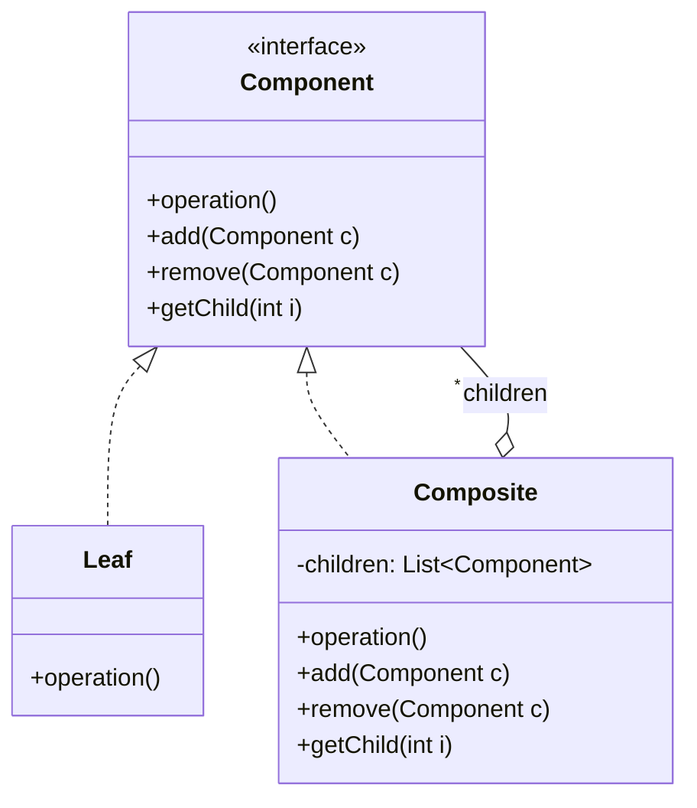

# 组合模式

你在开发一个文件管理系统。用户可以在目录中创建子目录，子目录中又可以创建文件和更深的子目录。这是一个典型的树形结构。

现在需要实现「计算目录大小」的功能：

```java
// 简单方案：针对文件或目录分别处理
public class FileSystem {
    public long calculateSize(Object node) {
        if (node instanceof File) {
            return ((File) node).getSize();
        } else if (node instanceof Directory) {
            Directory dir = (Directory) node;
            long size = 0;
            for (Object child : dir.getChildren()) {
                size += calculateSize(child);  // 递归调用
            }
            return size;
        }
        return 0;
    }
}
```

这段代码能工作，但存在严重问题：**调用方必须知道节点是文件还是目录**，需要用 `instanceof` 判断，然后分别处理。如果树形结构更复杂，或者需要添加新操作（如「复制」「删除」「搜索」），每个操作都要重复这个判断逻辑。

组合模式解决的是：**如何让调用方以统一的方式处理单个对象和组合对象**，而不需要知道它们的具体类型。

## 组合模式的核心思想

组合模式（Composite Pattern）将对象组合成树形结构以表示「部分-整体」的层次关系。组合模式让客户端对单个对象和组合对象的使用具有一致性。



组合模式的核心是：**让枝节点（Composite）和叶节点（Leaf）实现同一个接口**，客户端可以统一地对待它们。

## 透明组合模式 vs 安全组合模式

组合模式有两种实现方式，区别在于接口的设计：

### 透明组合模式

在 Component 接口中声明所有管理子节点的方法（`add`、`remove`、`getChild`），Leaf 也必须实现这些方法（但通常为空实现或抛异常）。

```mermaid
flowchart TB
    subgraph 透明模式["透明组合模式"]
        IC1[Component\n包含 add/remove/getChild]
        L1[Leaf\nadd/remove 抛异常]
        C1[Composite\n完整实现]
        IC1 <|.. L1
        IC1 <|.. C1
    end
```

### 安全组合模式

只在 Component 接口中声明业务操作，管理工作子节点的方法放在 Composite 中，不在接口中暴露。

```mermaid
flowchart TB
    subgraph 安全模式["安全组合模式"]
        IC2[Component\n只有业务操作]
        L2[Leaf\n只有业务操作]
        C2[Composite\n额外 add/remove/getChild]
        IC2 <|.. L2
        IC2 <|.. C2
    end
```

| 维度 | 透明组合模式 | 安全组合模式 |
| --- | --- | --- |
| **接口一致性** | 所有节点接口相同 | Composite 接口更丰富 |
| **安全性** | Leaf 的 add/remove 可能被误用 | Leaf 不暴露管理方法 |
| **透明性** | 客户端无需判断节点类型 | 客户端需要判断类型 |
| **Java 集合** | 类似 `List` 的抽象 | 类似 `Map` 的抽象 |

Java 的集合框架采用了安全组合模式：`List` 接口有 `add`、`remove`，但 `Collections.unmodifiableList()` 返回的视图对象会抛 `UnsupportedOperationException`。

## 组合模式的实现

### 文件系统示例

```java
// 组件接口
public abstract class FileSystemNode {
    protected String path;

    public FileSystemNode(String path) {
        this.path = path;
    }

    // 统一的操作接口
    public abstract long getSize();
    public abstract void print(String prefix);

    // 子节点管理（透明模式）
    public void add(FileSystemNode node) {
        throw new UnsupportedOperationException();
    }

    public void remove(FileSystemNode node) {
        throw new UnsupportedOperationException();
    }
}

// 叶节点：文件
public class File extends FileSystemNode {
    private long size;

    public File(String path, long size) {
        super(path);
        this.size = size;
    }

    @Override
    public long getSize() {
        return size;
    }

    @Override
    public void print(String prefix) {
        System.out.println(prefix + path + " (" + size + " bytes)");
    }
}

// 枝节点：目录
public class Directory extends FileSystemNode {
    private final List<FileSystemNode> children = new ArrayList<>();

    public Directory(String path) {
        super(path);
    }

    @Override
    public long getSize() {
        return children.stream().mapToLong(FileSystemNode::getSize).sum();
    }

    @Override
    public void print(String prefix) {
        System.out.println(prefix + path + "/");
        for (FileSystemNode child : children) {
            child.print(prefix + "  ");
        }
    }

    @Override
    public void add(FileSystemNode node) {
        children.add(node);
    }

    @Override
    public void remove(FileSystemNode node) {
        children.remove(node);
    }
}
```

使用示例：

```java
public class CompositeDemo {
    public static void main(String[] args) {
        // 构建树形结构
        Directory root = new Directory("/home/user");

        Directory docs = new Directory("/home/user/docs");
        docs.add(new File("/home/user/docs/resume.pdf", 1024 * 50));
        docs.add(new File("/home/user/docs/report.docx", 1024 * 200));

        Directory pictures = new Directory("/home/user/pictures");
        pictures.add(new File("/home/user/pictures/vacation.jpg", 1024 * 3000));
        pictures.add(new File("/home/user/pictures/avatar.png", 1024 * 50));

        root.add(docs);
        root.add(pictures);
        root.add(new File("/home/user/readme.txt", 1024 * 5));

        // 统一调用，无需判断类型
        System.out.println("总大小: " + root.getSize() + " bytes");
        root.print("");
    }
}
```

输出：

```
总大小: 3637329 bytes
/home/user/
  /home/user/docs/
    /home/user/docs/resume.pdf (51200 bytes)
    /home/user/docs/report.docx (204800 bytes)
  /home/user/pictures/
    /home/user/pictures/vacation.jpg (3072000 bytes)
    /home/user/pictures/avatar.png (51200 bytes)
  /home/user/readme.txt (5120 bytes)
```

### 组织架构示例

```java
// 员工组件
public abstract class Employee {
    protected String name;
    protected double salary;

    public Employee(String name, double salary) {
        this.name = name;
        this.salary = salary;
    }

    public abstract void printHierarchy(int level);
    public abstract double getTotalSalary();
    public abstract int getHeadcount();
}

// 叶节点：普通员工
public class IndividualEmployee extends Employee {
    public IndividualEmployee(String name, double salary) {
        super(name, salary);
    }

    @Override
    public void printHierarchy(int level) {
        System.out.println("  ".repeat(level) + "- " + name + " (¥" + salary + ")");
    }

    @Override
    public double getTotalSalary() {
        return salary;
    }

    @Override
    public int getHeadcount() {
        return 1;
    }
}

// 枝节点：部门主管
public class Department extends Employee {
    private final List<Employee> members = new ArrayList<>();

    public Department(String name, double salary) {
        super(name, salary);
    }

    public void addMember(Employee employee) {
        members.add(employee);
    }

    public void removeMember(Employee employee) {
        members.remove(employee);
    }

    @Override
    public void printHierarchy(int level) {
        System.out.println("  ".repeat(level) + "+ " + name + " (¥" + salary + ")");
        for (Employee member : members) {
            member.printHierarchy(level + 1);
        }
    }

    @Override
    public double getTotalSalary() {
        return salary + members.stream().mapToDouble(Employee::getTotalSalary).sum();
    }

    @Override
    public int getHeadcount() {
        return 1 + members.stream().mapToInt(Employee::getHeadcount).sum();
    }
}
```

使用示例：

```java
public class OrgDemo {
    public static void main(String[] args) {
        Department ceo = new Department("CEO", 200000);

        Department eng = new Department("Engineering VP", 150000);
        eng.addMember(new IndividualEmployee("Backend Lead", 80000));
        eng.addMember(new IndividualEmployee("Frontend Lead", 80000));
        eng.addMember(new IndividualEmployee("QA Lead", 70000));

        Department sales = new Department("Sales VP", 120000);
        sales.addMember(new IndividualEmployee("Sales Rep 1", 50000));
        sales.addMember(new IndividualEmployee("Sales Rep 2", 50000));

        ceo.addMember(eng);
        ceo.addMember(sales);

        System.out.println("=== 组织架构 ===");
        ceo.printHierarchy(0);

        System.out.println("\n总人力成本: ¥" + ceo.getTotalSalary() + "/月");
        System.out.println("总人数: " + ceo.getHeadcount() + " 人");
    }
}
```

## 组合模式在 JDK 中的应用

### HashMap 的内部节点

`HashMap` 的内部类 `Node` 实现了组合模式的思想：

```java
// HashMap 内部结构
public class HashMap<K, V> extends AbstractMap<K, V> {
    transient Node<K, V>[] table;

    static class Node<K, V> implements Map.Entry<K, V> {
        final int hash;
        final K key;
        V value;
        Node<K, V> next;  // 指向下一个节点（链表/树）
    }

    // 红黑树节点（JDK 8+）
    static final class TreeNode<K, V> extends LinkedHashMap.Entry<K, V> {
        TreeNode<K, V> parent;
        TreeNode<K, V> left;
        TreeNode<K, V> right;
        TreeNode<K, V> prev;
        // ...
    }
}
```

虽然 `HashMap` 不是严格的树形组合模式，但它的桶中既有链表节点又有红黑树节点，通过 `TreeNode` 继承 `LinkedHashMap.Entry`，实现了多形态节点的共存。

### ConcurrentHashMap 的内部结构

`ConcurrentHashMap` 的 `Node` 也有类似结构，支持链表和红黑树两种实现：

```java
static class Node<K, V> implements Map.Entry<K, V> {
    final int hash;
    final K key;
    volatile V val;
    volatile Node<K, V> next;  // 链表下一节点
}
```

## 组合模式的适用场景

### 适用场景

- 需要表示对象的「部分-整体」层次结构
- 希望客户端统一处理单个对象和组合对象
- 树形结构的处理（文件系统、GUI 组件、组织架构）
- 需要递归操作的对象集合

### 不适用场景

- 对象之间没有明显的层次关系
- 组合结构不固定，需要频繁增删枝节点
- 叶节点和枝节点行为差异太大，难以统一接口

:::warning 组合模式的性能考量

组合模式通常涉及递归遍历，当树形结构很深时，需要注意：

1. **递归深度**：过深的递归可能导致栈溢出
2. **遍历效率**：频繁的递归遍历可能影响性能
3. **缓存**：对于不常变化的组合结构，可以缓存计算结果

如果性能是关键考量，考虑使用**迭代器模式**替代递归遍历。

:::

## 思考题

**问题 1**：透明组合模式中，Leaf 节点的 `add` 和 `remove` 方法应该怎么处理？

<details>
<summary>参考答案</summary>

有三种常见处理方式：

**方式 1：抛异常**
```java
public class File extends FileSystemNode {
    @Override
    public void add(FileSystemNode node) {
        throw new UnsupportedOperationException("文件不能添加子节点");
    }
}
```
优点：明确告诉调用者这是不支持的操作
缺点：运行时才发现错误

**方式 2：静默忽略**
```java
public class File extends FileSystemNode {
    @Override
    public void add(FileSystemNode node) {
        // 什么都不做
    }
}
```
优点：不会因为误操作导致程序崩溃
缺点：调用者可能不知道操作没有生效

**方式 3：返回 false 或 this**
```java
public class File extends FileSystemNode {
    @Override
    public boolean add(FileSystemNode node) {
        return false;  // 或者 return this
    }
}
```
优点：调用者可以通过返回值判断是否成功
缺点：需要修改接口签名

**推荐**：如果追求类型安全，在设计阶段就用**安全组合模式**，不在 Component 中声明这些方法。

</details>

**问题 2**：组合模式如何处理循环引用？例如，目录 A 包含目录 B，目录 B 又包含目录 A。

<details>
<summary>参考答案</summary>

循环引用会导致无限递归，是组合模式的常见陷阱。处理方式：

**方式 1：禁止循环**
在 `add` 方法中检测：
```java
public void add(FileSystemNode node) {
    if (node.contains(this)) {  // 检测是否已经是祖先节点
        throw new IllegalArgumentException("禁止创建循环引用");
    }
    children.add(node);
}
```

**方式 2：使用标识追踪**
```java
public void print(String prefix) {
    Set<FileSystemNode> visited = new HashSet<>();
    printWithVisited(prefix, visited);
}

private void printWithVisited(String prefix, Set<FileSystemNode> visited) {
    if (visited.contains(this)) {
        System.out.println(prefix + "[已访问]");
        return;
    }
    visited.add(this);
    // 执行打印...
}
```

**方式 3：在应用层面限制**
文件系统通常通过**路径规范**来避免循环，如 Unix 的软硬链接需要特殊处理。

</details>

**问题 3**：在微服务架构中，如何应用组合模式？

<details>
<summary>参考答案</summary>

微服务中可以使用组合模式处理**聚合查询**和**服务编排**：

**场景：订单详情查询**

订单服务需要聚合用户信息、商品信息、物流信息。如果不用组合模式：

```java
// 直接调用各个服务
OrderDTO order = orderService.getOrder(id);
UserDTO user = userService.getUser(order.getUserId());
ProductDTO product = productService.getProduct(order.getProductId());
// 组装结果
```

使用组合模式（聚合服务）：

```java
public class OrderAggregateService {
    private final UserService userService;
    private final ProductService productService;

    public OrderDetail getOrderDetail(Long orderId) {
        // 并行调用
        CompletableFuture<Order> orderFuture = CompletableFuture
            .supplyAsync(() -> orderService.getOrder(orderId));
        CompletableFuture<User> userFuture = orderFuture
            .thenCompose(order -> CompletableFuture
                .supplyAsync(() -> userService.getUser(order.getUserId())));
        CompletableFuture<Product> productFuture = orderFuture
            .thenCompose(order -> CompletableFuture
                .supplyAsync(() -> productService.getProduct(order.getProductId())));

        // 等待所有结果
        Order order = orderFuture.join();
        User user = userFuture.join();
        Product product = productFuture.join();

        return new OrderDetail(order, user, product);
    }
}
```

组合模式在这里的体现：**聚合服务**（Composite）组合了多个**原子服务**（Leaf），对外提供统一的 `getOrderDetail` 接口。

</details>
