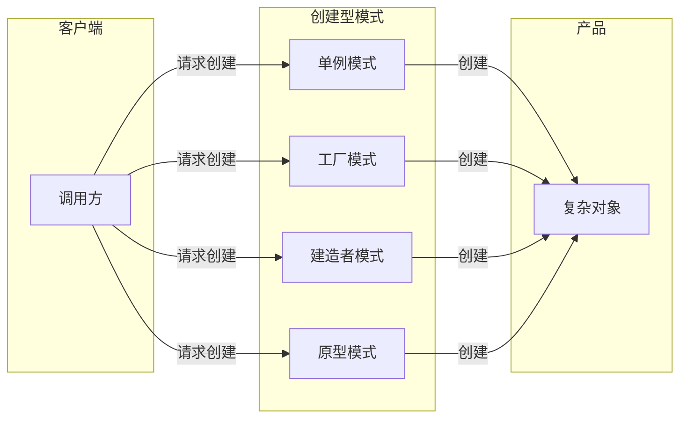
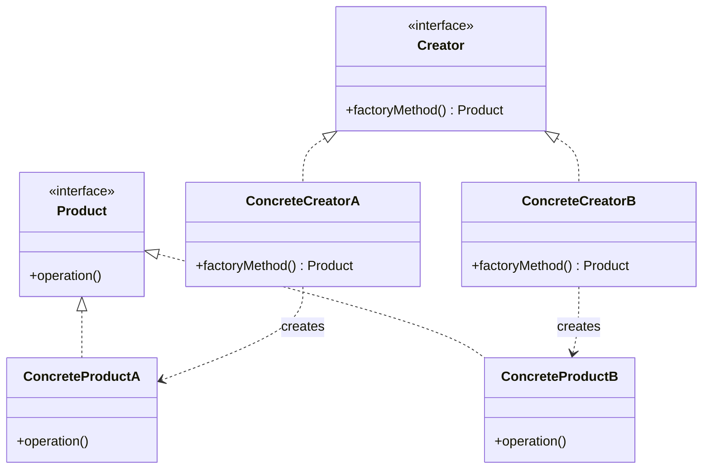
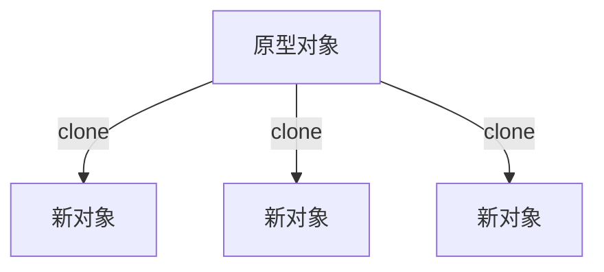
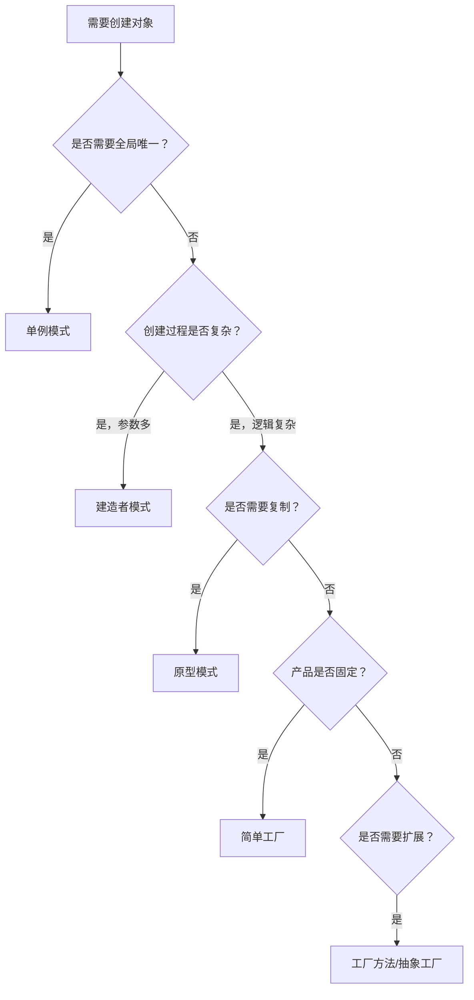

# 创建型模式总览

凌晨 2 点，你接手了一个新项目，需要创建一个数据库连接池对象。这个对象的构造函数有 7 个参数，每个参数都有默认值，你翻了半天才找到正确的配置方式。类似的场景在日常开发中并不少见——`ThreadPoolExecutor` 需要 6 个参数、`HttpClient` 需要一堆配置项、`OkHttpClient` 的 Builder 配置项超过 20 个。

这类问题的本质是：**对象的创建过程太复杂，导致调用方必须了解大量的实现细节**。创建型模式就是为了解决这个问题而产生的。

## 创建型模式的核心价值

创建型模式（Creational Patterns）关注的是「如何创建对象」，它解决的不是"创建什么"的问题，而是"谁来创建"和"怎么创建"的问题。通过将对象创建过程封装起来，创建型模式实现了三个核心目标：

1. **封装创建细节**：调用方不需要知道对象是如何被创建和组装的
2. **统一创建入口**：所有对象都通过相同的入口创建，便于管理和替换
3. **抽象依赖关系**：调用方依赖于抽象接口，而不是具体实现类



## 五种创建型模式概览

### 单例模式（Singleton）

确保一个类只有一个实例，并提供一个全局访问点。单例模式解决的是"全局唯一性"问题，比如配置管理器、连接池、线程池等。

典型使用场景：
- 数据库连接池（整个应用只需要一个实例）
- 日志记录器（所有模块共用一个日志实例）
- 配置中心客户端（全局配置统一管理）

### 工厂模式（Factory）

工厂模式是一族模式的统称，包括简单工厂、工厂方法和抽象工厂。它们的共同特点是：**定义一个创建对象的接口，让子类决定实例化哪个类**。



适用场景：
- 对象创建逻辑可能变化
- 需要解耦对象创建者和使用者
- 需要根据配置或环境创建不同类型的对象

### 建造者模式（Builder）

当一个对象构造过程复杂、参数众多时，建造者模式通过链式调用逐步构建对象，避免了构造函数参数列表过长的问题。

```java
// 不使用建造者
User user = new User("zhangsan", "zhangsan@example.com", "13800000000",
    "北京市", "朝阳区", "某大厦", "123456", true, 1, new Date());

// 使用建造者
User user = User.builder()
    .name("zhangsan")
    .email("zhangsan@example.com")
    .phone("13800000000")
    .address("北京市朝阳区某大厦")
    .zipCode("123456")
    .vip(true)
    .level(1)
    .build();
```

适用场景：
- 对象有多个可选参数
- 需要创建不同表示的同一类产品
- 需要构建不可变对象

### 原型模式（Prototype）

通过复制现有对象（原型）来创建新对象，而不是通过构造函数。当创建成本较高时，原型模式可以显著提升性能。



适用场景：
- 创建成本高（如数据库查询、远程调用）
- 对象结构复杂但差异化小
- 需要避免使用构造函数创建对象

## 创建型模式对比

| 模式 | 核心目标 | 线程安全 | 延迟加载 | 适用场景 |
|------|---------|---------|---------|---------|
| 单例模式 | 全局唯一实例 | 可选 | 可选 | 全局共享资源 |
| 简单工厂 | 统一创建入口 | 否 | 否 | 产品种类少且稳定 |
| 工厂方法 | 子类决定创建 | 可选 | 可选 | 产品种类扩展 |
| 抽象工厂 | 产品族创建 | 可选 | 可选 | 多个产品线 |
| 建造者模式 | 复杂对象构建 | 可选 | 可选 | 多参数、不可变对象 |
| 原型模式 | 对象复制 | 否 | 否 | 高成本对象创建 |

## 选择决策树



## 模式之间的组合使用

在实际项目中，创建型模式很少单独使用。它们往往组合出现：

**工厂 + 建造者**：工厂负责决定创建什么类型的对象，建造者负责构建这个对象的细节。

**单例 + 工厂**：工厂本身可以是单例，确保全局只有一个工厂实例。

**原型 + 工厂**：原型管理器结合工厂，原型作为创建新对象的模板。

## 思考题

**问题 1**：为什么说单例模式是「假并发安全」？

<details>
<summary>参考答案</summary>

单例模式的线程安全实现是有前提条件的。以双重检查锁为例，如果实例变量没有加 `volatile`，在某些 JVM 实现下可能发生「指令重排序」问题：其他线程可能看到一个部分构造的对象。但这种「假并发安全」实际上很少触发，因为：

1. 现代 JDK 的对象分配已经非常快，构造函数执行时间很短
2. `volatile` 的语义在 Java 5 之后才完全明确

所以现在的建议是：如果要写单例，要么用「静态内部类」方式，要么用「枚举」方式，都不需要额外加 `volatile`。这两种方式由 JVM 的类加载机制保证线程安全。

</details>

**问题 2**：建造者模式和工厂模式都能创建对象，什么时候用建造者而不是工厂？

<details>
<summary>参考答案</summary>

核心区别在于「构建过程」是否复杂：

- **工厂模式**：关注的是「创建什么类型的产品」，不关心产品内部如何组装
- **建造者模式**：关注的是「如何一步步构建产品」，强调构建步骤和参数配置

简单判断：如果创建对象只需要一行代码 `new Xxx()` 或 `factory.create()`，用工厂；如果需要配置大量参数、设置多个可选值，用建造者。

一个典型的反例：用建造者模式创建一个只有 2-3 个必需参数的简单对象，这是过度设计。

</details>

**问题 3**：原型模式中的「深拷贝」和「浅拷贝」有什么区别？各自有什么代价？

<details>
<summary>参考答案</summary>

**浅拷贝**：只复制对象的引用，不复制引用指向的实际对象。

```java
class Order {
    private List<Item> items; // 引用类型
}

Order copy = original.clone();
// copy.items 和 original.items 指向同一个 List
```

**深拷贝**：递归复制所有引用类型，直到基本类型。

```java
Order copy = original.clone();
copy.setItems(new ArrayList<>(original.getItems()));
// copy.items 是全新的 List
```

**代价对比**：

| 维度 | 浅拷贝 | 深拷贝 |
|------|-------|-------|
| 实现复杂度 | 简单 | 复杂（需要递归或序列化） |
| 性能 | 快（只复制引用） | 慢（需要递归复制所有对象） |
| 内存 | 共享引用，节省内存 | 独立副本，占用更多内存 |
| 副作用 | 修改会互相影响 | 完全独立，无副作用 |

</details>
