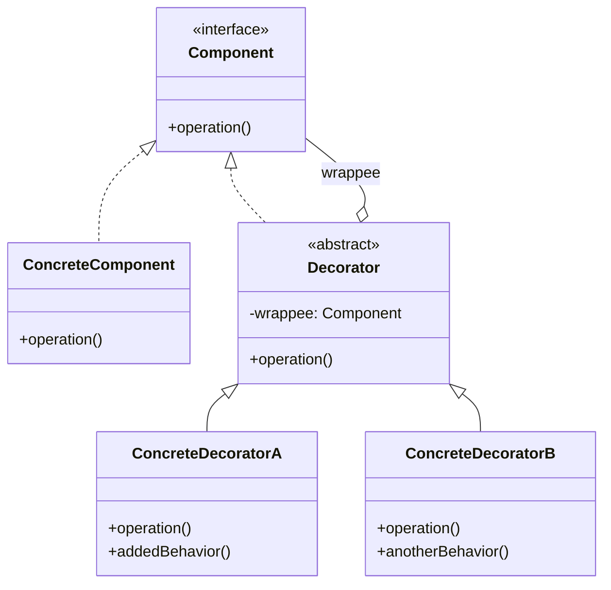

# 装饰器模式

打开一个文本文件读取内容，你可能会这样写：

```java
FileInputStream fis = new FileInputStream("data.txt");
byte[] buffer = new byte[1024];
while (fis.read(buffer) != -1) {
    // 处理数据
}
```

但如果文件很大，直接从磁盘读取会很慢。Java 提供了缓冲功能：

```java
BufferedInputStream bis = new BufferedInputStream(new FileInputStream("data.txt"));
```

`BufferedInputStream` 并没有继承 `FileInputStream`，它只是「包装」了 `FileInputStream`，然后在内部添加了缓冲逻辑。这就是装饰器模式的经典应用。

你可能会问：为什么不直接让 `FileInputStream` 支持缓冲？答案很简单：**不是所有读取都需要缓冲**。有些人只需要一次性读取小文件，有些人需要逐字节读取设备数据。装饰器模式让你可以按需组合功能，而不是把所有功能堆在一个类里。

## 装饰器模式的核心思想

装饰器模式（Decorator Pattern）动态地给对象添加额外职责，比继承更灵活。它将每个装饰功能封装在独立的装饰器类中，通过组合而非继承的方式，为对象叠加行为。



装饰器与被装饰对象实现同一个接口，客户端完全不知道使用的是装饰后的对象。装饰器在调用被装饰对象方法的同时，可以添加自己的逻辑，或者改变返回值。

## 装饰器模式 vs 继承

很多人第一反应是用继承解决这个问题：

```java
// 继承方案：BufferedFileInputStream
public class BufferedFileInputStream extends FileInputStream {
    private byte[] buffer;
    // ... 缓冲逻辑
}
```

这种方案的缺陷：

1. **类爆炸**：如果既要缓冲又要压缩，既要加密又要日志，就需要 `BufferedCompressedEncryptedFileInputStream` 这样的类
2. **继承层次固定**：如果 `FileInputStream` 增加了新方法，子类无法自动获得
3. **无法运行时组合**：编译时决定了功能，无法在运行时动态增减

装饰器模式通过**组合**解决这些问题：

```java
// 装饰器可以无限叠加
InputStream in = new GzipInputStream(           // 第5层：解压
                  new BufferedInputStream(       // 第4层：缓冲
                    new CipherInputStream(       // 第3层：解密
                      new ChecksumInputStream(    // 第2层：校验
                        new FileInputStream("data.txt") // 第1层：文件
                      )
                    )
                  )
                );
```

## Java I/O 中的装饰器模式

Java I/O 库是装饰器模式最经典的应用。整个 `InputStream`/`OutputStream` 家族都遵循这一模式：

```mermaid
flowchart TB
    subgraph InputStream家族
        IS[InputStream\n抽象组件]
        FIS[FileInputStream\n具体组件]
        BIS[BufferedInputStream\n缓冲装饰器]
        FIS2[FilterInputStream\n装饰器基类]
        CIS[CipherInputStream\n加密装饰器]
        GIS[GZIPInputStream\n压缩装饰器]
        OIS[ObjectInputStream\n对象装饰器]
    end

    IS <|.. FIS
    IS <|.. FIS2
    FIS2 <|-- BIS
    FIS2 <|-- CIS
    FIS2 <|-- GIS
    FIS2 <|-- OIS
```

`FilterInputStream` 是所有装饰器的基类，它持有被装饰对象的引用：

```java
public class FilterInputStream extends InputStream {
    // 被装饰的输入流
    protected volatile InputStream in;

    protected FilterInputStream(InputStream in) {
        this.in = in;
    }

    @Override
    public int read() throws IOException {
        return in.read();
    }

    @Override
    public int read(byte[] b, int off, int len) throws IOException {
        return in.read(b, off, len);
    }
    // ... 其他方法都是透传
}
```

`BufferedInputStream` 在 `FilterInputStream` 的基础上添加了缓冲逻辑：

```java
public class BufferedInputStream extends FilterInputStream {
    private byte[] buffer;
    private int pos;      // 当前位置
    private int count;    // 缓冲区中有效字节数

    public BufferedInputStream(InputStream in) {
        this(in, DEFAULT_BUFFER_SIZE);
    }

    public BufferedInputStream(InputStream in, int size) {
        super(in);
        buffer = new byte[size];
    }

    @Override
    public synchronized int read() throws IOException {
        // 先从缓冲区获取
        if (pos >= count) {
            fill();  // 缓冲区空了，从底层流填充
            if (pos >= count) {
                return -1;
            }
        }
        return buffer[pos++] & 0xff;
    }

    private void fill() throws IOException {
        byte[] newBuffer = new byte[buffer.length];
        int len = in.read(newBuffer);  // 一次读取一大块
        if (len > 0) {
            buffer = newBuffer;
            pos = 0;
            count = len;
        }
    }
}
```

`BufferedInputStream` 的设计精髓在于：**把多次小读（每次读 1 个字节）变成一次大读（每次读 8192 字节）**。这样减少了系统调用次数，显著提升读取性能。

## 装饰器模式的实现

让我们用完整的代码实现一个数据源装饰器系统：

```java
// 组件接口
public interface DataSource {
    void write(String data);
    String read();
}

// 具体组件
public class FileDataSource implements DataSource {
    private String filename;
    private StringBuilder content = new StringBuilder();

    public FileDataSource(String filename) {
        this.filename = filename;
    }

    @Override
    public void write(String data) {
        content.append(data).append("\n");
        // 实际项目中会写入文件
        System.out.println("写入文件: " + filename);
    }

    @Override
    public String read() {
        System.out.println("读取文件: " + filename);
        return content.toString();
    }
}

// 装饰器基类
public class DataSourceDecorator implements DataSource {
    protected DataSource wrappee;  // 被装饰的对象

    public DataSourceDecorator(DataSource wrappee) {
        this.wrappee = wrappee;
    }

    @Override
    public void write(String data) {
        wrappee.write(data);  // 默认：透传给被装饰对象
    }

    @Override
    public String read() {
        return wrappee.read();
    }
}

// 具体装饰器：数据加密
public class EncryptionDecorator extends DataSourceDecorator {
    public EncryptionDecorator(DataSource wrappee) {
        super(wrappee);
    }

    @Override
    public void write(String data) {
        String encrypted = encrypt(data);
        super.write(encrypted);
    }

    @Override
    public String read() {
        String data = super.read();
        return decrypt(data);
    }

    private String encrypt(String data) {
        System.out.println("[加密] 处理数据");
        return Base64.getEncoder().encodeToString(data.getBytes());
    }

    private String decrypt(String data) {
        System.out.println("[解密] 处理数据");
        return new String(Base64.getDecoder().decode(data));
    }
}

// 具体装饰器：数据压缩
public class CompressionDecorator extends DataSourceDecorator {
    public CompressionDecorator(DataSource wrappee) {
        super(wrappee);
    }

    @Override
    public void write(String data) {
        String compressed = compress(data);
        super.write(compressed);
    }

    @Override
    public String read() {
        String data = super.read();
        return decompress(data);
    }

    private String compress(String data) {
        System.out.println("[压缩] 处理数据");
        return "[压缩]" + data;
    }

    private String decompress(String data) {
        System.out.println("[解压] 处理数据");
        return data.replace("[压缩]", "");
    }
}
```

使用示例：

```java
public class DecoratorDemo {
    public static void main(String[] args) {
        // 最基础的文件数据源
        DataSource source = new FileDataSource("report.txt");

        // 加一层加密
        DataSource encrypted = new EncryptionDecorator(source);

        // 再加一层压缩
        DataSource compressed = new CompressionDecorator(encrypted);

        // 写入时：压缩 -> 加密 -> 写入文件
        compressed.write("Hello World");

        // 读取时：读文件 -> 解密 -> 解压
        String data = compressed.read();
        System.out.println("读取结果: " + data);
    }
}
```

输出：

```
[压缩] 处理数据
[加密] 处理数据
写入文件: report.txt
读取文件: report.txt
[解密] 处理数据
[解压] 处理数据
读取结果: Hello World
```

## 装饰器模式 vs 代理模式

装饰器和代理的结构几乎一样——都是持有一个被代理/被装饰的对象，在调用前后执行额外逻辑。但两者的**意图**不同：

| 维度 | 装饰器模式 | 代理模式 |
| --- | --- | --- |
| **核心意图** | 为对象**动态添加功能**，功能可以叠加组合 | **控制对对象的访问**，客户端可能不知道真实对象存在 |
| **关注点** | 功能的**扩展与叠加** | 访问的**控制与增强** |
| **组合方式** | 装饰器可以嵌套任意多层 | 通常单一代理 |
| **客户端感知** | 客户端知道被装饰了 | 客户端以为调用的是真实对象 |
| **典型场景** | I/O 流、Java I/O 类库 | AOP 事务、性能监控、访问控制 |

:::tip 一句话区分

装饰器模式：**我需要给这个对象加个功能**
代理模式：**我不想让客户端直接访问这个对象**

:::

## 装饰器模式的适用场景

### 适用场景

- 需要动态给对象添加职责，且这些职责可以被撤销
- 需要扩展类的功能，但不能通过继承实现
- 需要扩展功能，但希望保持接口不变
- 功能的组合场景（如 I/O 流的各种组合）

### 不适用场景

- 被装饰的类没有公开的组件接口
- 类之间的关系已经非常复杂，添加装饰器会让系统更难理解
- 只有一到两个简单扩展，直接继承或直接修改可能更清晰

:::danger 装饰器地狱

装饰器虽好，但嵌套太多层会变成「装饰器地狱」：

```java
DataSource ds = new CompressionDecorator(
    new EncryptionDecorator(
        new ChecksumDecorator(
            new LoggingDecorator(
                new FileDataSource("data.txt")
            )
        )
    )
);
```

这种代码调试困难、维护困难。如果超过 3 层装饰，考虑是否应该用继承或重构类结构。

:::

## 思考题

**问题 1**：装饰器模式和继承都能扩展功能，两者如何选择？

<details>
<summary>参考答案</summary>

选择装饰器模式的场景：

1. 需要运行时动态组合功能
2. 功能种类多，组合方式多（如 I/O 流的各种组合）
3. 避免类爆炸
4. 需要能随时撤销某个功能

选择继承的场景：

1. 功能扩展固定，不会动态组合
2. 扩展的功能是主体功能的自然延伸
3. 继承层次浅，不会出现菱形继承
4. 优先考虑复用而非灵活性

**经验法则**：如果发现需要为同一个基类创建很多变体类（如 `BufferedFileInputStream`、`BufferedNetworkInputStream`），就是该用装饰器的时候了。

</details>

**问题 2**：在 `DataSourceDecorator` 中，为什么要保存 `wrappee` 而不是直接持有具体组件？

<details>
<summary>参考答案</summary>

保存 `wrappee`（被装饰对象）而不是具体组件，有两个关键原因：

1. **透明度**：装饰器对上层透明，上层只知道是 `DataSource`，不知道也不需要知道具体是哪种装饰器。这样任何装饰器都可以继续被其他装饰器包装。

2. **单一职责**：装饰器只关心自己的功能，不关心被装饰的是什么类型的组件。如果持有具体组件，每个装饰器都需要适配不同的组件类型，代码会膨胀。

这种设计使得装饰器链可以无限延伸：`Decorator(Decorator(Decorator(...)))`。

</details>

**问题 3**：如果装饰器需要「改变」被装饰对象的行为（如加密装饰器），而非只是「增强」，应该怎么做？

<details>
<summary>参考答案</summary>

改变行为本身没有错，这是装饰器的合法用途。但需要区分两种情况：

1. **前置/后置处理**：装饰器在调用被装饰对象前后执行自己的逻辑（最常见）
2. **替代行为**：装饰器可能完全不调用被装饰对象，直接返回自己的结果

如果需要替代行为：

```java
public class CachingDecorator extends DataSourceDecorator {
    private String cachedData;

    @Override
    public String read() {
        // 直接返回缓存，不调用被装饰对象
        if (cachedData != null) {
            return cachedData;
        }
        cachedData = super.read();
        return cachedData;
    }
}
```

关键是：**装饰器应该保持接口契约**——调用 `write()` 后，`read()` 应该能返回之前写入的内容。即使中间做了加密、压缩、缓存，也必须保证这个约束。

</details>
