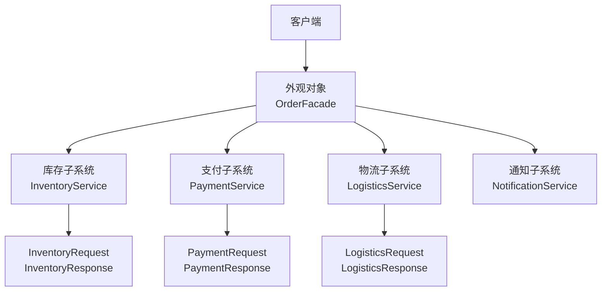
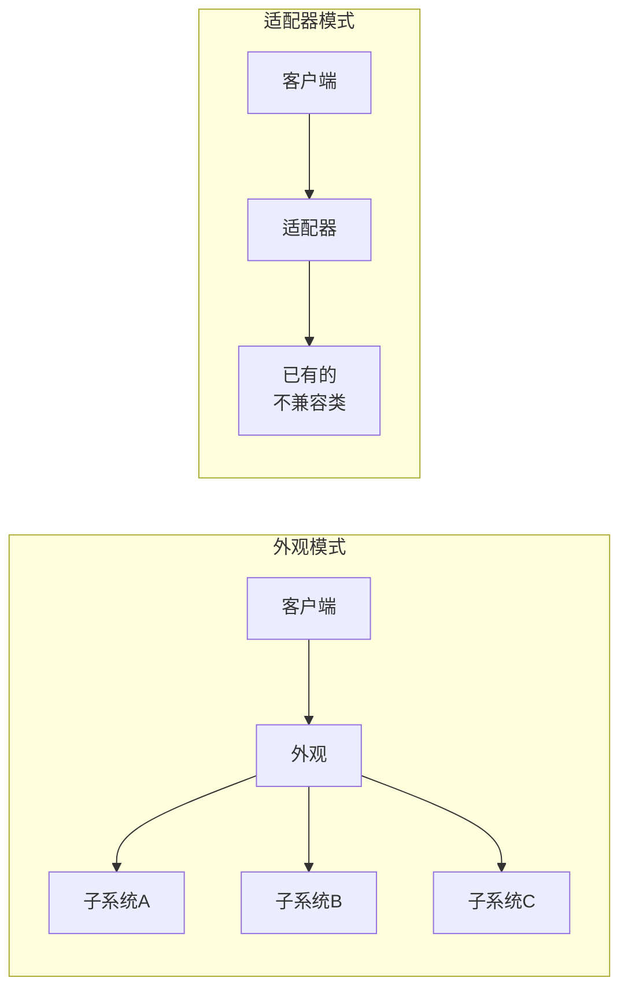
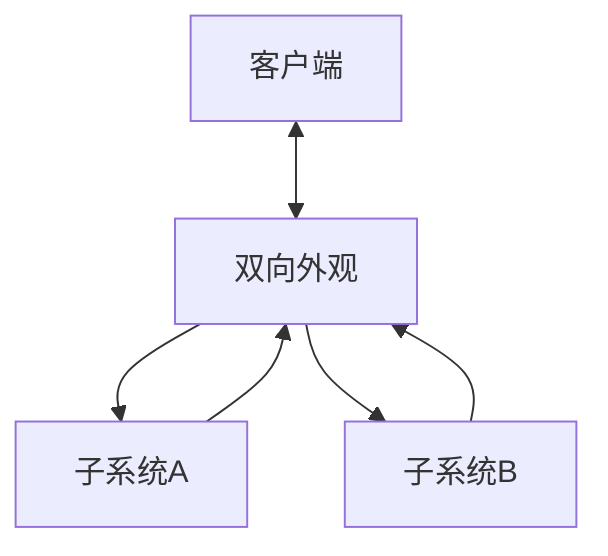
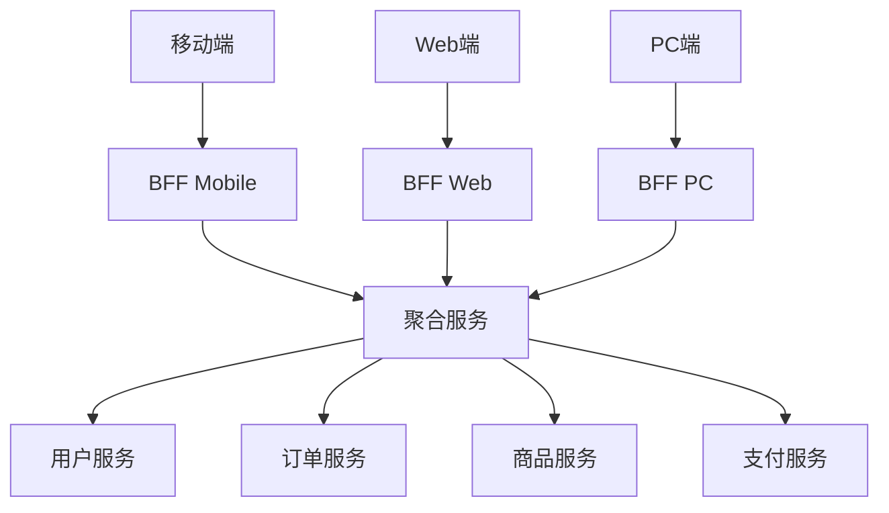

# 外观模式

你接到一个任务：开发一个新订单系统，需要调用库存服务扣减库存、调用支付服务完成扣款、调用物流服务创建发货单。这三个服务各有十几个 API，参数校验规则不同，返回格式各异。你需要写多少代码？

没有外观模式的时代，你可能这样写：

```java
// 订单创建
public void createOrder(OrderDTO order) {
    // 1. 校验库存
    InventoryRequest req1 = new InventoryRequest();
    req1.setProductId(order.getProductId());
    req1.setQuantity(order.getQuantity());
    req1.setWarehouseCode("WH001");
    InventoryResponse resp1 = inventoryService.reserve(req1);

    if (resp1.getCode() != 200) {
        throw new BusinessException("库存不足");
    }

    // 2. 扣款
    PaymentRequest req2 = new PaymentRequest();
    req2.setUserId(order.getUserId());
    req2.setAmount(order.getAmount());
    req2.setPaymentMethod(order.getPaymentMethod());
    PaymentResponse resp2 = paymentService.deduct(req2);

    if (resp2.getCode() != 200) {
        // 回滚库存
        inventoryService.release(req1);
        throw new BusinessException("支付失败");
    }

    // 3. 创建物流
    LogisticsRequest req3 = new LogisticsRequest();
    req3.setOrderId(generateOrderId());
    req3.setReceiverAddress(order.getAddress());
    LogisticsResponse resp3 = logisticsService.create(req3);

    // 4. 发送通知
    notificationService.send(order.getUserId(), "订单创建成功");
}
```

每个服务都有自己的请求类、响应类、错误码体系。当需要创建订单时，调用方需要了解所有这些细节。有没有办法把这种复杂性封装起来，让调用方只关心「创建订单」这一个动作？

这就是外观模式的价值。

## 外观模式的核心思想

外观模式（Facade Pattern）为复杂的子系统提供一个统一的接口，使子系统更易于使用。外观对象将客户端请求委派给相应的子系统对象，处理实际的工作。



外观模式的核心目标不是「添加新功能」，而是「简化现有接口」。它不取代子系统，只是包装了一层更友好的接口。

## 外观模式的实现

```java
// 统一的订单请求
public class CreateOrderRequest {
    private String userId;
    private String productId;
    private int quantity;
    private BigDecimal amount;
    private String paymentMethod;
    private String address;
    // getters and setters
}

// 统一的订单响应
public class CreateOrderResponse {
    private boolean success;
    private String orderId;
    private String message;
    // getters and setters
}

// 订单外观类
public class OrderFacade {
    private final InventoryService inventoryService;
    private final PaymentService paymentService;
    private final LogisticsService logisticsService;
    private final NotificationService notificationService;

    public OrderFacade() {
        this.inventoryService = new InventoryService();
        this.paymentService = new PaymentService();
        this.logisticsService = new LogisticsService();
        this.notificationService = new NotificationService();
    }

    // 简化的统一接口
    public CreateOrderResponse createOrder(CreateOrderRequest request) {
        CreateOrderResponse response = new CreateOrderResponse();

        try {
            // 1. 扣减库存
            InventoryResponse invResp = inventoryService.reserve(
                request.getProductId(),
                request.getQuantity()
            );
            if (!invResp.isSuccess()) {
                return response.fail("库存不足");
            }

            // 2. 支付扣款
            PaymentResponse payResp = paymentService.deduct(
                request.getUserId(),
                request.getAmount(),
                request.getPaymentMethod()
            );
            if (!payResp.isSuccess()) {
                // 回滚库存
                inventoryService.release(request.getProductId(), request.getQuantity());
                return response.fail("支付失败");
            }

            // 3. 创建物流
            String orderId = generateOrderId();
            LogisticsResponse logResp = logisticsService.create(
                orderId,
                request.getAddress()
            );

            // 4. 发送通知
            notificationService.send(request.getUserId(), "订单创建成功");

            return response.success(orderId);

        } catch (Exception e) {
            // 统一异常处理
            return response.fail("系统异常: " + e.getMessage());
        }
    }

    private String generateOrderId() {
        return "ORD" + System.currentTimeMillis();
    }
}
```

调用方代码变得极其简洁：

```java
public class OrderController {
    private final OrderFacade orderFacade = new OrderFacade();

    public void createOrder(HttpRequest request) {
        CreateOrderRequest req = new CreateOrderRequest();
        req.setUserId(request.getUserId());
        req.setProductId(request.getProductId());
        req.setQuantity(request.getQuantity());
        req.setAmount(request.getAmount());
        req.setPaymentMethod(request.getPaymentMethod());
        req.setAddress(request.getAddress());

        CreateOrderResponse resp = orderFacade.createOrder(req);

        if (resp.isSuccess()) {
            return ok(resp.getOrderId());
        } else {
            return badRequest(resp.getMessage());
        }
    }
}
```

## 外观模式 vs 适配器模式

两者看起来都是「包装」，但意图完全不同：

| 维度 | 外观模式 | 适配器模式 |
| --- | --- | --- |
| **核心意图** | **简化**复杂接口，让它更好用 | **转换**不兼容接口，让它能对接 |
| **关注点** | 减少客户端与子系统的耦合 | 解决接口不匹配问题 |
| **子系统感知** | 客户端不知道子系统的存在 | 客户端知道适配后的目标接口 |
| **典型场景** | 为复杂库/框架提供简单入口 | 接入第三方 SDK、兼容遗留系统 |



外观模式不改变子系统的接口，只是把多个接口打包成一个。适配器模式则是「翻译」——把 A 接口转换成客户端期望的 B 接口。

## 双向外观

标准的外观模式是单向的：客户端通过外观访问子系统。但在某些场景下，需要双向访问——子系统也需要知道客户端的存在。



双向外观的典型应用是**事件总线**。子系统发布事件，客户端订阅事件，外观负责路由：

```java
public class EventBusFacade {
    private final Map<Class<?>, List<Consumer<?>>> subscribers = new ConcurrentHashMap<>();

    // 子系统发布事件
    public <T> void publish(T event) {
        List<Consumer<?>> handlers = subscribers.get(event.getClass());
        if (handlers != null) {
            for (Consumer<?> handler : handlers) {
                ((Consumer<T>) handler).accept(event);
            }
        }
    }

    // 客户端订阅事件
    public <T> void subscribe(Class<T> eventType, Consumer<T> handler) {
        subscribers.computeIfAbsent(eventType, k -> new CopyOnWriteArrayList<>())
                   .add(handler);
    }
}
```

## Spring 中的外观模式

### RequestContextHolder

Spring MVC 中的 `RequestContextHolder` 是一个典型的外观模式实现。它封装了 `HttpServletRequest` 的获取逻辑，让开发者可以随时随地获取当前请求上下文：

```java
// 原始方式：依赖注入
@Controller
public class UserController {
    @RequestMapping("/user")
    public String getUser(HttpServletRequest request) {
        String userId = request.getParameter("id");
        // ...
        return "user";
    }
}

// 外观模式：通过静态方法随时获取
@Service
public class UserService {
    public User getCurrentUser() {
        HttpServletRequest request = RequestContextHolder.getRequestAttributes().getRequest();
        String userId = request.getParameter("id");
        // ...
        return userRepository.findById(userId);
    }
}
```

`RequestContextHolder` 封装了获取 `RequestAttributes` 的复杂性，包括线程绑定、请求作用域管理等细节。

### TransactionTemplate

Spring 的 `TransactionTemplate` 简化了事务管理：

```java
// 原始方式：全手工事务
public void transfer(Account from, Account to, BigDecimal amount) {
    Connection conn = dataSource.getConnection();
    try {
        conn.setAutoCommit(false);
        // 转出
        accountDao.decrease(from, amount);
        // 转入
        accountDao.increase(to, amount);
        conn.commit();
    } catch (Exception e) {
        conn.rollback();
    } finally {
        conn.close();
    }
}

// 外观模式：封装事务逻辑
public void transfer(Account from, Account to, BigDecimal amount) {
    transactionTemplate.execute(status -> {
        accountDao.decrease(from, amount);
        accountDao.increase(to, amount);
        return null;
    });
}
```

`TransactionTemplate` 把事务的开启、提交、回滚、异常处理全部封装起来，调用方只需要关注业务逻辑。

## 外观模式的适用场景

### 适用场景

- 为复杂的子系统提供简单接口
- 客户端与子系统之间存在耦合，需要解耦
- 需要分层架构，在各层之间建立外观
- 子系统可能变化，但客户端只需要知道外观接口

### 不适用场景

- 客户端需要直接访问子系统的全部功能
- 子系统本身已经足够简单，不需要再包装
- 性能敏感场景，外观可能增加不必要的调用开销

:::tip 外观模式的「守门人」角色

外观模式不仅是简化接口，还承担了**统一入口**的角色：

1. **参数校验**：在外观层统一校验请求参数
2. **权限检查**：在外观层检查用户权限
3. **日志记录**：在外观层记录调用日志
4. **异常转换**：把子系统的异常转换成统一的业务异常

这些横切关注点集中在外观层处理，可以让子系统更纯粹。

:::

## 思考题

**问题 1**：外观模式和迪米特法则（最少知识原则）有什么关系？

<details>
<summary>参考答案</summary>

迪米特法则（Law of Demeter）要求一个对象对其他对象有最少的了解——只和「直接朋友」交流。「直接朋友」包括：

1. 对象本身
2. 对象的成员对象
3. 方法参数
4. 方法内部创建的对象

外观模式是实现迪米特法则的典型手段。如果不用外观，客户端需要了解子系统中多个类的接口，这违反了迪米特法则。通过外观，客户端只和一个类（外观）交互，子系统的复杂性被隐藏。

但要注意：**外观不是万能的**。如果客户端确实需要访问子系统的某个特定功能，不应该强行通过外观，而是应该重新设计接口或直接暴露该功能。

</details>

**问题 2**：如果子系统需要演进，新功能要加到外观接口中，应该怎么做？

<details>
<summary>参考答案</summary>

这涉及到开闭原则和外观模式的平衡：

1. **如果新功能是子系统的增强**，应该在外观中直接添加方法，客户端自动获得这个能力。

2. **如果新功能是可选的复杂功能**，可以：
   - 在外观中添加 `getAdvancedFacade()` 方法，返回更细粒度的接口
   - 使用「外观 + 策略模式」，让调用方按需注入

3. **如果新功能只是部分客户端需要**，可以：
   - 添加新的专用外观类
   - 把原有外观保持简单，新功能放到新外观中

关键原则：**不要因为扩展而破坏已有客户端**。如果现有客户端不需要新功能，不应该被迫了解它。

</details>

**问题 3**：如何在微服务架构中应用外观模式？

<details>
<summary>参考答案</summary>

在微服务架构中，外观模式通常体现在 BFF（Backend For Frontend）层：



每个 BFF 为特定客户端聚合多个微服务，返回适合该客户端的数据格式。例如：

- 移动端 BFF 聚合用户信息 + 订单列表 + 商品简略信息
- Web 端 BFF 聚合相同数据，但返回更详细的商品描述和图片 URL

这样，各端可以独立演进，不需要为所有端维护统一的 API。

</details>
