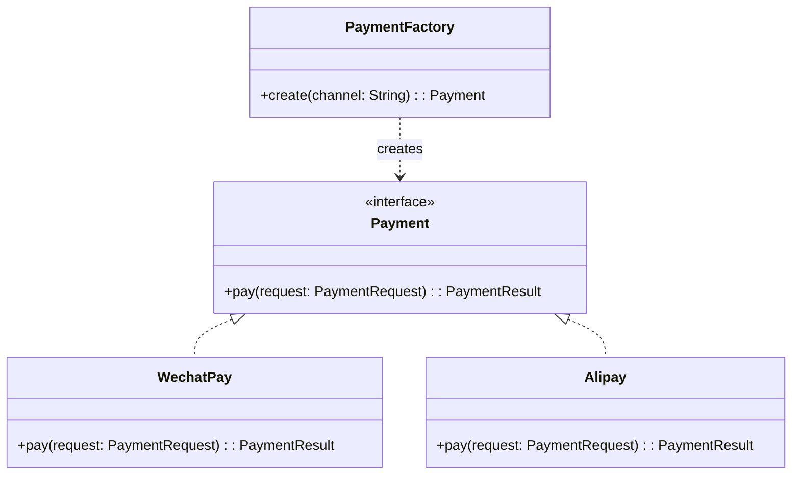
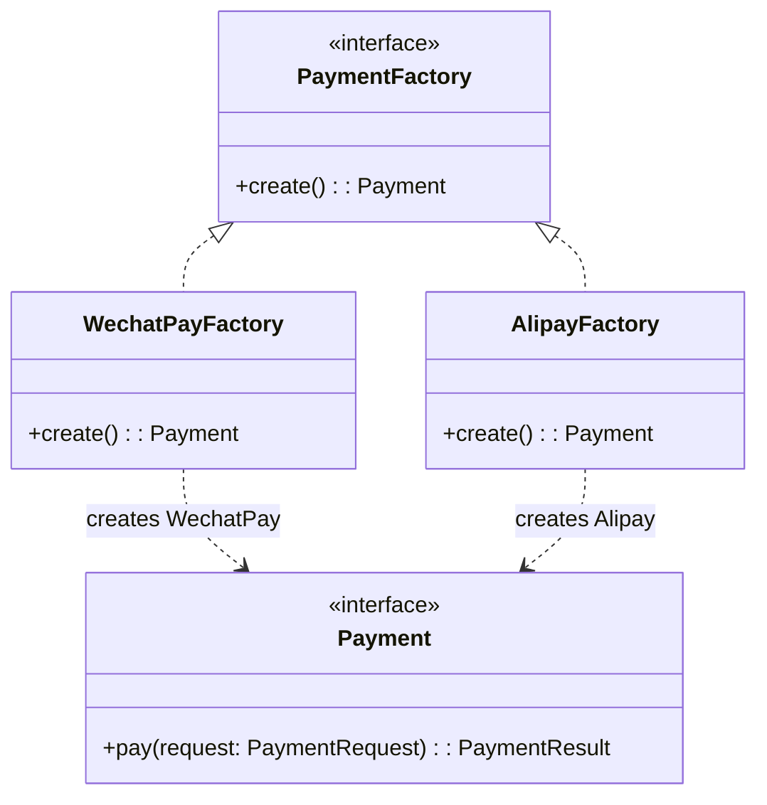
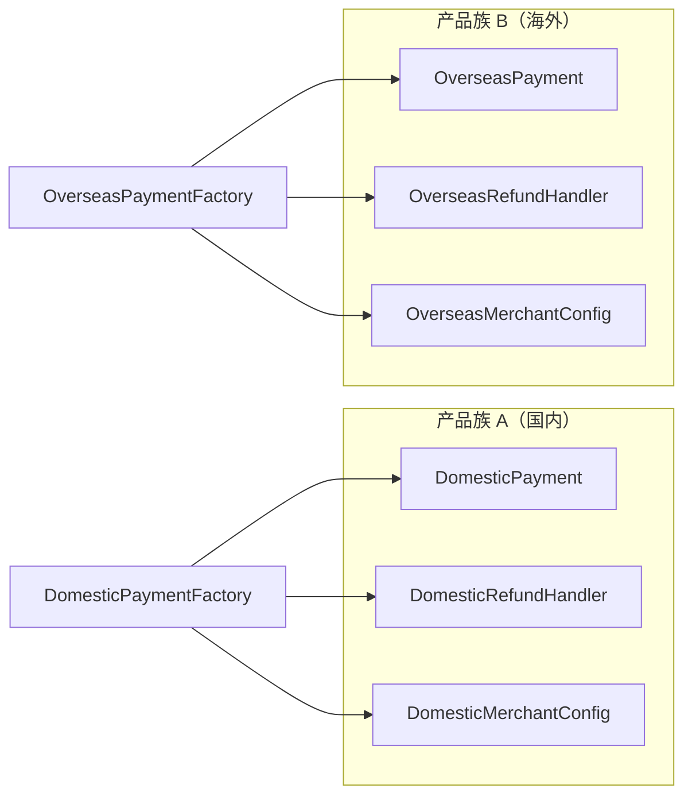

# 工厂模式

你在做一个支付模块，需要对接微信支付、支付宝、银联支付三种渠道。每种支付方式的接口参数、加密方式、回调处理都不同。如果在业务代码里写一堆 `if-else` 判断：

```java
public PaymentResult pay(String channel, PaymentRequest request) {
    if ("wechat".equals(channel)) {
        // 微信支付逻辑，50 行
    } else if ("alipay".equals(channel)) {
        // 支付宝逻辑，60 行
    } else if ("unionpay".equals(channel)) {
        // 银联逻辑，55 行
    }
    // ...
}
```

这会带来两个问题：**一是** 业务代码和对象创建逻辑混在一起；**二是** 新增支付渠道时必须修改已有代码，违反开闭原则。工厂模式就是为了解决这类问题而产生的。

## 为什么不能直接 new？

```java
// 错误写法
Payment wechatPay = new WechatPay();
Payment alipay = new Alipay();
```

直接 `new` 的问题在于：

1. **依赖倒置原则违背**：调用方依赖了具体实现类，新增实现必须修改调用方
2. **创建逻辑分散**：对象创建的参数配置、依赖注入散布在各处
3. **测试困难**：无法用 mock 对象替换真实实现
4. **违反单一职责**：调用方既要管业务，又要管创建

## 三种工厂模式的演进

### 简单工厂：统一创建入口

```java
public class PaymentFactory {
    public static Payment create(String channel) {
        return switch (channel) {
            case "wechat" -> new WechatPay();
            case "alipay" -> new Alipay();
            case "unionpay" -> new UnionPay();
            default -> throw new IllegalArgumentException("Unknown channel: " + channel);
        };
    }
}

// 调用方代码
Payment payment = PaymentFactory.create("wechat");
payment.pay(request);
```



**优点**：封装了创建逻辑，调用方不需要知道具体类的创建方式
**缺点**：违反开闭原则，新增支付渠道需要修改工厂类

### 工厂方法：子类决定创建

```java
public interface PaymentFactory {
    Payment create();
}

// 微信支付工厂
public class WechatPayFactory implements PaymentFactory {
    @Override
    public Payment create() {
        return new WechatPay();
    }
}

// 支付宝工厂
public class AlipayFactory implements PaymentFactory {
    @Override
    public Payment create() {
        return new Alipay();
    }
}

// 调用方代码
PaymentFactory factory = new WechatPayFactory();
Payment payment = factory.create();
```



**优点**：符合开闭原则，新增支付渠道只需新增工厂类
**缺点**：类的数量翻倍了

### 抽象工厂：产品族概念

当产品不仅有一种，而是有一族相关产品时，用抽象工厂。

```java
// 支付产品族：包含多种关联产品
public interface PaymentFactory {
    Payment createPayment();
    RefundHandler createRefundHandler();
    MerchantConfig createMerchantConfig();
}

// 国内支付工厂
public class DomesticPaymentFactory implements PaymentFactory {
    @Override
    public Payment createPayment() {
        return new DomesticPayment();
    }

    @Override
    public RefundHandler createRefundHandler() {
        return new DomesticRefundHandler();
    }

    @Override
    public MerchantConfig createMerchantConfig() {
        return new DomesticMerchantConfig();
    }
}

// 海外支付工厂
public class OverseasPaymentFactory implements PaymentFactory {
    @Override
    public Payment createPayment() {
        return new OverseasPayment();
    }

    @Override
    public RefundHandler createRefundHandler() {
        return new OverseasRefundHandler();
    }

    @Override
    public MerchantConfig createMerchantConfig() {
        return new OverseasMerchantConfig();
    }
}
```



**优点**：保证同一个工厂创建的产品是兼容的（同一产品族）
**缺点**：新增产品族容易（开闭），新增产品种类困难（违反开闭）

## 三种工厂模式对比

| 维度 | 简单工厂 | 工厂方法 | 抽象工厂 |
|------|---------|---------|---------|
| 产品数量 | 单一产品 | 单一产品 | 产品族 |
| 开闭原则 | 部分违反 | 符合 | 扩展符合、修改违反 |
| 复杂度 | 简单 | 中等 | 复杂 |
| 适用场景 | 产品种类稳定 | 产品需要扩展 | 产品族需要切换 |

## Java SPI 机制

Java SPI（Service Provider Interface）是工厂模式的一个经典应用。

```java
// 1. 定义接口
package com.example.spi;

public interface DataSource {
    String getConnectionInfo();
}

// 2. 实现接口
package com.example.spi.impl;

public class MySQLDataSource implements DataSource {
    @Override
    public String getConnectionInfo() {
        return "mysql://localhost:3306";
    }
}

// 3. 在 META-INF/services 注册
// 文件：META-INF/services/com.example.spi.DataSource
// 内容：com.example.spi.impl.MySQLDataSource
```

```java
// 4. 使用 ServiceLoader 加载
ServiceLoader<DataSource> loader = ServiceLoader.load(DataSource.class);
for (DataSource ds : loader) {
    System.out.println(ds.getConnectionInfo());
}
```

Spring Boot 的自动配置、JDBC 驱动加载都用了这套机制。

## Spring 中的工厂模式

Spring 的 `BeanFactory` 就是工厂模式的典型应用：

```java
public interface BeanFactory {
    Object getBean(String name) throws BeansException;
    Object getBean(String name, Object... args) throws BeansException;
    <T> T getBean(Class<T> requiredType) throws BeansException;
}
```

`ApplicationContext` 是 `BeanFactory` 的扩展，提供了更多企业级特性：

```java
// Spring 使用工厂模式创建 Bean
ApplicationContext context = new ClassPathXmlApplicationContext("beans.xml");

// 也可以用 @Configuration 和 @Bean 定义工厂方法
@Configuration
public class AppConfig {
    @Bean
    public UserService userService() {
        return new UserService();
    }
}
```

MyBatis 的 `SqlSessionFactory` 也是工厂模式的体现：

```java
SqlSessionFactory factory = new SqlSessionFactoryBuilder().build(inputStream);
SqlSession session = factory.openSession();
```

## 工厂模式 vs 建造者模式

| 维度 | 工厂模式 | 建造者模式 |
|------|---------|-----------|
| 关注点 | 创建什么类型 | 怎么构建对象 |
| 参数 | 通常少量（类型选择） | 通常多量（配置细节） |
| 返回对象 | 立即可用 | 需要 `build()` |
| 典型场景 | 产品族切换 | 复杂配置对象 |

## 思考题

**问题 1**：简单工厂是否真的违反开闭原则？

<details>
<summary>参考答案</summary>

从严格定义来看，简单工厂在新增产品时确实需要修改工厂类，违反了「对扩展开放，对修改关闭」的原则。

但实际项目中，简单工厂并非一无是处：

- 产品种类非常稳定，不太可能新增
- 产品创建逻辑简单，不需要复杂的子类体系
- 作为团队内部的权宜之计

如果产品确实需要频繁扩展，才考虑升级到工厂方法或抽象工厂。过早优化也是问题。

</details>

**问题 2**：抽象工厂的「产品族」和「产品等级」是什么意思？

<details>
<summary>参考答案</summary>

**产品等级**：同一个抽象产品（如 `Button`）的不同实现（Windows Button、Mac Button）

**产品族**：同一个工厂生产的同一等级的产品集合（Windows Button + Windows Menu + Windows TextField）

```
产品等级 1（按钮）
├── WindowsButton
├── MacButton
└── LinuxButton

产品等级 2（菜单）
├── WindowsMenu
├── MacMenu
└── LinuxMenu
```

**产品族 A**：WindowsButton + WindowsMenu（由 WindowsFactory 创建）
**产品族 B**：MacButton + MacMenu（由 MacFactory 创建）

抽象工厂确保同一个工厂生产的产品是配套的，保持风格一致性。

</details>

**问题 3**：Spring 中 `@Bean` 和 `@Component` 哪个是工厂模式？

<details>
<summary>参考答案</summary>

两者都与工厂模式相关，但角度不同：

**`@Component`**：声明式创建 Bean，Spring 容器通过反射创建实例。本质上是「配置驱动的工厂」，Spring 作为工厂根据配置决定创建什么。

**`@Bean`**：更明确的工厂方法。它把方法返回值作为 Bean 实例，更接近传统工厂模式的语义。当需要创建第三方库的类（无法加 `@Component`）时，必须用 `@Bean`。

```java
@Configuration
public class AppConfig {
    @Bean
    public RestTemplate restTemplate() {
        return new RestTemplate();
    }
}
```

如果非要说更接近传统工厂模式，**`@Bean` 方式更贴切**，因为它显式声明了创建方法。

</details>
