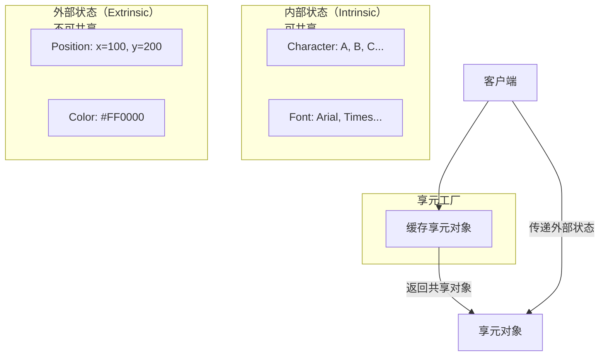
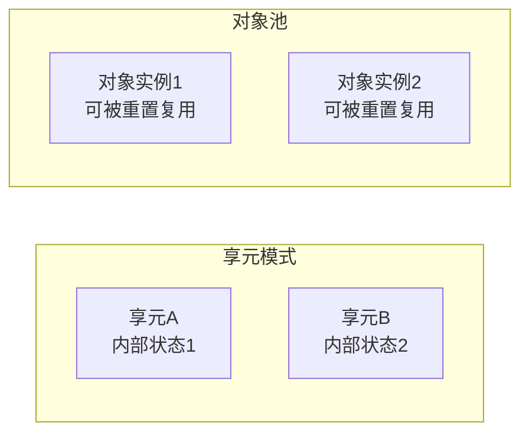

# 享元模式

你在开发一个文本编辑器，需要渲染一个包含 100 万字符的文档。每个字符都有字体、大小、颜色等样式信息。如果为每个字符创建一个独立的对象，100 万字符 × N 个属性 = 巨大的内存开销。

但仔细想想：这 100 万字符中，真正的字符内容只有几千种（汉字、英文字母、数字、标点），而字体、大小、颜色等样式也是有限的几种。**能不能把这些公共信息抽取出来，只创建一份，然后让所有相同字符共享？**

这正是享元模式的核心思想。

## 享元模式的核心思想

享元模式（Flyweight Pattern）运用共享技术有效地支持大量细粒度对象的复用。核心是将对象分为**内部状态**（可共享）和**外部状态**（不可共享），只创建一份内部状态的对象实例，供所有需要该状态的场景共享。



### 内部状态 vs 外部状态

| 类型 | 说明 | 示例 | 存储位置 |
| --- | --- | --- | --- |
| **内部状态** | 可共享，不随场景变化 | 字符的 Unicode、字体的名称 | 享元对象内部 |
| **外部状态** | 不可共享，随场景变化 | 字符的位置、颜色、缩放比例 | 客户端传入 |

**判断方法**：如果删除某个属性后，对象仍然有意义且可以复用，这个属性就是内部状态；如果删除后对象不完整或必须配合外部数据才能使用，就是外部状态。

## String Pool：最熟悉的享元模式

Java 中的字符串常量池是享元模式最经典的应用：

```java
public class StringPoolDemo {
    public static void main(String[] args) {
        // 字面量方式创建字符串，优先从常量池获取
        String s1 = "hello";
        String s2 = "hello";

        // new 方式强制在堆中创建新对象
        String s3 = new String("hello");

        System.out.println(s1 == s2);  // true，指向同一个对象
        System.out.println(s1 == s3);  // false，堆中不同对象
        System.out.println(s1 == s3.intern());  // true，intern() 从常量池获取
    }
}
```

String Pool 的内存布局：

```
堆内存
├── String Pool（方法区/堆的特殊区域）
│   ├── "hello" ──────────────────────────┐
│   └── "world"                          │
└── 堆对象                               │
    ├── new String("hello") ─────────────┘
    └── new String("world")
```

## Integer 缓存：享元的典型实现

`Integer` 类对 `-128` 到 `127` 的整数进行了缓存：

```java
public class IntegerDemo {
    public static void main(String[] args) {
        Integer a = 127;
        Integer b = 127;
        System.out.println(a == b);  // true

        Integer c = 128;
        Integer d = 128;
        System.out.println(c == d);  // false

        // 自动装箱的陷阱
        Integer e = 127;
        Integer f = Integer.valueOf(127);
        System.out.println(e == f);  // true
    }
}
```

`Integer.valueOf()` 的实现：

```java
public static Integer valueOf(int i) {
    if (i >= IntegerCache.low && i <= IntegerCache.high) {
        return IntegerCache.cache[i + (-IntegerCache.low)];
    }
    return new Integer(i);
}

// IntegerCache 预加载了 -128 到 127 的整数
private static class IntegerCache {
    static final int low = -128;
    static final int high;
    static final Integer cache[];

    static {
        int h = 127;
        // 允许通过 -Djava.lang.Integer.IntegerCache.high 设置上限
        high = java.lang.Integer.IntegerCache.high;
        int size = high - low + 1;
        cache = new Integer[size];
        for (int i = 0; i < size; i++) {
            cache[i] = new Integer(i + low);
        }
    }
}
```

## 享元模式的实现

### 文本编辑器示例

```java
// 享元接口
public interface Glyph {
    void draw(Context context);  // context 是外部状态
}

// 具体享元：字符
public class Character implements Glyph {
    private final char character;  // 内部状态

    public Character(char character) {
        this.character = character;
    }

    @Override
    public void draw(Context context) {
        System.out.println("绘制字符 '" + character + "' at ("
                          + context.getX() + ", " + context.getY()
                          + ") with color " + context.getColor());
    }
}

// 具体享元：空格（经常出现，可以特殊优化）
public class Space implements Glyph {
    public static final Space INSTANCE = new Space();

    private Space() {}

    @Override
    public void draw(Context context) {
        // 空格不需要绘制，但需要推进光标
    }
}

// 外部状态
public class Context {
    private int x, y;
    private String color;

    public Context(int x, int y, String color) {
        this.x = x;
        this.y = y;
        this.color = color;
    }

    public int getX() { return x; }
    public int getY() { return y; }
    public String getColor() { return color; }
}

// 享元工厂
public class GlyphFactory {
    private final Map<Character, Character> characters = new HashMap<>();

    public Glyph getCharacter(char ch) {
        Character key = new Character(ch);
        return characters.computeIfAbsent(key, k -> k);
    }

    public Glyph getSpace() {
        return Space.INSTANCE;  // 单例
    }
}
```

使用示例：

```java
public class FlyweightDemo {
    public static void main(String[] args) {
        GlyphFactory factory = new GlyphFactory();

        // 创建 1000 个 'A'
        for (int i = 0; i < 1000; i++) {
            Glyph glyph = factory.getCharacter('A');
            glyph.draw(new Context(i * 10, 0, "black"));
        }

        // 只创建了 1 个 Character('A') 实例
        System.out.println("实际创建的对象数: " +
            ((HashMap<?, ?>) getCharactersField(factory)).size());
    }
}
```

### 线程池示例

线程池也是享元模式的应用：线程是昂贵的资源，池化复用可以避免频繁创建销毁。

```java
public class ThreadPoolDemo {
    public static void main(String[] args) {
        ExecutorService executor = Executors.newFixedThreadPool(4);

        // 提交 100 个任务，但只有 4 个线程
        for (int i = 0; i < 100; i++) {
            final int taskId = i;
            executor.submit(() -> {
                System.out.println("任务 " + taskId + " 由线程 "
                    + Thread.currentThread().getName() + " 执行");
                try {
                    Thread.sleep(100);
                } catch (InterruptedException e) {
                    e.printStackTrace();
                }
            });
        }

        executor.shutdown();
    }
}
```

## 享元模式 vs 对象池

很多人把享元模式和对象池（Object Pool）混为一谈，但两者有本质区别：

| 维度 | 享元模式 | 对象池 |
| --- | --- | --- |
| **核心思想** | 共享对象的内部状态，减少对象数量 | 复用对象实例，避免频繁创建销毁 |
| **共享内容** | 内部状态（逻辑数据） | 整个对象（包括生命周期状态） |
| **生命周期** | 享元对象通常无状态，可长期共享 | 对象池中的对象有状态，需要重置 |
| **典型应用** | String Pool、Integer 缓存、字符渲染 | 数据库连接池、线程池、缓冲池 |
| **客户端依赖** | 不感知共享，可直接使用 | 需要显式获取/归还对象 |



**简单区分**：

- 享元模式：**不需要归还**，调用方拿到后直接用，内部状态是共享的
- 对象池：**需要归还**，用完后放回池中，对象会被重置后给下一个调用方

## 享元模式的适用场景

### 适用场景

- 应用程序使用了大量对象，造成很大存储开销
- 对象的大多数状态可以变为外部状态
- 对象的多数组可共享
- 不依赖于对象标识（享元对象没有唯一性）

### 不适用场景

- 对象状态较少，共享收益不明显
- 对象状态经常变化（外部化收益不大）
- 需要维护对象标识（享元会丢失对象身份）

:::danger 享元模式的风险

## 思考题

**问题 1**：享元模式的内部状态和外部状态如何划分？有没有绝对的标准？

<details>
<summary>参考答案</summary>

划分标准不是绝对的，取决于具体的业务场景：

**判断方法**：

1. **变化频率**：不随使用场景变化的属性倾向于作为内部状态
2. **共享可能性**：被多个对象共用的属性适合作为内部状态
3. **存储成本**：占用内存大的属性优先考虑共享

**示例：文本编辑器**

```
内部状态：字符值、字体名称、字形数据
外部状态：位置、颜色、缩放比例、当前上下文

为什么这样划分？
- 字符值只有几千种，但出现 100 万次
- 位置信息每次都不同，无法共享
- 如果把位置作为内部状态，每个字符只能出现在一个位置
```

**示例：游戏角色**

```
内部状态：角色模型、外观属性、默认行为
外部状态：当前位置、当前血量、当前装备

为什么这样划分？
- 模型数据占内存大，但所有同类型角色可以共享
- 血量、装备因角色而异，必须是外部状态
```

</details>

**问题 2**：如何在保证线程安全的前提下实现享元模式？

<details>
<summary>参考答案</summary>

线程安全的享元实现有几种策略：

**策略 1：不可变对象**

```java
public final class Character {
    private final char value;  // 不可变

    public Character(char value) {
        this.value = value;
    }

    public char getValue() {
        return value;
    }
}
```

不可变对象天然线程安全，因为状态不会被修改。

**策略 2：只读共享，写时复制**

```java
public class Font {
    private final Map<String, Object> properties;  // 只读

    public Font(Map<String, Object> properties) {
        this.properties = Collections.unmodifiableMap(
            new HashMap<>(properties));
    }

    public Object getProperty(String key) {
        return properties.get(key);
    }
}
```

**策略 3：线程局部存储**

如果共享可能导致竞争，可以考虑 ThreadLocal：

```java
public class ThreadLocalFlyweight {
    private static final ThreadLocal<Context> contextHolder =
        ThreadLocal.withInitial(Context::new);

    public static Context getContext() {
        return contextHolder.get();
    }
}
```

**策略 4：ConcurrentHashMap**

在工厂类中使用并发安全的缓存：

```java
public class GlyphFactory {
    private final ConcurrentHashMap<Character, Character> cache =
        new ConcurrentHashMap<>();

    public Glyph getCharacter(char ch) {
        return cache.computeIfAbsent(
            new Character(ch),
            c -> c
        );
    }
}
```

</details>

**问题 3**：数据库连接池为什么不属于典型的享元模式？

<details>
<summary>参考答案</summary>

数据库连接池更接近**对象池**而非**享元模式**，原因是：

1. **连接状态不能共享**：每个数据库连接都有独立的会话状态（事务、锁、临时表等），不能直接共享
2. **需要显式归还**：用完必须 `connection.close()` 归还池中，由池负责重置
3. **池化而非共享**：连接池复用的是整个连接对象（包括网络连接、认证信息），而非提取出内部状态

**对比**：

```
享元模式：提取内部状态，只共享那部分数据
对象池：  复用整个对象，用完归还并重置
```

数据库连接池的关键操作是**重置**（如 `Connection.reset()`），这说明连接对象内部有不可共享的状态需要清理。

**那连接池的哪些部分是享元？**

JDBC 驱动中的**语句缓存**（Statement Pool）可以是享元模式的应用：预编译的 SQL 语句（结构相同，只是参数不同）可以共享，只把参数作为外部状态传入。

</details>
