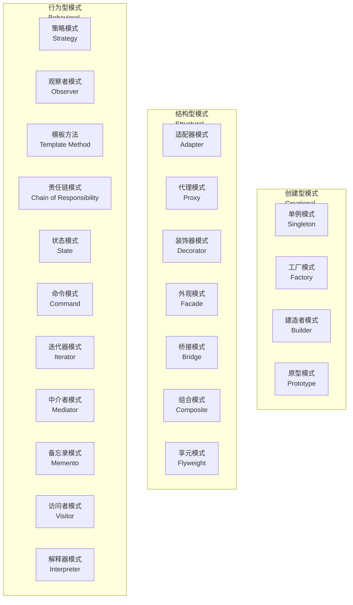
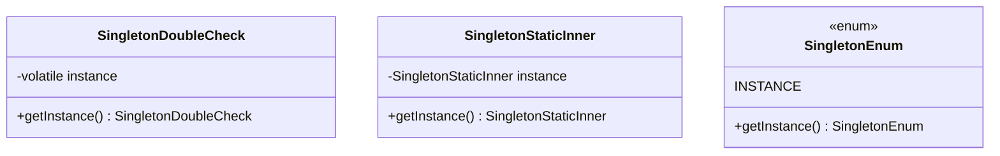
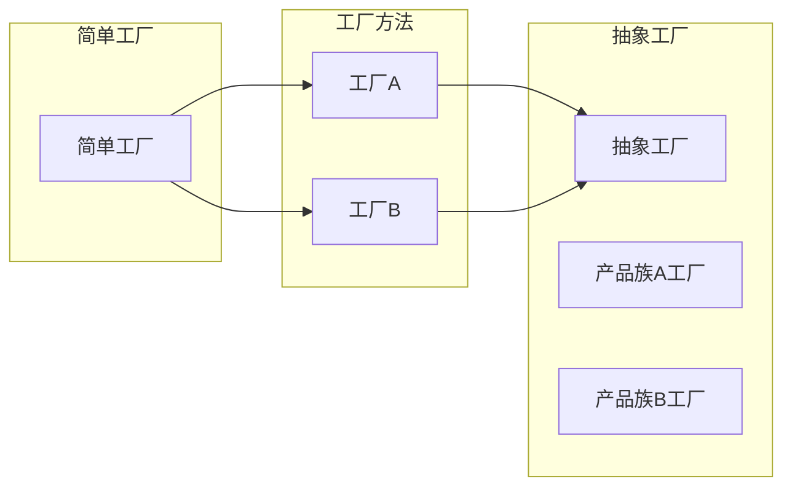
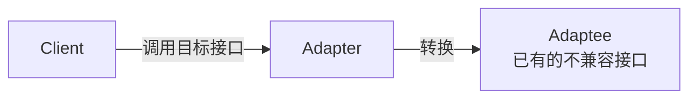
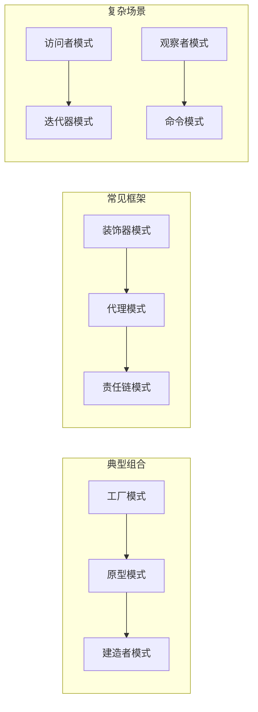

# 应用设计模式

凌晨 2 点，线上告警突然响起。数据库连接池被打满，接口开始大量超时。你翻遍日志，发现问题指向同一个地方——一个被多线程共享的 `SingletonService` 实例，在某些边界情况下被重复创建了两次。双重检查锁看起来写得没问题，但 JVM 的指令重排让 `instance` 在构造函数执行完成前就被赋值给了其他线程。

这只是设计模式相关问题的冰山一角。

设计模式（Design Pattern）是软件开发中反复出现的典型问题的通用解决方案。它不是具体的代码，而是一种经过验证的思维框架——告诉你「在什么场景下，应该怎么组织代码」。但设计模式也是一把双刃剑：用对了是救星，用错了是灾难。很多「过度工程化」的代码，恰恰是设计模式滥用导致的。

本模块聚焦 Java 后端开发中最核心的 23 种设计模式，从单例模式的线程安全陷阱，到策略模式的组合使用，从装饰器模式在 IO 流中的经典应用，到责任链模式在拦截器链中的实践，系统性地建立你的设计模式知识体系。

## 模块结构

本模块按类型分为三大类：

| 类型 | 关注点 | 包含模式 |
| --- | --- | --- |
| 创建型模式 | 对象如何创建 | 单例、工厂、建造者、原型 |
| 结构型模式 | 类/对象如何组合 | 适配器、代理、装饰器、外观、桥接、组合、享元 |
| 行为型模式 | 对象间的职责分配与算法执行 | 策略、观察者、模板方法、责任链、状态、命令、迭代器、中介者、备忘录、访问者、解释器 |

## 设计模式概览图



## 创建型模式：对象的创建艺术

创建型模式关注「对象是如何被创建的」，核心目标是控制对象的创建过程，隐藏创建细节，实现对象复用。

### 单例模式（Singleton）

确保一个类只有一个实例，并提供一个全局访问点。

常见实现方式有三种：



| 实现方式 | 线程安全 | 能延迟加载 | 反序列化安全 |
| --- | --- | --- | --- |
| 饿汉式 | 是 | 否 | 否 |
| 懒汉式（同步方法） | 是 | 是 | 否 |
| **双重检查锁** | 是 | 是 | 否 |
| **静态内部类** | 是 | 是 | 否 |
| **枚举** | 是 | 是 | 是 |

### 工厂模式家族



| 类型 | 优点 | 缺点 | 适用场景 |
| --- | --- | --- | --- |
| 简单工厂 | 简单直观 | 违反开闭原则 | 产品类型少且稳定 |
| 工厂方法 | 符合开闭原则 | 类数量膨胀 | 产品类型多、需要扩展 |
| 抽象工厂 | 保证产品族一致性 | 结构复杂 | 多产品族、多品牌 |

### 建造者模式（Builder）

链式调用构建复杂对象，特别适合不可变对象的创建：

```java
public class User {
    private final String name;      // 必填
    private final int age;           // 必填
    private final String email;     // 可选
    private final String phone;     // 可选
    private final List<String> roles; // 可选
    
    private User(UserBuilder builder) {
        this.name = builder.name;
        this.age = builder.age;
        this.email = builder.email;
        this.phone = builder.phone;
        this.roles = Collections.unmodifiableList(builder.roles);
    }
    
    public static class UserBuilder {
        private final String name;
        private final int age;
        private String email;
        private String phone;
        private List<String> roles = new ArrayList<>();
        
        public UserBuilder(String name, int age) {
            this.name = name;
            this.age = age;
        }
        
        public UserBuilder email(String email) {
            this.email = email;
            return this;
        }
        
        public UserBuilder phone(String phone) {
            this.phone = phone;
            return this;
        }
        
        public UserBuilder roles(List<String> roles) {
            this.roles.addAll(roles);
            return this;
        }
        
        public User build() {
            if (age < 0 || age > 150) {
                throw new IllegalArgumentException("年龄不合理");
            }
            return new User(this);
        }
    }
}
```

```java
User user = new User.UserBuilder("张三", 30)
    .email("zhangsan@example.com")
    .phone("13800138000")
    .roles(Arrays.asList("admin", "user"))
    .build();
```

### 原型模式（Prototype）

通过克隆已有对象创建新对象，核心是深拷贝与浅拷贝的区别：

```java
public class PrototypeDemo implements Cloneable {
    private String name;
    private List<String> items;  // 引用类型
    
    @Override
    protected PrototypeDemo clone() {
        try {
            PrototypeDemo cloned = (PrototypeDemo) super.clone();
            // 深拷贝：需要手动复制引用类型
            cloned.items = new ArrayList<>(this.items);
            return cloned;
        } catch (CloneNotSupportedException e) {
            throw new RuntimeException(e);
        }
    }
}
```

:::warning 深拷贝 vs 浅拷贝

浅拷贝只复制引用，`clone.items` 与原对象共享同一份 `List` 实例；深拷贝则创建全新的对象。如果引用类型没有实现 `Cloneable`，序列化拷贝是更安全的深拷贝方式。

:::

## 结构型模式：类的组织与复用

结构型模式关注如何组合类与对象，形成更大的结构。

### 适配器模式（Adapter）

将不兼容的接口转换为可用的接口，解决「接口不一致」的集成问题：



```java
// 目标接口
public interface DataProcessor {
    void process(String data);
}

// 已有的不兼容类
public class LegacyProcessor {
    public void handle(byte[] data) {
        // 处理字节数据
    }
}

// 适配器
public class DataProcessorAdapter implements DataProcessor {
    private final LegacyProcessor legacyProcessor;
    
    public DataProcessorAdapter(LegacyProcessor legacyProcessor) {
        this.legacyProcessor = legacyProcessor;
    }
    
    @Override
    public void process(String data) {
        legacyProcessor.handle(data.getBytes(StandardCharsets.UTF_8));
    }
}
```

### 代理模式（Proxy）

为其他对象提供一种代理以控制对这个对象的访问：

| 类型 | 实现方式 | 适用场景 |
| --- | --- | --- |
| 静态代理 | 编译时生成代理类 | 简单场景、调试 |
| **JDK 动态代理** | 基于接口、Proxy 类 | 接口明确、业务稳定 |
| **CGLib** | 基于继承、字节码生成 | 无接口、类 `final` 方法 |
| **JavaAssist** | 字节码操作库 | 更高灵活性 |

### 装饰器模式（Decorator）

动态地给对象添加额外职责，比继承更灵活：

```java
// 基础组件
public interface DataSource {
    void write(String data);
    String read();
}

// 核心实现
public class FileDataSource implements DataSource {
    private String filename;
    
    @Override
    public void write(String data) { /* 写入文件 */ }
    
    @Override
    public String read() { /* 读取文件 */ }
}

// 装饰器基类
public class DataSourceDecorator implements DataSource {
    protected DataSource wrappee;
    
    public DataSourceDecorator(DataSource wrappee) {
        this.wrappee = wrappee;
    }
    
    @Override
    public void write(String data) {
        wrappee.write(data);
    }
    
    @Override
    public String read() {
        return wrappee.read();
    }
}

// 具体装饰器：加密
public class EncryptionDecorator extends DataSourceDecorator {
    public EncryptionDecorator(DataSource wrappee) {
        super(wrappee);
    }
    
    @Override
    public void write(String data) {
        super.write(encrypt(data));
    }
    
    @Override
    public String read() {
        return decrypt(super.read());
    }
    
    private String encrypt(String data) { /* 加密逻辑 */ return data; }
    private String decrypt(String data) { /* 解密逻辑 */ return data; }
}
```

```java
// 装饰器可以叠加使用
DataSource source = new FileDataSource("data.txt");
DataSource encrypted = new EncryptionDecorator(source);
DataSource compressed = new CompressionDecorator(encrypted);
```

:::tip 代理 vs 装饰器

两者结构几乎一样，核心区别在于**意图**：

- 代理模式：控制对对象的访问，客户端不知道真实对象的存在
- 装饰器模式：为对象动态添加功能，强调功能的叠加组合

:::

### 其他结构型模式速览

| 模式 | 核心思想 | 经典应用 |
| --- | --- | --- |
| 外观模式 | 提供统一入口，简化子系统使用 | 订单系统Facade封装库存/支付/物流 |
| 桥接模式 | 分离抽象与实现，支持独立扩展 | JDBC驱动、窗口组件跨平台实现 |
| 组合模式 | 树形结构，部分与整体等价 | 文件系统、菜单系统、组织架构 |
| 享元模式 | 共享细粒度对象，减少内存 | 字符串常量池、线程池、数据库连接池 |

## 行为型模式：职责分配与算法封装

行为型模式关注对象间的职责分配与算法执行。

### 策略模式（Strategy）

定义一系列算法，将每个算法封装起来，使它们可以互换：

```java
// 策略接口
public interface DiscountStrategy {
    BigDecimal calculate(BigDecimal price);
}

// 具体策略
public class NoDiscountStrategy implements DiscountStrategy {
    @Override
    public BigDecimal calculate(BigDecimal price) {
        return price;
    }
}

public class PercentOffStrategy implements DiscountStrategy {
    private final int percentOff;
    
    public PercentOffStrategy(int percentOff) {
        this.percentOff = percentOff;
    }
    
    @Override
    public BigDecimal calculate(BigDecimal price) {
        return price.multiply(BigDecimal.valueOf(100 - percentOff))
                     .divide(BigDecimal.valueOf(100), 2, RoundingMode.HALF_UP);
    }
}

public class FixedAmountStrategy implements DiscountStrategy {
    private final BigDecimal discount;
    
    public FixedAmountStrategy(BigDecimal discount) {
        this.discount = discount;
    }
    
    @Override
    public BigDecimal calculate(BigDecimal price) {
        return price.subtract(discount).max(BigDecimal.ZERO);
    }
}

// 上下文
public class OrderContext {
    private DiscountStrategy strategy;
    
    public void setStrategy(DiscountStrategy strategy) {
        this.strategy = strategy;
    }
    
    public BigDecimal applyDiscount(BigDecimal price) {
        return strategy.calculate(price);
    }
}
```

### 观察者模式（Observer）

定义对象间的一对多依赖关系，当对象状态改变时通知所有依赖：

```java
// 观察者接口
public interface PropertyObserver {
    void onPropertyChanged(String propertyName, Object oldValue, Object newValue);
}

// 被观察者
public class Observable {
    private final List<PropertyObserver> observers = new CopyOnWriteArrayList<>();
    
    public void addObserver(PropertyObserver observer) {
        observers.add(observer);
    }
    
    public void removeObserver(PropertyObserver observer) {
        observers.remove(observer);
    }
    
    protected void notifyObservers(String propertyName, Object oldValue, Object newValue) {
        for (PropertyObserver observer : observers) {
            observer.onPropertyChanged(propertyName, oldValue, newValue);
        }
    }
}
```

### 责任链模式（Chain of Responsibility）

将请求沿着处理者链传递，直到被某个处理器处理：

```java
public abstract class Handler {
    protected Handler next;
    
    public Handler setNext(Handler next) {
        this.next = next;
        return next;
    }
    
    public final void handle(Request request) {
        if (doHandle(request)) {
            return;
        }
        if (next != null) {
            next.handle(request);
        }
    }
    
    protected abstract boolean doHandle(Request request);
}

// 具体处理器
public class AuthHandler extends Handler {
    @Override
    protected boolean doHandle(Request request) {
        if (request.getToken() == null) {
            throw new UnauthorizedException("未登录");
        }
        return false; // 继续传递
    }
}

public class ValidationHandler extends Handler {
    @Override
    protected boolean doHandle(Request request) {
        if (!request.isValid()) {
            throw new BadRequestException("参数校验失败");
        }
        return false;
    }
}

public class RateLimitHandler extends Handler {
    @Override
    protected boolean doHandle(Request request) {
        if (isRateLimited(request.getUserId())) {
            throw new TooManyRequestsException("请求过于频繁");
        }
        return false;
    }
}
```

```java
Handler chain = new AuthHandler()
    .setNext(new ValidationHandler())
    .setNext(new RateLimitHandler())
    .setNext(new BusinessHandler());
```

### 其他行为型模式速览

| 模式 | 核心思想 | 经典应用 |
| --- | --- | --- |
| 模板方法 | 定义算法骨架，子类重写特定步骤 | Spring `AbstractJdbcTemplate` |
| 状态模式 | 对象内部状态决定行为，状态间可切换 | 订单状态机、工单流转 |
| 命令模式 | 请求封装为对象，支持撤销/重做 | 历史记录、批处理任务 |
| 迭代器模式 | 顺序访问集合，不暴露内部结构 | Java `Iterator`、集合遍历 |
| 中介者模式 | 用中介对象封装对象间交互 | GUI 组件通信、聊天室消息中心 |
| 备忘录模式 | 捕获对象状态并保存 | 游戏存档、编辑器撤销 |
| 访问者模式 | 数据结构与操作分离，双分派 | 编译器 AST 处理、报表生成 |
| 解释器模式 | 定义语法解释器 | SQL 解析、规则引擎 |

## 模式选用指南

### 场景对比表

| 场景 | 推荐模式 | 替代方案 |
| --- | --- | --- |
| 全局唯一对象（如配置中心） | 单例模式 | Spring Bean 单例 |
| 创建逻辑复杂、参数多 | 建造者模式 | 重载构造函数、 telescoping constructor |
| 产品族差异大（如多数据库） | 抽象工厂 | 简单工厂 + 反射 |
| 接入不兼容的老系统 | 适配器模式 | 修改老系统、重写新接口 |
| 为类添加日志/缓存/事务 | 装饰器模式 | 继承、代理 |
| 封装复杂子系统的调用 | 外观模式 | 直接调用子系统 |
| 减少重复对象创建 | 享元模式 | 对象池、缓存 |
| 算法可以运行时切换 | 策略模式 | if-else、工厂 |
| 状态转换有固定流程 | 状态模式 | if-else 状态判断 |
| 请求需要多层处理 | 责任链模式 | 顺序调用、过滤器 |

### 模式组合使用

很多实际问题需要多种模式组合解决：



| 组合 | 场景示例 |
| --- | --- |
| 工厂 + 建造者 | 创建复杂对象，且创建过程需要变化 |
| 策略 + 工厂 | 算法族创建与使用解耦 |
| 装饰器 + 代理 | AOP 切面编程、事务管理 |
| 命令 + 备忘录 + 责任链 | 撤销重做系统、多级审批 |
| 观察者 + 中介者 | MVC 架构、GUI 事件处理 |

## 反模式警示

设计模式用错比不用更危险。以下是常见反模式：

:::danger 过度使用单例

全局共享状态是并发问题的温床。很多「疑难杂症」追根溯源都是单例被多线程不当修改。

- 避免在单例中存储可变状态
- 优先使用 Spring Bean 单例而非自己实现
- 考虑是否真的需要全局唯一

:::

:::danger 滥用工厂

每个产品类都配一个工厂类，导致类爆炸。工厂模式本意是封装创建逻辑，如果产品类型稳定且简单，简单工厂足够。

:::danger 装饰器地狱

多层嵌套的装饰器虽然灵活，但调试困难。如果decorator层数超过3层，考虑是否应该用继承或直接修改类。

:::danger 策略过度设计

只有两三种策略时，if-else 往往更简单。策略模式适合策略可能持续扩展的场景。

:::danger 模板方法滥用继承

模板方法通过继承实现复用，但继承是静态的。Java 8 以后，优先考虑用函数式接口 + Lambda 替代继承。

## 本章文章导读

如果你时间有限，可以按以下优先级阅读：

**创建型模式（必读）**：

1. 单例模式—— 线程安全实现与常见陷阱
2. 工厂模式—— 三种工厂的演进与适用场景
3. 建造者模式—— 链式调用与不可变对象

**结构型模式（推荐）**：

1. 适配器模式—— 解决接口不兼容问题
2. 代理模式—— AOP 与访问控制的基石
3. 装饰器模式—— 灵活组合功能的艺术

**行为型模式（选读）**：

1. 策略模式—— 算法切换的首选
2. 观察者模式—— 解耦对象间通信
3. 责任链模式—— 请求处理的链式结构

准备好了吗？让我们从创建型模式开始，深入理解每种模式的本质与适用场景。
