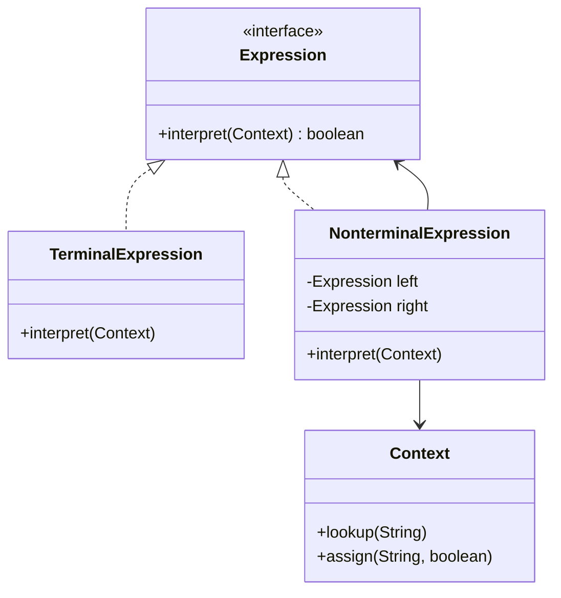

# 解释器模式

正则表达式你用过吗？

```java
Pattern pattern = Pattern.compile("\\d{3,4}-?\\d{7,8}");
Matcher matcher = pattern.matcher("010-12345678");
boolean matches = matcher.matches();
```

当你写下一个正则表达式时，底层的正则引擎正在解析这个表达式，将其编译为状态机，然后匹配目标字符串。这个「解析表达式，编译为可执行结构」的过程，正是解释器模式的核心。

## 问题背景：表达式的解析需求

很多场景需要解释「特定语法」：

- **正则表达式**：`\d{3,4}-?\d{7,8}` 匹配电话号码
- **SQL WHERE 子句**：`age > 18 AND name LIKE '张%'`
- **EL 表达式**：`${user.name} + ${user.age}`
- **配置规则**：`timeout > 3000 ? retry : abort`
- **业务规则引擎**：根据规则表达式自动决策

如果每次新增一种规则都要写一堆解析代码，代码将难以维护。

## 解释器模式结构

解释器模式（Interpreter Pattern）定义一个语法的表示，以及一个解释器，这个解释器使用该表示来解释语言中的句子。



### 表达式接口

```java
public interface Expression {
    /**
     * 解释表达式
     * @param context 上下文，包含变量值
     * @return 表达式结果
     */
    boolean interpret(Context context);
}
```

### 终结符表达式

```java
public class VariableExpression implements Expression {
    private final String name;

    public VariableExpression(String name) {
        this.name = name;
    }

    @Override
    public boolean interpret(Context context) {
        return context.lookup(name);
    }

    @Override
    public String toString() {
        return name;
    }
}

public class ConstantExpression implements Expression {
    private final boolean value;

    public ConstantExpression(boolean value) {
        this.value = value;
    }

    @Override
    public boolean interpret(Context context) {
        return value;
    }
}
```

### 非终结符表达式

```java
public class AndExpression implements Expression {
    private final Expression left;
    private final Expression right;

    public AndExpression(Expression left, Expression right) {
        this.left = left;
        this.right = right;
    }

    @Override
    public boolean interpret(Context context) {
        return left.interpret(context) && right.interpret(context);
    }

    @Override
    public String toString() {
        return "(" + left + " AND " + right + ")";
    }
}

public class OrExpression implements Expression {
    private final Expression left;
    private final Expression right;

    public OrExpression(Expression left, Expression right) {
        this.left = left;
        this.right = right;
    }

    @Override
    public boolean interpret(Context context) {
        return left.interpret(context) || right.interpret(context);
    }

    @Override
    public String toString() {
        return "(" + left + " OR " + right + ")";
    }
}

public class NotExpression implements Expression {
    private final Expression expression;

    public NotExpression(Expression expression) {
        this.expression = expression;
    }

    @Override
    public boolean interpret(Context context) {
        return !expression.interpret(context);
    }

    @Override
    public String toString() {
        return "NOT (" + expression + ")";
    }
}
```

### 上下文

```java
public class Context {
    private final Map<String, Boolean> variables = new HashMap<>();

    public void assign(String name, boolean value) {
        variables.put(name, value);
    }

    public boolean lookup(String name) {
        Boolean value = variables.get(name);
        if (value == null) {
            throw new IllegalArgumentException("Variable not found: " + name);
        }
        return value;
    }
}
```

### 客户端使用

```java
// 表达式: (VIP AND 消费金额 > 1000) OR (会员 AND 消费金额 > 500)
Context context = new Context();
context.assign("VIP", true);
context.assign("会员", false);
context.assign("消费金额", 800);

// 构建表达式树
Expression rule = new OrExpression(
    new AndExpression(
        new VariableExpression("VIP"),
        new GreaterThanExpression(
            new VariableExpression("消费金额"),
            new ConstantExpression(1000)
        )
    ),
    new AndExpression(
        new VariableExpression("会员"),
        new GreaterThanExpression(
            new VariableExpression("消费金额"),
            new ConstantExpression(500)
        )
    )
);

// 解释表达式
boolean result = rule.interpret(context);
System.out.println("是否发送优惠券: " + result);
```

## 四则运算表达式案例

一个完整的四则运算解释器：

### 表达式接口

```java
public interface Expression {
    int interpret(Context context);
}
```

### 终结符表达式

```java
public class NumberExpression implements Expression {
    private final int number;

    public NumberExpression(int number) {
        this.number = number;
    }

    @Override
    public int interpret(Context context) {
        return number;
    }
}

public class VariableExpression implements Expression {
    private final String name;

    public VariableExpression(String name) {
        this.name = name;
    }

    @Override
    public int interpret(Context context) {
        return context.get(name);
    }
}
```

### 非终结符表达式

```java
public class AddExpression implements Expression {
    private final Expression left;
    private final Expression right;

    public AddExpression(Expression left, Expression right) {
        this.left = left;
        this.right = right;
    }

    @Override
    public int interpret(Context context) {
        return left.interpret(context) + right.interpret(context);
    }
}

public class SubtractExpression implements Expression {
    private final Expression left;
    private final Expression right;

    public SubtractExpression(Expression left, Expression right) {
        this.left = left;
        this.right = right;
    }

    @Override
    public int interpret(Context context) {
        return left.interpret(context) - right.interpret(context);
    }
}

public class MultiplyExpression implements Expression {
    private final Expression left;
    private final Expression right;

    public MultiplyExpression(Expression left, Expression right) {
        this.left = left;
        this.right = right;
    }

    @Override
    public int interpret(Context context) {
        return left.interpret(context) * right.interpret(context);
    }
}

public class DivideExpression implements Expression {
    private final Expression left;
    private final Expression right;

    public DivideExpression(Expression left, Expression right) {
        this.left = left;
        this.right = right;
    }

    @Override
    public int interpret(Context context) {
        int divisor = right.interpret(context);
        if (divisor == 0) {
            throw new ArithmeticException("Division by zero");
        }
        return left.interpret(context) / divisor;
    }
}
```

### 上下文

```java
public class Context {
    private final Map<String, Integer> variables = new HashMap<>();

    public void set(String name, int value) {
        variables.put(name, value);
    }

    public int get(String name) {
        Integer value = variables.get(name);
        if (value == null) {
            throw new IllegalArgumentException("Variable not found: " + name);
        }
        return value;
    }
}
```

### 表达式解析器（从字符串构建表达式树）

```java
public class ExpressionParser {
    private String expression;
    private int position;

    public Expression parse(String expression) {
        this.expression = expression.replaceAll("\\s+", "");
        this.position = 0;
        return parseExpression();
    }

    private Expression parseExpression() {
        return parseAddSubtract();
    }

    private Expression parseAddSubtract() {
        Expression left = parseMultiplyDivide();

        while (position < expression.length()) {
            char op = expression.charAt(position);
            if (op != '+' && op != '-') {
                break;
            }
            position++;
            Expression right = parseMultiplyDivide();
            left = (op == '+')
                ? new AddExpression(left, right)
                : new SubtractExpression(left, right);
        }

        return left;
    }

    private Expression parseMultiplyDivide() {
        Expression left = parsePrimary();

        while (position < expression.length()) {
            char op = expression.charAt(position);
            if (op != '*' && op != '/') {
                break;
            }
            position++;
            Expression right = parsePrimary();
            left = (op == '*')
                ? new MultiplyExpression(left, right)
                : new DivideExpression(left, right);
        }

        return left;
    }

    private Expression parsePrimary() {
        // 括号表达式
        if (match('(')) {
            Expression exp = parseExpression();
            expect(')');
            return exp;
        }

        // 数字
        if (Character.isDigit(expression.charAt(position))) {
            return parseNumber();
        }

        // 变量
        return parseVariable();
    }

    private Expression parseNumber() {
        int start = position;
        while (position < expression.length() &&
               Character.isDigit(expression.charAt(position))) {
            position++;
        }
        int number = Integer.parseInt(expression.substring(start, position));
        return new NumberExpression(number);
    }

    private Expression parseVariable() {
        int start = position;
        while (position < expression.length() &&
               Character.isLetterOrDigit(expression.charAt(position))) {
            position++;
        }
        String name = expression.substring(start, position);
        return new VariableExpression(name);
    }

    private boolean match(char c) {
        if (position < expression.length() && expression.charAt(position) == c) {
            position++;
            return true;
        }
        return false;
    }

    private void expect(char c) {
        if (!match(c)) {
            throw new IllegalArgumentException("Expected '" + c + "'");
        }
    }
}
```

### 使用示例

```java
ExpressionParser parser = new ExpressionParser();

// 解析表达式: (a + b) * c
Expression expr = parser.parse("(a + b) * c");

Context context = new Context();
context.set("a", 2);
context.set("b", 3);
context.set("c", 4);

int result = expr.interpret(context);
System.out.println("(2 + 3) * 4 = " + result);  // 20
```

## 解释器模式 vs 策略模式

两者都封装了算法，但侧重点不同：

| 维度 | 解释器模式 | 策略模式 |
| --- | --- | --- |
| **输入** | 字符串/语法 | 对象/参数 |
| **解析** | 需要解析输入，构建表达式树 | 不需要 |
| **适用场景** | DSL、业务规则 | 算法切换 |
| **复杂度** | 通常需要组合多个表达式类 | 通常单一实现 |

## Spring Expression Language (SpEL)

Spring 的 SpEL 是解释器模式的典型应用：

```java
@Service
public class RuleEngine {
    private ExpressionParser parser = new SpelExpressionParser();

    public boolean evaluate(String rule, Map<String, Object> context) {
        Expression expression = parser.parseExpression(rule);
        EvaluationContext evalContext = new StandardEvaluationContext();

        // 设置变量
        context.forEach(evalContext::setVariable);

        return expression.getValue(evalContext, Boolean.class);
    }
}

// 使用
Map<String, Object> variables = new HashMap<>();
variables.put("age", 25);
variables.put("vip", true);
variables.put("balance", 1500.0);

boolean eligible = ruleEngine.evaluate(
    "age >= 18 && (vip == true || balance > 1000)",
    variables
);
System.out.println("Eligible: " + eligible);
```

SpEL 支持的功能：

| 功能 | 示例 |
| --- | --- |
| 算术运算 | `1 + 2 * 3` |
| 比较运算 | `age > 18` |
| 逻辑运算 | `a && b \|\| c` |
| 三元表达式 | `a ? b : c` |
| 方法调用 | `'hello'.toUpperCase()` |
| 集合操作 | `{#list.?[age > 18]}` |
| 正则匹配 | `'123' matches '\\d+'` |

## 解释器模式的优缺点

### 优点

1. **易于改变和扩展语法**：通过继承可以方便地添加新的表达式
2. **易于实现简单语法**：语法树的每个节点可以单独实现
3. **增加新的解释方式**：通过增加新的访问者

### 缺点

1. **复杂语法难以维护**：当语法规则很多时，类数量会爆炸
2. **性能问题**：每次解释都需要遍历表达式树
3. **难以处理上下文**：需要额外的上下文管理机制

:::warning 解释器模式的局限性

解释器模式不适合复杂的业务规则：

1. **规则数量 > 20**：考虑使用规则引擎（如 Drools）
2. **性能要求高**：考虑预编译为状态机
3. **需要持久化**：考虑序列化为 JSON/XML

对于简单的条件判断，直接使用 if-else 或策略模式更合适。

:::

## 思考题

**问题 1**：如何优化解释器模式的性能？

<details>
<summary>参考答案</summary>

几种优化策略：

1. **预编译表达式**

```java
// SpEL 示例
Expression expression = parser.parseExpression("a + b * c");
// 预编译后可以多次使用
expression.setValue(context, 100);
```

2. **缓存解释结果**

```java
public class CachingExpression implements Expression {
    private final Expression delegate;
    private final Map<Context, Boolean> cache = new ConcurrentHashMap<>();

    @Override
    public boolean interpret(Context context) {
        // 使用上下文序列化作为 key
        String key = context.serialize();
        return cache.computeIfAbsent(key, k -> delegate.interpret(context));
    }
}
```

3. **编译为字节码**（如 Janino、Aviator）

```java
// 使用 Janino 编译为字节码
ScriptEngine engine = new CompiledScriptEngine();
CompiledScript compiled = engine.compile("a + b * c");
compiled.eval(context);
```

</details>

**问题 2**：正则表达式与解释器模式有什么关系？

<details>
<summary>参考答案</summary>

正则表达式底层使用了解释器模式的思想：

1. **Pattern** 是语法定义（相当于 Expression 接口）
2. **PatternMatcher** 是解释器（相当于具体的 Expression 实现）
3. 编译阶段：将正则表达式解析为 NFA/DFA
4. 匹配阶段：在 NFA/DFA 上执行

```java
// 源码简化理解
public class Pattern {
    private final Node root;

    // compile 方法：将正则表达式解析为语法树
    public static Pattern compile(String regex) {
        Node root = new SequenceNode();
        // 解析过程...
        return new Pattern(root);
    }

    // matcher 方法：创建解释器
    public Matcher matcher(CharSequence input) {
        return new Matcher(this, input);
    }
}

public class Matcher {
    public boolean matches() {
        return root.match(this);
    }
}
```

</details>

**问题 3**：如何实现一个简单的 JSONPath 解释器？

<details>
<summary>参考答案</summary>

JSONPath 用于从 JSON 文档中提取数据：

```java
public class JsonPathExpression implements Expression {
    private final List<PathComponent> components;

    public JsonPathExpression(String path) {
        this.components = parse(path);
    }

    @Override
    public Object interpret(Context context) {
        Object current = context.getRoot();
        for (PathComponent component : components) {
            current = component.evaluate(current, context);
        }
        return current;
    }

    private List<PathComponent> parse(String path) {
        List<PathComponent> components = new ArrayList<>();
        // 解析 path 如 "$.store.book[0].title"
        return components;
    }
}

// PathComponent 接口
public interface PathComponent {
    Object evaluate(Object current, JsonContext context);
}

// 根节点
public class RootComponent implements PathComponent {
    @Override
    public Object evaluate(Object current, JsonContext context) {
        return context.getRoot();
    }
}

// 属性访问
public class PropertyComponent implements PathComponent {
    private final String name;

    @Override
    public Object evaluate(Object current, JsonContext context) {
        return ((Map) current).get(name);
    }
}

// 数组索引
public class IndexComponent implements PathComponent {
    private final int index;

    @Override
    public Object evaluate(Object current, JsonContext context) {
        return ((List) current).get(index);
    }
}
```

</details>
