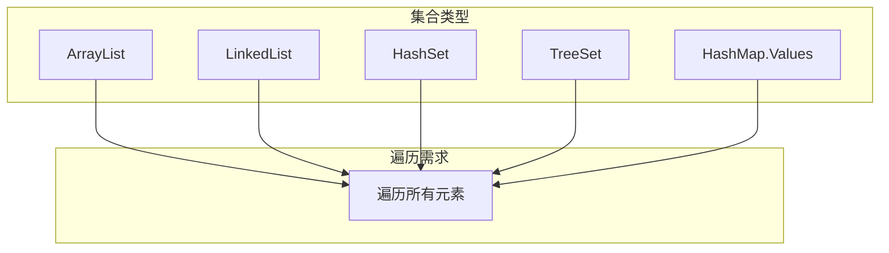
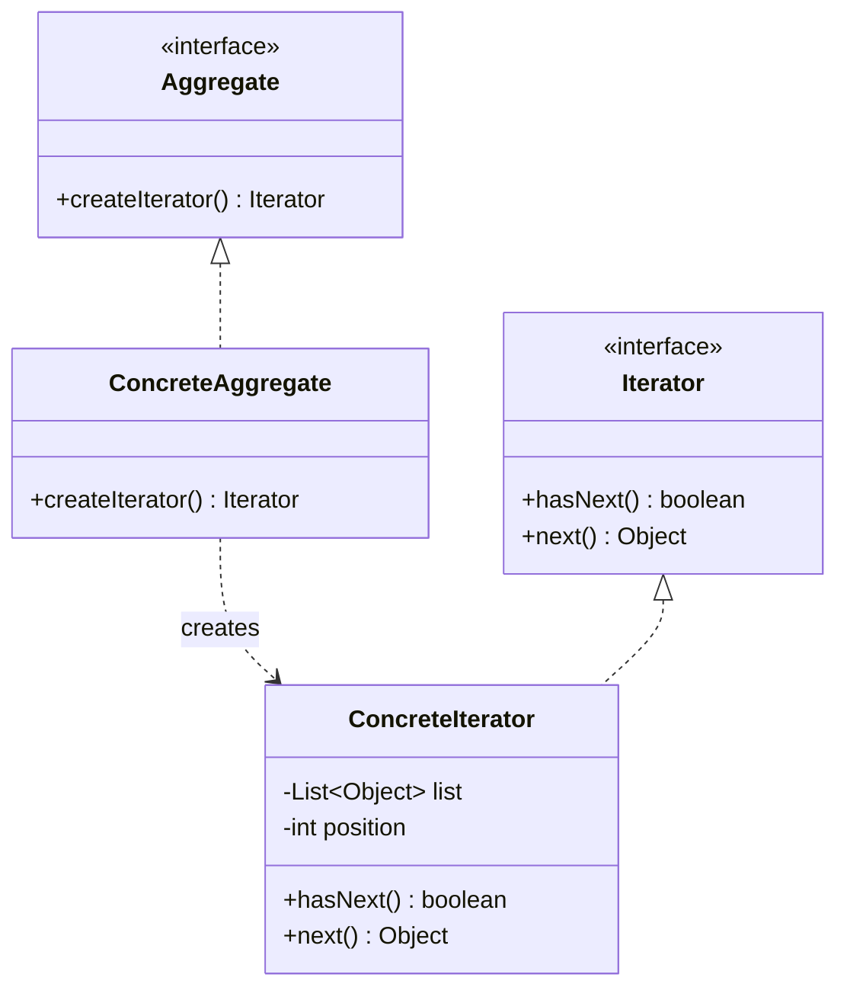
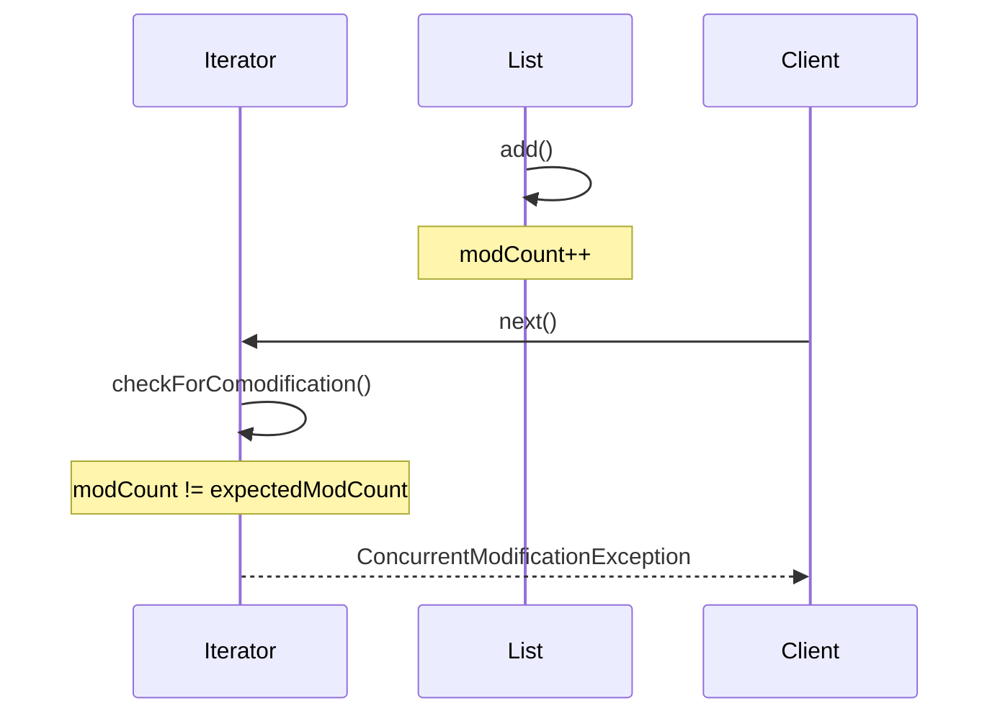

# 迭代器模式

遍历一个列表，你会怎么写？

```java
// 方式1：for 循环
for (int i = 0; i < list.size(); i++) {
    System.out.println(list.get(i));
}

// 方式2：增强 for 循环
for (String item : list) {
    System.out.println(item);
}

// 方式3：Iterator
Iterator<String> it = list.iterator();
while (it.hasNext()) {
    System.out.println(it.next());
}
```

三种方式看起来效果一样，但背后隐藏着设计的演进：从索引遍历，到语法糖，再到统一的迭代器接口。每一步演进都在解决「如何统一不同集合的遍历方式」这个问题。

## 问题背景：集合遍历的统一性

Java 的集合框架有多种实现：



每种集合的内部结构不同：

- `ArrayList` 是数组，支持随机访问
- `LinkedList` 是链表，只能顺序访问
- `HashSet` 使用哈希表，遍历顺序不确定
- `TreeSet` 是红黑树，按排序顺序遍历

如果客户端直接操作集合内部结构：

```java
// 依赖 ArrayList 的实现
for (int i = 0; i < list.size(); i++) {
    doSomething(list.get(i));
}

// 换成 LinkedList 后性能急剧下降
// 因为 LinkedList 的 get(i) 是 O(n)
```

问题：**客户端与集合实现耦合，切换集合类型时需要修改大量代码**。

## 迭代器模式结构

迭代器模式（Iterator Pattern）提供一种方法顺序访问集合中的各个元素，而不暴露该集合的底层表示。



### 迭代器接口

```java
public interface Iterator<E> {
    /**
     * 是否还有下一个元素
     */
    boolean hasNext();

    /**
     * 返回下一个元素
     */
    E next();

    /**
     * 是否支持逆向遍历
     */
    default boolean hasPrevious() {
        return false;
    }

    /**
     * 返回上一个元素
     */
    default E previous() {
        throw new UnsupportedOperationException();
    }

    /**
     * 移除上一个返回的元素（可选操作）
     */
    default void remove() {
        throw new UnsupportedOperationException();
    }

    /**
     * 替换上一个返回的元素（可选操作）
     */
    default void set(E e) {
        throw new UnsupportedOperationException();
    }

    /**
     * 添加元素到集合（可选操作）
     */
    default void add(E e) {
        throw new UnsupportedOperationException();
    }
}
```

### 聚合接口

```java
public interface Aggregate<E> {
    /**
     * 创建迭代器
     */
    Iterator<E> createIterator();

    /**
     * 是否为空
     */
    default boolean isEmpty() {
        return size() == 0;
    }

    /**
     * 元素数量
     */
    int size();
}
```

### 具体实现

```java
public class ArrayList<E> implements Aggregate<E> {
    private Object[] elements;
    private int size;

    public ArrayList() {
        this.elements = new Object[10];
        this.size = 0;
    }

    public void add(E element) {
        if (size >= elements.length) {
            resize();
        }
        elements[size++] = element;
    }

    public E get(int index) {
        if (index < 0 || index >= size) {
            throw new IndexOutOfBoundsException();
        }
        return (E) elements[index];
    }

    public int size() {
        return size;
    }

    @Override
    public Iterator<E> createIterator() {
        return new ArrayListIterator();
    }

    private class ArrayListIterator implements Iterator<E> {
        private int current = 0;

        @Override
        public boolean hasNext() {
            return current < size;
        }

        @Override
        public E next() {
            if (!hasNext()) {
                throw new NoSuchElementException();
            }
            return (E) elements[current++];
        }

        @Override
        public void remove() {
            if (current <= 0) {
                throw new IllegalStateException();
            }
            // 删除逻辑
            System.arraycopy(elements, current, elements, current - 1, size - current);
            current--;
            size--;
        }
    }
}
```

### 客户端使用

```java
ArrayList<String> list = new ArrayList<>();
list.add("A");
list.add("B");
list.add("C");

Iterator<String> it = list.createIterator();
while (it.hasNext()) {
    String item = it.next();
    System.out.println(item);
}

// 可以切换到其他集合实现，客户端代码不变
LinkedList<String> linkedList = new LinkedList<>();
linkedList.addAll(Arrays.asList("A", "B", "C"));

Iterator<String> it2 = linkedList.createIterator();
while (it2.hasNext()) {
    String item = it2.next();
    System.out.println(item);
}
```

## Java 内置迭代器

### Iterator 接口

Java 1.2 引入的 `java.util.Iterator`：

```java
public interface Iterator<E> {
    boolean hasNext();
    E next();

    default void remove() {
        throw new UnsupportedOperationException("remove");
    }

    default void forEachRemaining(Consumer<? super E> action) {
        Objects.requireNonNull(action);
        while (hasNext()) {
            action.accept(next());
        }
    }
}
```

### ListIterator 接口

`ListIterator` 是 `Iterator` 的子接口，专门用于 `List`：

```java
public interface ListIterator<E> extends Iterator<E> {
    boolean hasNext();
    E next();

    boolean hasPrevious();
    E previous();

    int nextIndex();
    int previousIndex();

    void remove();
    void set(E e);    // 替换
    void add(E e);    // 添加
}
```

```java
List<String> list = new ArrayList<>(Arrays.asList("A", "B", "C"));
ListIterator<String> it = list.listIterator();

// 正向遍历
while (it.hasNext()) {
    System.out.println(it.next());
}

// 切换到逆向遍历
while (it.hasPrevious()) {
    String item = it.previous();
    if ("B".equals(item)) {
        it.set("X");  // 替换
        it.add("Y");  // 添加
    }
}

System.out.println(list);  // [A, X, Y, C]
```

### for-each 循环的实现

增强 for 循环（`for-each`）是语法糖，编译器会将其转换为迭代器调用：

```java
// 源代码
for (String item : list) {
    System.out.println(item);
}

// 编译后等价于
for (Iterator<String> it = list.iterator(); it.hasNext(); ) {
    String item = it.next();
    System.out.println(item);
}
```

## 迭代器的 fail-fast 机制

Java 集合的迭代器是 **fail-fast** 的：如果在迭代过程中集合被修改（除迭代器自身的 `remove()` 方法外），会抛出 `ConcurrentModificationException`。

### 原理

每个集合内部维护一个 `modCount`（修改次数）计数器：

```java
// ArrayList 部分源码
protected transient int modCount = 0;  // 修改次数

public void add(E element) {
    modCount++;  // 修改时递增
    // ...
}

public void remove(int index) {
    modCount++;  // 修改时递增
    // ...
}
```

迭代器保存迭代开始时的 `expectedModCount`：

```java
private class Itr implements Iterator<E> {
    int cursor;
    int lastRet = -1;
    int expectedModCount = modCount;  // 保存初始值

    public E next() {
        checkForComodification();
        // ...
    }

    void checkForComodification() {
        if (modCount != expectedModCount) {
            throw new ConcurrentModificationException();
        }
    }
}
```

每次迭代器方法调用时，都会检查 `modCount` 是否变化：



### 示例

```java
List<String> list = new ArrayList<>(Arrays.asList("A", "B", "C"));

Iterator<String> it = list.iterator();
while (it.hasNext()) {
    String item = it.next();
    if ("B".equals(item)) {
        list.remove(item);  // 在迭代过程中修改集合
    }
}
```

运行结果：

```java
java.util.ConcurrentModificationException
    at java.util.ArrayList$Itr.checkForComodification(ArrayList.java:...)
```

### 正确做法：使用迭代器删除

```java
Iterator<String> it = list.iterator();
while (it.hasNext()) {
    String item = it.next();
    if ("B".equals(item)) {
        it.remove();  // 使用迭代器自身的 remove 方法
    }
}
```

:::warning fail-fast 不是 fail-safe

fail-fast 机制只能检测并发修改，不能保证在所有情况下都抛出异常。它是**尽最大努力检测**。

在单线程环境下，避免在迭代过程中直接修改集合。

:::

### CopyOnWriteArrayList：fail-safe 迭代器

`CopyOnWriteArrayList` 提供了**fail-safe** 迭代器，遍历时不检测并发修改：

```java
List<String> list = new CopyOnWriteArrayList<>(Arrays.asList("A", "B", "C"));

// 即使在遍历过程中修改集合，也不会抛出异常
for (String item : list) {
    System.out.println(item);
    if ("B".equals(item)) {
        list.add("D");  // 添加新元素
    }
}
```

原理：**每次修改都复制一份底层数组**，迭代器遍历的是快照。

代价：修改操作成本高（复制数组），适合读多写少场景。

## ConcurrentModificationException 原理

### 触发条件

1. 单线程：`Iterator` 遍历时，用集合自身的 `add/remove` 方法修改集合
2. 多线程：一个线程遍历集合，另一个线程修改集合

### 如何避免

| 方法 | 说明 |
| --- | --- |
| 使用 `Iterator.remove()` | 迭代过程中删除元素 |
| 使用 `ListIterator` | 可以添加、替换元素 |
| 使用 `CopyOnWriteArrayList` | fail-safe 迭代器 |
| 使用 `ConcurrentHashMap` | 专为并发设计的集合 |
| 先记录后删除 | 遍历时记录要删除的元素，遍历后再删除 |

```java
// 方法1：记录要删除的元素
List<String> toRemove = new ArrayList<>();
for (String item : list) {
    if (shouldRemove(item)) {
        toRemove.add(item);
    }
}
list.removeAll(toRemove);

// 方法2：使用 removeIf（Java 8+）
list.removeIf(this::shouldRemove);

// 方法3：并发集合
ConcurrentHashMap<String, String> map = new ConcurrentHashMap<>();
```

## 迭代器模式 vs for 循环

| 维度 | 迭代器模式 | for 循环 |
| --- | --- | --- |
| **适用场景** | 需要统一遍历接口 | 需要索引 |
| **删除操作** | 支持边遍历边删除 | 需要特殊处理 |
| **逆向遍历** | `ListIterator` 支持 | 需要调整索引 |
| **性能** | 与集合实现相关 | 同上 |
| **代码可读性** | 适合简单遍历 | 适合复杂遍历 |

### 选择建议

- **简单遍历**：`for-each` 循环最简洁
- **需要删除元素**：使用 `Iterator.remove()`
- **需要索引**：使用普通 `for` 循环
- **需要逆向遍历或添加元素**：`ListIterator`

```java
// 推荐用法
List<String> list = new ArrayList<>();

// 简单遍历
for (String item : list) {
    System.out.println(item);
}

// 需要删除
Iterator<String> it = list.iterator();
while (it.hasNext()) {
    if (condition(it.next())) {
        it.remove();
    }
}

// 需要索引
for (int i = 0; i < list.size(); i++) {
    process(list.get(i), i);
}
```

## 迭代器模式的优缺点

### 优点

1. **单一职责**：集合负责存储数据，迭代器负责遍历逻辑
2. **开闭原则**：可以在不修改集合的情况下添加新的迭代器
3. **支持多种遍历**：同一个集合可以有多个不同的遍历方式
4. **延迟计算**：迭代器可以按需计算下一个元素（如数据库游标）

### 缺点

1. **类数量增加**：每种遍历方式需要一个迭代器类
2. **内存占用**：迭代器需要保存遍历状态
3. **破坏集合的封装**：有时直接访问集合内部更高效

## 思考题

**问题 1**：如何实现一个支持过滤的迭代器？

<details>
<summary>参考答案</summary>

使用**装饰器模式**包装基础迭代器：

```java
public class FilteringIterator<E> implements Iterator<E> {
    private final Iterator<E> source;
    private final Predicate<E> predicate;
    private E nextElement;

    public FilteringIterator(Iterator<E> source, Predicate<E> predicate) {
        this.source = source;
        this.predicate = predicate;
        advance();
    }

    private void advance() {
        nextElement = null;
        while (source.hasNext()) {
            E element = source.next();
            if (predicate.test(element)) {
                nextElement = element;
                break;
            }
        }
    }

    @Override
    public boolean hasNext() {
        return nextElement != null;
    }

    @Override
    public E next() {
        if (nextElement == null) {
            throw new NoSuchElementException();
        }
        E result = nextElement;
        advance();
        return result;
    }
}

// 使用
List<Integer> numbers = Arrays.asList(1, 2, 3, 4, 5, 6);
Iterator<Integer> evens = new FilteringIterator<>(
    numbers.iterator(),
    n -> n % 2 == 0
);

while (evens.hasNext()) {
    System.out.println(evens.next());  // 2, 4, 6
}
```

</details>

**问题 2**：数据库游标与迭代器有什么关系？

<details>
<summary>参考答案</summary>

数据库游标本质上就是迭代器模式的实现：

```java
// JDBC 游标
Connection conn = dataSource.getConnection();
PreparedStatement stmt = conn.prepareStatement(
    "SELECT * FROM users",
    ResultSet.TYPE_FORWARD_ONLY,
    ResultSet.CONCUR_READ_ONLY
);

// 设置 fetchSize 为 Integer.MIN_VALUE，启用流式游标
stmt.setFetchSize(Integer.MIN_VALUE);

ResultSet rs = stmt.executeQuery();
while (rs.next()) {
    // 每次只从数据库获取一行，避免内存溢出
    processUser(rs);
}
```

对比：

| JDBC 游标 | Java 迭代器 |
| --- | --- |
| `rs.next()` | `hasNext() + next()` |
| 游标位置 | 当前元素索引 |
| 数据库连接 | 数据源 |
| 流式获取 | 按需计算 |
| `fetchSize` | 预加载数量 |

</details>

**问题 3**：如何实现一个支持「无限遍历」的迭代器？

<details>
<summary>参考答案</summary>

无限遍历的迭代器通过循环生成元素：

```java
public class CyclingIterator<E> implements Iterator<E> {
    private final List<E> source;
    private int index = 0;

    public CyclingIterator(List<E> source) {
        this.source = source;
    }

    @Override
    public boolean hasNext() {
        return !source.isEmpty();  // 永远返回 true
    }

    @Override
    public E next() {
        if (source.isEmpty()) {
            throw new NoSuchElementException();
        }
        E element = source.get(index);
        index = (index + 1) % source.size();  // 循环
        return element;
    }
}

// 使用
List<String> directions = Arrays.asList("N", "E", "S", "W");
CyclingIterator<String> it = new CyclingIterator<>(directions);

for (int i = 0; i < 10; i++) {
    System.out.println(it.next());  // N, E, S, W, N, E, S, W, N, E
}
```

</details>
