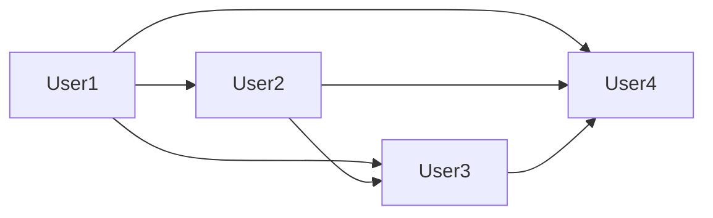
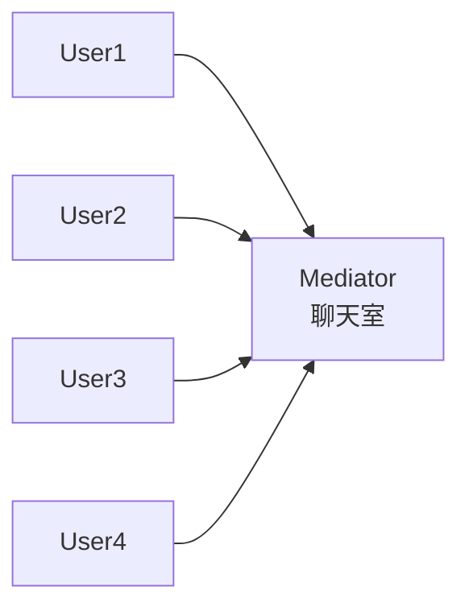
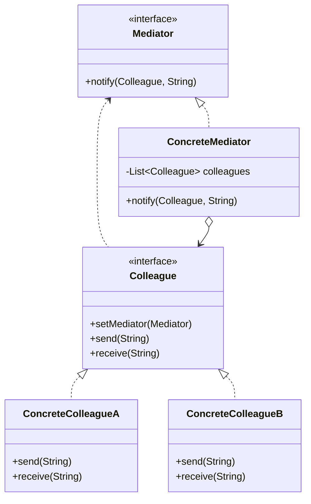
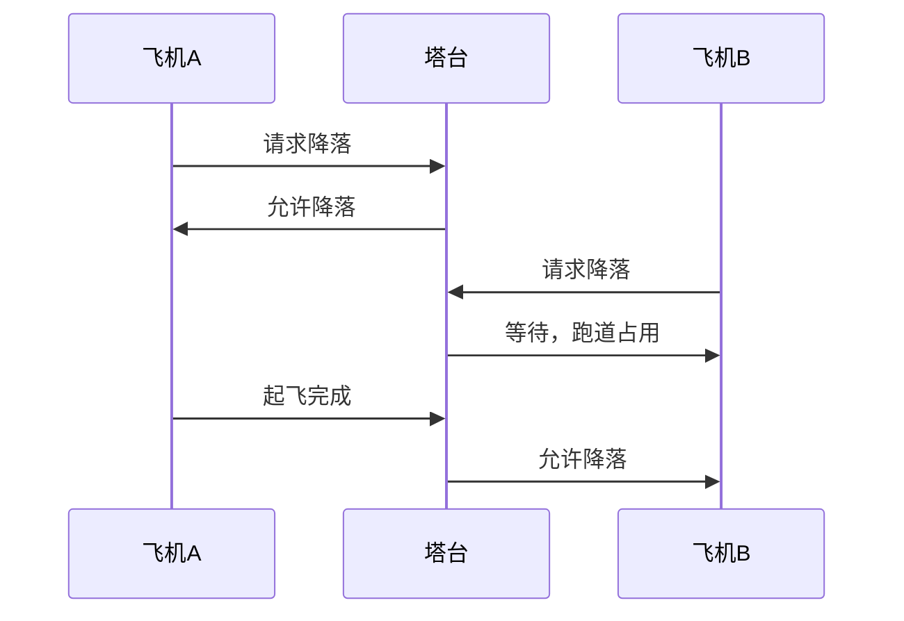
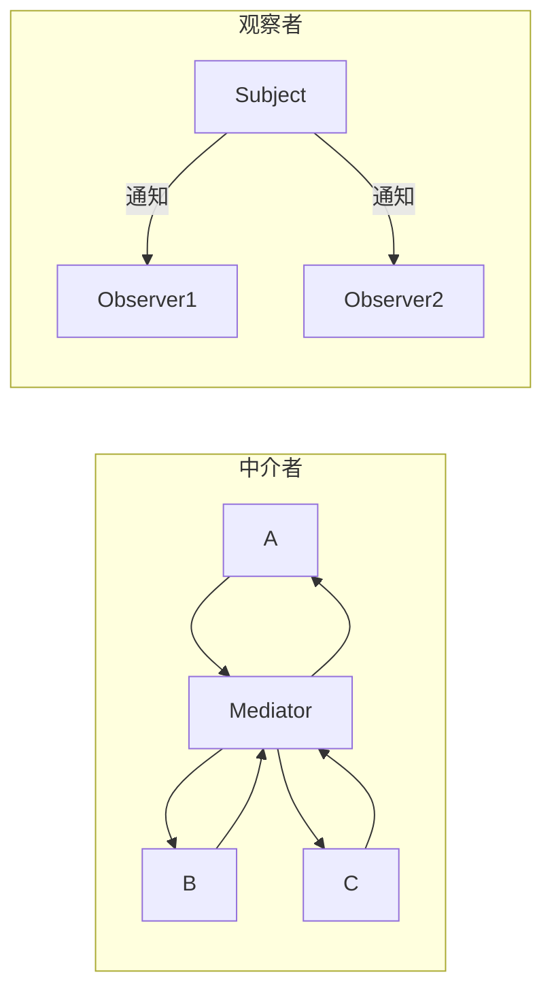
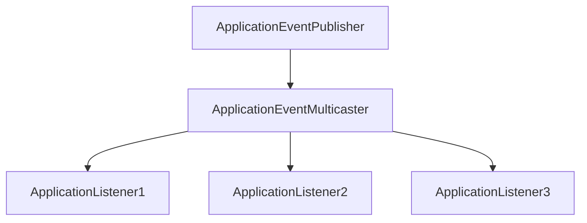
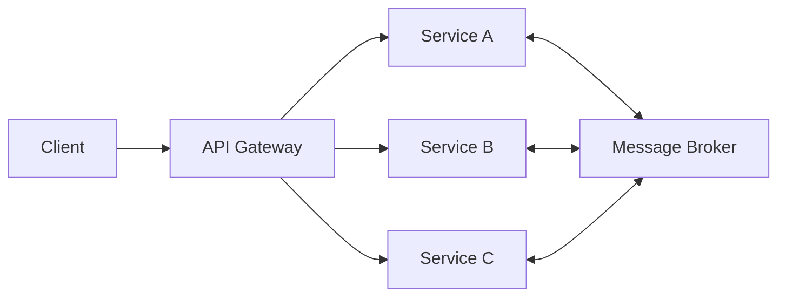

# 中介者模式

飞机场里，飞机之间从不直接通信。每一架飞机降落还是起飞，都由塔台统一调度。如果飞机可以直接互相通话，那航线将混乱不堪——每架飞机都需要知道其他所有飞机的位置和状态。

软件开发中，当对象之间的交互关系变得复杂时（如 10 个对象两两互联），引入一个「协调者」来管理对象间的通信，就是中介者模式。

## 问题背景：网状结构的复杂度

考虑一个聊天室的场景：用户之间可以直接发消息，但每个用户都需要知道其他所有用户的引用：

```java
public class User {
    private String name;
    private List<User> friends;  // 每个用户持有所有好友引用

    public void sendMessage(User to, String message) {
        to.receiveMessage(this, message);
    }

    public void receiveMessage(User from, String message) {
        System.out.println(from.getName() + " -> " + this.name + ": " + message);
    }

    public void broadcast(String message) {
        for (User friend : friends) {
            friend.receiveMessage(this, message);
        }
    }
}
```

问题：

1. 每个 `User` 持有所有其他 `User` 的引用，形成紧密耦合
2. 添加新用户时，需要更新所有现有用户的引用
3. 用户之间的消息逻辑分散在各个 `User` 类中



如果用中介者模式重构：



## 中介者模式结构

中介者模式（Mediator Pattern）用一个中介对象来封装一系列对象交互。中介者使各个对象不需要显式地相互引用，从而使其耦合松散。



### 中介者接口

```java
public interface ChatMediator {
    /**
     * 发送消息
     * @param message 消息内容
     * @param from 发送者
     */
    void sendMessage(String message, User from);

    /**
     * 添加用户
     */
    void addUser(User user);
}
```

### 同事接口

```java
public abstract class User {
    protected String name;
    protected ChatMediator mediator;

    public User(String name, ChatMediator mediator) {
        this.name = name;
        this.mediator = mediator;
    }

    public String getName() {
        return name;
    }

    public void setMediator(ChatMediator mediator) {
        this.mediator = mediator;
    }

    public abstract void send(String message);

    public abstract void receive(String message);
}
```

### 具体同事

```java
public class ChatUser extends User {
    public ChatUser(String name, ChatMediator mediator) {
        super(name, mediator);
    }

    @Override
    public void send(String message) {
        System.out.println(this.name + " 发送消息: " + message);
        mediator.sendMessage(message, this);
    }

    @Override
    public void receive(String message) {
        System.out.println(this.name + " 收到消息: " + message);
    }
}
```

### 具体中介者

```java
public class ChatRoom implements ChatMediator {
    private final List<User> users = new ArrayList<>();

    @Override
    public void sendMessage(String message, User from) {
        // 广播给所有其他用户
        for (User user : users) {
            if (user != from) {
                user.receive(message);
            }
        }
    }

    @Override
    public void addUser(User user) {
        users.add(user);
    }
}
```

### 客户端使用

```java
ChatMediator chatRoom = new ChatRoom();

User alice = new ChatUser("Alice", chatRoom);
User bob = new ChatUser("Bob", chatRoom);
User charlie = new ChatUser("Charlie", chatRoom);

chatRoom.addUser(alice);
chatRoom.addUser(bob);
chatRoom.addUser(charlie);

alice.send("大家好！");
// 输出：
// Alice 发送消息: 大家好！
// Bob 收到消息: 大家好！
// Charlie 收到消息: 大家好！
```

## 航空调度系统案例

一个更复杂的例子：飞机调度系统。

### 参与者

```java
public interface Aircraft {
    String getCallsign();

    void receive(String msg);

    void send(String msg);
}

public class Boeing737 implements Aircraft {
    private final String callsign;
    private AirTrafficControl controlTower;

    public Boeing737(String callsign) {
        this.callsign = callsign;
    }

    public void setControlTower(AirTrafficControl controlTower) {
        this.controlTower = controlTower;
    }

    @Override
    public String getCallsign() {
        return callsign;
    }

    @Override
    public void receive(String msg) {
        System.out.println("[" + callsign + "] 收到: " + msg);
    }

    @Override
    public void send(String msg) {
        System.out.println("[" + callsign + "] 发送: " + msg);
        controlTower.route(this, msg);
    }
}
```

### 中介者

```java
public interface AirTrafficControl {
    void register(Aircraft aircraft);

    void sendMessage(String message, Aircraft from);

    void requestLanding(Aircraft aircraft);

    void requestTakeoff(Aircraft aircraft);
}

public class ControlTower implements AirTrafficControl {
    private final Map<String, Aircraft> aircrafts = new HashMap<>();
    private final Queue<Aircraft> landingQueue = new ArrayDeque<>();
    private Aircraft currentRunwayOccupant;

    @Override
    public void register(Aircraft aircraft) {
        aircrafts.put(aircraft.getCallsign(), aircraft);
        aircraft.setControlTower(this);
        broadcast("[" + aircraft.getCallsign() + "] 已注册到塔台");
    }

    @Override
    public void sendMessage(String message, Aircraft from) {
        // 广播给其他飞机
        for (Aircraft aircraft : aircrafts.values()) {
            if (aircraft != from) {
                aircraft.receive("[" + from.getCallsign() + "] -> " + message);
            }
        }
    }

    @Override
    public void requestLanding(Aircraft aircraft) {
        if (currentRunwayOccupant != null) {
            aircraft.receive("跑道被 [" + currentRunwayOccupant.getCallsign() + "] 占用，等待中");
            landingQueue.offer(aircraft);
        } else {
            currentRunwayOccupant = aircraft;
            aircraft.receive("允许降落，跑道已分配");
        }
    }

    @Override
    public void requestTakeoff(Aircraft aircraft) {
        if (currentRunwayOccupant == aircraft) {
            currentRunwayOccupant = null;
            broadcast("[" + aircraft.getCallsign() + "] 已起飞");
            // 允许下一架飞机降落
            if (!landingQueue.isEmpty()) {
                Aircraft next = landingQueue.poll();
                requestLanding(next);
            }
        } else {
            aircraft.receive("无法起飞，你不在跑道上");
        }
    }

    private void broadcast(String message) {
        for (Aircraft aircraft : aircrafts.values()) {
            aircraft.receive("[塔台广播] " + message);
        }
    }
}
```

### 调度流程



## 中介者模式 vs 观察者模式

两种模式都可以用于对象间通信，但有不同的应用场景：

| 维度 | 中介者模式 | 观察者模式 |
| --- | --- | --- |
| **通信方式** | 对象间通过中介者通信 | 被观察者直接通知观察者 |
| **耦合度** | 对象只与中介者耦合 | 观察者与被观察者耦合 |
| **关注点** | 协调交互 | 状态变化通知 |
| **典型场景** | UI 组件协调 | 事件监听 |
| **复杂度** | 集中化（中介者复杂） | 分散化（每个对象都可能复杂） |



## Spring 中的中介者

### ApplicationEventMulticaster

Spring 的事件广播机制是中介者模式的实现：



```java
public interface ApplicationEventPublisher {
    void publishEvent(ApplicationEvent event);
}

public interface ApplicationEventMulticaster {
    void addApplicationListener(ApplicationListener<?> listener);
    void removeApplicationListener(ApplicationListener<?> listener);
    void multicastEvent(ApplicationEvent event);
}

// Spring 内置实现
public class SimpleApplicationEventMulticaster
        implements ApplicationEventMulticaster {

    private final Map<Class<?>, List<ApplicationListener<?>>> listenerMap = new HashMap<>();

    @Override
    public void multicastEvent(ApplicationEvent event) {
        for (ApplicationListener<?> listener : getListeners(event)) {
            listener.onApplicationEvent(event);
        }
    }
}
```

### 使用示例

```java
@Component
public class OrderEventMulticaster {
    private final ApplicationEventPublisher publisher;

    public OrderEventMulticaster(ApplicationEventPublisher publisher) {
        this.publisher = publisher;
    }

    public void publishOrderCreated(Order order) {
        publisher.publishEvent(new OrderCreatedEvent(order));
    }
}

@Component
public class InventoryService {
    @EventListener
    public void handleOrderCreated(OrderCreatedEvent event) {
        // 扣减库存
        inventoryService.reserve(event.getOrder());
    }
}

@Component
public class NotificationService {
    @EventListener
    public void handleOrderCreated(OrderCreatedEvent event) {
        // 发送通知
        sendConfirmation(event.getOrder());
    }
}
```

## 中介者模式的优缺点

### 优点

1. **降低耦合**：对象之间不再直接引用
2. **集中控制**：交互逻辑集中在中介者中
3. **简化对象协议**：对象不需要知道如何与多个对象交互
4. **易于扩展**：新增同事只需要修改中介者

### 缺点

1. **中介者膨胀**：交互逻辑复杂时，中介者可能变得非常庞大
2. **单点风险**：中介者成为系统的中心，如果它崩溃，整个系统受影响
3. **隐藏了对象关系**：对象间的交互被中介者隐藏，可能导致过度耦合

:::warning 中介者模式的适用条件

当对象之间的直接引用关系造成紧耦合，且这种耦合关系难以维护时，才考虑使用中介者模式。

如果对象之间的关系本身就不复杂，使用中介者模式反而会增加不必要的复杂度。

:::

## 思考题

**问题 1**：中介者模式和外观模式都封装了子系统，它们有什么区别？

<details>
<summary>参考答案</summary>

| 维度 | 中介者模式 | 外观模式 |
| --- | --- | --- |
| **参与者** | 同级对象（Colleague） | 客户端 + 子系统 |
| **通信方向** | 双向（同事之间通过中介者通信） | 单向（客户端调用外观） |
| **目的** | 解耦对象间的交互 | 简化子系统的使用 |
| **子系统关系** | 子系统组件之间本可直接通信 | 子系统组件之间通常不直接通信 |
| **典型场景** | 聊天室、飞机调度 | 文件系统封装、支付网关封装 |

</details>

**问题 2**：如何在运行时动态配置中介者的行为？

<details>
<summary>参考答案</summary>

几种实现方式：

1. **策略模式**：中介者持有路由策略

```java
public interface RoutingStrategy {
    void route(Message message, Colleague from, List<Colleague> to);
}

public class ChatRoomWithStrategy implements ChatMediator {
    private RoutingStrategy strategy;

    public void setStrategy(RoutingStrategy strategy) {
        this.strategy = strategy;
    }

    @Override
    public void sendMessage(String message, User from) {
        strategy.route(new Message(message), from, users);
    }
}

// 广播策略、私信策略、群组策略
```

2. **配置驱动**：通过配置文件定义路由规则

```yaml
mediator:
  rules:
    - from: "admin-*"
      to: "all"
    - from: "vip-*"
      to: "vip-*,admin-*"
```

3. **规则引擎**：使用 Drools 等规则引擎动态配置路由

</details>

**问题 3**：中介者模式在微服务架构中有什么应用？

<details>
<summary>参考答案</summary>

微服务架构中，中介者模式的应用：

1. **API 网关**：作为客户端与微服务的中间层
2. **消息代理**（RabbitMQ/Kafka）：服务间通信的中介
3. **服务网格**（Istio）：Sidecar 代理服务间通信



这些本质上都是**分布式中介者**的概念。

</details>
