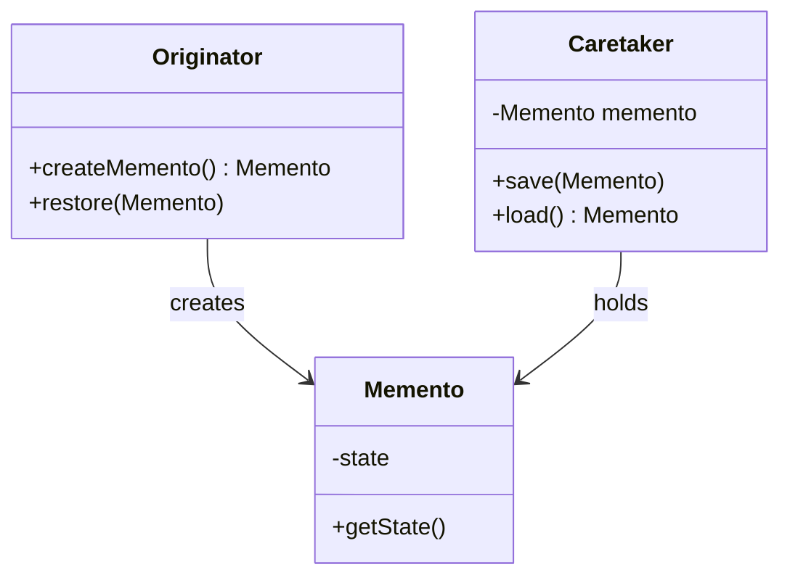
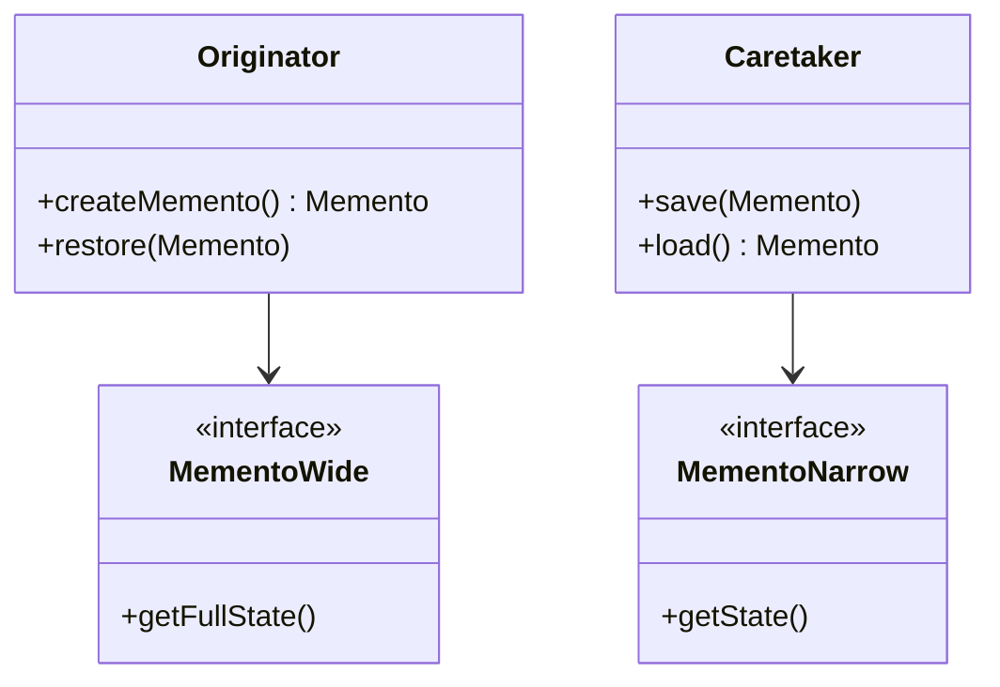
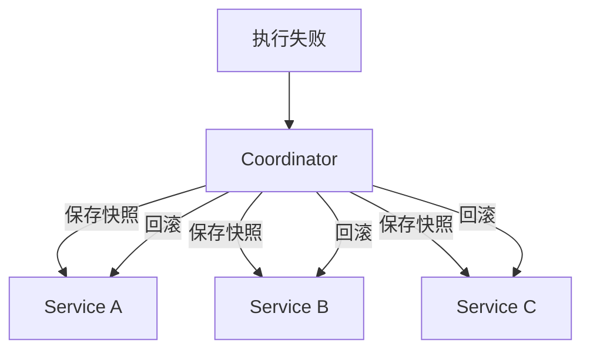

# 备忘录模式

游戏存档功能大家都熟悉：打 Boss 前存个档，如果团灭就读档重来。这个「存档」就是一个备忘录——它保存了游戏在某个时刻的完整状态。

在软件中，这同样是个常见需求：**保存对象的某个状态，以便日后恢复**。数据库事务的回滚、编辑器的撤销功能、系统的配置快照——背后都是备忘录模式的思想。

## 问题背景：对象状态的保存与恢复

很多场景需要保存对象状态：

- **游戏存档**：保存角色属性、位置、背包、任务进度
- **事务回滚**：操作失败时恢复到之前的状态
- **配置管理**：保存配置的快照，支持回滚
- **草稿功能**：编辑器保存未发布的内容

传统方式的实现：

```java
public class Editor {
    private String content;
    private int cursorPosition;

    public void setContent(String content) {
        this.content = content;
    }

    public void setCursorPosition(int position) {
        this.cursorPosition = position;
    }

    // 手动保存状态
    public void saveTo(Object[] state) {
        state[0] = this.content;
        state[1] = this.cursorPosition;
    }

    // 手动恢复状态
    public void restoreFrom(Object[] state) {
        this.content = (String) state[0];
        this.cursorPosition = (int) state[1];
    }
}
```

问题：

1. **破坏封装**：客户端需要知道 `Editor` 的内部结构
2. **状态可能不完整**：如果 `Editor` 有新的字段，需要修改保存/恢复逻辑
3. **类型不安全**：使用 `Object[]` 没有编译时检查

## 备忘录模式结构

备忘录模式（Memento Pattern）捕获并外部化对象的内部状态，以便以后恢复它，而不破坏封装。



### 发起人（Originator）

```java
public class GameCharacter {
    private int health;
    private int mana;
    private String name;
    private Position position;

    public GameCharacter(String name) {
        this.name = name;
        this.health = 100;
        this.mana = 100;
        this.position = new Position(0, 0);
    }

    /**
     * 创建备忘录：保存当前状态
     */
    public CharacterMemento createMemento() {
        return new CharacterMemento(
            health,
            mana,
            name,
            position.copy()
        );
    }

    /**
     * 从备忘录恢复状态
     */
    public void restore(CharacterMemento memento) {
        this.health = memento.getHealth();
        this.mana = memento.getMana();
        this.name = memento.getName();
        this.position = memento.getPosition().copy();
    }

    public void takeDamage(int damage) {
        this.health = Math.max(0, this.health - damage);
    }

    public void useMana(int amount) {
        this.mana = Math.max(0, this.mana - amount);
    }

    // Getters
    public int getHealth() { return health; }
    public int getMana() { return mana; }
    public String getName() { return name; }
    public Position getPosition() { return position; }
}
```

### 备忘录（Memento）

```java
public class CharacterMemento {
    private final int health;
    private final int mana;
    private final String name;
    private final Position position;
    private final LocalDateTime savedAt;

    public CharacterMemento(int health, int mana, String name, Position position) {
        this.health = health;
        this.mana = mana;
        this.name = name;
        this.position = position;
        this.savedAt = LocalDateTime.now();
    }

    // 宽接口：仅 Originator 可以访问
    int getHealth() { return health; }
    int getMana() { return mana; }
    String getName() { return name; }
    Position getPosition() { return position; }

    // 对外暴露的信息
    public LocalDateTime getSavedAt() {
        return savedAt;
    }
}
```

### 负责人（Caretaker）

```java
public class GameSaveManager {
    private final Map<String, Deque<CharacterMemento>> saveSlots =
        new HashMap<>();

    /**
     * 保存存档
     */
    public void save(String slotName, GameCharacter character) {
        CharacterMemento memento = character.createMemento();
        saveSlots.computeIfAbsent(slotName, k -> new ArrayDeque())
                 .push(memento);
        System.out.println("存档已保存到 " + slotName);
    }

    /**
     * 加载最新存档
     */
    public boolean load(String slotName, GameCharacter character) {
        Deque<CharacterMemento> saves = saveSlots.get(slotName);
        if (saves == null || saves.isEmpty()) {
            System.out.println("没有找到存档");
            return false;
        }
        CharacterMemento memento = saves.peek();
        character.restore(memento);
        System.out.println("已加载存档: " + slotName);
        return true;
    }

    /**
     * 回退到指定版本
     */
    public boolean rollback(String slotName, GameCharacter character, int version) {
        Deque<CharacterMemento> saves = saveSlots.get(slotName);
        if (saves == null || saves.size() < version) {
            return false;
        }
        // 弹出并丢弃之后的存档
        while (saves.size() > version) {
            saves.pop();
        }
        return load(slotName, character);
    }

    public List<LocalDateTime> getSaveHistory(String slotName) {
        Deque<CharacterMemento> saves = saveSlots.get(slotName);
        if (saves == null) {
            return Collections.emptyList();
        }
        return saves.stream()
            .map(CharacterMemento::getSavedAt)
            .collect(Collectors.toList());
    }
}
```

### 客户端使用

```java
GameCharacter hero = new GameCharacter("Hero");
GameSaveManager saveManager = new GameSaveManager();

// 开始战斗
saveManager.save("slot1", hero);
hero.takeDamage(30);
System.out.println("战斗前血量: " + hero.getHealth());

// 团灭，读档
saveManager.load("slot1", hero);
System.out.println("读档后血量: " + hero.getHealth());
```

## 宽接口 vs 窄接口

备忘录模式涉及接口的可见性控制：



| 接口类型 | 可见性 | 访问权限 |
| --- | --- | --- |
| **宽接口** | 全部状态 | 仅 `Originator` |
| **窄接口** | 部分状态 | `Caretaker` |

### Java 实现

```java
// 宽接口（包内可见）
class GameMemento {
    private final int health;
    private final int mana;
    private final int x;
    private final int y;

    // 包内可见，供 Originator 访问
    GameMemento(int health, int mana, int x, int y) {
        this.health = health;
        this.mana = mana;
        this.x = x;
        this.y = y;
    }

    int getHealth() { return health; }
    int getMana() { return mana; }
    int getX() { return x; }
    int getY() { return y; }
}

// 窄接口（公开可见）
public interface MementoSnapshot {
    LocalDateTime getTimestamp();
    int getHealth();
}
```

## 克隆方式替代备忘录

对于不需要外部保存状态的场景，可以使用**原型模式**的克隆方式：

```java
public class GameCharacter implements Cloneable {
    private int health;
    private int mana;
    private String name;

    @Override
    public GameCharacter clone() {
        try {
            return (GameCharacter) super.clone();
        } catch (CloneNotSupportedException e) {
            throw new RuntimeException(e);
        }
    }
}

// 使用
GameCharacter hero = new GameCharacter("Hero", 100, 100);

// 克隆代替备忘录
GameCharacter backup = hero.clone();

// 战斗后失败
hero.takeDamage(50);

// 读档
hero = backup;
```

:::tip 克隆 vs 备忘录

| 维度 | 克隆方式 | 备忘录模式 |
| --- | --- | --- |
| 封装性 | 保存的是整个对象 | 可以控制可见性 |
| 复杂度 | 简单 | 需要额外类 |
| 适用场景 | 内部使用 | 需要暴露给外部 |
| 对象引用 | 深拷贝需要处理 | 备忘录内部处理 |

:::

## 反序列化实现深拷贝

序列化是备忘录模式的另一种实现方式：

```java
public class SerializableMemento {
    // 对象必须实现 Serializable
    public static <T extends Serializable> T snapshot(T object) {
        try {
            ByteArrayOutputStream baos = new ByteArrayOutputStream();
            ObjectOutputStream oos = new ObjectOutputStream(baos);
            oos.writeObject(object);

            ByteArrayInputStream bais = new ByteArrayInputStream(baos.toByteArray());
            ObjectInputStream ois = new ObjectInputStream(bais);

            return (T) ois.readObject();
        } catch (IOException | ClassNotFoundException e) {
            throw new RuntimeException(e);
        }
    }
}

// 使用
GameCharacter backup = SerializableMemento.snapshot(hero);
hero.takeDamage(50);
hero = backup;
```

## 保存/恢复对象状态的最佳实践

### 1. 使用 @Transactional 的事务回滚

```java
@Service
public class AccountService {
    @Transactional
    public void transfer(Account from, Account to, BigDecimal amount) {
        from.withdraw(amount);
        to.deposit(amount);
        // 如果抛出异常，事务自动回滚
    }
}
```

### 2. 命令模式 + 备忘录

实现撤销功能：

```java
public class CommandWithMemento implements Command {
    private final Memento before;
    private final Memento after;

    public CommandWithMemento(Memento before, Memento after) {
        this.before = before;
        this.after = after;
    }

    @Override
    public void execute() {
        // 恢复到 after 状态
    }

    @Override
    public void undo() {
        // 恢复到 before 状态
    }
}
```

### 3. 数据库快照

```sql
-- 创建快照表
CREATE TABLE account_snapshots (
    id BIGINT PRIMARY KEY,
    account_id BIGINT,
    balance DECIMAL(19,2),
    snapshot_time TIMESTAMP
);

-- 保存快照
INSERT INTO account_snapshots (account_id, balance, snapshot_time)
VALUES (1, 1000.00, NOW());

-- 恢复到快照
UPDATE account a
SET balance = (
    SELECT balance
    FROM account_snapshots
    WHERE account_id = a.id
    ORDER BY snapshot_time DESC
    LIMIT 1
);
```

## 备忘录模式的优缺点

### 优点

1. **保持封装边界**：不破坏对象的封装性
2. **简化发起人**：状态保存逻辑移到备忘录中
3. **支持撤销**：可以保存多个状态点
4. **状态恢复**：可以方便地恢复对象状态

### 缺点

1. **内存消耗**：如果状态占用内存大，备忘录会消耗很多资源
2. **维护成本**：每次状态变化都需要创建备忘录
3. **生命周期管理**：需要管理备忘录的生命周期

:::warning 备忘录模式的性能问题

如果对象状态频繁变化，备忘录模式可能导致：

1. **内存激增**：频繁保存大对象
2. **GC 压力**：大量临时对象

建议：

1. 使用增量快照而非全量快照
2. 设置保存间隔（如每 N 步保存一次）
3. 使用数据库或文件系统持久化快照

:::

## 思考题

**问题 1**：如何实现游戏中的「自动存档」功能？

<details>
<summary>参考答案</summary>

自动存档的核心是**定时保存**和**关键节点保存**：

```java
public class AutoSaveManager {
    private final GameCharacter character;
    private final GameSaveManager saveManager;
    private ScheduledExecutorService scheduler;

    public AutoSaveManager(GameCharacter character, GameSaveManager saveManager) {
        this.character = character;
        this.saveManager = saveManager;
    }

    public void startAutoSave(String slotName, long intervalSeconds) {
        scheduler = Executors.newSingleThreadScheduledExecutor();
        scheduler.scheduleAtFixedRate(() ->
            saveManager.save(slotName, character),
            intervalSeconds,
            intervalSeconds,
            TimeUnit.SECONDS
        );
    }

    public void stopAutoSave() {
        if (scheduler != null) {
            scheduler.shutdown();
        }
    }
}

// 关键节点保存
public class GameEventListener {
    @Autowired
    private GameSaveManager saveManager;

    @EventListener
    public void onBossSpawned(BossSpawnedEvent event) {
        saveManager.save("boss_" + event.getBossId(), gameCharacter);
    }

    @EventListener
    public void onLevelUp(LevelUpEvent event) {
        saveManager.save("levelup_" + event.getLevel(), gameCharacter);
    }
}
```

</details>

**问题 2**：备忘录模式与原型模式都可以保存对象状态，它们有什么区别？

<details>
<summary>参考答案</summary>

| 维度 | 备忘录模式 | 原型模式 |
| --- | --- | --- |
| **封装性** | 可控的接口（宽/窄） | 完全复制 |
| **状态存储** | 独立的备忘录对象 | 对象自身 |
| **恢复方式** | 恢复到指定状态 | 替换引用 |
| **撤销粒度** | 可精确到任意版本 | 通常只恢复到上一个版本 |
| **适用场景** | 需要外部控制状态 | 内部使用 |

备忘录模式适合需要**外部控制**状态的场景，如用户主动存档；原型模式适合**内部快速复制**的场景。

</details>

**问题 3**：如何在微服务架构中实现分布式事务的回滚？

<details>
<summary>参考答案</summary>

微服务架构中，每个服务维护自己的状态快照：



实现方式：

1. **Saga 模式**：每个服务提供正向操作和补偿操作
2. **事件溯源**：保存所有状态变更事件，而非状态快照
3. **2PC/3PC**：分布式事务协议（不推荐）

```java
// Saga 补偿模式
public class TransferSaga {
    public void execute() {
        try {
            accountService.debit(fromAccount, amount);
            accountService.credit(toAccount, amount);
        } catch (Exception e) {
            // 补偿操作
            accountService.credit(fromAccount, amount);
            throw e;
        }
    }
}
```

</details>
