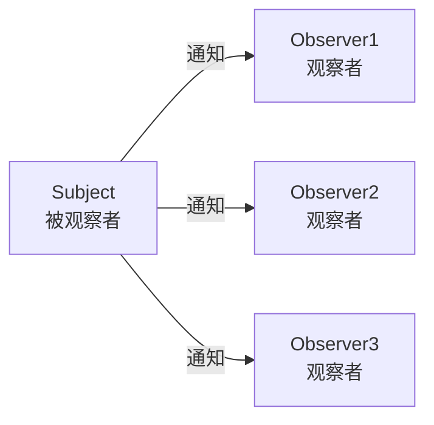
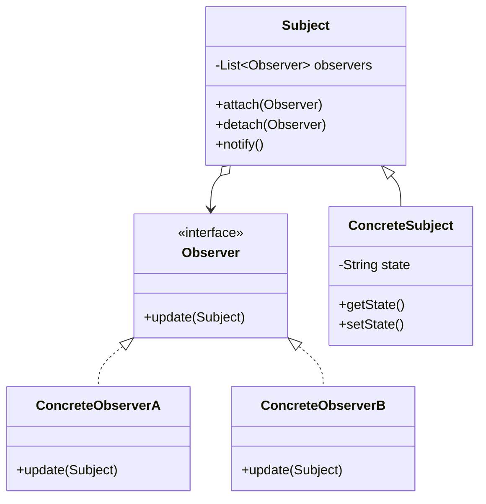
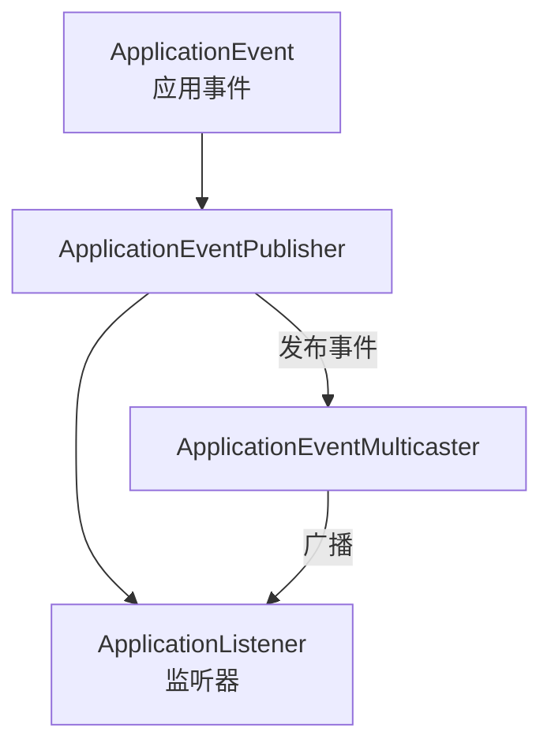
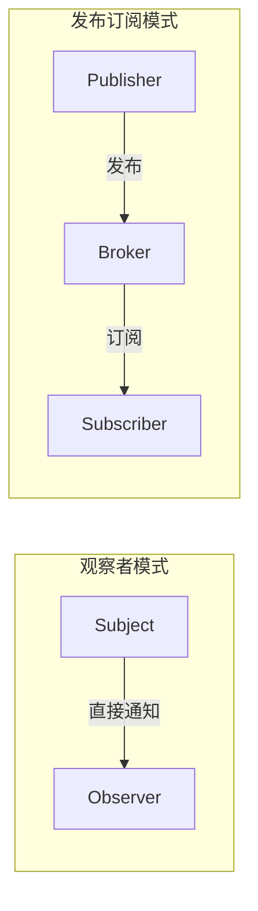

# 观察者模式

周一早上 9 点，你盯着股票行情软件，屏幕上密密麻麻的数字每隔几秒就跳动一次。某只股票突然从绿翻红，你还没来得及反应，APP 已经弹出一条推送：「您的自选股 XXX 涨幅超过 5%，当前价 XXX」。紧接着，邮箱里也收到了邮件提醒。

这背后就是观察者模式的应用：**行情数据（被观察者）一旦变化，所有订阅者（观察者）都会自动收到通知**。

## 问题背景：一对多依赖关系

在软件开发中，经常遇到这样的场景：

- **GUI 事件监听**：点击按钮、输入框变化
- **消息推送**：用户下单后通知库存、物流、财务
- **股票行情**：价格变化实时推送给所有订阅者
- **数据绑定**：模型变化自动更新视图

这些场景的共同特点是：**一个对象（Subject）的状态变化，需要通知多个其他对象（Observer）**。



如果用传统方式实现：

```java
public class Stock {
    private BigDecimal price;
    private List<StockAlert> alerts = new ArrayList<>();

    public void setPrice(BigDecimal newPrice) {
        this.price = newPrice;
        // 直接调用各个观察者的更新方法
        for (StockAlert alert : alerts) {
            alert.onPriceChange(this.price);
        }
    }
}
```

问题在于：**被观察者需要知道所有观察者，并直接调用它们**。这造成了紧耦合——新增一个观察者就要修改被观察者代码。

## 观察者模式结构

观察者模式（Observer Pattern）定义对象间的一种一对多依赖关系，当一个对象状态改变时，所有依赖它的对象都会收到通知并自动更新。



### 观察者接口

```java
public interface Observer {
    /**
     * 当被观察者状态变化时调用
     * @param subject 被观察者引用
     */
    void update(Subject subject);
}
```

### 被观察者

```java
public class Subject {
    private final List<Observer> observers = new CopyOnWriteArrayList<>();
    private String state;

    public void attach(Observer observer) {
        observers.add(observer);
    }

    public void detach(Observer observer) {
        observers.remove(observer);
    }

    public void notifyAllObservers() {
        for (Observer observer : observers) {
            observer.update(this);
        }
    }

    public String getState() {
        return state;
    }

    public void setState(String state) {
        this.state = state;
        notifyAllObservers();
    }
}
```

### 具体观察者实现

```java
public class StockAlert implements Observer {
    private final String alertName;
    private final double threshold;

    public StockAlert(String alertName, double threshold) {
        this.alertName = alertName;
        this.threshold = threshold;
    }

    @Override
    public void update(Subject subject) {
        Stock stock = (Stock) subject;
        double price = stock.getPrice();
        if (price >= threshold) {
            sendNotification("价格达到预警值: " + price);
        }
    }

    private void sendNotification(String message) {
        System.out.println("[" + alertName + "] " + message);
    }
}

public class PriceLogger implements Observer {
    @Override
    public void update(Subject subject) {
        Stock stock = (Stock) subject;
        System.out.println("价格变化记录: " + stock.getPrice());
    }
}
```

### 客户端使用

```java
Stock stock = new Stock("AAPL", 150.0);

StockAlert highPriceAlert = new StockAlert("高价预警", 155.0);
StockAlert lowPriceAlert = new StockAlert("低价预警", 145.0);
PriceLogger logger = new PriceLogger();

stock.attach(highPriceAlert);
stock.attach(lowPriceAlert);
stock.attach(logger);

stock.setPrice(156.5);  // 触发所有观察者
```

## Java 内置观察者支持

JDK 早期提供了 `java.util.Observable` 和 `java.util.Observer`，但**在 Java 9 中已被废弃**：

```java
// 已废弃，不推荐使用
public class StockObservable extends Observable {
    private double price;

    public void setPrice(double price) {
        this.price = price;
        setChanged();      // 标记状态已改变
        notifyObservers(); // 通知所有观察者
    }

    public double getPrice() {
        return price;
    }
}
```

```java
// 已废弃，不推荐使用
public class PriceObserver implements Observer {
    @Override
    public void update(Observable o, Object arg) {
        StockObservable stock = (StockObservable) o;
        System.out.println("价格更新: " + stock.getPrice());
    }
}
```

:::warning 为什么 Observable 被废弃

1. `Observable` 是类而非接口，违反了「面向接口编程」原则
2. `Observable` 的 `setChanged()` 需手动调用，容易遗漏
3. 线程安全需要额外处理
4. 无法组合多个被观察对象

现代 Java 推荐使用 `java.beans.PropertyChangeSupport` 或自定义接口实现。

:::

## 事件监听机制：Spring ApplicationListener

Spring 框架的事件监听机制是观察者模式的典型应用：



### 自定义事件

```java
public class OrderPlacedEvent extends ApplicationEvent {
    private final String orderId;
    private final BigDecimal amount;

    public OrderPlacedEvent(Object source, String orderId, BigDecimal amount) {
        super(source);
        this.orderId = orderId;
        this.amount = amount;
    }

    public String getOrderId() {
        return orderId;
    }

    public BigDecimal getAmount() {
        return amount;
    }
}
```

### 定义监听器

```java
@Component
public class OrderNotificationListener implements ApplicationListener<OrderPlacedEvent> {

    @Autowired
    private NotificationService notificationService;

    @Override
    public void onApplicationEvent(OrderPlacedEvent event) {
        String orderId = event.getOrderId();
        notificationService.sendOrderConfirmation(orderId);
    }
}

@Component
public class InventoryListener implements ApplicationListener<OrderPlacedEvent> {

    @Autowired
    private InventoryService inventoryService;

    @Override
    public void onApplicationEvent(OrderPlacedEvent event) {
        inventoryService.reserveInventory(event.getOrderId());
    }
}

@Component
public class LogisticsListener implements ApplicationListener<OrderPlacedEvent> {

    @Autowired
    private LogisticsService logisticsService;

    @Override
    public void onApplicationEvent(OrderPlacedEvent event) {
        logisticsService.scheduleDelivery(event.getOrderId());
    }
}
```

### 发布事件

```java
@Service
public class OrderService {
    @Autowired
    private ApplicationEventPublisher eventPublisher;

    public void placeOrder(Order order) {
        // 保存订单
        orderRepository.save(order);

        // 发布事件
        eventPublisher.publishEvent(
            new OrderPlacedEvent(this, order.getId(), order.getAmount())
        );
    }
}
```

:::tip Spring 事件机制的优势

1. 解耦：发布者和订阅者不需要知道彼此
2. 异步支持：通过 `@Async` 注解实现异步处理
3. 顺序控制：通过 `@Order` 注解控制监听器执行顺序
4. 条件监听：使用 `@EventListener(condition)` 实现条件触发

:::

## 观察者模式 vs 发布订阅模式

很多人把观察者模式和发布订阅模式混为一谈，但两者有本质区别：

| 维度 | 观察者模式 | 发布订阅模式 |
| --- | --- | --- |
| **通信方式** | 直接通信（Subject 直接调用 Observer） | 间接通信（通过消息代理） |
| **耦合程度** | 发布者和订阅者耦合 | 完全解耦 |
| **消息通道** | 无中间层 | 有消息代理（Broker） |
| **消息路由** | 无 | 支持主题过滤、多消费者 |
| **适用场景** | 进程内通信 | 跨进程、跨服务通信 |



发布订阅模式实际上是一种架构模式，观察者模式是其实现方式之一。其他实现还包括消息队列（如 RabbitMQ、Kafka）等。

## Guava EventBus 实战

Guava 的 `EventBus` 是进程内观察者模式的现代化实现，比 Spring 事件机制更轻量：

### Maven 依赖

```xml
<dependency>
    <groupId>com.google.guava</groupId>
    <artifactId>guava</artifactId>
    <version>32.1.3-jre</version>
</dependency>
```

### 定义事件

```java
public class OrderCreatedEvent {
    private final String orderId;
    private final String customerId;
    private final List<OrderItem> items;

    public OrderCreatedEvent(String orderId, String customerId, List<OrderItem> items) {
        this.orderId = orderId;
        this.customerId = customerId;
        this.items = items;
    }
}

public class OrderShippedEvent {
    private final String orderId;
    private final String trackingNumber;

    public OrderShippedEvent(String orderId, String trackingNumber) {
        this.orderId = orderId;
        this.trackingNumber = trackingNumber;
    }
}
```

### 定义监听器

使用 `@Subscribe` 注解标记事件处理方法：

```java
public class OrderEventHandler {
    private final Logger logger = LoggerFactory.getLogger(getClass());

    @Subscribe
    public void handleOrderCreated(OrderCreatedEvent event) {
        logger.info("订单创建: {}", event.getOrderId());
        sendConfirmationEmail(event.getCustomerId());
    }

    @Subscribe
    public void handleOrderShipped(OrderShippedEvent event) {
        logger.info("订单发货: {}, 运单号: {}", event.getOrderId(), event.getTrackingNumber());
        notifyCustomer(event.getCustomerId());
    }
}
```

### EventBus 配置和使用

```java
public class EventBusCenter {
    private static final EventBus eventBus = new EventBus();

    static {
        // 注册监听器
        eventBus.register(new OrderEventHandler());
        eventBus.register(new InventoryEventHandler());
        eventBus.register(new NotificationEventHandler());
    }

    public static void post(Object event) {
        eventBus.post(event);
    }

    public static void register(Object handler) {
        eventBus.register(handler);
    }
}

// 发布事件
OrderCreatedEvent event = new OrderCreatedEvent("ORDER-001", "CUST-001", items);
EventBusCenter.post(event);
```

### 异步 EventBus

对于需要异步处理的场景，使用 `AsyncEventBus`：

```java
ExecutorService executor = Executors.newFixedThreadPool(4);
AsyncEventBus asyncEventBus = new AsyncEventBus(executor);

asyncEventBus.register(new OrderEventHandler());
asyncEventBus.post(new OrderCreatedEvent("ORDER-001", "CUST-001", items));
```

## 观察者模式的优缺点

### 优点

1. **开闭原则**：新增观察者不需要修改 Subject
2. **建立稳定触发链**：在对象间建立自动触发机制
3. **广播通信**：一次通知，所有订阅者都能收到

### 缺点

1. **通知顺序不确定**：观察者收到通知的顺序不可控
2. **内存泄漏风险**：如果观察者未及时取消注册，Subject 持有引用导致无法回收
3. **循环依赖**：如果 Subject 和 Observer 互相观察，可能导致死循环
4. **性能问题**：观察者过多时，通知过程耗时较长

:::warning 内存泄漏风险

观察者模式最常见的坑是**未取消注册导致的内存泄漏**：

```java
public class MyActivity extends AppCompatActivity {
    private final Observer observer = new Observer() {
        @Override
        public void update(Subject subject) {
            // Activity 被销毁后，这个 observer 仍然被 Subject 持有
        }
    };

    @Override
    protected void onCreate(Bundle savedInstanceState) {
        super.onCreate(savedInstanceState);
        subject.attach(observer);  // 注册
    }

    @Override
    protected void onDestroy() {
        super.onDestroy();
        subject.detach(observer);  // 务必取消注册！
    }
}
```

:::

## 思考题

**问题 1**：如何控制观察者的通知顺序？

<details>
<summary>参考答案</summary>

有几种方式：

1. **使用有序集合**：如 `LinkedHashMap` 代替 `ArrayList`，按插入顺序通知
2. **使用 `@Order` 注解**：Spring 中可以配合 `SmartInitializingSingleton` 实现有序
3. **在通知方法中排序**：通知前对观察者列表排序
4. **拆分消息类型**：不同优先级的观察者使用不同的 Subject

</details>

**问题 2**：观察者模式与 MQ（消息队列）有什么联系？

<details>
<summary>参考答案</summary>

MQ 是观察者模式的扩展实现：

| 维度 | 观察者模式 | MQ |
| --- | --- | --- |
| 通信范围 | 进程内 | 跨进程/跨服务 |
| 消息持久化 | 无 | 支持 |
| 消息过滤 | 无 | 主题交换机、绑定键 |
| 消息确认 | 无 | 消费确认机制 |
| 失败重试 | 无 | 死信队列、重试机制 |

在微服务架构中，MQ（如 RabbitMQ、RocketMQ）常用于替代进程内观察者模式，实现服务间的异步通信。

</details>

**问题 3**：如何实现「观察者只接收特定类型的事件」？

<details>
<summary>参考答案</summary>

几种实现方式：

1. **类型判断**：在 `update` 方法中判断事件类型
2. **泛型监听器**：`Observer<T>` 泛型接口，只接收特定类型
3. **条件注解**：Spring `@EventListener(condition = "#event.type == 'ORDER'")`
4. **分组观察者**：不同分组使用不同的 Subject 实例

```java
// 方式1：类型判断
@Override
public void update(Subject subject) {
    if (subject instanceof OrderSubject) {
        // 处理订单事件
    }
}

// 方式2：泛型（更推荐）
public interface TypedObserver<T> {
    void update(T event);
}
```

</details>
