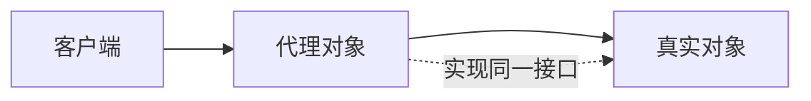
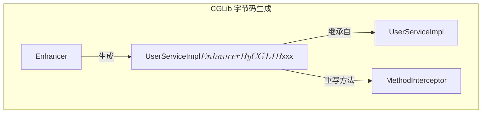
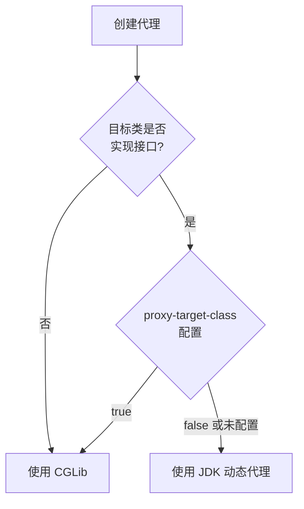

# 代理模式

凌晨 2 点，电商系统的大促活动刚刚结束。运营同学突然报告：有个接口的响应时间从正常的 50ms 飙升到了 3 秒。你翻开代码，`OrderService` 的下单逻辑里竟然找不到任何性能监控——没有接口耗时日志，没有异常捕获，甚至没有记录是谁调了这个方法。

但奇怪的是，每次排查问题都要在海量的业务代码里翻找，而不是快速定位到性能瓶颈在哪里。如果能有一种机制，在不修改 `OrderService` 源码的情况下，自动为所有方法调用添加耗时统计、异常日志、事务控制，那该多好。

这正是代理模式要解决的问题。

## 代理模式的核心思想

代理模式（Proxy Pattern）为其他对象提供一种代理，以控制对这个对象的访问。代理对象在客户端和真实目标对象之间充当中介，可以在调用真实方法前后执行额外的逻辑。



代理模式解决的核心问题不是「对象怎么创建的」，而是「对象怎么被访问的」。它把访问逻辑从业务逻辑中分离出来，让业务代码专注核心功能，而横切关注点（性能监控、事务管理、权限校验）由代理统一处理。

## 静态代理：编译时已确定

最原始的代理实现是静态代理。你需要手动为每个被代理类编写一个代理类，这个代理类在编译时就已经存在。

```java
// 业务接口
public interface UserService {
    void createUser(String name);
    void deleteUser(Long id);
}

// 真实业务实现
public class UserServiceImpl implements UserService {
    @Override
    public void createUser(String name) {
        System.out.println("创建用户: " + name);
    }

    @Override
    public void deleteUser(Long id) {
        System.out.println("删除用户: " + id);
    }
}

// 静态代理类
public class UserServiceProxy implements UserService {
    private final UserService target;

    public UserServiceProxy(UserService target) {
        this.target = target;
    }

    @Override
    public void createUser(String name) {
        long start = System.currentTimeMillis();
        try {
            // 前置增强：参数校验
            if (name == null || name.isEmpty()) {
                throw new IllegalArgumentException("用户名不能为空");
            }
            // 调用真实对象
            target.createUser(name);
            // 后置增强：成功日志
            System.out.println("用户创建成功，耗时: " + (System.currentTimeMillis() - start) + "ms");
        } catch (Exception e) {
            System.out.println("用户创建失败: " + e.getMessage());
            throw e;
        }
    }

    @Override
    public void deleteUser(Long id) {
        long start = System.currentTimeMillis();
        try {
            target.deleteUser(id);
            System.out.println("用户删除成功，耗时: " + (System.currentTimeMillis() - start) + "ms");
        } catch (Exception e) {
            System.out.println("用户删除失败: " + e.getMessage());
            throw e;
        }
    }
}
```

静态代理的致命缺陷在于：**每个业务接口都需要一个对应的代理类**。如果业务接口有 10 个方法，代理类也要写 10 个方法，哪怕这些方法只是简单透传。当业务接口增加或修改时，代理类也要同步维护，代码膨胀速度极快。

## JDK 动态代理：运行时生成字节码

静态代理的困境催生了动态代理。JDK 动态代理不需要你手动编写代理类，而是在运行时通过 `Proxy.newProxyInstance()` 方法生成代理对象的字节码。

```java
import java.lang.reflect.InvocationHandler;
import java.lang.reflect.Method;
import java.lang.reflect.Proxy;

// InvocationHandler：处理方法调用的调用处理器
public class PerformanceHandler implements InvocationHandler {
    private final Object target;

    public PerformanceHandler(Object target) {
        this.target = target;
    }

    @Override
    public Object invoke(Object proxy, Method method, Object[] args) throws Throwable {
        long start = System.currentTimeMillis();
        String methodName = method.getName();
        try {
            // 调用真实对象的方法
            Object result = method.invoke(target, args);
            long cost = System.currentTimeMillis() - start;
            System.out.println("[性能监控] " + methodName + " 执行耗时: " + cost + "ms");
            return result;
        } catch (Exception e) {
            long cost = System.currentTimeMillis() - start;
            System.out.println("[性能监控] " + methodName + " 执行异常，耗时: " + cost + "ms");
            throw e;
        }
    }
}

// 创建代理对象
public class JdkProxyDemo {
    public static void main(String[] args) {
        UserService realService = new UserServiceImpl();

        UserService proxy = (UserService) Proxy.newProxyInstance(
            UserService.class.getClassLoader(),  // 类加载器
            new Class<?>[] { UserService.class }, // 要代理的接口
            new PerformanceHandler(realService)   // 调用处理器
        );

        proxy.createUser("张三");
        proxy.deleteUser(1L);
    }
}
```

`Proxy.newProxyInstance` 生成的代理对象具有以下特点：

1. **实现指定接口**：代理对象实现了被代理类所有 public 接口，客户端可以将其当作真实对象使用
2. **方法调用走 Handler**：所有方法调用会被路由到 `InvocationHandler.invoke()`
3. **反射调用真实方法**：`method.invoke(target, args)` 才是真正执行业务逻辑的地方

JDK 动态代理的原理是：**在内存中动态生成 `$Proxy0` 之类的类**，它实现了 `UserService` 接口，并在每个方法中调用 `PerformanceHandler.invoke()`。这个生成过程由 JVM 在第一次调用时完成，之后会被缓存。

:::warning JDK 动态代理的局限

JDK 动态代理只能代理**接口**，不能代理具体类。如果你尝试对没有实现接口的类使用 JDK 动态代理，会抛出 `IllegalArgumentException: UserServiceImpl is not an interface`。

这正是 Spring AOP 在处理无接口类时选择 CGLib 的原因。

:::

## CGLib：基于继承的字节码生成

CGLib（Code Generation Library）通过继承被代理类、重写非 `final` 方法来实现代理，因此**不需要被代理类实现任何接口**。

```java
import net.sf.cglib.proxy.Enhancer;
import net.sf.cglib.proxy.MethodInterceptor;
import net.sf.cglib.proxy.MethodProxy;

public class CglibProxyDemo {
    public static void main(String[] args) {
        Enhancer enhancer = new Enhancer();
        // 设置父类：CGLib 通过继承实现代理
        enhancer.setSuperclass(UserServiceImpl.class);
        // 设置回调
        enhancer.setCallback(new MethodInterceptor() {
            @Override
            public Object intercept(Object obj, Method method, Object[] args,
                                    MethodProxy proxy) throws Throwable {
                long start = System.currentTimeMillis();
                try {
                    // 调用父类的方法（CGLib 是继承，所以用 super）
                    Object result = proxy.invokeSuper(obj, args);
                    System.out.println("[CGLib] " + method.getName() + " 耗时: "
                                       + (System.currentTimeMillis() - start) + "ms");
                    return result;
                } catch (Exception e) {
                    System.out.println("[CGLib] " + method.getName() + " 异常");
                    throw e;
                }
            }
        });

        UserServiceImpl proxy = (UserServiceImpl) enhancer.create();
        proxy.createUser("李四");
        proxy.deleteUser(2L);
    }
}
```

CGLib 的核心原理是：**在运行时生成被代理类的子类字节码**，在这个子类中重写所有非 `final` 方法，并在方法前后插入增强逻辑。



## JDK 动态代理 vs CGLib

| 维度 | JDK 动态代理 | CGLib |
| --- | --- | --- |
| **实现原理** | 实现接口，聚合真实对象 | 继承被代理类，重写方法 |
| **代理对象类型** | 实现相同接口的另一个类 | 被代理类的子类 |
| **需要接口** | 必须有接口 | 不需要接口 |
| **`final` 方法** | 不影响（接口没有 `final`） | 无法代理 `final`/`private` 方法 |
| **性能** | 反射调用，略慢 | 直接调用父类方法，稍快 |
| **类加载** | 需要接口类在编译时存在 | 需要被代理类在编译时存在 |
| **Spring 默认** | 有接口时优先使用 | 无接口或 `proxy-target-class=true` 时使用 |

:::tip 性能差异有多大？

在 Spring AOP 的典型使用场景下（方法执行前后的通知），两者的性能差异在微秒级别，实际业务代码中完全可以忽略。选择哪种方式主要看**被代理类是否有接口**，而非性能。

:::

## Spring AOP 中的代理选择

Spring AOP 默认使用 JDK 动态代理，但如果目标类没有实现接口，则自动切换为 CGLib。

```java
// application.properties
# 强制使用 CGLib（即使有接口也用继承方式）
spring.aop.proxy-target-class=true

# 优先使用 JDK 动态代理（默认）
spring.aop.proxy-target-class=false
```

Spring 选择代理方式的决策逻辑：



Spring Boot 由于采用 `@EnableAspectJAutoProxy(proxyTargetClass = true)` 作为默认值，因此默认使用 CGLib。这保证了即使 Service 类没有实现接口，也能被正确代理。

## 代理模式的典型应用

### AOP 事务管理

```java
public class TransactionInterceptor implements MethodInterceptor {
    @Override
    public Object invoke(MethodInvocation invocation) throws Throwable {
        Connection connection = null;
        try {
            connection = DataSourceUtils.getConnection();
            connection.setAutoCommit(false);

            Object result = invocation.proceed(); // 调用目标方法

            connection.commit();
            return result;
        } catch (Exception e) {
            if (connection != null) {
                connection.rollback();
            }
            throw e;
        } finally {
            if (connection != null) {
                connection.setAutoCommit(true);
                DataSourceUtils.releaseConnection(connection);
            }
        }
    }
}
```

### 延迟加载（虚拟代理）

```java
public class LazyProxy implements Image {
    private RealImage realImage;
    private String filename;

    public LazyProxy(String filename) {
        this.filename = filename;
    }

    @Override
    public void display() {
        // 第一次使用时才加载真实对象
        if (realImage == null) {
            realImage = new RealImage(filename);
        }
        realImage.display();
    }
}
```

### 访问控制（安全代理）

```java
public class SecurityProxy<T> implements InvocationHandler {
    private final T target;
    private final Set<String> allowedRoles;

    public SecurityProxy(T target, Set<String> allowedRoles) {
        this.target = target;
        this.allowedRoles = allowedRoles;
    }

    @Override
    public Object invoke(Object proxy, Method method, Object[] args) throws Throwable {
        RequiredRole annotation = method.getAnnotation(RequiredRole.class);
        if (annotation != null) {
            String requiredRole = annotation.value();
            if (!allowedRoles.contains(requiredRole)) {
                throw new SecurityException("无权限访问: " + requiredRole);
            }
        }
        return method.invoke(target, args);
    }
}
```

## 代理模式的适用场景与局限

### 适用场景

- 需要在方法执行前后添加统一逻辑（日志、监控、事务）
- 需要控制对对象的访问权限
- 需要延迟加载重量级对象
- 需要远程调用本地化

### 不适用场景

- 被代理类是 `final` 类，无法被继承
- 被代理类的方法是 `final`/`private`，无法被重写
- 只需要为某个类的一两个方法添加增强，直接修改源码可能更简单
- 过度使用代理会导致调试困难（调用栈变深，IDE 断点不好打）

:::danger 代理模式的过度使用

代理模式虽好，但不要滥用。有些团队在每个 Service 都套一层代理，结果排查问题时发现调用栈深达 20 层，找个方法实现要追半天。

代理应该用在真正需要「横切关注点」的地方。对于单个类内部的逻辑，直接修改源码比套代理更清晰。

:::

## 思考题

**问题 1**：JDK 动态代理生成的代理类和被代理类是什么关系？为什么代理对象调用 `hashCode()` 时发现值变了？

<details>
<summary>参考答案</summary>

JDK 动态代理生成的 `$Proxy0` 实现了 `UserService` 接口，但不继承 `UserServiceImpl`。因此，`hashCode()` 和 `equals()` 方法的行为取决于 `InvocationHandler` 的实现。默认情况下，`hashCode()` 返回的是代理对象的 hashCode，而非真实对象的。

解决方法是：在 `InvocationHandler.invoke()` 中拦截 `hashCode()` 和 `equals()` 方法，委托给真实对象处理。

</details>

**问题 2**：如果被代理的类有多个接口，JDK 动态代理能否同时代理所有接口？

<details>
<summary>参考答案</summary>

可以。`Proxy.newProxyInstance()` 的第二个参数是 `Class<?>[] interfaces`，可以传入多个接口。但需要注意：如果两个接口有同名的方法，代理对象调用该方法时会执行同一个 `InvocationHandler`，需要根据 `method.getDeclaringClass()` 判断实际调用的接口。

</details>

**问题 3**：为什么 Spring Boot 默认使用 CGLib 而不是 JDK 动态代理？

<details>
<summary>参考答案</summary>

Spring Boot 默认使用 CGLib 主要有两个原因：

1. **减少代码侵入**：如果用 JDK 动态代理，所有需要被代理的类都必须实现接口，这会强迫开发者为每个类都创建接口，增加代码复杂度。CGLib 通过继承实现，对现有代码无需修改。

2. **一致性保证**：使用 CGLib 时，`AopContext.currentProxy()` 获取的代理对象类型与目标对象类型一致，而 JDK 动态代理返回的是接口类型，可能导致类型转换问题。

</details>
