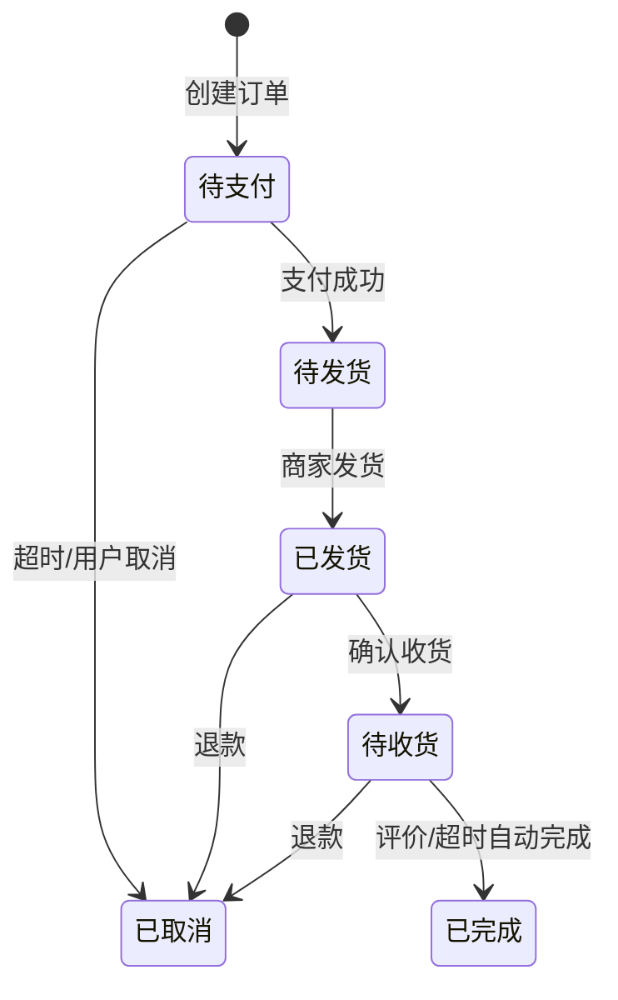
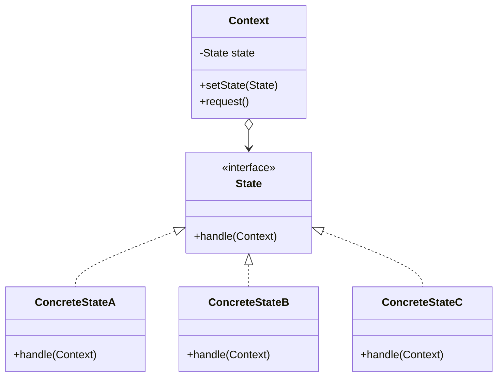
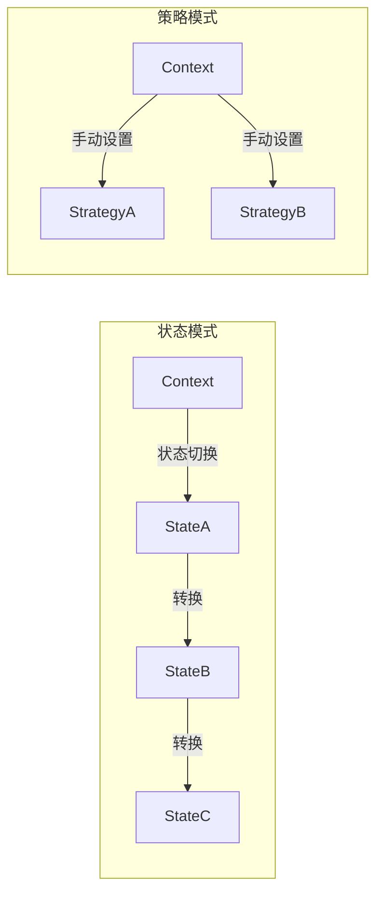
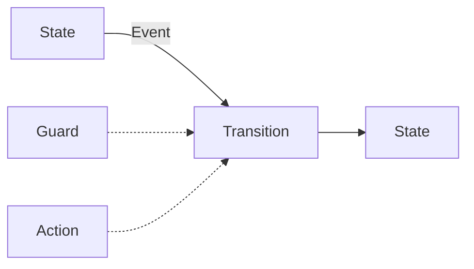

# 状态模式

订单系统的 if-else 越来越多：订单创建后可以支付，支付后才能发货，发货后才能确认收货...各种状态转换规则散落在代码各处，新来的同事每次都要问「这个状态下能执行那个操作吗？」

更糟糕的是，上周线上出了一个 bug：已完成的订单居然还能被取消。原来是某个分支条件写错了，把「已完成」状态的订单错误地加入了可取消列表。

这正是状态模式要解决的问题：**当对象的行为取决于其内部状态，且状态转换规则复杂时，如何避免 if-else 爆炸？**

## 问题背景：状态转换的复杂性

订单状态流转是一个典型的状态机问题：



用 if-else 实现：

```java
public void handle(Order order, String action) {
    // 状态转换规则
    if ("待支付".equals(order.getStatus())) {
        if ("支付".equals(action)) {
            order.setStatus("待发货");
        } else if ("取消".equals(action)) {
            order.setStatus("已取消");
        }
    } else if ("待发货".equals(order.getStatus())) {
        if ("发货".equals(action)) {
            order.setStatus("已发货");
        } else if ("取消".equals(action)) {
            order.setStatus("已取消");
        }
    } else if ("已发货".equals(order.getStatus())) {
        if ("确认收货".equals(action)) {
            order.setStatus("待收货");
        } else if ("退款".equals(action)) {
            order.setStatus("已取消");
        }
    } else if ("待收货".equals(action)) {
        if ("确认收货".equals(action)) {
            order.setStatus("已完成");
        } else if ("退款".equals(action)) {
            order.setStatus("已取消");
        }
    }
    // 每加一个状态就要改这里
}
```

问题：

1. 状态和转换规则混在一起，难以维护
2. 难以保证状态转换的安全性
3. 添加新状态需要修改多处代码

## 状态模式结构

状态模式（State Pattern）允许对象在内部状态改变时改变其行为。对象看起来好像修改了其类。



### 状态接口

```java
public interface OrderState {
    /**
     * 处理订单
     * @param context 订单上下文
     */
    void handle(OrderContext context);

    /**
     * 获取状态名称
     */
    String getStateName();

    /**
     * 当前状态允许的操作
     */
    default List<String> getAllowedActions() {
        return Collections.emptyList();
    }
}
```

### 具体状态实现

```java
public class PendingPaymentState implements OrderState {
    @Override
    public void handle(OrderContext context) {
        // 待支付状态的处理逻辑
        context.setState(this);
    }

    @Override
    public String getStateName() {
        return "待支付";
    }

    @Override
    public List<String> getAllowedActions() {
        return Arrays.asList("支付", "取消");
    }

    public void pay(OrderContext context) {
        // 支付逻辑
        context.setState(new PendingShipmentState());
        context.notifyStateChanged("已支付，等待发货");
    }

    public void cancel(OrderContext context) {
        context.setState(new CancelledState());
        context.notifyStateChanged("订单已取消");
    }
}

public class PendingShipmentState implements OrderState {
    @Override
    public void handle(OrderContext context) {
        // 待发货状态的处理逻辑
    }

    @Override
    public String getStateName() {
        return "待发货";
    }

    @Override
    public List<String> getAllowedActions() {
        return Arrays.asList("发货", "取消");
    }
}

public class ShippedState implements OrderState {
    @Override
    public void handle(OrderContext context) {
        // 已发货状态的处理逻辑
    }

    @Override
    public String getStateName() {
        return "已发货";
    }

    @Override
    public List<String> getAllowedActions() {
        return Arrays.asList("确认收货", "退款");
    }
}

public class CompletedState implements OrderState {
    @Override
    public void handle(OrderContext context) {
        // 已完成状态的处理逻辑
    }

    @Override
    public String getStateName() {
        return "已完成";
    }

    @Override
    public List<String> getAllowedActions() {
        return Arrays.asList("评价", "申请售后");
    }
}

public class CancelledState implements OrderState {
    @Override
    public void handle(OrderContext context) {
        // 已取消状态的处理逻辑
    }

    @Override
    public String getStateName() {
        return "已取消";
    }

    @Override
    public List<String> getAllowedActions() {
        return Collections.emptyList();  // 无可用操作
    }
}
```

### Context 上下文

```java
public class OrderContext {
    private OrderState state;
    private final String orderId;
    private final Logger logger = LoggerFactory.getLogger(getClass());

    public OrderContext(String orderId) {
        this.orderId = orderId;
        this.state = new PendingPaymentState();  // 初始状态
    }

    public void setState(OrderState state) {
        this.state = state;
    }

    public OrderState getState() {
        return state;
    }

    public String getOrderId() {
        return orderId;
    }

    /**
     * 执行操作：委托给当前状态处理
     */
    public void execute(String action) {
        logger.info("订单 {} 执行操作: {}", orderId, action);
        state.handle(this);
        // 根据操作更新状态
        transition(action);
    }

    private void transition(String action) {
        if (state instanceof PendingPaymentState) {
            if ("支付".equals(action)) {
                ((PendingPaymentState) state).pay(this);
            } else if ("取消".equals(action)) {
                ((PendingPaymentState) state).cancel(this);
            }
        }
        // ... 其他状态的处理
    }

    public void notifyStateChanged(String message) {
        logger.info("订单 {} 状态变更: {}", orderId, message);
        // 发送通知：短信、推送等
    }
}
```

### 客户端使用

```java
OrderContext order = new OrderContext("ORDER-001");

order.execute("支付");    // 待支付 -> 待发货
order.execute("发货");    // 待发货 -> 已发货
order.execute("确认收货"); // 已发货 -> 待收货

System.out.println(order.getState().getStateName());  // 待收货
```

## 状态模式 vs 策略模式

状态模式和策略模式结构几乎一样，但解决的问题不同：

| 维度 | 状态模式 | 策略模式 |
| --- | --- | --- |
| **目的** | 状态决定行为，状态间可转换 | 算法可切换，策略间无关联 |
| **切换方式** | 自动切换（通过 context） | 手动切换（外部注入） |
| **状态关系** | 状态之间有转换关系 | 策略之间无关联 |
| **Context 角色** | 持有状态，状态操作 context | 持有策略，context 不被修改 |
| **典型场景** | 订单流转、审批流程 | 支付算法、排序算法 |



## 有限状态机：StateMachine

状态模式的一个扩展是有限状态机（FSM）。在复杂业务中，可以使用状态机框架来管理状态转换。

### 状态机核心概念



- **State（状态）**：系统处于的稳定状态
- **Event（事件）**：触发状态转换的事件
- **Transition（转换）**：从源状态到目标状态的转换
- **Guard（守卫）**：决定转换是否执行的条件
- **Action（动作）**：转换时执行的动作

### 使用 Spring StateMachine

```xml
<dependency>
    <groupId>org.springframework.statemachine</groupId>
    <artifactId>spring-statemachine-core</artifactId>
    <version>4.0.0</version>
</dependency>
```

```java
// 定义状态枚举
public enum OrderState {
    PENDING_PAYMENT,  // 待支付
    PENDING_SHIPMENT, // 待发货
    SHIPPED,         // 已发货
    DELIVERED,       // 已收货
    CANCELLED        // 已取消
}

// 定义事件枚举
public enum OrderEvent {
    PAY,             // 支付
    SHIP,            // 发货
    CONFIRM_RECEIVE, // 确认收货
    CANCEL           // 取消
}
```

```java
@Configuration
@EnableStateMachine
public class OrderStateMachineConfig
        extends StateMachineConfigurerAdapter<OrderState, OrderEvent> {

    @Override
    public void configure(StateMachineConfigurationConfigurer<OrderState, OrderEvent> config)
            throws Exception {
        config
            .withConfiguration()
            .autoStartup(false)
            .listener(listener());
    }

    @Override
    public void configure(StateMachineStateConfigurer<OrderState, OrderEvent> states)
            throws Exception {
        states
            .withStates()
            .initial(OrderState.PENDING_PAYMENT)
            .states(EnumSet.allOf(OrderState.class))
            .end(OrderState.CANCELLED)
            .end(OrderState.DELIVERED);
    }

    @Override
    public void configure(StateMachineTransitionConfigurer<OrderState, OrderEvent> transitions)
            throws Exception {
        transitions
            // 待支付 -> 待发货（支付）
            .withExternal()
            .source(OrderState.PENDING_PAYMENT)
            .target(OrderState.PENDING_SHIPMENT)
            .event(OrderEvent.PAY)
            .guard(orderGuard())
            .action(paymentAction())
            // 待支付 -> 已取消（取消）
            .and()
            .withExternal()
            .source(OrderState.PENDING_PAYMENT)
            .target(OrderState.CANCELLED)
            .event(OrderEvent.CANCEL)
            // 待发货 -> 已发货（发货）
            .and()
            .withExternal()
            .source(OrderState.PENDING_SHIPMENT)
            .target(OrderState.SHIPPED)
            .event(OrderEvent.SHIP)
            // 已发货 -> 已收货（确认收货）
            .and()
            .withExternal()
            .source(OrderState.SHIPPED)
            .target(OrderState.DELIVERED)
            .event(OrderEvent.CONFIRM_RECEIVE);
    }

    @Bean
    public StateMachineListener<OrderState, OrderEvent> listener() {
        return new StateMachineListenerAdapter<>() {
            @Override
            public void stateChanged(State<OrderState, OrderEvent> from,
                                     State<OrderState, OrderEvent> to) {
                log.info("状态变更: {} -> {}",
                    from != null ? from.getId() : "无",
                    to.getId());
            }
        };
    }

    @Bean
    public StateMachineGuard<OrderState, OrderEvent> orderGuard() {
        return context -> {
            // 守卫条件：检查支付金额
            Integer amount = context.getExtendedState()
                .get("amount", Integer.class);
            return amount != null && amount > 0;
        };
    }

    @Bean
    public StateMachineAction<OrderState, OrderEvent> paymentAction() {
        return context -> {
            // 支付成功后的动作：扣库存、发消息等
            log.info("执行支付后动作");
        };
    }
}
```

### 使用状态机

```java
@Service
public class OrderService {
    @Autowired
    private StateMachine<OrderState, OrderEvent> stateMachine;

    public void payOrder(String orderId, BigDecimal amount) {
        // 设置上下文数据
        ExtendedState extendedState = stateMachine.getExtendedState();
        extendedState.getVariables().put("orderId", orderId);
        extendedState.getVariables().put("amount", amount);

        // 发送事件
        boolean success = stateMachine.sendEvent(OrderEvent.PAY);

        if (success) {
            log.info("订单支付成功，当前状态: {}",
                stateMachine.getState().getId());
        } else {
            log.error("订单支付失败，当前状态: {}",
                stateMachine.getState().getId());
        }
    }
}
```

## 状态模式 vs 责任链模式

两者都可以处理多种情况，但适用场景不同：

| 维度 | 状态模式 | 责任链模式 |
| --- | --- | --- |
| **处理方式** | 当前状态决定处理逻辑 | 链式传递，找到能处理的处理器 |
| **状态转换** | 状态间有转换关系 | Handler 之间无关联 |
| **选择机制** | 状态自动决定下一个状态 | 顺序遍历，处理器决定是否处理 |
| **典型场景** | 订单流程、审批流程 | 过滤器链、拦截器链 |

:::tip 选择建议

- 如果业务核心是「状态流转」，使用**状态模式**
- 如果业务核心是「请求传递」，使用**责任链模式**

:::

## 状态模式的优缺点

### 优点

1. **消除 if-else**：状态转换逻辑集中管理
2. **开闭原则**：新增状态不需要修改现有代码
3. **简化 Context**：Context 代码更简洁
4. **状态转换安全**：状态转换规则统一管理，避免非法转换
5. **易于测试**：每个状态可以独立测试

### 缺点

1. **类数量增加**：每个状态都需要一个具体类
2. **状态机复杂度**：状态和转换多时，管理成本增加
3. **状态间耦合**：如果状态之间有共享逻辑，需要通过 Context 提取

:::warning 状态模式 vs 简单 if-else

状态模式不是银弹。只有当状态转换规则足够复杂时，才需要引入状态模式。

| 状态数量 | 转换规则复杂度 | 推荐方案 |
| --- | --- | --- |
| `<= 3` | 简单 | if-else |
| `3-10` | 中等 | 状态模式 |
| `> 10` | 复杂 | 状态机框架 |

:::

## 思考题

**问题 1**：如何实现状态的持久化（如订单状态保存到数据库）？

<details>
<summary>参考答案</summary>

几种实现方式：

1. **状态枚举存储**：状态转换后，将枚举值存入数据库
2. **状态快照**：使用备忘录模式保存状态快照
3. **状态机持久化**：Spring StateMachine 支持将状态机状态持久化到 Redis

```java
// 方式1：状态枚举存储
public enum OrderState {
    PENDING_PAYMENT, PENDING_SHIPMENT, SHIPPED, DELIVERED, CANCELLED
}

// 订单实体
@Entity
public class Order {
    @Enumerated(EnumType.STRING)
    private OrderState state;
}

// 加载时恢复状态
public OrderContext loadOrder(String orderId) {
    Order order = orderRepository.findById(orderId);
    OrderContext context = new OrderContext(orderId);
    context.setState(stateMap.get(order.getState()));
    return context;
}
```

</details>

**问题 2**：如何处理并发状态转换（如两个操作同时修改订单状态）？

<details>
<summary>参考答案</summary>

几种解决方案：

1. **乐观锁**：使用版本号控制

```java
@Version
private Long version;

// 更新时检查版本
@Transactional
public void updateState(Order order, OrderState newState, Long expectedVersion) {
    if (!order.getVersion().equals(expectedVersion)) {
        throw new OptimisticLockException("订单已被其他操作修改");
    }
    order.setState(newState);
    order.setVersion(expectedVersion + 1);
}
```

2. **悲观锁**：使用数据库行锁

```java
@Transactional
public void updateState(Long orderId, OrderState newState) {
    Order order = orderRepository.findByIdWithLock(orderId);
    // 更新逻辑
}
```

3. **状态机内置支持**：Spring StateMachine 支持乐观锁

```java
config.withConfiguration()
    .machineType(UuidStateMachineIdResolver)
    .persistence(persistenceSink);
```

</details>

**问题 3**：状态模式和观察者模式可以一起使用吗？

<details>
<summary>参考答案</summary>

可以，两种模式天然互补：

- **状态模式**：管理状态转换
- **观察者模式**：当状态变化时通知相关方

```java
public class OrderContext {
    private OrderState state;
    private final List<OrderObserver> observers = new CopyOnWriteArrayList<>();

    public void addObserver(OrderObserver observer) {
        observers.add(observer);
    }

    public void setState(OrderState newState) {
        OrderState oldState = this.state;
        this.state = newState;

        // 通知观察者
        for (OrderObserver observer : observers) {
            observer.onStateChanged(this, oldState, newState);
        }
    }
}

public interface OrderObserver {
    void onStateChanged(OrderContext order,
                        OrderState oldState,
                        OrderState newState);
}

// 实现类：库存观察者、消息观察者、审计日志观察者
```

典型的应用场景：**订单状态变更时，通知库存系统扣减库存、通知用户发送推送、记录审计日志**。

</details>
