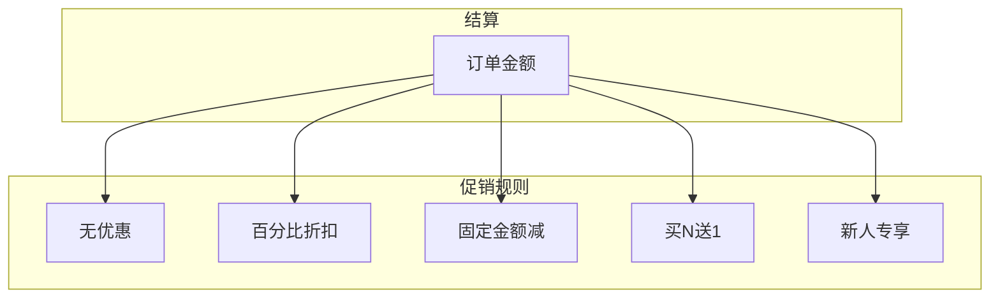
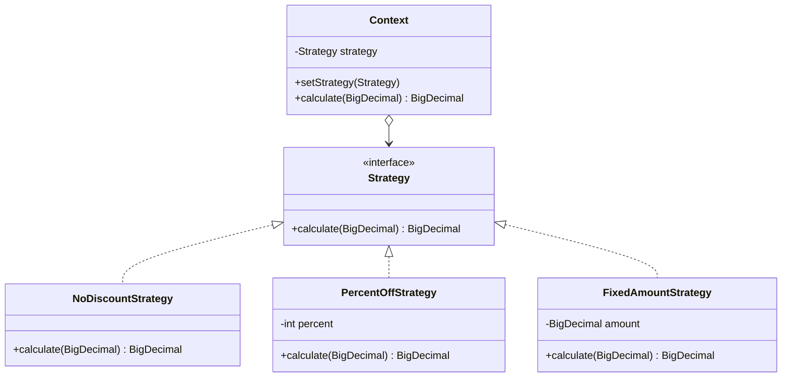

# 策略模式

双十一零点，促销系统崩溃了。运营配置了「满 200 减 50 再叠加 8 折优惠」，但结算时系统只会用第一种规则，后面的优惠全部失效。技术团队连夜排查，发现代码里堆满了 `if (type == 1) {...} else if (type == 2) {...}` —— 每加一种促销规则，就要改一次核心结算代码，还要小心翼翼地不破坏现有逻辑。

这就是策略模式要解决的问题：**当存在多种算法或行为，且需要在运行时切换时，如何避免 if-else 爆炸？**

## 问题背景：促销规则的选择困境

电商系统的促销场景是策略模式的经典应用：



常见的促销规则包括：

- **无优惠**：原价计算
- **百分比折扣**：如 8 折、7.5 折
- **固定金额减免**：如满 200 减 50
- **买 N 送 1**：如买 3 送 1
- **新人专享**：首单优惠

每种规则都是一种「算法」，如果用 if-else 实现：

```java
public BigDecimal calculate(BigDecimal price, String discountType) {
    if ("NONE".equals(discountType)) {
        return price;
    } else if ("PERCENT".equals(discountType)) {
        return price.multiply(BigDecimal.valueOf(0.8));
    } else if ("FIXED".equals(discountType)) {
        return price.subtract(BigDecimal.valueOf(50));
    } else if ("BUY_N_GET_1".equals(discountType)) {
        // 买 N 送 1 的逻辑
    } else if ("NEW_USER".equals(discountType)) {
        // 新人专享的逻辑
    }
    // 每加一种规则就要改这里
    return price;
}
```

问题显而易见：**每增加一种促销规则，都需要修改这段代码**，违反了开闭原则（对扩展开放，对修改关闭）。

## 策略模式结构

策略模式（Strategy Pattern）定义一系列算法，将每个算法封装起来，使它们可以互换。



### 策略接口

定义算法的公共接口：

```java
public interface DiscountStrategy {
    /**
     * 计算折扣后的价格
     * @param originalPrice 原始价格
     * @return 折扣后价格（不会小于0）
     */
    BigDecimal calculate(BigDecimal originalPrice);
}
```

### 具体策略实现

```java
public class NoDiscountStrategy implements DiscountStrategy {
    @Override
    public BigDecimal calculate(BigDecimal originalPrice) {
        return originalPrice;
    }
}

public class PercentOffStrategy implements DiscountStrategy {
    private final int percentOff;  // 如 80 表示 8 折

    public PercentOffStrategy(int percentOff) {
        if (percentOff <= 0 || percentOff >= 100) {
            throw new IllegalArgumentException("折扣比例必须在 0-100 之间");
        }
        this.percentOff = percentOff;
    }

    @Override
    public BigDecimal calculate(BigDecimal originalPrice) {
        return originalPrice
            .multiply(BigDecimal.valueOf(percentOff))
            .divide(BigDecimal.valueOf(100), 2, RoundingMode.HALF_UP);
    }
}

public class FixedAmountStrategy implements DiscountStrategy {
    private final BigDecimal discountAmount;

    public FixedAmountStrategy(BigDecimal discountAmount) {
        this.discountAmount = discountAmount;
    }

    @Override
    public BigDecimal calculate(BigDecimal originalPrice) {
        return originalPrice.subtract(discountAmount).max(BigDecimal.ZERO);
    }
}
```

### Context 上下文

持有策略引用，客户端通过 Context 使用策略：

```java
public class DiscountContext {
    private DiscountStrategy strategy;

    public DiscountContext(DiscountStrategy strategy) {
        this.strategy = strategy;
    }

    public void setStrategy(DiscountStrategy strategy) {
        this.strategy = strategy;
    }

    public BigDecimal calculate(BigDecimal originalPrice) {
        if (strategy == null) {
            throw new IllegalStateException("请先设置折扣策略");
        }
        return strategy.calculate(originalPrice);
    }
}
```

### 客户端使用

```java
public class OrderService {
    private final Map<String, DiscountStrategy> strategies;

    public OrderService() {
        strategies = new HashMap<>();
        strategies.put("NONE", new NoDiscountStrategy());
        strategies.put("PERCENT_80", new PercentOffStrategy(80));
        strategies.put("PERCENT_75", new PercentOffStrategy(75));
        strategies.put("FIXED_50", new FixedAmountStrategy(BigDecimal.valueOf(50)));
    }

    public BigDecimal calculatePrice(BigDecimal originalPrice, String discountType) {
        DiscountStrategy strategy = strategies.get(discountType);
        if (strategy == null) {
            throw new IllegalArgumentException("不支持的折扣类型: " + discountType);
        }
        return strategy.calculate(originalPrice);
    }
}
```

## 与简单工厂结合：策略选择自动化

上面的实现中，客户端仍然需要知道具体策略类的存在。可以通过简单工厂进一步封装：

```java
public class DiscountStrategyFactory {
    private static final Map<String, DiscountStrategy> STRATEGIES = new HashMap<>();

    static {
        STRATEGIES.put("NONE", new NoDiscountStrategy());
        STRATEGIES.put("PERCENT_80", new PercentOffStrategy(80));
        STRATEGIES.put("PERCENT_75", new PercentOffStrategy(75));
        STRATEGIES.put("FIXED_50", new FixedAmountStrategy(BigDecimal.valueOf(50)));
    }

    public static DiscountStrategy getStrategy(String discountType) {
        DiscountStrategy strategy = STRATEGIES.get(discountType);
        if (strategy == null) {
            throw new IllegalArgumentException("不支持的折扣类型: " + discountType);
        }
        return strategy;
    }
}
```

这样客户端代码变得更简洁：

```java
public BigDecimal calculatePrice(BigDecimal originalPrice, String discountType) {
    return DiscountStrategyFactory.getStrategy(discountType)
        .calculate(originalPrice);
}
```

:::tip 策略模式 + 工厂模式的组合

这种组合在实际项目中非常常见，工厂负责创建策略，策略模式负责算法封装。工厂可以进一步演进为**策略注册表**，支持动态注册新策略，无需修改工厂代码。

:::

## 策略模式 vs 简单工厂 vs 模板方法

| 维度 | 策略模式 | 简单工厂 | 模板方法 |
| --- | --- | --- | --- |
| **目的** | 算法可切换 | 对象创建 | 流程复用 |
| **实现方式** | 组合（持有接口引用） | 直接创建 | 继承 |
| **切换时机** | 运行时 | 编译时 | 编译时 |
| **扩展方式** | 增加新策略类 | 增加新产品类 | 增加新子类 |
| **客户端依赖** | 依赖策略接口 | 依赖具体类 | 依赖抽象类 |

### 简单工厂 vs 策略模式

```java
// 简单工厂：创建对象
Product product = ProductFactory.create("A");

// 策略模式：使用对象
Context context = new Context(new ConcreteStrategyA());
context.execute();
```

简单工厂关注「创建」，策略模式关注「使用」。两者可以组合使用——工厂创建策略，策略被 Context 使用。

### 策略模式 vs 模板方法

```java
// 模板方法：通过继承复用流程
abstract class AbstractValidator {
    public final boolean validate() {
        return checkNonNull() && checkFormat() && checkRange();
    }
    abstract boolean checkFormat();
    abstract boolean checkRange();
}

// 策略模式：通过组合复用算法
public interface Validator {
    boolean validate();
}
```

模板方法通过继承复用，策略模式通过组合复用。模板方法适合「流程固定、步骤可变」的场景，策略模式适合「流程不固定、算法可变」的场景。

## Spring 中的策略模式

Spring 框架大量使用策略模式，其中最具代表性的是 `InstantiationStrategy`。

### BeanFactory 的 InstantiationStrategy

当 Spring 创建 Bean 实例时，使用不同的实例化策略：

```java
public interface InstantiationStrategy {
    Object instantiate(RootBeanDefinition beanDefinition, String beanName, BeanFactory owner);

    Object instantiate(RootBeanDefinition beanDefinition, String beanName, BeanFactory owner,
                       Constructor<?> constructor, Object[] args);

    Object instantiate(RootBeanDefinition beanDefinition, String beanName, BeanFactory owner,
                       Object factoryBean, Method factoryMethod, Object[] args);
}
```

Spring 提供了两种具体实现：

- **CglibSubclassingInstantiationStrategy**：使用 CGLIB 生成子类，适用于需要继承的场景
- **SimpleInstantiationStrategy**：使用反射直接调用构造函数，适用于没有特殊需求的场景

### JdbcTemplate 的策略应用

Spring 的 `JdbcTemplate` 在执行查询时使用 `RowMapper` 策略：

```java
public class JdbcTemplate {
    public <T> List<T> query(String sql, Object[] args, RowMapper<T> rowMapper) {
        return jdbcTemplate.execute(sql, (Connection callback) -> {
            PreparedStatement ps = callback.prepareStatement(sql);
            setValues(ps, args);
            ResultSet rs = ps.executeQuery();
            List<T> result = new ArrayList<>();
            int rowNum = 0;
            while (rs.next()) {
                result.add(rowMapper.mapRow(rs, rowNum++));
            }
            return result;
        });
    }
}

// 使用方式
List<User> users = jdbcTemplate.query(
    "SELECT * FROM users WHERE status = ?",
    new Object[]{1},
    (rs, rowNum) -> new User(
        rs.getLong("id"),
        rs.getString("name")
    )
);
```

`RowMapper` 就是典型的策略模式——将结果集映射逻辑封装起来，由客户端决定如何映射。

## 策略模式在 JDK 中的应用

### Comparator 接口

Java 的 `Comparator` 接口是策略模式的经典应用：

```java
public interface Comparator<T> {
    int compare(T o1, T o2);
}
```

不同的比较策略可以互换：

```java
List<User> users = new ArrayList<>();

// 按年龄升序
users.sort(Comparator.comparingInt(User::getAge));

// 按年龄降序
users.sort(Comparator.comparingInt(User::getAge).reversed());

// 按年龄升序，年龄相同按姓名排序
users.sort(Comparator.comparingInt(User::getAge)
    .thenComparing(User::getName));

// 自定义比较策略
users.sort((u1, u2) -> {
    if (!u1.getAge().equals(u2.getAge())) {
        return u1.getAge() - u2.getAge();
    }
    return u1.getName().compareTo(u2.getName());
});
```

### ThreadPoolExecutor 的 RejectedExecutionHandler

线程池的拒绝策略也是策略模式：

```java
public interface RejectedExecutionHandler {
    void rejectedExecution(Runnable r, ThreadPoolExecutor executor);
}
```

JDK 内置四种策略：

- `AbortPolicy`：抛出 `RejectedExecutionException`
- `CallerRunsPolicy`：由调用线程执行
- `DiscardPolicy`：静默丢弃
- `DiscardOldestPolicy`：丢弃最老的任务

```java
ThreadPoolExecutor executor = new ThreadPoolExecutor(
    4, 8, 60, TimeUnit.SECONDS,
    new LinkedBlockingQueue<>(100),
    Executors.defaultThreadFactory(),
    new ThreadPoolExecutor.AbortPolicy()  // 拒绝策略
);
```

## 策略模式的优缺点

### 优点

1. **符合开闭原则**：新增策略不修改现有代码
2. **消除 if-else**：通过多态替代条件判断
3. **算法复用**：策略可以在多个 Context 中共享
4. **运行时切换**：可以在运行时动态切换策略
5. **单元测试**：每个策略可以独立测试

### 缺点

1. **类数量增加**：每个策略都需要一个具体类
2. **客户端需要了解策略**：客户端需要知道有哪些策略可选
3. **策略高度独立**：如果策略之间有依赖关系，策略模式就不适用了

:::warning 策略模式的适用条件

策略模式最适合**策略之间高度独立、没有依赖关系**的场景。如果策略之间有共享状态或需要协调，慎重使用策略模式。

:::

## 思考题

**问题 1**：在什么情况下应该优先使用 if-else 而不是策略模式？

<details>
<summary>参考答案</summary>

当策略数量较少（通常 1-3 种）、不会频繁变化时，if-else 更简单直接。例如只有「是」和「否」两种情况，或者业务规则已经稳定不会再扩展。过早引入策略模式会导致过度设计。

</details>

**问题 2**：如何实现策略的动态注册和热加载？

<details>
<summary>参考答案</summary>

可以使用策略注册表模式：

1. 使用 `Map<String, Class<? extends Strategy>>` 存储策略类
2. 提供 `register(String name, Class<? extends Strategy>)` 方法
3. 结合 Spring 的 `BeanFactory` 或 `InitializingBean` 实现自动发现
4. 对于热加载，可以使用类加载器重新加载策略类

</details>

**问题 3**：策略模式与状态模式看起来很相似，它们有什么区别？

<details>
<summary>参考答案</summary>

两者核心区别在于**策略由谁决定**：

- 策略模式：策略由客户端或外部配置决定，策略之间通常无关联
- 状态模式：状态由对象内部管理，状态之间有明确的转换关系

状态模式中的「状态」决定了行为，而策略模式中的「策略」是主动选择的。

</details>
