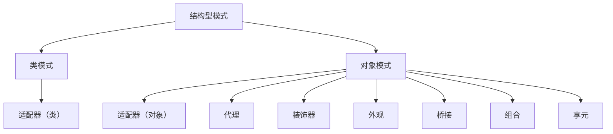
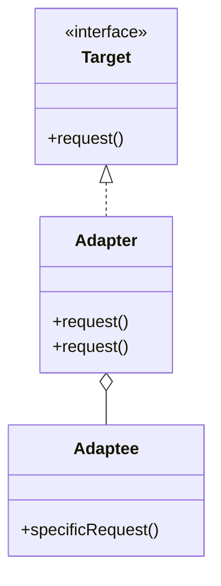
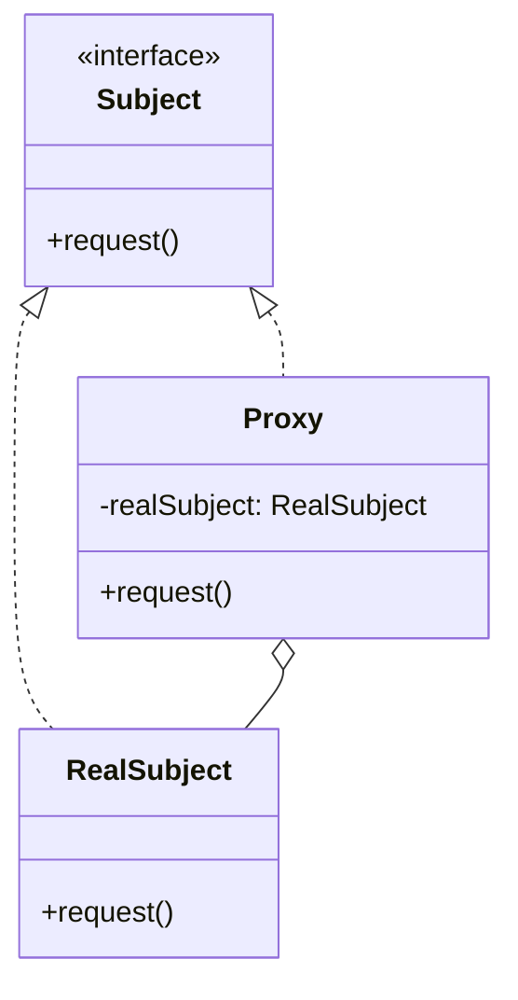
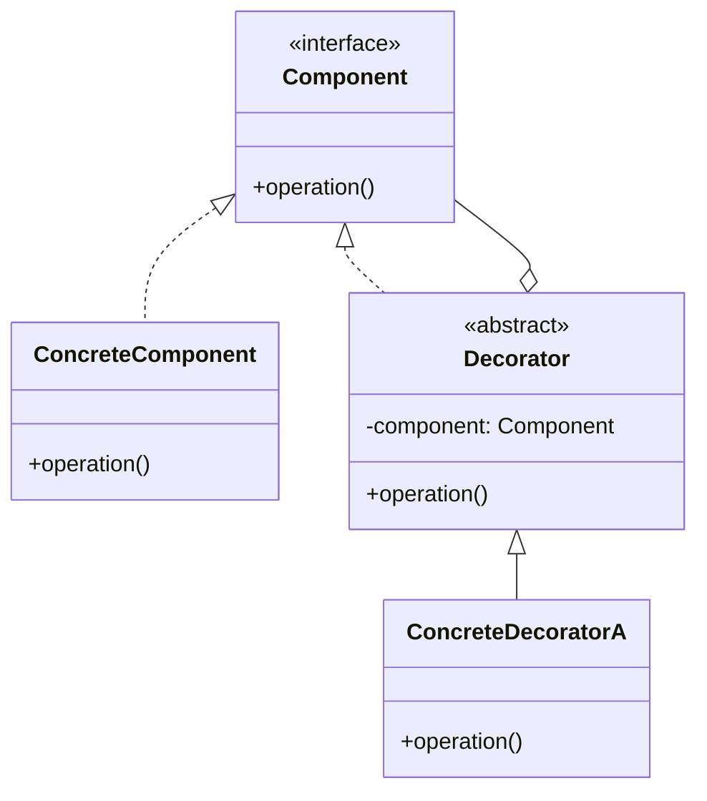
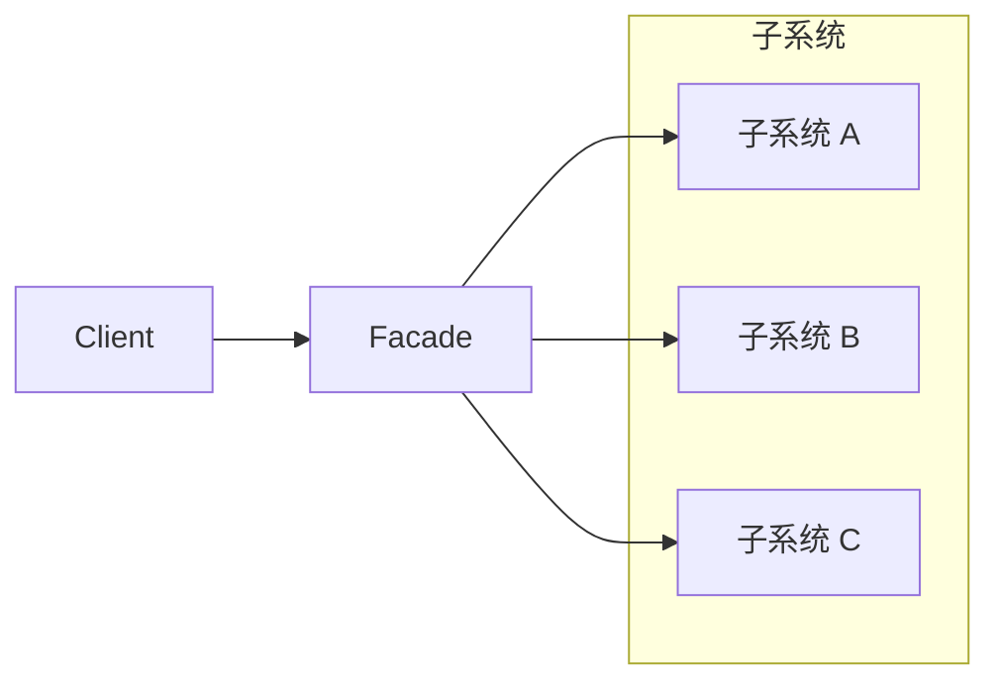
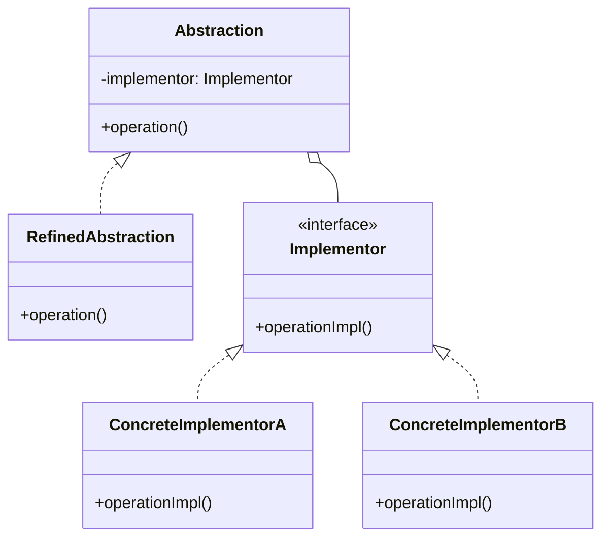
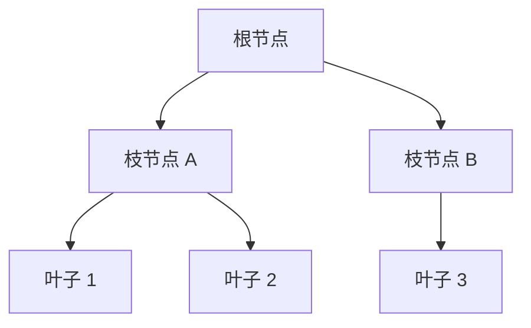
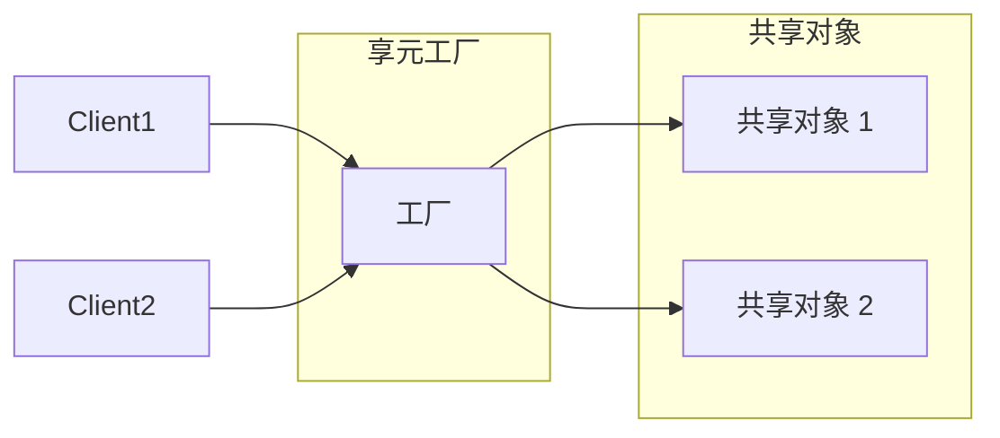

# 结构型模式总览

你接手了一个遗留系统，需要给它的日志模块添加缓存功能。这个模块有 100 多个类，如果要改每个类添加缓存逻辑，工作量巨大。但如果能「装饰」这个模块，让它在保持原有功能的同时增加新能力，问题就简单了。

这就是结构型模式的核心思想：**将类或对象组合成更大的结构**，以获得更灵活的功能。

## 结构型模式的分类



结构型模式分为**类模式**（通过继承组合）和**对象模式**（通过组合/聚合组合）。GoF 的 23 种设计模式中，结构型模式有 7 种。

## 七种结构型模式概览

### 适配器模式（Adapter）

解决接口不兼容问题。想象一下：你的手机需要用 Type-C 充电，但只有 USB-A 的充电线。Type-C 转 USB-A 的转接头就是适配器。



**典型场景**：对接第三方 SDK、兼容老接口

### 代理模式（Proxy）

为其他对象提供一种代理以控制对这个对象的访问。就像房产中介：你不直接找房东，而是通过中介（代理）来处理。



**典型场景**：延迟加载、访问控制、日志记录、远程调用

### 装饰器模式（Decorator）

动态地给对象添加职责。就像给手机装手机壳：你不需要改变手机本身，只需要套上一个壳就能获得保护功能。



**典型场景**：IO 流、日志增强、缓存包装

### 外观模式（Facade）

为子系统中的一组接口提供一个统一的入口。想象去餐厅吃饭：你不需要知道厨房怎么做菜，只需要跟服务员（外观）点菜。



**典型场景**：简化复杂系统调用、统一配置入口

### 桥接模式（Bridge）

将抽象部分与实现部分分离，使它们可以独立变化。想象电脑和打印机：电脑有台式机/笔记本，打印机有激光/喷墨。如果用继承实现需要 4 种组合，但用桥接只需要 2+2 种。



**典型场景**：跨平台应用、多维度变化

### 组合模式（Composite）

将对象组合成树形结构，表示「部分-整体」的层次关系。就像文件夹：文件夹里可以有文件，也可以有子文件夹。



**典型场景**：文件系统、菜单系统、组织架构、XML/HTML 解析

### 享元模式（Flyweight）

运用共享技术有效地支持大量细粒度对象。就像共享单车：一辆车可以被多人共享使用，而不是每人买一辆。



**典型场景**：对象池、字符串常量池、数据库连接池

## 结构型模式对比

| 模式 | 核心目标 | 组合方式 | 适用场景 |
|------|---------|---------|---------|
| 适配器 | 接口转换 | 继承/组合 | 接口不兼容 |
| 代理 | 访问控制 | 组合 | 延迟加载、访问控制 |
| 装饰器 | 动态增强 | 组合 | 功能增强 |
| 外观 | 简化调用 | 组合 | 简化复杂系统 |
| 桥接 | 分离变化 | 组合 | 多维度独立变化 |
| 组合 | 树形结构 | 组合 | 部分-整体层次 |
| 享元 | 共享对象 | 组合 | 大量相似对象 |

## 模式之间的关系

```mermaid
flowchart LR
    subgraph "容易混淆的组合"
        A[适配器]
        B[装饰器]
        C[代理]
    end
    A --->|都是包装器| B
    A --->|都是包装器| C
    B --->|"装饰器：增加功能"<br/>"代理：控制访问"| D[区别]
```

**适配器 vs 装饰器 vs 代理**：

| 维度 | 适配器 | 装饰器 | 代理 |
|------|-------|-------|------|
| 目的 | 转换接口 | 增加功能 | 控制访问 |
| 原接口 | 可能不同 | 必须相同 | 必须相同 |
| 使用时机 | 事后补救 | 设计时规划 | 设计时规划 |
| 典型场景 | 对接第三方 | 增强原有功能 | 延迟加载 |

## 思考题

**问题 1**：装饰器模式和代理模式的核心区别是什么？

<details>
<summary>参考答案</summary>

两者的**结构相似**（都持有原对象的引用），但**目的不同**：

**代理模式**：强调「代替」原对象，控制对原对象的访问。访问者通常不知道代理的存在。

- 远程代理：本地代表远程服务器
- 虚代理：按需加载大对象
- 保护代理：权限控制
- 智能引用：访问计数

**装饰器模式**：强调「增强」原对象，在调用前后添加额外功能。调用方明确知道自己在使用装饰器。

- BufferedInputStream 装饰 FileInputStream
- 缓存装饰器
- 日志装饰器

**简单判断**：如果目的是「控制对对象的访问」，用代理；如果目的是「给对象增加新功能」，用装饰器。

</details>

**问题 2**：为什么装饰器模式不会导致类爆炸？

<details>
<summary>参考答案</summary>

假设有 4 种功能（缓存、日志、事务、权限），每种有 2 种实现方式：

**不用装饰器**：需要 `2 * 2 * 2 * 2 = 16` 个类

**用装饰器**：
- 1 个基础类
- 4 个装饰器（每种功能一个）
- 组合方式：调用时动态组合

```java
Service service = new PermissionDecorator(
    new TransactionDecorator(
        new LogDecorator(
            new CacheDecorator(
                new BasicService()
            )
        )
    )
);
```

这就是装饰器的威力——**用组合代替继承**，避免了类的指数级增长。

</details>

**问题 3**：桥接模式和策略模式有什么区别？

<details>
<summary>参考答案</summary>

两者都涉及「组合」，但解决的问题不同：

| 维度 | 桥接模式 | 策略模式 |
|------|---------|---------|
| 目的 | 分离抽象和实现 | 封装可互换的算法 |
| 变化方向 | 两个维度独立变化 | 算法可以相互替换 |
| 关系 | 抽象持有实现 | 上下文持有策略 |
| 运行时 | 一般不改变 | 运行时可切换 |

**桥接模式示例**：

```java
// 维度 1：消息类型（Email、SMS）
// 维度 2：消息格式（JSON、XML）
// 两者独立变化

Message message = new JsonMessage(new SmsSender());
```

**策略模式示例**：

```java
// 排序算法可以随时切换
List<Integer> list = Arrays.asList(3, 1, 2);
list.sort(Comparator.naturalOrder());     // 自然排序
list.sort(Comparator.reverseOrder());     // 反向排序
```

核心区别：桥接模式解决的是**双维度变化**的问题，策略模式解决的是**算法可切换**的问题。

</details>
