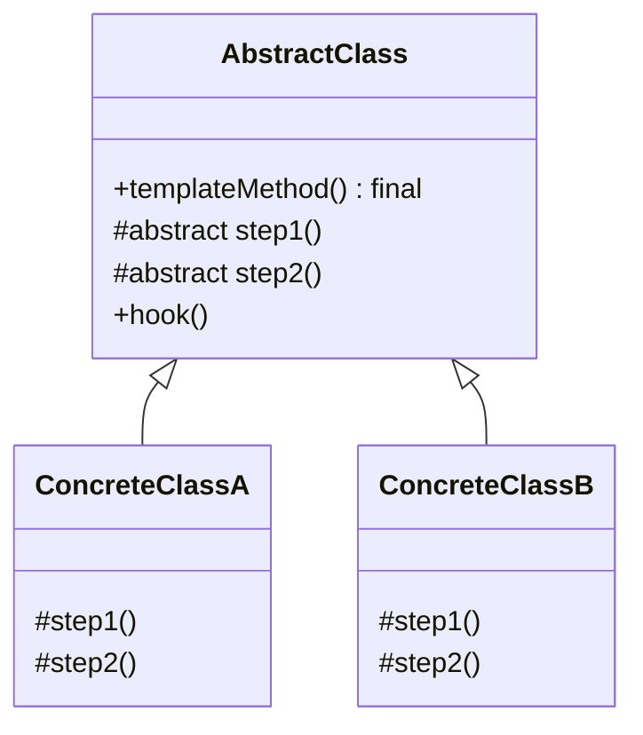
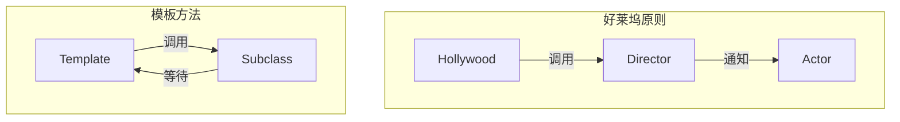

# 模板方法模式

每次写数据库操作代码，你是否厌倦了这种重复：

```java
public User findById(Long id) {
    Connection conn = null;
    PreparedStatement stmt = null;
    ResultSet rs = null;
    try {
        conn = dataSource.getConnection();
        stmt = conn.prepareStatement("SELECT * FROM users WHERE id = ?");
        stmt.setLong(1, id);
        rs = stmt.executeQuery();
        if (rs.next()) {
            return mapToUser(rs);
        }
        return null;
    } catch (SQLException e) {
        throw new RuntimeException(e);
    } finally {
        closeQuietly(rs, stmt, conn);
    }
}

public List<User> findAll() {
    Connection conn = null;
    PreparedStatement stmt = null;
    ResultSet rs = null;
    try {
        conn = dataSource.getConnection();
        stmt = conn.prepareStatement("SELECT * FROM users");
        rs = stmt.executeQuery();
        List<User> users = new ArrayList<>();
        while (rs.next()) {
            users.add(mapToUser(rs));
        }
        return users;
    } catch (SQLException e) {
        throw new RuntimeException(e);
    } finally {
        closeQuietly(rs, stmt, conn);
    }
}
```

连接获取、异常处理、资源释放的代码完全一样，只有 SQL 语句和结果映射不同。这就是模板方法模式的典型应用场景。

## 问题背景：重复的流程，可变的步骤

很多业务流程都有固定的结构，但部分步骤的实现可能不同：

- **JDBC 操作**：获取连接 → 执行 SQL → 处理结果 → 释放资源
- **单元测试**：setup → 执行测试 → 验证结果 → teardown
- **算法流程**：校验 → 查询 → 计算 → 输出
- **框架回调**：初始化 → 执行业务 → 清理

这些场景的共同特点是：**流程固定，但具体实现可能变化**。

## 模板方法模式结构

模板方法模式（Template Method Pattern）在父类中定义一个算法的骨架，将某些步骤延迟到子类中实现。模板方法使得子类可以在不改变算法结构的情况下，重新定义算法的某些特定步骤。



### JDBC 模板的抽象实现

```java
public abstract class JdbcTemplate {

    /**
     * 模板方法：定义算法骨架（final 防止被子类重写）
     */
    public final <T> T execute(String sql, Object[] params, ResultSetExtractor<T> extractor) {
        Connection conn = null;
        PreparedStatement stmt = null;
        ResultSet rs = null;
        try {
            // 1. 获取连接
            conn = getConnection();

            // 2. 创建语句
            stmt = conn.prepareStatement(sql);
            setParameters(stmt, params);

            // 3. 执行查询
            rs = stmt.executeQuery();

            // 4. 处理结果（由子类提供）
            return extractor.extractData(rs);
        } catch (SQLException e) {
            throw new RuntimeException("数据库操作失败", e);
        } finally {
            // 5. 释放资源
            closeQuietly(rs, stmt, conn);
        }
    }

    protected abstract Connection getConnection() throws SQLException;

    protected abstract void closeQuietly(ResultSet rs, Statement stmt, Connection conn);

    protected void setParameters(PreparedStatement stmt, Object[] params) throws SQLException {
        if (params == null) return;
        for (int i = 0; i < params.length; i++) {
            stmt.setObject(i + 1, params[i]);
        }
    }
}
```

### 具体实现

```java
public class UserJdbcTemplate extends JdbcTemplate {
    private final DataSource dataSource;

    public UserJdbcTemplate(DataSource dataSource) {
        this.dataSource = dataSource;
    }

    @Override
    protected Connection getConnection() throws SQLException {
        return dataSource.getConnection();
    }

    @Override
    protected void closeQuietly(ResultSet rs, Statement stmt, Connection conn) {
        closeQuietly(rs);
        closeQuietly(stmt);
        closeQuietly(conn);
    }

    private void closeQuietly(AutoCloseable closeable) {
        if (closeable != null) {
            try {
                closeable.close();
            } catch (Exception ignored) {
            }
        }
    }

    // 具体业务方法
    public User findById(Long id) {
        return execute(
            "SELECT * FROM users WHERE id = ?",
            new Object[]{id},
            rs -> {
                if (rs.next()) {
                    return mapToUser(rs);
                }
                return null;
            }
        );
    }

    public List<User> findByStatus(int status) {
        return execute(
            "SELECT * FROM users WHERE status = ?",
            new Object[]{status},
            rs -> {
                List<User> users = new ArrayList<>();
                while (rs.next()) {
                    users.add(mapToUser(rs));
                }
                return users;
            }
        );
    }

    private User mapToUser(ResultSet rs) throws SQLException {
        return User.builder()
            .id(rs.getLong("id"))
            .name(rs.getString("name"))
            .email(rs.getString("email"))
            .status(rs.getInt("status"))
            .build();
    }
}
```

## 钩子方法：给子类扩展点

钩子方法（Hook Method）是模板方法模式的重要扩展机制。它在父类中提供默认实现，子类可以选择性地覆盖。

```java
public abstract class DataProcessor {

    /**
     * 模板方法
     */
    public final void process() {
        if (shouldProcess()) {  // 钩子方法：控制是否执行
            beforeProcess();
            doProcess();
            afterProcess();
        }
    }

    /**
     * 钩子方法：默认返回 true
     */
    protected boolean shouldProcess() {
        return true;
    }

    /**
     * 钩子方法：空实现
     */
    protected void beforeProcess() {
    }

    protected abstract void doProcess();

    /**
     * 钩子方法：默认空实现
     */
    protected void afterProcess() {
    }
}

// 子类可以覆盖钩子方法
public class LoggingDataProcessor extends DataProcessor {
    private final Logger logger = LoggerFactory.getLogger(getClass());

    @Override
    protected void beforeProcess() {
        logger.info("开始处理数据...");
    }

    @Override
    protected void doProcess() {
        // 实际处理逻辑
    }

    @Override
    protected void afterProcess() {
        logger.info("数据处理完成");
    }
}

// 使用钩子控制是否执行
public class ConditionalDataProcessor extends DataProcessor {
    private final boolean shouldRun;

    @Override
    protected boolean shouldProcess() {  // 覆盖钩子
        return shouldRun;
    }

    @Override
    protected void doProcess() {
        // 处理逻辑
    }
}
```

:::tip 钩子方法的设计原则

钩子方法遵循「**子类可以选择性地覆盖**」的原则：

1. 钩子方法必须有默认实现（可以是空实现）
2. 钩子方法不能是 `abstract`（否则失去可选性）
3. 钩子方法通常用于控制流程（shouldXxx）或提供扩展点（onXxx）

:::

## 好莱坞原则：Don't call us, we'll call you

模板方法模式体现了「好莱坞原则」：**高层组件调用底层组件，而不是底层组件调用高层组件**。



在好莱坞，导演（高层组件）决定何时叫演员（底层组件）来表演，而不是演员自己跑去找导演要角色。

在软件开发中：

```java
// 框架代码（高层）
public abstract class FrameworkClass {
    public final void process() {
        // 框架控制流程
        setup();
        execute();      // 调用子类的业务逻辑
        cleanup();
    }

    protected abstract void execute();
}

// 业务代码（底层）
public class BusinessClass extends FrameworkClass {
    @Override
    protected void execute() {
        // 业务逻辑被框架调用
    }
}
```

框架提供骨架，业务代码填充具体实现。这正是 Spring 框架的核心设计理念。

## Spring 中的模板方法

Spring 大量使用模板方法模式，最典型的是数据访问层。

### JdbcTemplate 源码解析

Spring 的 `JdbcTemplate` 是模板方法模式的经典实现：

```java
public class JdbcTemplate extends JdbcAccessor implements JdbcOperations {

    @Override
    public <T> T execute(ConnectionCallback<T> action) {
        Assert.notNull(action, "Callback object must not be null");

        Connection con = DataSourceUtils.getConnection(obtainDataSource());
        try {
            Connection conToUse = con;
            if (this.nativeJdbcExtractor != null) {
                conToUse = this.nativeJdbcExtractor.getNativeConnection(con);
            } else {
                conToUse = con;
            }
            // 调用回调方法，由客户端提供具体实现
            return action.doInConnection(conToUse);
        } catch (SQLException ex) {
            throw getExceptionTranslator().translate("JdbcTemplate", sql, ex);
        } finally {
            DataSourceUtils.releaseConnection(con, getDataSource());
        }
    }

    @Override
    public <T> T query(final String sql, final ResultSetExtractor<T> rse) {
        return execute((ConnectionCallback<T>) con -> {
            Statement stmt = null;
            ResultSet rs = null;
            try {
                stmt = con.createStatement();
                stmt.setFetchSize(getFetchSize());
                rs = stmt.executeQuery(sql);
                ResultSet rsToUse = rs;
                if (nativeJdbcExtractor != null) {
                    rsToUse = nativeJdbcExtractor.getNativeResultSet(rs);
                }
                return rse.extractData(rsToUse);
            } finally {
                JdbcUtils.closeResultSet(rs);
                JdbcUtils.closeStatement(stmt);
            }
        });
    }
}
```

`JdbcTemplate` 的工作流程：

1. **获取连接**：从数据源获取连接，支持连接复用
2. **创建语句**：创建 `PreparedStatement` 或 `Statement`
3. **执行 SQL**：执行查询或更新
4. **处理结果**：通过回调 `ResultSetExtractor` 处理结果集
5. **释放资源**：关闭 `ResultSet`、`Statement`、`Connection`

使用示例：

```java
jdbcTemplate.query(
    "SELECT id, name, email FROM users WHERE status = ?",
    new Object[]{1},
    (rs) -> {
        List<User> users = new ArrayList<>();
        while (rs.next()) {
            users.add(new User(
                rs.getLong("id"),
                rs.getString("name"),
                rs.getString("email")
            ));
        }
        return users;
    }
);
```

### RestTemplate 同样采用模板方法

```java
RestTemplate template = new RestTemplate();

// GET 请求
User user = template.getForObject(
    "http://api.example.com/users/{id}",
    User.class,
    1
);

// POST 请求
ResponseEntity<User> response = template.postForEntity(
    "http://api.example.com/users",
    new UserRequest("张三", "zhangsan@example.com"),
    User.class
);
```

RestTemplate 内部封装了 HTTP 请求的重复逻辑（连接管理、超时设置、异常处理），用户只需提供具体的请求参数和响应处理。

## 模板方法 vs 回调（Template + Callback）

Java 8 以后，模板方法模式经常与函数式接口（回调）配合使用，实现更灵活的扩展。

### 传统模板方法

```java
public abstract class AbstractValidator {
    public final ValidationResult validate(Object data) {
        if (!checkNotNull(data)) {
            return ValidationResult.fail("数据不能为空");
        }
        if (!checkFormat(data)) {
            return ValidationResult.fail("格式不正确");
        }
        if (!checkBusiness(data)) {
            return ValidationResult.fail("业务校验失败");
        }
        return ValidationResult.success();
    }

    protected abstract boolean checkFormat(Object data);
    protected abstract boolean checkBusiness(Object data);

    protected boolean checkNotNull(Object data) {
        return data != null;
    }
}
```

### 模板方法 + 回调

```java
public class ValidationTemplate {

    public ValidationResult validate(Object data, List<Validator> validators) {
        for (Validator validator : validators) {
            ValidationResult result = validator.validate(data);
            if (!result.isSuccess()) {
                return result;
            }
        }
        return ValidationResult.success();
    }

    @FunctionalInterface
    public interface Validator {
        ValidationResult validate(Object data);
    }
}

// 使用 Lambda
ValidationTemplate template = new ValidationTemplate();
ValidationResult result = template.validate(user, Arrays.asList(
    data -> data != null ? ValidationResult.success() : ValidationResult.fail("为空"),
    data -> ((String) data).length() > 0 ? ValidationResult.success() : ValidationResult.fail("为空字符串"),
    data -> ((String) data).contains("@") ? ValidationResult.success() : ValidationResult.fail("非邮箱格式")
));
```

### JdbcTemplate 的回调机制

Spring JdbcTemplate 支持多种回调方式：

```java
// 方式1：ResultSetExtractor（处理整个结果集）
List<User> users = jdbcTemplate.query(sql, params,
    rs -> {
        List<User> list = new ArrayList<>();
        while (rs.next()) {
            list.add(mapUser(rs));
        }
        return list;
    }
);

// 方式2：RowCallbackHandler（逐行处理）
jdbcTemplate.query(sql, params, rs -> {
    while (rs.next()) {
        users.add(mapUser(rs));
    }
});

// 方式3：RowMapper（每行映射为一个对象）
jdbcTemplate.query(sql, params, (rs, rowNum) -> mapUser(rs));
```

三种回调的区别：

| 类型 | 使用场景 |
| --- | --- |
| `ResultSetExtractor` | 需要在回调中控制整个结果集的处理逻辑 |
| `RowCallbackHandler` | 只需要遍历结果集，不需要返回结果 |
| `RowMapper` | 每行映射为一个对象，返回对象列表 |

## 模板方法的优缺点

### 优点

1. **代码复用**：将公共逻辑抽取到父类
2. **符合开闭原则**：新增子类不需要修改模板方法
3. **好莱坞原则**：框架调用业务代码，而非相反
4. **钩子方法**：提供灵活的可选扩展点

### 缺点

1. **继承是静态的**：子类必须继承整个父类
2. **类数量增加**：每个算法变体都需要一个子类
3. **违反里氏替换**：子类可能通过覆盖方法破坏父类预期行为

:::warning 模板方法的局限性

Java 8 以后，很多模板方法的场景可以用**函数式接口 + Lambda** 替代：

```java
// 模板方法（继承）
abstract class BeforeProcessor {
    public final void process() {
        before();
        doProcess();
        after();
    }
    abstract void doProcess();
}

// 函数式替代（组合）
public class Processor {
    private final Runnable before;
    private final Runnable doProcess;
    private final Runnable after;

    public void process() {
        before.run();
        doProcess.run();
        after.run();
    }
}

Processor processor = new Processor(
    () -> System.out.println("before"),
    () -> { /* do process */ },
    () -> System.out.println("after")
);
```

如果继承层级不深、业务逻辑不复杂，优先考虑函数式方案。

:::

## 思考题

**问题 1**：模板方法模式和策略模式都能封装算法，它们有什么区别？

<details>
<summary>参考答案</summary>

| 维度 | 模板方法 | 策略模式 |
| --- | --- | --- |
| 复用机制 | 继承 | 组合 |
| 切换方式 | 子类继承 | 运行时注入 |
| 粒度 | 算法骨架 | 算法本身 |
| 适用场景 | 流程固定、步骤可变 | 算法独立、可互换 |

模板方法强调「骨架 + 变体步骤」，策略模式强调「算法可互换」。

</details>

**问题 2**：如何在模板方法中实现异步执行？

<details>
<summary>参考答案</summary>

可以通过钩子方法添加异步支持：

```java
public abstract class AsyncTemplate {

    public final void execute() {
        before();
        if (isAsync()) {
            CompletableFuture.runAsync(this::doExecute);
        } else {
            doExecute();
        }
        after();
    }

    // 钩子方法：控制是否异步
    protected boolean isAsync() {
        return false;
    }

    protected void before() { }
    protected abstract void doExecute();
    protected void after() { }
}
```

</details>

**问题 3**：模板方法模式与 Spring 的 `InitializingBean` 有什么关系？

<details>
<summary>参考答案</summary>

`InitializingBean` 是模板方法模式的简化版本，只定义了一个钩子方法：

```java
public interface InitializingBean {
    void afterPropertiesSet() throws Exception;
}

// 使用模板方法封装
public abstract class InitializingObject implements InitializingBean {
    @Override
    public final void afterPropertiesSet() throws Exception {
        validate();
        initialize();
    }

    protected void validate() { }
    protected abstract void initialize();
}
```

Spring 的 `InitializingBean` 提供了一个「初始化回调」的扩展点，具体初始化逻辑由 Bean 自己实现。

</details>
