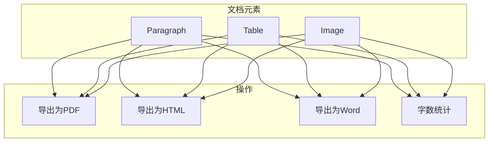
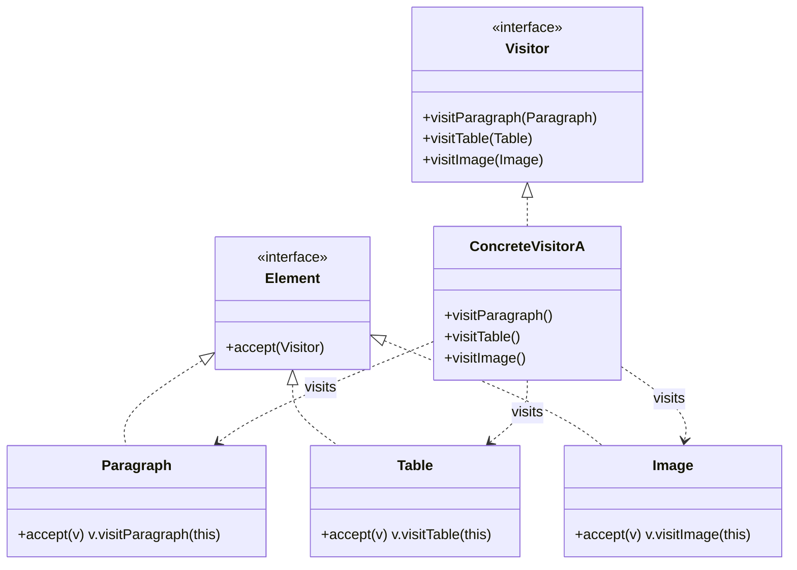
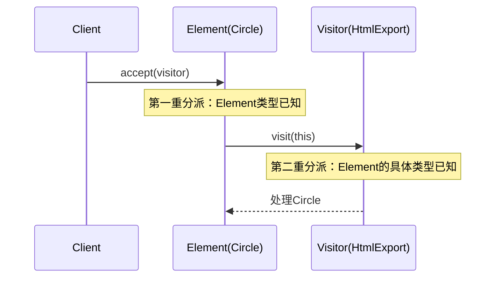

# 访问者模式

编译器的抽象语法树（AST）是一个经典的数据结构分离问题：语法树节点是固定的数据结构，但对这些节点的操作（如类型检查、代码优化、字节码生成）却在不断变化。

如果每次新增一种操作都要修改所有节点类，代码将难以维护。访问者模式正是解决这个问题的利器：**将数据结构与操作分离，数据结构不变，操作自由扩展**。

## 问题背景：数据结构与操作的分离

考虑一个文档元素系统：



如果每个操作都写到元素类中：

```java
public abstract class DocumentElement {
    public abstract void exportToPdf();
    public abstract void exportToHtml();
    public abstract void exportToWord();
    public abstract void countWords();
}

public class Paragraph extends DocumentElement {
    private String text;

    @Override
    public void exportToPdf() { /* PDF 导出逻辑 */ }
    @Override
    public void exportToHtml() { /* HTML 导出逻辑 */ }
    @Override
    public void exportToWord() { /* Word 导出逻辑 */ }
    @Override
    public void countWords() { /* 统计字数 */ }
}
```

问题：

1. 每次新增操作都要修改所有元素类
2. 元素类承担了不该承担的职责
3. 操作之间可能互相干扰

## 访问者模式结构

访问者模式（Visitor Pattern）表示一个作用于某对象结构中的各元素的操作。它使你可以在不改变各元素的类的前提下定义作用于这些元素的新操作。



### 元素接口

```java
public interface DocumentElement {
    /**
     * 接受访问者
     * @param visitor 访问者
     */
    void accept(DocumentVisitor visitor);
}
```

### 具体元素

```java
public class Paragraph implements DocumentElement {
    private String text;

    public Paragraph(String text) {
        this.text = text;
    }

    public String getText() {
        return text;
    }

    @Override
    public void accept(DocumentVisitor visitor) {
        visitor.visit(this);
    }
}

public class Table implements DocumentElement {
    private List<List<String>> rows;
    private String caption;

    public Table(List<List<String>> rows, String caption) {
        this.rows = rows;
        this.caption = caption;
    }

    public List<List<String>> getRows() {
        return rows;
    }

    public String getCaption() {
        return caption;
    }

    @Override
    public void accept(DocumentVisitor visitor) {
        visitor.visit(this);
    }
}

public class Image implements DocumentElement {
    private String url;
    private String alt;

    public Image(String url, String alt) {
        this.url = url;
        this.alt = alt;
    }

    public String getUrl() {
        return url;
    }

    public String getAlt() {
        return alt;
    }

    @Override
    public void accept(DocumentVisitor visitor) {
        visitor.visit(this);
    }
}
```

### 访问者接口

```java
public interface DocumentVisitor {
    void visit(Paragraph paragraph);
    void visit(Table table);
    void visit(Image image);
}
```

### 具体访问者

```java
public class HtmlExporter implements DocumentVisitor {
    private StringBuilder html = new StringBuilder();

    @Override
    public void visit(Paragraph paragraph) {
        html.append("<p>").append(paragraph.getText()).append("</p>\n");
    }

    @Override
    public void visit(Table table) {
        html.append("<table>\n");
        for (List<String> row : table.getRows()) {
            html.append("<tr>");
            for (String cell : row) {
                html.append("<td>").append(cell).append("</td>");
            }
            html.append("</tr>\n");
        }
        html.append("</table>\n");
    }

    @Override
    public void visit(Image image) {
        html.append("\n");
    }

    public String getHtml() {
        return html.toString();
    }
}

public class WordCountVisitor implements DocumentVisitor {
    private int totalWords = 0;

    @Override
    public void visit(Paragraph paragraph) {
        totalWords += countWords(paragraph.getText());
    }

    @Override
    public void visit(Table table) {
        for (List<String> row : table.getRows()) {
            for (String cell : row) {
                totalWords += countWords(cell);
            }
        }
    }

    @Override
    public void visit(Image image) {
        // 图片不计字数
    }

    private int countWords(String text) {
        if (text == null || text.isEmpty()) {
            return 0;
        }
        return text.trim().split("\\s+").length;
    }

    public int getTotalWords() {
        return totalWords;
    }
}
```

### 客户端使用

```java
List<DocumentElement> elements = Arrays.asList(
    new Paragraph("Hello World"),
    new Image("http://example.com/logo.png", "Logo"),
    new Table(Arrays.asList(
        Arrays.asList("Name", "Age"),
        Arrays.asList("Alice", "25"),
        Arrays.asList("Bob", "30")
    ), "人员信息")
);

// 导出为 HTML
HtmlExporter htmlExporter = new HtmlExporter();
elements.forEach(e -> e.accept(htmlExporter));
System.out.println(htmlExporter.getHtml());

// 统计字数
WordCountVisitor wordCounter = new WordCountVisitor();
elements.forEach(e -> e.accept(wordCounter));
System.out.println("Total words: " + wordCounter.getTotalWords());
```

## 双分派原理

访问者模式的核心是**双分派（Double Dispatch）**。

### 单分派的问题

```java
// 单分派：只根据方法参数类型分派
void process(Shape shape) {
    if (shape instanceof Circle) {
        draw((Circle) shape);
    } else if (shape instanceof Rectangle) {
        draw((Rectangle) shape);
    }
}
```

### 双分派的实现

```java
// 第一重分派：运行时确定接收者类型
shape.accept(visitor);

// 第二重分派：运行时确定参数类型
visitor.visit(this);  // this 是具体的 Shape 子类
```



Java 的方法调用机制保证了双分派的实现：

1. `element.accept(visitor)` —— JVM 根据 `element` 的实际类型选择 `accept` 方法
2. `visitor.visit(element)` —— JVM 根据 `visitor` 的实际类型选择 `visit` 方法（参数是具体类型）

## 访问者模式的优缺点

### 优点

1. **开闭原则**：新增操作不需要修改元素类
2. **单一职责**：相关操作集中在一个访问者类中
3. **累积算法**：访问者可以在遍历过程中累积状态

### 缺点

1. **增加新元素困难**：需要修改所有访问者接口
2. **破坏封装**：访问者需要了解元素的内部结构
3. **类型检查**：需要在访问者中进行类型转换

:::warning 访问者模式的适用条件

1. 数据结构稳定（如 AST、DOM 树）
2. 操作经常变化
3. 需要在数据结构上执行多种不相关的操作

如果数据结构经常变化，访问者模式会导致大量修改。

:::

## JDK 中的访问者模式

### FileVisitor

Java NIO 的 `FileVisitor` 用于遍历文件树：

```java
public interface FileVisitor<T> {
    // 进入目录前
    FileVisitResult preVisitDirectory(T dir, BasicFileAttributes attrs);

    // 访问文件
    FileVisitResult visitFile(T file, BasicFileAttributes attrs);

    // 访问文件失败
    FileVisitResult visitFileFailed(T file, IOException exc);

    // 离开目录后
    FileVisitResult postVisitDirectory(T dir, IOException exc);
}
```

```java
Path start = Paths.get("/path/to/dir");

Files.walkFileTree(start, new SimpleFileVisitor<Path>() {
    @Override
    public FileVisitResult visitFile(Path file, BasicFileAttributes attrs) {
        System.out.println("Found file: " + file);
        return FileVisitResult.CONTINUE;
    }

    @Override
    public FileVisitResult preVisitDirectory(Path dir, BasicFileAttributes attrs) {
        System.out.println("Entering: " + dir);
        return FileVisitResult.CONTINUE;
    }

    @Override
    public FileVisitResult visitFileFailed(Path file, IOException exc) {
        System.err.println("Failed: " + file);
        return FileVisitResult.CONTINUE;
    }
});
```

### ElementVisitor

Java 编译器的 `ElementVisitor` 用于处理注解处理中的程序元素：

```java
public interface ElementVisitor<R, P> {
    R visit(Element e, P p);
    R visitPackage(PackageElement e, P p);
    R visitType(TypeElement e, P p);
    R visitVariable(VariableElement e, P p);
    R visitExecutable(ExecutableElement e, P p);
    R visitTypeParameter(TypeParameterElement e, P p);
}
```

## AST 编译器案例

模拟一个简单的算术表达式编译器：

### 表达式元素

```java
public interface Expression {
    <R> R accept(ExpressionVisitor<R> visitor);
}

public class NumberExpr implements Expression {
    private final int value;

    public NumberExpr(int value) {
        this.value = value;
    }

    public int getValue() {
        return value;
    }

    @Override
    public <R> R accept(ExpressionVisitor<R> visitor) {
        return visitor.visit(this);
    }
}

public class AddExpr implements Expression {
    private final Expression left;
    private final Expression right;

    public AddExpr(Expression left, Expression right) {
        this.left = left;
        this.right = right;
    }

    public Expression getLeft() {
        return left;
    }

    public Expression getRight() {
        return right;
    }

    @Override
    public <R> R accept(ExpressionVisitor<R> visitor) {
        return visitor.visit(this);
    }
}

public class MultiplyExpr implements Expression {
    private final Expression left;
    private final Expression right;

    public MultiplyExpr(Expression left, Expression right) {
        this.left = left;
        this.right = right;
    }

    public Expression getLeft() {
        return left;
    }

    public Expression getRight() {
        return right;
    }

    @Override
    public <R> R accept(ExpressionVisitor<R> visitor) {
        return visitor.visit(this);
    }
}
```

### 表达式访问者

```java
public interface ExpressionVisitor<R> {
    R visit(NumberExpr expr);
    R visit(AddExpr expr);
    R visit(MultiplyExpr expr);
}

// 求值访问者
public class Evaluator implements ExpressionVisitor<Integer> {
    @Override
    public Integer visit(NumberExpr expr) {
        return expr.getValue();
    }

    @Override
    public Integer visit(AddExpr expr) {
        int left = expr.getLeft().accept(this);
        int right = expr.getRight().accept(this);
        return left + right;
    }

    @Override
    public Integer visit(MultiplyExpr expr) {
        int left = expr.getLeft().accept(this);
        int right = expr.getRight().accept(this);
        return left * right;
    }
}

// 打印访问者
public class Printer implements ExpressionVisitor<String> {
    @Override
    public String visit(NumberExpr expr) {
        return String.valueOf(expr.getValue());
    }

    @Override
    public String visit(AddExpr expr) {
        return "(" + expr.getLeft().accept(this) + " + " +
               expr.getRight().accept(this) + ")";
    }

    @Override
    public String visit(MultiplyExpr expr) {
        return "(" + expr.getLeft().accept(this) + " * " +
               expr.getRight().accept(this) + ")";
    }
}

// 字节码生成访问者
public class BytecodeGenerator implements ExpressionVisitor<String> {
    @Override
    public String visit(NumberExpr expr) {
        return "ICONST_" + expr.getValue();
    }

    @Override
    public String visit(AddExpr expr) {
        return expr.getLeft().accept(this) + "\n" +
               expr.getRight().accept(this) + "\n" +
               "IADD";
    }

    @Override
    public String visit(MultiplyExpr expr) {
        return expr.getLeft().accept(this) + "\n" +
               expr.getRight().accept(this) + "\n" +
               "IMUL";
    }
}
```

### 使用示例

```java
// 表达式: (3 + 5) * 2
Expression expr = new MultiplyExpr(
    new AddExpr(new NumberExpr(3), new NumberExpr(5)),
    new NumberExpr(2)
);

// 求值
Evaluator evaluator = new Evaluator();
int result = expr.accept(evaluator);
System.out.println("Result: " + result);  // 16

// 打印
Printer printer = new Printer();
String str = expr.accept(printer);
System.out.println("Expression: " + str);  // ((3 + 5) * 2)

// 生成字节码
BytecodeGenerator generator = new BytecodeGenerator();
String bytecode = expr.accept(generator);
System.out.println("Bytecode:\n" + bytecode);
// ICONST_3
// ICONST_5
// IADD
// ICONST_2
// IMUL
```

## 思考题

**问题 1**：访问者模式和策略模式都能封装算法，它们有什么区别？

<details>
<summary>参考答案</summary>

| 维度 | 访问者模式 | 策略模式 |
| --- | --- | --- |
| **数据结构** | 需要访问多个不同类型的对象 | 作用于单一对象 |
| **扩展方向** | 扩展操作，不扩展元素 | 扩展算法，不扩展上下文 |
| **分派机制** | 双分派 | 单分派 |
| **适用场景** | AST、DOM 遍历 | 算法可切换 |

访问者模式适合「数据结构稳定，操作经常变化」；策略模式适合「算法需要运行时切换」。

</details>

**问题 2**：如何处理访问者模式中「添加新元素」的问题？

<details>
<summary>参考答案</summary>

几种解决方案：

1. **提供默认实现**：在访问者接口中提供默认实现

```java
public interface DocumentVisitor {
    default void visit(Paragraph p) { /* 默认空实现 */ }
    default void visit(Table t) { /* 默认空实现 */ }
    default void visit(Image i) { /* 默认空实现 */ }
    // 新元素需要实现 visit(NewElement e)
}
```

2. **使用反射**：动态调用方法

```java
public class ReflectiveVisitor implements DocumentVisitor {
    @Override
    public void visit(DocumentElement element) {
        String methodName = "visit" + element.getClass().getSimpleName();
        try {
            Method method = getClass().getMethod(methodName, element.getClass());
            method.invoke(this, element);
        } catch (NoSuchMethodException e) {
            visitDefault(element);
        }
    }
}
```

3. **接受变化**：当数据结构需要频繁变化时，不使用访问者模式

</details>

**问题 3**：访问者模式在 Spring 框架中有哪些应用？

<details>
<summary>参考答案</summary>

Spring 中访问者模式的应用：

1. **BeanDefinitionVisitor**：访问和修改 Bean 定义
2. **PropertySourceVisitor**：访问属性源
3. **BeanValidationVisitor**：验证 Bean 属性

```java
// Spring 的 BeanDefinitionVisitor
public class BeanDefinitionVisitor {
    public void visitBeanDefinition(BeanDefinitionHolder bdHolder) {
        visitBeanDefinition(bdHolder.getBeanDefinition());
        visitPropertyValues(bdHolder.getBeanDefinition().getPropertyValues());
        visitConstructorArgumentValues(
            bdHolder.getBeanDefinition().getConstructorArgumentValues()
        );
    }
}
```

</details>
