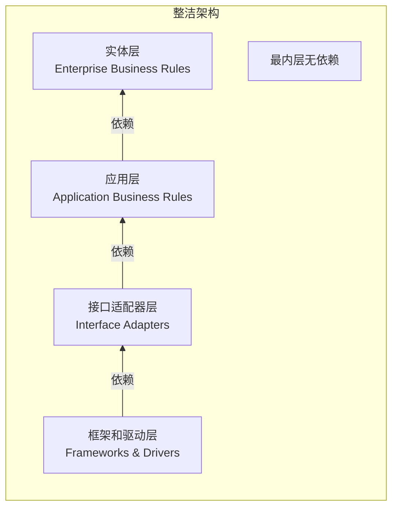
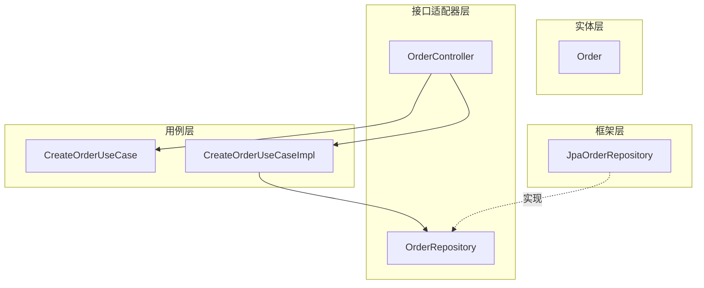

# 整洁架构

Bob 大叔（Robert C. Martin）在 2012 年提出了「整洁架构」（Clean Architecture）的概念。但如果你仔细看他画的同心圆，你会发现：**这不是一个新发明，而是一种系统化的总结**。六边形架构、洋葱架构、DCI 架构、RBAC 架构——这些模式的核心思想都被他提炼到了一个同心圆里。

整洁架构的最大贡献不是「圆形画法」，而是**明确了一条铁律**：源代码依赖只能指向内层。

## 整洁架构的核心原则

Robert C. Martin 在他的博文《整洁架构》中给出了这张经典的同心圆图：



**核心原则**：源代码依赖只能指向内层。外层机制可以影响内层机制，但内层机制绝不能影响外层机制。

这意味着：
- **实体层**是最稳定的层，包含企业级业务规则
- **应用层**包含应用级业务规则，依赖实体层
- **接口适配器层**处理内外转换，依赖应用层
- **框架层**包含具体的工具和框架，依赖接口适配器层

## 整洁架构的四层

### 第一层：实体（Entities）

实体层包含企业级业务规则，是整个架构中最稳定、最不应该变化的部分。这些规则在多个应用程序中都是通用的，不依赖于业务操作的成功或失败。

```java
// 实体 - 企业级业务规则
// 这段代码不依赖于任何框架、数据库或 UI
public class Order {
    private final OrderId id;
    private final Customer customer;
    private final List<OrderLine> lines;
    private Money totalAmount;
    private OrderStatus status;

    // 构造函数是公开的，允许自由构造
    public Order(OrderId id, Customer customer, List<OrderLine> lines) {
        this.id = id;
        this.customer = customer;
        this.lines = new ArrayList<>(lines);
        this.totalAmount = calculateTotal();
        this.status = OrderStatus.PENDING;
    }

    // 核心业务规则：订单确认
    public void confirm() {
        if (this.status != OrderStatus.PENDING) {
            throw new IllegalStateException(
                "只有待确认状态的订单可以确认，当前状态：" + this.status);
        }
        if (this.lines.isEmpty()) {
            throw new IllegalStateException("订单不能为空");
        }
        this.status = OrderStatus.CONFIRMED;
    }

    // 核心业务规则：订单取消
    public void cancel(String reason) {
        if (this.status == OrderStatus.SHIPPED || this.status == OrderStatus.DELIVERED) {
            throw new IllegalStateException("已发货或已送达的订单不能取消");
        }
        this.status = OrderStatus.CANCELLED;
        this.cancelReason = reason;
    }

    private Money calculateTotal() {
        return lines.stream()
            .map(OrderLine::getSubtotal)
            .reduce(Money.ZERO, Money::add);
    }

    // Getter...
}
```

### 第二层：用例（Use Cases）

用例层包含应用级业务规则，它们依赖于实体层，但不包含业务规则本身——它们编排实体来达到业务目的。

```java
// 用例 - 应用级业务规则
public interface CreateOrderUseCase {
    /**
     * 创建订单
     * @param command 包含客户ID和订单明细
     * @return 创建的订单ID
     */
    OrderId execute(CreateOrderCommand command);
}

public interface CancelOrderUseCase {
    void execute(CancelOrderCommand command);
}
```

```java
// 用例实现
@Service
public class CreateOrderUseCaseImpl implements CreateOrderUseCase {

    private final OrderRepository orderRepository;
    private final CustomerRepository customerRepository;
    private final EventPublisher eventPublisher;

    public CreateOrderUseCaseImpl(
            OrderRepository orderRepository,
            CustomerRepository customerRepository,
            EventPublisher eventPublisher) {
        this.orderRepository = orderRepository;
        this.customerRepository = customerRepository;
        this.eventPublisher = eventPublisher;
    }

    @Override
    @Transactional
    public OrderId execute(CreateOrderCommand command) {
        // 1. 获取客户
        Customer customer = customerRepository.findById(command.getCustomerId())
            .orElseThrow(() -> new CustomerNotFoundException(command.getCustomerId()));

        // 2. 创建订单领域对象（业务规则在实体中）
        Order order = new Order(
            OrderId.generate(),
            customer,
            toOrderLines(command.getLines())
        );

        // 3. 持久化
        orderRepository.save(order);

        // 4. 发布领域事件（不关心谁会处理）
        eventPublisher.publish(new OrderCreatedEvent(order.getId(), order.getCustomer().getId()));

        return order.getId();
    }

    private List<OrderLine> toOrderLines(List<OrderLineCommand> lineCommands) {
        return lineCommands.stream()
            .map(cmd -> new OrderLine(cmd.getProductId(), cmd.getQuantity(), cmd.getUnitPrice()))
            .collect(Collectors.toList());
    }
}
```

### 第三层：接口适配器（Interface Adapters）

这一层负责把内外世界的格式转换成用例层和实体层能理解的格式。控制器（Controller）、网关（Gateway）、 presenters 都属于这一层。

```java
// 控制器 - 接口适配器
@RestController
@RequestMapping("/api/v1/orders")
public class OrderController {

    private final CreateOrderUseCase createOrderUseCase;
    private final CancelOrderUseCase cancelOrderUseCase;
    private final GetOrderUseCase getOrderUseCase;

    public OrderController(
            CreateOrderUseCase createOrderUseCase,
            CancelOrderUseCase cancelOrderUseCase,
            GetOrderUseCase getOrderUseCase) {
        this.createOrderUseCase = createOrderUseCase;
        this.cancelOrderUseCase = cancelOrderUseCase;
        this.getOrderUseCase = getOrderUseCase;
    }

    @PostMapping
    public ResponseEntity<CreateOrderResponse> createOrder(
            @Valid @RequestBody CreateOrderRequest request) {
        CreateOrderCommand command = toCommand(request);
        OrderId orderId = createOrderUseCase.execute(command);
        return ResponseEntity
            .created(URI.create("/api/v1/orders/" + orderId.getValue()))
            .body(new CreateOrderResponse(orderId.getValue()));
    }

    @PostMapping("/{id}/cancel")
    public ResponseEntity<Void> cancelOrder(
            @PathVariable String id,
            @Valid @RequestBody CancelOrderRequest request) {
        CancelOrderCommand command = new CancelOrderCommand(
            OrderId.of(id),
            request.getReason()
        );
        cancelOrderUseCase.execute(command);
        return ResponseEntity.noContent().build();
    }

    @GetMapping("/{id}")
    public ResponseEntity<OrderDetailResponse> getOrder(@PathVariable String id) {
        OrderDetail detail = getOrderUseCase.execute(OrderId.of(id));
        return ResponseEntity.ok(toResponse(detail));
    }

    private CreateOrderCommand toCommand(CreateOrderRequest request) {
        List<OrderLineDTO> lines = request.getLines().stream()
            .map(l -> new OrderLineDTO(l.getProductId(), l.getQuantity(), l.getUnitPrice()))
            .collect(Collectors.toList());
        return new CreateOrderCommand(request.getCustomerId(), lines);
    }
}
```

### 第四层：框架与驱动（Frameworks & Drivers）

这是最外层，包含具体的工具和框架：数据库、Web 框架、消息队列、缓存、第三方 API 客户端等。

```java
// 数据库实现 - 框架层
@Repository
public class JpaOrderRepository implements OrderRepository {

    @Autowired
    private OrderJpaEntityRepository jpaRepository;

    @Override
    public void save(Order order) {
        OrderJpaEntity entity = toEntity(order);
        jpaRepository.save(entity);
    }

    @Override
    public Optional<Order> findById(OrderId id) {
        return jpaRepository.findById(id.getValue())
            .map(this::toDomain);
    }

    @Override
    public List<Order> findByCustomerId(CustomerId customerId) {
        return jpaRepository.findByCustomerId(customerId.getValue())
            .stream()
            .map(this::toDomain)
            .collect(Collectors.toList());
    }

    private OrderJpaEntity toEntity(Order order) {
        // 转换逻辑...
    }

    private Order toDomain(OrderJpaEntity entity) {
        // 转换逻辑...
    }
}
```

## 依赖倒置在整洁架构中的应用

整洁架构通过**依赖倒置**（Dependency Inversion）来实现源代码依赖指向内层：



实线箭头表示**编译时依赖**（源代码依赖），虚线表示**运行时依赖**（实例注入）。

关键是：
- **用例实现**依赖**仓储接口**（编译时）
- **JPA 仓储实现**实现**仓储接口**（运行时通过 DI 注入）

这样，用例实现不需要知道它用的是 MySQL 还是 PostgreSQL。

```java
// 用例实现 - 只依赖接口
@Service
public class CreateOrderUseCaseImpl implements CreateOrderUseCase {

    private final OrderRepository orderRepository;  // 接口
    private final CustomerRepository customerRepository;  // 接口

    public CreateOrderUseCaseImpl(
            OrderRepository orderRepository,
            CustomerRepository customerRepository) {
        this.orderRepository = orderRepository;
        this.customerRepository = customerRepository;
    }
}
```

```java
// Spring 配置 - 绑定运行时实现
@Configuration
public class DependencyConfig {

    @Bean
    public OrderRepository orderRepository(JpaOrderRepository jpaImpl) {
        return jpaImpl;  // 运行时注入 JPA 实现
    }

    @Bean
    public CreateOrderUseCase createOrderUseCase(OrderRepository orderRepository, ...) {
        return new CreateOrderUseCaseImpl(orderRepository, ...);
    }
}
```

## 整洁架构 vs 六边形 vs 洋葱

这三种架构经常被放在一起比较，因为它们确实非常相似。核心思想都是**依赖指向内部**。区别在于命名和层次划分：

| 维度 | 六边形架构 | 洋葱架构 | 整洁架构 |
| --- | --- | --- | --- |
| **核心命名** | Application Core | Domain Core | Entities / Use Cases |
| **层次数量** | 2层（核心 + 适配器） | 4层（核心/应用/接口/框架） | 4层（实体/用例/适配器/框架） |
| **强调点** | 端口是边界 | 同心圆层次 | 依赖规则 |
| **用例位置** | 在核心内 | 独立的应用层 | 独立的用例层 |

**本质是相同的**：都是通过依赖倒置，让核心业务逻辑不依赖外部世界。

## 整洁架构 vs 分层架构

最常见的对比是整洁架构与三层架构：

| 维度 | 三层架构 | 整洁架构 |
| --- | --- | --- |
| **依赖方向** | 上层依赖下层 | 外层依赖内层 |
| **数据库位置** | 底层，被所有层依赖 | 外层，只被外层依赖 |
| **业务逻辑位置** | Service 层 | 实体层 + 用例层 |
| **可测试性** | Service 层测试需要模拟 DAO | 用例层测试可以完全 Mock |
| **换数据库代价** | 可能影响 Service 层 | 只影响适配器层 |
| **适用范围** | 简单 CRUD | 复杂业务逻辑 |

三层架构的问题在于：**业务逻辑层依赖数据访问层**。当数据库变了，可能影响业务逻辑。整洁架构通过依赖倒置解决了这个问题。

## 适用场景与不适用场景

| 场景 | 推荐程度 | 说明 |
| --- | --- | --- |
| 大型企业系统 | **强烈推荐** | 需要长期维护，稳定性优先 |
| 核心业务系统 | **强烈推荐** | 业务规则需要被严格保护 |
| 微服务中的领域服务 | **推荐** | 每个服务都可以是整洁架构 |
| 快速迭代的小项目 | **谨慎** | 可能过度设计 |
| 简单 CRUD 系统 | **不推荐** | 整洁架构的复杂度不值得 |

:::tip 经验之谈

整洁架构、六边形、洋葱——很多人纠结用哪个。实际上，它们的核心是一样的：依赖指向内层。选择哪个主要看：

1. **团队熟悉度**：用团队最熟悉的那个
2. **项目需要**：如果需要和 DDD 结合，洋葱更自然
3. **文档丰富度**：整洁架构因为 Bob 大叔的背书，资料更多

**不要为了「用整洁架构」而用它**。如果你的项目不需要切换数据库、不需要独立测试核心逻辑，那么普通分层就够了。

:::

## 总结

整洁架构的核心贡献是**明确了一条依赖规则**：源代码依赖只能指向内层。这条规则保证了：

1. **核心业务逻辑稳定**——不随框架、数据库、UI 的变化而变化
2. **测试不依赖外部**——可以在不启动数据库的情况下测试核心逻辑
3. **可以独立开发**——外层可以并行开发，最后集成

整洁架构、六边形架构、洋葱架构都是同一个思想的不同表述。理解了「依赖倒置」这个核心，就理解了所有这些架构模式。

接下来让我们看看 **CQRS**，它是一种完全不同的架构思路：分离读写操作。

