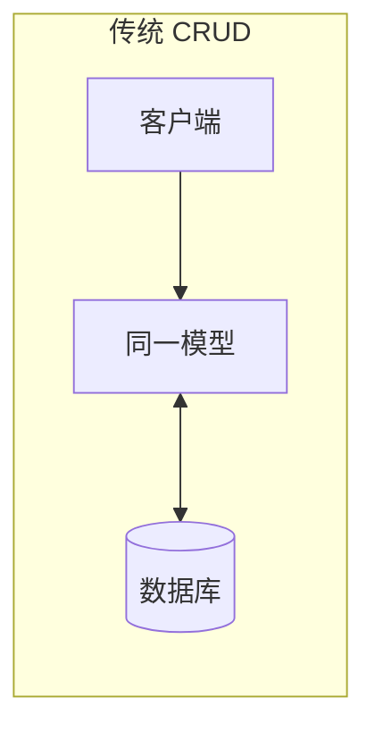
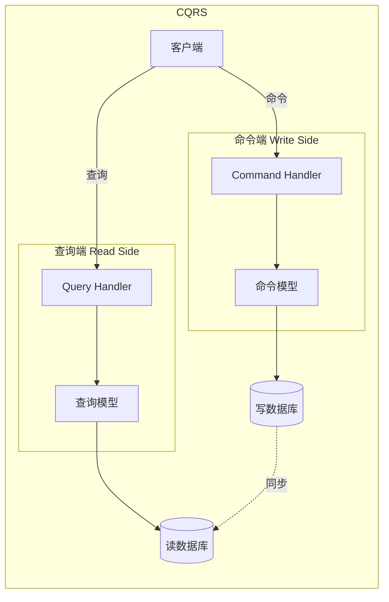
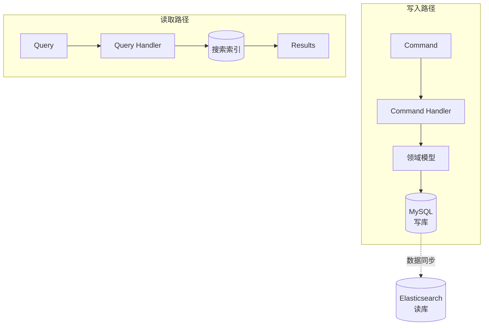
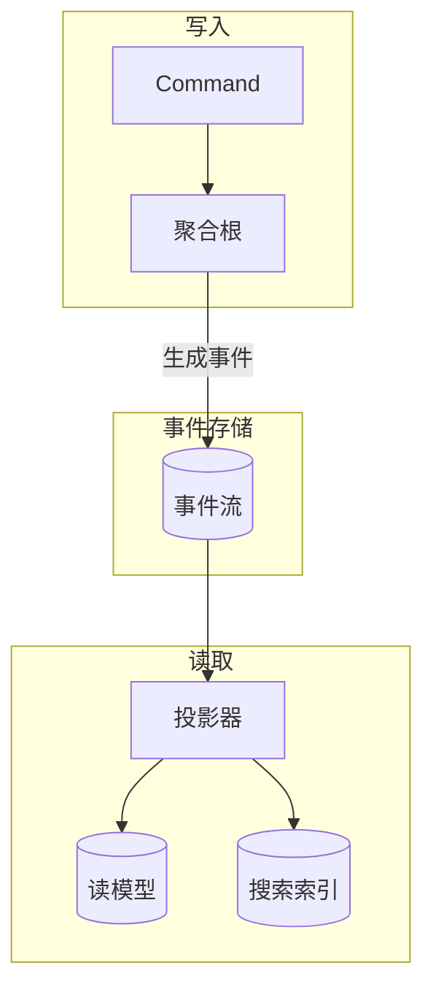

# CQRS 命令查询职责分离

你的系统上线一年后，产品经理提了一个需求：「在订单列表页，用户要求能按商品名称、商家名称、收货人信息等多维度搜索。」你看了下现有的 Order 表，发现它只有 order_id、user_id、total_amount 这些字段，没有商品名称、商家名称这些反规范化数据。

如果要支持这个查询，你有几种选择：

1. **加 JOIN 查询**：Order JOIN OrderItem JOIN Product JOIN Shop JOIN User，一个查询跑 5 张表
2. **建搜索表**：把需要搜索的字段都冗余到一张搜索表里
3. **上 Elasticsearch**：专门的搜索系统

无论哪种方案，你都会遇到同一个问题：**订单的写入模型和读取模型是同一个**。每次想优化查询，都要改写入逻辑；每次改写入逻辑，又担心影响其他查询。这就是传统 CRUD 的困境：**读写耦合**。

CQRS（Command Query Responsibility Segregation）提出了一个简单的解决方案：**命令和查询用不同的模型**。

## CQRS 的核心思想

CQRS 由 Greg Young 在 2010 年提出。它的核心主张是：**分离读写操作，使用不同的数据模型**。

在传统 CRUD 系统中，我们用同一个数据模型（通常是数据库表）来读写：



CQRS 把读写分开：



**命令（Command）**：修改数据的操作，如 CreateOrder、UpdateOrder、CancelOrder。命令端使用**命令模型**，关注业务正确性。

**查询（Query）**：读取数据的操作，如 GetOrderDetail、SearchOrders。查询端使用**查询模型**，关注查询效率。

## 什么时候需要 CQRS

CQRS 不是万能药。很多项目的 CQRS 失败，不是因为技术实现难，而是因为**选错了场景**。

### 适合 CQRS 的场景

**读多写少**：读请求占 90%，写请求占 10%。这时候为读操作单独优化，价值最大。比如电商的商品详情页、社交媒体的信息流。

**复杂查询**：需要 JOIN 多张表、聚合统计、全文搜索。这类查询不应该和写操作共用模型。

**性能要求差异化**：读操作需要毫秒级响应，写操作可以容忍秒级。比如实时大屏 vs 后台批处理。

**读写团队分离**：读和写由不同团队负责，可以独立演进。

### 不适合 CQRS 的场景

**简单 CRUD**：如果你的应用主要是增删改查，引入 CQRS 只会增加复杂度。

**低延迟写入要求**：如果写操作也需要毫秒级响应，CQRS 的同步机制可能成为瓶颈。

**团队规模小**：CQRS 增加了系统复杂度，小团队可能维护不过来。

## CQRS 的实现模式

### 模式一：最简 CQRS（单数据库）

最简单的方式是在同一个数据库中，用不同的接口分开读写：

```java
// 写入侧 - 使用领域模型
@Service
public class OrderCommandService {

    private final OrderRepository orderRepository;

    public OrderId createOrder(CreateOrderCommand command) {
        Order order = new Order(
            OrderId.generate(),
            customerRepository.findById(command.getCustomerId()),
            toOrderLines(command.getLines())
        );
        orderRepository.save(order);
        return order.getId();
    }
}
```

```java
// 读取侧 - 直接使用 DTO 和 SQL
@Service
public class OrderQueryService {

    @Autowired
    private JdbcTemplate jdbcTemplate;

    public OrderDetailDTO getOrderDetail(String orderId) {
        String sql = """
            SELECT o.*, c.name as customer_name, c.phone as customer_phone,
                   GROUP_CONCAT(p.name) as product_names
            FROM orders o
            LEFT JOIN customers c ON o.customer_id = c.id
            LEFT JOIN order_items oi ON o.id = oi.order_id
            LEFT JOIN products p ON oi.product_id = p.id
            WHERE o.id = ?
            GROUP BY o.id
            """;
        return jdbcTemplate.queryForObject(sql, new OrderDetailRowMapper(), orderId);
    }
}
```

### 模式二：双数据库 CQRS

在复杂场景下，读库和写库可以是完全不同的数据库：



同步机制通常有几种选择：

1. **同步双写**：写的时候同时写两个库，简单但有一致性问题
2. **异步同步**：写成功后再异步同步到读库，有延迟但性能好
3. **事件同步**：通过消息队列同步，最常用

```java
// 事件驱动的同步实现
@Service
public class OrderProjectionService {

    @Autowired
    private ElasticsearchTemplate esTemplate;

    @KafkaListener(topics = "order-events")
    public void handleOrderEvent(OrderEvent event) {
        if (event instanceof OrderCreatedEvent) {
            OrderCreatedEvent created = (OrderCreatedEvent) event;
            OrderSearchDocument doc = buildDocument(created);
            esTemplate.save(doc);
        } else if (event instanceof OrderCancelledEvent) {
            OrderCancelledEvent cancelled = (OrderCancelledEvent) event;
            esTemplate.update(cancelled.getOrderId(), doc -> {
                doc.setStatus("CANCELLED");
                return doc;
            });
        }
    }
}
```

## CQRS 的读写模型设计

CQRS 的关键在于**读写模型可以完全不同**。

### 写入模型：领域模型

写入侧使用标准的领域模型，关注业务正确性：

```java
// 写入模型 - 领域模型
public class Order {
    private OrderId id;
    private Customer customer;
    private List<OrderLine> lines;
    private Money totalAmount;
    private OrderStatus status;

    public void confirm() {
        if (this.status != OrderStatus.PENDING) {
            throw new IllegalStateException("只有待确认订单可以确认");
        }
        this.status = OrderStatus.CONFIRMED;
    }

    public void addLine(OrderLine line) {
        this.lines.add(line);
        this.totalAmount = this.totalAmount.add(line.getSubtotal());
    }
}
```

### 读取模型：查询优化的数据结构

读取侧可以使用完全不同的数据结构，甚至可以是反规范化的：

```java
// 读取模型 - 反规范化的 DTO
public class OrderListItem {
    private String orderId;
    private String orderNumber;
    private String customerName;  // 反规范化，避免 JOIN
    private String customerPhone;
    private List<String> productNames;  // 存储商品名称列表
    private BigDecimal totalAmount;
    private String status;
    private LocalDateTime createdAt;

    // 这个类专门为查询优化，不包含业务逻辑
}
```

```java
// Elasticsearch 文档模型
@Document(indexName = "orders")
public class OrderSearchDocument {
    @Id
    private String id;

    @Field(type = FieldType.Text, analyzer = "ik_max_word")
    private String orderNumber;

    @Field(type = FieldType.Text, analyzer = "ik_max_word")
    private String customerName;

    @Field(type = FieldType.Text, analyzer = "ik_max_word")
    private String productNames;  // 用 IK 分词器支持商品名称搜索

    @Field(type = FieldType.Keyword)
    private String status;

    @Field(type = FieldType.Date)
    private LocalDateTime createdAt;

    // 方便的搜索方法
    public static OrderSearchDocument from(Order order) {
        OrderSearchDocument doc = new OrderSearchDocument();
        doc.setId(order.getId().getValue());
        doc.setOrderNumber(order.getOrderNumber());
        doc.setCustomerName(order.getCustomer().getName());
        doc.setProductNames(order.getLines().stream()
            .map(l -> l.getProduct().getName())
            .collect(Collectors.joining(" ")));
        return doc;
    }
}
```

## CQRS 的代价

CQRS 不是免费的午餐。在决定使用之前，需要理解它的代价：

### 一致性延迟

写操作完成后，读模型不会立即更新（如果是异步同步）。这意味着**写入后立即读取可能读到旧数据**。

```java
// 如果是异步同步，会有一致性延迟
@Service
public class OrderCommandService {

    public OrderId createOrder(CreateOrderCommand command) {
        // 写入主库
        Order order = createOrderEntity(command);
        orderRepository.save(order);

        // 发布事件异步同步到读库
        eventPublisher.publish(new OrderCreatedEvent(order));

        return order.getId();
    }
}

// 客户端需要处理「写入后立即查询可能失败」的情况
@Service
public class OrderController {

    @PostMapping("/orders")
    public ResponseEntity<OrderResponse> createOrder(...) {
        OrderId orderId = commandService.createOrder(command);
        // 可能读库还没有同步，返回创建成功，让前端稍后刷新
        return ResponseEntity.accepted()
            .header("X-Order-Id", orderId.getValue())
            .build();
    }
}
```

### 复杂度增加

CQRS 增加了系统复杂度：

1. **维护两套模型**：读写模型可能需要独立演进
2. **处理一致性问题**：需要考虑写入后立即读取的场景
3. **同步机制**：需要可靠的数据同步机制
4. **监控**：需要监控读写库的延迟和一致性

### 历史数据问题

当读写模型分离后，如果需要查看历史状态，需要额外处理：

```java
// 可能需要维护审计日志
@Service
public class OrderProjectionService {

    @KafkaListener(topics = "order-events")
    public void handleEvent(DomainEvent event) {
        OrderProjection projection = loadOrCreateProjection(event.getOrderId());
        applyEvent(projection, event);
        saveProjection(projection);

        // 同时记录历史
        saveToHistory(event);
    }
}
```

## CQRS + 事件溯源

CQRS 经常和**事件溯源**（Event Sourcing）一起使用，形成一个强大的组合：



关于事件溯源的详细内容，会在下一篇文章中展开。

## 适用场景与不适用场景

| 场景 | 推荐程度 | 说明 |
| --- | --- | --- |
| 读多写少，查询复杂 | **强烈推荐** | CQRS 的最佳场景 |
| 电商商品详情页 | **推荐** | 读远多于写 |
| 审计日志系统 | **推荐** | 需要完整历史记录 |
| 社交媒体信息流 | **推荐** | 查询模式多样化 |
| 企业内部工具 | **谨慎** | 复杂度可能不值得 |
| 简单 CRUD 系统 | **不推荐** | 过度设计 |

:::tip 经验之谈

很多团队用了 CQRS 但后悔了，主要原因是：

1. **选错场景**：在一个简单的 CRUD 系统里硬上 CQRS
2. **低估复杂度**：低估了一致性延迟和同步机制带来的麻烦
3. **缺乏基础设施**：没有可靠的消息队列和事件日志系统

CQRS 的引入门槛比想象中高。建议从「最简 CQRS」开始，在单数据库中分离读写，等业务真正需要时才升级到双数据库。

:::

## 总结

CQRS 的核心是**分离命令和查询**。通过使用不同的数据模型，可以让写入侧专注于业务正确性，读取侧专注于查询效率。

**适合 CQRS 的场景**：
- 读多写少
- 查询复杂，需要 JOIN 多表或全文搜索
- 读写性能要求差异大

**不适合 CQRS 的场景**：
- 简单 CRUD
- 需要强一致性（写入后立即读取必须读到）
- 小团队，没有维护多套模型的能力

理解了 CQRS，下一步就是**事件溯源**——一种和 CQRS 天然搭配的数据存储方式。

