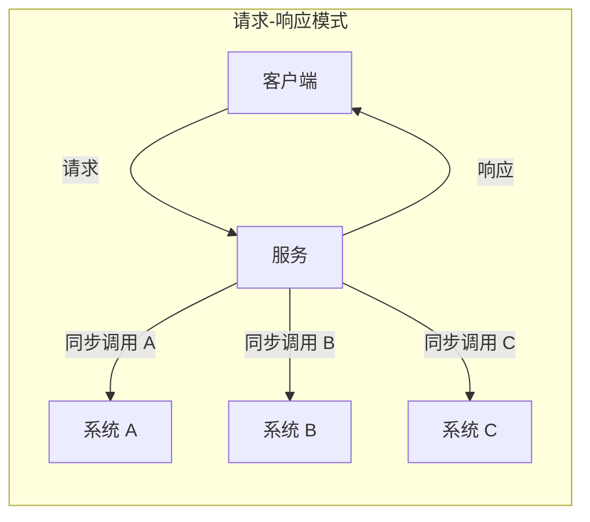
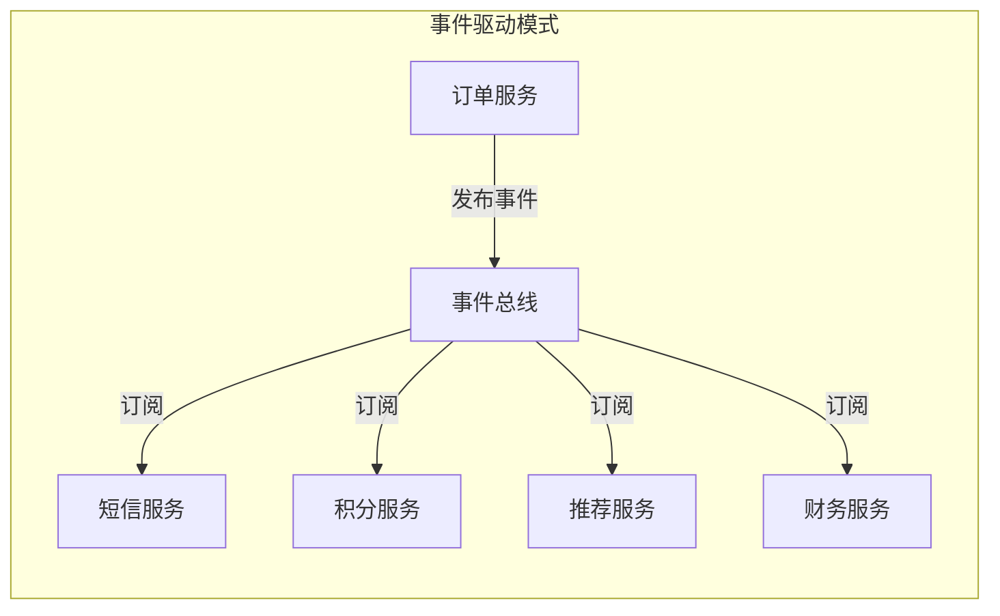
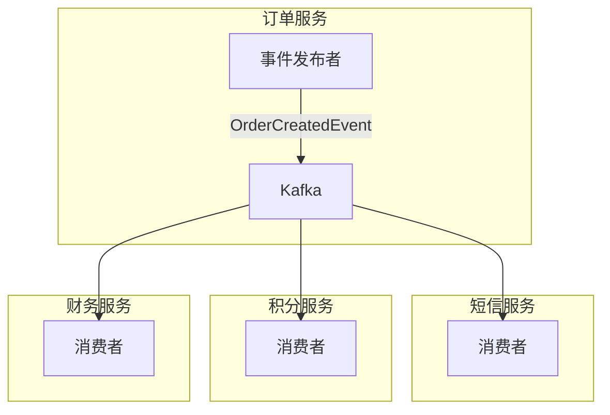
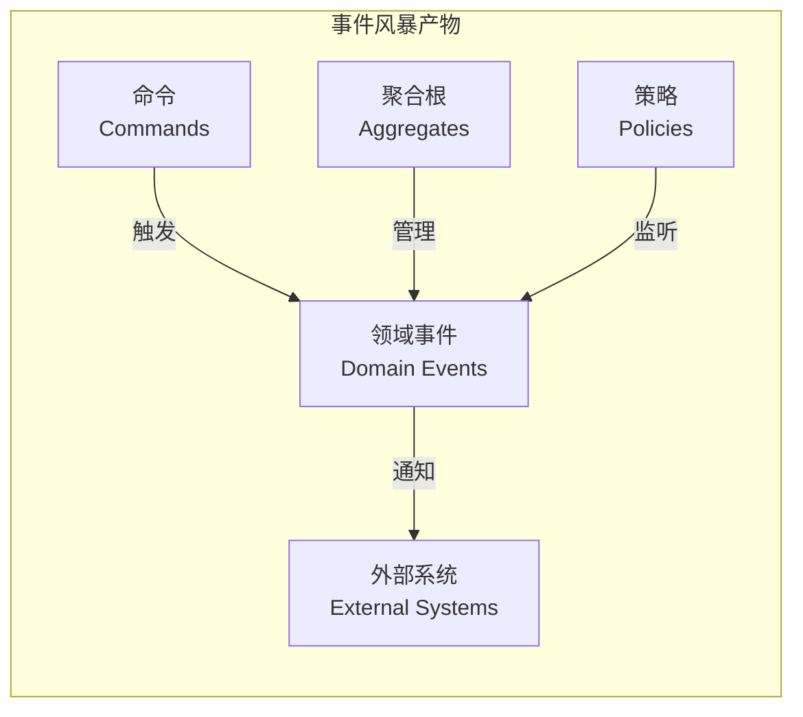

# EDA 事件驱动架构

你的系统需要对接一个新功能：订单完成后，不仅要发短信通知用户，还要更新积分系统、触发推荐算法、通知财务系统生成对账单。你看了看现有代码，发现订单服务里堆满了各种调用：

```java
@Service
public class OrderService {

    public void createOrder(Order order) {
        orderRepository.save(order);
        smsService.sendNotification(order);
        pointsService.addPoints(order.getCustomerId(), order.getAmount());
        recommendationService.updatePreferences(order.getCustomerId());
        financeService.createBill(order);
    }
}
```

每次加新功能都要改订单服务，每次订单服务出问题都会影响下游所有系统。这不是代码问题，是**架构问题**——你用同步调用处理了一个天然应该是**异步**的场景。

事件驱动架构（Event-Driven Architecture，EDA）提出了一种不同的思路：**不要调用下游，让它们自己来订阅**。

## 为什么需要事件驱动

传统的企业应用大多采用**请求-响应模式**：



问题在于：
- **紧耦合**：订单服务必须知道所有下游系统的存在
- **单点故障**：任何下游系统挂了，订单服务都会受影响
- **扩展困难**：每加一个下游，都要去改订单服务

事件驱动架构把这些系统**解耦**：



订单服务只负责发布事件，下游系统自己订阅自己处理。订单服务不需要知道下游是谁。

## 事件驱动的三种模式

Martin Fowler 在《企业应用架构模式》中定义了三种事件处理模式：

### 模式一：事件通知（Event Notification）

最简单的模式。发布者只发送「某事发生了」的简单通知，订阅者收到通知后自己决定如何处理。

```java
// 发布者
@Service
public class OrderService {

    private final ApplicationEventMulticaster eventMulticaster;

    public void createOrder(Order order) {
        orderRepository.save(order);
        // 发布简单的事件通知
        eventMulticaster.multicastEvent(new OrderCreatedEvent(order.getId()));
    }
}
```

```java
// 订阅者
@Service
public class SmsNotificationService {

    @EventListener
    public void handleOrderCreated(OrderCreatedEvent event) {
        Order order = orderRepository.findById(event.getOrderId());
        smsService.send(order.getCustomer().getPhone(), "您的订单已创建");
    }
}

@Service
public class PointsService {

    @EventListener
    public void handleOrderCreated(OrderCreatedEvent event) {
        Order order = orderRepository.findById(event.getOrderId());
        pointsCalculator.addPoints(order.getCustomerId(), order.getAmount());
    }
}
```

**适用场景**：下游处理逻辑简单，不需要发布者提供详细信息。

### 模式二：事件携带状态传输（Event-Carried State Transfer）

如果订阅者需要较多信息，可以把完整状态放在事件里。这样订阅者不需要再查询发布者。

```java
// 携带完整状态的事件
public class OrderCreatedEvent extends ApplicationEvent {

    private final String orderId;
    private final String orderNumber;
    private final CustomerInfo customerInfo;  // 冗余完整信息
    private final List<OrderLineItem> lineItems;
    private final BigDecimal totalAmount;
    private final LocalDateTime createdAt;

    public OrderCreatedEvent(Order order) {
        super(order);
        this.orderId = order.getId().getValue();
        this.orderNumber = order.getOrderNumber();
        this.customerInfo = new CustomerInfo(
            order.getCustomer().getId().getValue(),
            order.getCustomer().getName(),
            order.getCustomer().getPhone()
        );
        this.lineItems = order.getLines().stream()
            .map(this::toDTO)
            .collect(Collectors.toList());
        this.totalAmount = order.getTotalAmount();
        this.createdAt = order.getCreatedAt();
    }
}
```

```java
// 订阅者可以直接使用事件中的信息，不需要再查询
@Service
public class FinanceService {

    @EventListener
    public void handleOrderCreated(OrderCreatedEvent event) {
        // 直接使用事件中的信息，不需要调用订单服务
        FinanceBill bill = new FinanceBill(
            event.getOrderNumber(),
            event.getCustomerInfo().getName(),
            event.getTotalAmount(),
            event.getCreatedAt()
        );
        billRepository.save(bill);
    }
}
```

**优点**：订阅者不需要额外查询，减少了系统间调用。

**缺点**：事件变大，占用更多带宽；可能出现数据不一致（事件发布后状态变了）。

### 模式三：事件溯源（Event Sourcing）

这在前面的文章中有详细介绍。核心思想是**存储事件而不是状态**，通过重放事件来重建状态。

## 事件总线设计

事件总线是事件驱动架构的核心组件，负责事件的发布和订阅管理。

### Spring 的事件机制

Spring 提供了 `ApplicationEventMulticaster` 来实现应用内的事件驱动：

```java
// 配置事件广播器
@Configuration
public class EventConfiguration {

    @Bean
    public ApplicationEventMulticaster applicationEventMulticaster(
            SimpleApplicationEventMulticaster simpleApplicationEventMulticaster) {
        // 配置线程池，支持异步处理
        ThreadPoolTaskExecutor executor = new ThreadPoolTaskExecutor();
        executor.setCorePoolSize(5);
        executor.setMaxPoolSize(10);
        executor.setQueueCapacity(100);
        executor.initialize();

        simpleApplicationEventMulticaster.setTaskExecutor(executor);
        return simpleApplicationEventMulticaster;
    }
}
```

```java
// 发布事件
@Service
public class OrderService {

    @Autowired
    private ApplicationEventMulticaster multicaster;

    public void createOrder(Order order) {
        orderRepository.save(order);
        multicaster.multicastEvent(new OrderCreatedEvent(order));
    }
}
```

### 消息队列事件总线

当事件需要跨服务传播时，需要使用消息队列：



```java
// Kafka 事件发布
@Service
public class KafkaOrderEventPublisher {

    @Autowired
    private KafkaTemplate<String, OrderEvent> kafkaTemplate;

    public void publish(OrderCreatedEvent event) {
        kafkaTemplate.send("order-events", event.getOrderId(), event);
    }
}
```

```java
// Kafka 事件消费
@Service
public class SmsNotificationConsumer {

    @KafkaListener(topics = "order-events", groupId = "sms-notification")
    public void handle(OrderCreatedEvent event) {
        OrderDTO order = fetchOrderDetails(event.getOrderId());
        smsService.send(order.getCustomerPhone(), "您的订单已创建");
    }
}
```

## 事件驱动 vs 请求-响应

| 维度 | 请求-响应 | 事件驱动 |
| --- | --- | --- |
| **耦合度** | 紧耦合，服务间相互依赖 | 松耦合，服务间无直接依赖 |
| **调用方式** | 同步 | 同步或异步 |
| **扩展性** | 差，增加下游需要改上游 | 好，新增订阅者无需改发布者 |
| **一致性** | 强一致（同一事务内） | 最终一致（需要处理幂等） |
| **调试难度** | 低，请求链路清晰 | 高，异步调用难以追踪 |
| **适用场景** | 需要即时响应的场景 | 需要解耦、削峰的场景 |

## 事件风暴（Event Storming）

事件风暴是 Alberto Brandolini 发明的一种事件驱动建模方法，用于快速发现和建模业务领域。

### 事件风暴的步骤

1. **头脑风暴事件**：参与者（业务专家、技术团队）共同识别领域中的关键事件
2. **识别命令**：识别触发事件的用户操作或系统操作
3. **识别聚合**：把相关的事件和命令归类到同一个聚合根
4. **识别限界上下文**：根据业务语义划分不同的限界上下文
5. **识别策略**：识别业务规则和策略

### 事件风暴的产物



### 事件风暴工作坊

事件风暴通常以工作坊形式进行，用不同颜色的便签纸代表不同元素：

- **橙色**：领域事件
- **蓝色**：命令
- **黄色**：聚合根
- **紫色**：外部系统
- **红色**：策略（业务规则）

```java
// 事件风暴后得到的聚合根
public class OrderAggregate {

    private OrderId id;
    private OrderStatus status;

    // 处理命令，生成事件
    public List<DomainEvent> placeOrder(PlaceOrderCommand command) {
        if (command.getLines().isEmpty()) {
            throw new IllegalArgumentException("订单不能为空");
        }

        List<DomainEvent> events = new ArrayList<>();

        OrderCreatedEvent created = new OrderCreatedEvent(
            OrderId.generate(),
            command.getCustomerId(),
            command.getLines(),
            command.getTotalAmount()
        );
        events.add(created);

        return events;
    }
}
```

## 事件驱动的常见问题

### 幂等性处理

事件可能因为重试而被重复投递，订阅者必须保证**幂等**：

```java
@Service
public class PointsService {

    @KafkaListener(topics = "order-events", groupId = "points")
    @Transactional
    public void handleOrderCreated(OrderCreatedEvent event) {
        // 先检查是否已处理过
        if (pointsRepository.existsByOrderId(event.getOrderId())) {
            return;  // 幂等：已处理过则跳过
        }

        Points points = new Points(
            event.getCustomerId(),
            event.getOrderId(),
            calculatePoints(event.getTotalAmount())
        );
        pointsRepository.save(points);
    }
}
```

### 事务边界

事件发布和业务操作需要保持一致。有两种常用方案：

**方案一：Transactional Outbox**

```java
@Service
public class OrderService {

    @Transactional
    public void createOrder(Order order) {
        orderRepository.save(order);

        // 不直接发 Kafka，而是写入 Outbox 表
        outboxRepository.save(new OutboxEvent(
            "OrderCreatedEvent",
            serialize(order),
            LocalDateTime.now()
        ));
    }
}

// 单独的任务从 Outbox 读取并发送
@Component
public class OutboxPublisher {

    @Scheduled(fixedDelay = 100)
    public void publish() {
        List<OutboxEvent> events = outboxRepository.findPending();
        for (OutboxEvent event : events) {
            kafkaTemplate.send(event.getTopic(), event.getPayload());
            event.markAsPublished();
        }
        outboxRepository.saveAll(events);
    }
}
```

**方案二：CDC（Change Data Capture）**

使用数据库的 binlog 捕获数据变化，发送到消息队列。Debezium 是常用的 CDC 工具。

## 适用场景与不适用场景

| 场景 | 推荐程度 | 说明 |
| --- | --- | --- |
| 微服务解耦 | **强烈推荐** | 事件驱动天然适合服务间解耦 |
| 异步任务处理 | **推荐** | 发短信、发邮件等异步操作 |
| 跨系统数据同步 | **推荐** | 多个系统需要保持数据一致 |
| 实时数据流处理 | **推荐** | 物联网、日志处理等 |
| 需要强一致的事务 | **不推荐** | 事件驱动是最终一致，不适合强事务场景 |
| 简单 CRUD 系统 | **不推荐** | 增加了不必要的复杂度 |

:::tip 经验之谈

事件驱动架构最大的坑是**把同步场景做成了异步**。很多团队看到「解耦」「削峰」的好处就大量引入事件，结果发现：

1. **调试困难**：异步调用出问题，很难追踪因果关系
2. **数据不一致**：用户下了单，但积分没加上，用户体验差
3. **事件契约变更**：事件 schema 变了，所有订阅者都要改

**原则**：能用同步解决的问题，不要为了「潮流」改成异步。事件驱动适合的场景是「解耦」和「削峰」，不是「炫技」。

:::

## 总结

事件驱动架构通过**事件的发布-订阅**模式实现系统间松耦合。核心组件是事件总线，负责管理事件的发布和订阅。

**三种事件处理模式**：
- **事件通知**：只发送简单通知，订阅者自行处理
- **事件携带状态传输**：把完整状态放在事件里
- **事件溯源**：存储事件而不是状态

**事件驱动的优点**：
- 系统间松耦合
- 支持异步处理和削峰
- 易于扩展新的订阅者

**事件驱动的代价**：
- 最终一致性，不是强一致
- 调试和追踪困难
- 需要处理幂等性

理解了事件驱动架构，接下来让我们看看**微内核架构**，它解决的是另一种问题：如何设计可扩展的核心系统。

